# 8.网络系统 / Network Systems

## 目录结构规划 / Directory Structure Planning

### 8.1 知识梳理 / Knowledge Review
- 网络系统基本概念与发展历程 / Basic Concepts and Development History
- 网络架构与协议栈 / Network Architecture and Protocol Stack
- 网络性能与服务质量 / Network Performance and Quality of Service
- 网络安全与隐私保护 / Network Security and Privacy Protection

### 8.2 批判分析 / Critical Analysis
- 网络架构争议与批判 / Network Architecture Controversies and Criticism
- 网络技术优劣分析 / Network Technology Pros and Cons Analysis
- 网络安全挑战与治理 / Network Security Challenges and Governance
- 网络未来展望与挑战 / Network Future Prospects and Challenges

### 8.3 形式化结构 / Formal Structure
- 网络拓扑结构模型 / Network Topology Structure Models
- 网络协议形式化建模 / Network Protocol Formal Modeling
- 网络状态机与转换 / Network State Machines and Transitions
- 网络资源分配模型 / Network Resource Allocation Models

### 8.4 形式化证明 / Formal Proof
- 网络协议正确性证明 / Network Protocol Correctness Proof
- 网络性能边界分析 / Network Performance Boundary Analysis
- 网络安全性质验证 / Network Security Property Verification
- 网络一致性证明 / Network Consistency Proof

### 8.5 多表征 / Multiple Representations
- 网络架构对比表 / Network Architecture Comparison Tables
- 网络协议流程图 / Network Protocol Flowcharts
- 网络性能分析图 / Network Performance Analysis Charts
- 网络安全威胁模型 / Network Security Threat Models

### 8.6 形式语义 / Formal Semantics
- 网络协议语义建模 / Network Protocol Semantic Modeling
- 网络数据流语义 / Network Data Flow Semantics
- 网络控制流语义 / Network Control Flow Semantics
- 网络服务质量语义 / Network QoS Semantics

### 8.7 系统运行时语义 / System Runtime Semantics
- 网络动态行为建模 / Network Dynamic Behavior Modeling
- 网络异常处理语义 / Network Exception Handling Semantics
- 网络自适应机制 / Network Adaptive Mechanisms
- 网络性能优化语义 / Network Performance Optimization Semantics

### 8.8 综合专题与前沿展望 / Special Topics and Prospects
- 软件定义网络（SDN） / Software-Defined Networking (SDN)
- 网络功能虚拟化（NFV） / Network Function Virtualization (NFV)
- 5G/6G网络技术 / 5G/6G Network Technologies
- 量子网络与未来网络 / Quantum Networks and Future Networks

## 系统化成果展示 / Systematic Achievement Display

### 中英双语对照 / Chinese-English Bilingual Content
- 所有章节标题、概念定义、技术术语均采用中英双语对照
- All chapter titles, concept definitions, and technical terms use Chinese-English bilingual content

### 工程论证深度 / Engineering Argumentation Depth
- 网络协议工程实现细节 / Network Protocol Engineering Implementation Details
- 网络性能优化工程实践 / Network Performance Optimization Engineering Practices
- 网络安全工程最佳实践 / Network Security Engineering Best Practices
- 网络运维工程案例分析 / Network Operations Engineering Case Studies

### 知识点完备性 / Knowledge Point Completeness
- 网络基础理论体系 / Network Basic Theoretical System
- 网络协议栈完整覆盖 / Complete Coverage of Network Protocol Stack
- 网络性能分析方法论 / Network Performance Analysis Methodology
- 网络安全防护体系 / Network Security Protection System

### 结构对标国际wiki / Structure Benchmarking International Wiki
- 分层递进的知识结构 / Layered Progressive Knowledge Structure
- 多维度交叉验证 / Multi-dimensional Cross-validation
- 可视化表达与工程可行性 / Visual Expression and Engineering Feasibility
- 内容递进与可维护性 / Content Progression and Maintainability

## 递归专题与扩展案例 / Recursive Topics and Extended Cases

### 网络协议深度分析 / Deep Analysis of Network Protocols
- TCP/IP协议栈形式化分析 / Formal Analysis of TCP/IP Protocol Stack
- HTTP/HTTPS协议语义建模 / HTTP/HTTPS Protocol Semantic Modeling
- DNS协议安全性验证 / DNS Protocol Security Verification
- BGP协议收敛性证明 / BGP Protocol Convergence Proof

### 网络性能优化专题 / Network Performance Optimization Topics
- 网络拥塞控制算法 / Network Congestion Control Algorithms
- 网络流量工程优化 / Network Traffic Engineering Optimization
- 网络负载均衡策略 / Network Load Balancing Strategies
- 网络QoS保障机制 / Network QoS Guarantee Mechanisms

### 网络安全前沿技术 / Network Security Frontier Technologies
- 零信任网络架构 / Zero Trust Network Architecture
- 网络入侵检测系统 / Network Intrusion Detection Systems
- 网络威胁情报分析 / Network Threat Intelligence Analysis
- 网络隐私保护技术 / Network Privacy Protection Technologies

## 规划与建议 / Planning and Recommendations

### 短期目标 / Short-term Goals
- 完善网络系统基础理论体系 / Complete Network System Basic Theoretical System
- 建立网络协议形式化验证框架 / Establish Network Protocol Formal Verification Framework
- 开发网络性能分析工具链 / Develop Network Performance Analysis Toolchain
- 构建网络安全评估体系 / Build Network Security Assessment System

### 中期目标 / Medium-term Goals
- 实现网络系统自动化验证 / Realize Network System Automated Verification
- 建立网络性能预测模型 / Establish Network Performance Prediction Models
- 开发网络安全态势感知 / Develop Network Security Situation Awareness
- 构建网络运维智能化平台 / Build Intelligent Network Operations Platform

### 长期目标 / Long-term Goals
- 实现网络系统自愈能力 / Realize Network System Self-healing Capability
- 建立网络性能自适应优化 / Establish Network Performance Adaptive Optimization
- 开发网络安全主动防御 / Develop Network Security Active Defense
- 构建未来网络架构蓝图 / Build Future Network Architecture Blueprint

---

## 全局知识结构与批判性导图 / Global Knowledge Structure and Critical Diagram

```mermaid
graph TD;
  Z[网络系统 Network Systems]
  Z1[知识梳理 Knowledge Review]
  Z2[批判分析 Critical Analysis]
  Z3[形式化结构 Formal Structure]
  Z4[形式化证明 Formal Proof]
  Z5[多表征 Multiple Representations]
  Z6[形式语义 Formal Semantics]
  Z7[运行时语义 Runtime Semantics]
  Z8[综合专题与前沿展望 Special Topics & Prospects]
  Z --> Z1
  Z --> Z2
  Z --> Z3
  Z --> Z4
  Z --> Z5
  Z --> Z6
  Z --> Z7
  Z --> Z8
  
  Z1 --> Z1A[基本概念 Basic Concepts]
  Z1 --> Z1B[协议栈 Protocol Stack]
  Z1 --> Z1C[性能分析 Performance Analysis]
  Z1 --> Z1D[安全防护 Security Protection]
  
  Z2 --> Z2A[架构争议 Architecture Controversies]
  Z2 --> Z2B[技术优劣 Technology Pros/Cons]
  Z2 --> Z2C[安全挑战 Security Challenges]
  Z2 --> Z2D[未来展望 Future Prospects]
  
  Z3 --> Z3A[拓扑结构 Topology Structure]
  Z3 --> Z3B[协议建模 Protocol Modeling]
  Z3 --> Z3C[状态机 State Machines]
  Z3 --> Z3D[资源分配 Resource Allocation]
  
  Z4 --> Z4A[协议正确性 Protocol Correctness]
  Z4 --> Z4B[性能边界 Performance Boundaries]
  Z4 --> Z4C[安全验证 Security Verification]
  Z4 --> Z4D[一致性证明 Consistency Proof]
  
  Z5 --> Z5A[架构对比 Architecture Comparison]
  Z5 --> Z5B[协议流程 Protocol Flow]
  Z5 --> Z5C[性能分析 Performance Analysis]
  Z5 --> Z5D[威胁模型 Threat Models]
  
  Z6 --> Z6A[协议语义 Protocol Semantics]
  Z6 --> Z6B[数据流语义 Data Flow Semantics]
  Z6 --> Z6C[控制流语义 Control Flow Semantics]
  Z6 --> Z6D[QoS语义 QoS Semantics]
  
  Z7 --> Z7A[动态行为 Dynamic Behavior]
  Z7 --> Z7B[异常处理 Exception Handling]
  Z7 --> Z7C[自适应机制 Adaptive Mechanisms]
  Z7 --> Z7D[性能优化 Performance Optimization]
  
  Z8 --> Z8A[SDN技术 SDN Technologies]
  Z8 --> Z8B[NFV技术 NFV Technologies]
  Z8 --> Z8C[5G/6G技术 5G/6G Technologies]
  Z8 --> Z8D[量子网络 Quantum Networks]
```

### 哲学批判说明 / Philosophical Critique

- **理论深度与现实复杂性平衡**：网络系统知识体系需兼顾理论深度、现实复杂性与多元批判
  Balance theoretical depth with real-world complexity: network system knowledge system should balance theoretical depth, real-world complexity, and pluralistic critique

- **结构化与简化风险**：图谱化有助于整体把握，但需警惕结构化带来的简化与盲区
  Structure and simplification risk: graphical representation helps with holistic understanding, but beware of simplification and blind spots caused by structuring

- **工程实践与理论验证**：网络系统理论必须通过工程实践验证，避免纯理论脱离实际
  Engineering practice and theoretical verification: network system theory must be verified through engineering practice, avoiding pure theory divorced from reality

- **技术演进与批判思维**：在快速发展的网络技术中保持批判性思维，避免技术崇拜
  Technology evolution and critical thinking: maintain critical thinking in rapidly evolving network technologies, avoid technology worship

---

> 本README为网络系统知识体系的系统化规划，采用中英双语对照，突出工程论证与知识点完备性，结构对标国际wiki标准。
> This README provides systematic planning for the network system knowledge system, with Chinese-English bilingual content, emphasizing engineering argumentation and comprehensive knowledge points, benchmarking international wiki standards.
