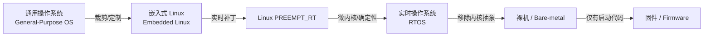
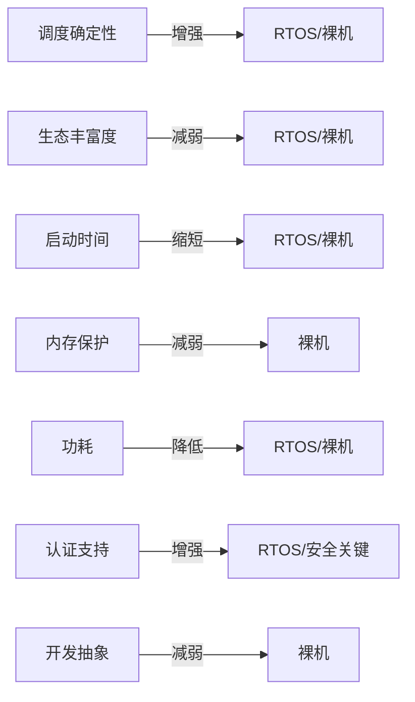
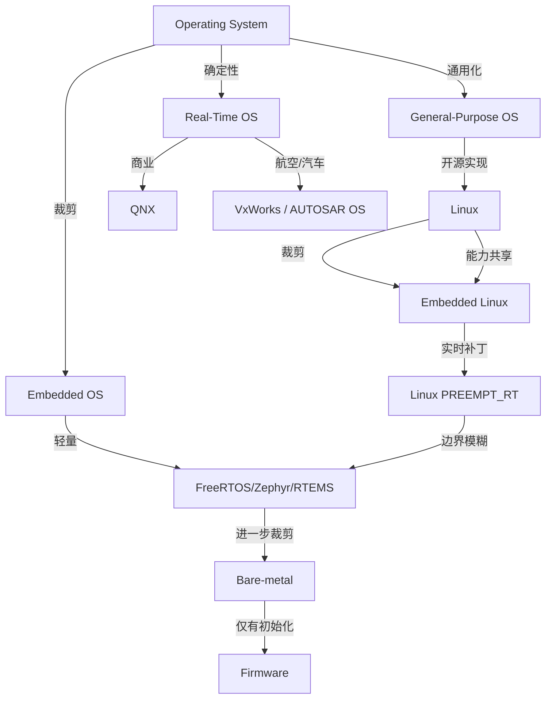
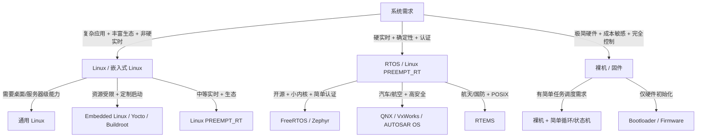
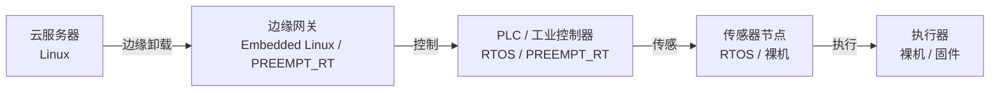

# 操作系统连续谱分析：通用 OS → Linux → 嵌入式 Linux → RTOS → 裸机

<!-- TOC START -->

- [操作系统连续谱分析：通用 OS → Linux → 嵌入式 Linux → RTOS → 裸机](#操作系统连续谱分析通用-os--linux--嵌入式-linux--rtos--裸机)
  - [1. 连续谱定义](#1-连续谱定义)
  - [2. 能力退化/增强维度](#2-能力退化增强维度)
  - [3. 形式化对比矩阵](#3-形式化对比矩阵)
  - [4. 统一演进树](#4-统一演进树)
  - [5. 选型决策树](#5-选型决策树)
  - [6. 典型场景映射](#6-典型场景映射)
  - [7. 国际来源映射](#7-国际来源映射)
  - [8. 相关文件](#8-相关文件)

<!-- TOC END -->

> **权威来源**：Silberschatz *Operating System Concepts* 10e, OSTEP, Linux Kernel Documentation, FreeRTOS/Zephyr/QNX/RTEMS Docs, Buttazzo *Hard Real-Time Computing Systems*, ISO 26262 / IEC 61508 / DO-178C。
>
> **目标**：建立从通用 OS 到裸机的连续谱系，明确各形态的能力、约束、选型依据与形式化对比。

---

## 1. 连续谱定义

操作系统并非二元分类，而是一个能力连续谱：

**形态说明**：

| 形态 | 核心特征 | 代表 |
|------|----------|------|
| 通用 OS | 完整虚拟内存、多用户、丰富生态、通用调度 | Windows Server, macOS, Linux Desktop |
| Linux | 单内核/模块化、POSIX 兼容、广泛驱动、社区生态 | Ubuntu Server, RHEL, Debian |
| 嵌入式 Linux | 针对特定硬件裁剪、启动时间/功耗优化、Yocto/Buildroot | 工业网关、NVR、路由器 |
| Linux PREEMPT_RT | 在 Linux 上增加实时抢占能力 | 工业机器人、数控机床 |
| RTOS | 确定性调度、低中断延迟、小内核、认证支持 | FreeRTOS, Zephyr, QNX, VxWorks, RTEMS |
| 裸机 | 无 OS 抽象，直接操作寄存器 | MCU 固件、启动代码 |
| 固件 | 仅初始化硬件并加载 OS，或执行极简任务 | Boot ROM, U-Boot SPL |

---

## 2. 能力退化/增强维度

沿连续谱从左到右，以下能力发生系统性变化：

| 维度 | 通用 OS/Linux | 嵌入式 Linux | RTOS | 裸机 |
|------|---------------|--------------|------|------|
| 调度确定性 | 低~中（CFS 公平但非确定） | 中（PREEMPT_RT 可提升） | 高（RMS/EDF/固定优先级） | 最高（完全控制） |
| 中断延迟 | 10us~1ms | 10us~100us | < 1us~10us | 取决于代码 |
| 内存保护 | MMU 完整 | MMU/MPU 可选 | MPU/MMU 可选 | 无 |
| 启动时间 | 数秒~分钟 | 数百 ms~数秒 | 数 ms~数百 ms | 数 us~ms |
| 功耗 | 高 | 中 | 低 | 最低 |
| 生态 | 极丰富 | 丰富 | 有限 | 无 |
| 实时认证 | 少 | 部分（PREEMPT_RT） | 多（ISO 26262 / IEC 61508 / DO-178C） | 需自证 |
| 文件系统 | 完整 | 可选 | 可选/简单 | 无 |
| 网络协议栈 | 完整 TCP/IP | 可裁剪 | 可选 | 无/手写 |
| 开发抽象 | 高 | 中高 | 中 | 低 |

---

## 3. 形式化对比矩阵

| 概念 | 通用 OS (Linux) | 嵌入式 Linux | RTOS | 裸机 |
|------|-----------------|--------------|------|------|
| **进程/任务抽象** | `task_struct`，进程/线程 | `task_struct`，通常为单用户 | `Task`/`TCB`，task ≈ thread | 函数/中断上下文 |
| **调度策略** | CFS / RT / DL | CFS / RT / DL / PREEMPT_RT | RMS / EDF / Fixed Priority | 轮询/中断驱动 |
| **调度器公平性** | Proportional fairness | Proportional fairness | Deadline feasibility | 无 |
| **内存管理** | 虚拟内存 + 页表 + MMU | 虚拟内存/FLAT/NOMMU | 静态/heap/pool，可选 MPU | 静态分配 |
| **中断处理** | Top-half + bottom-half + threaded IRQ | 同左 | ISR + deferred procedure | 直接 ISR |
| **同步原语** | futex / mutex / rwlock / semaphore | 同左 | mutex / semaphore / queue / event | 关中断/自旋 |
| **IPC** | pipe / socket / shm / mq | 同左 | queue / mailbox / shared memory | 全局变量 |
| **文件系统** | VFS + ext4/XFS/Btrfs | 裁剪 VFS + overlay/tmpfs | 可选 FAT/LittleFS | 无 |
| **网络** | 完整 TCP/IP + netfilter + eBPF | 可裁剪 TCP/IP | 可选 TCP/IP / MQTT / CoAP | 无/手写驱动 |
| **安全机制** | LSM / seccomp / namespaces / cgroups | 同左 | MPU / TrustZone / 分区 | 无 |
| **启动链** | UEFI/GRUB → Kernel → initramfs → systemd | U-Boot → Kernel → initramfs → busybox/systemd | Bootloader → Kernel → main() | Reset vector → main() |
| **确定性证明** | 难以形式化（太复杂） | 部分可形式化 | 可调度性分析、WCET | 可完全分析 |

---

## 4. 统一演进树

---

## 5. 选型决策树

| 决策节点 | 问题 | 推荐方向 |
|----------|------|----------|
| 是否需要 GUI/丰富库/多用户？ | 是 → Linux | 否 → 继续 |
| 是否需要硬实时（< 100us 确定性）？ | 是 → RTOS / PREEMPT_RT | 否 → 继续 |
| 是否需要 ISO 26262/DO-178C/IEC 61508 认证？ | 是 → QNX/VxWorks/SafeRTOS | 否 → 继续 |
| 是否需要 TCP/IP 协议栈？ | 是 → 嵌入式 Linux / Zephyr | 否 → 继续 |
| 资源是否 < 128KB RAM？ | 是 → FreeRTOS / 裸机 | 否 → 嵌入式 Linux |
| 是否需要完全控制硬件/最低功耗？ | 是 → 裸机 | 否 → RTOS |

---

## 6. 典型场景映射

| 场景 | 形态 | 关键需求 | 典型系统 |
|------|------|----------|----------|
| 云服务器 | 通用 Linux | 吞吐、虚拟化、多租户 | AWS EC2, Azure VM |
| 边缘网关 | 嵌入式 Linux / PREEMPT_RT | 多协议、容器、中等实时 | 工业网关、NVR |
| 工业控制器 | RTOS / Linux PREEMPT_RT | 硬实时、确定性、长生命周期 | KUKA, Siemens PLC |
| 汽车 ECU | RTOS / AUTOSAR OS | ASIL-D、确定性、认证 | Bosch ECU |
| 无人机飞控 | RTOS / 裸机 | 低延迟、低功耗、高可靠 | PX4, DJI |
| 传感器节点 | RTOS / 裸机 | 超低功耗、低成本 | 环境监测、智能电表 |
| 启动固件 | 固件 | 最小代码、快速启动 | U-Boot SPL, Boot ROM |

---

## 7. 国际来源映射

| 概念/维度 | 来源类型 | 来源 | 位置 |
|----------|----------|------|------|
| OS 分类与概念 | Textbook | Silberschatz, *Operating System Concepts* 10e | Ch. 1~2 |
| 虚拟化/并发/持久化 | Textbook | OSTEP | 全书 |
| Linux 内核 | SourceCode | Linux Kernel | <https://docs.kernel.org/> |
| RTOS 概念 | Documentation | FreeRTOS / Zephyr / RTEMS / QNX | 官方文档 |
| 实时调度 | Textbook | Buttazzo, *Hard Real-Time Computing Systems* | Ch. 1~4 |
| 安全关键 | Standard | ISO 26262 / IEC 61508 / DO-178C | 官方标准 |
| 嵌入式 Linux | Textbook | *Embedded Linux Primer* / *Linux Device Drivers* | 相关章节 |

---

## 8. 相关文件

- [操作系统概念树](../2.操作系统/02-operating-systems/00-concept-atlas/concept-tree-os.md)
- [Linux 概念树](../2.操作系统/02-operating-systems/05-linux-kernel/linux-concept-tree.md)
- [RTOS 概念树](../3.物联网嵌入式系统/04-rtos-concepts/rtos-concept-tree.md)
- [Linux vs RTOS 决策树](../3.物联网嵌入式系统/06-decision-trees/linux-vs-rtos.md)
- [跨层映射图](../2.操作系统/02-operating-systems/08-interfaces/cross-layer-mapping.md)
- [运行时语义跨平台映射](./操作系统运行时语义跨平台映射.md)
