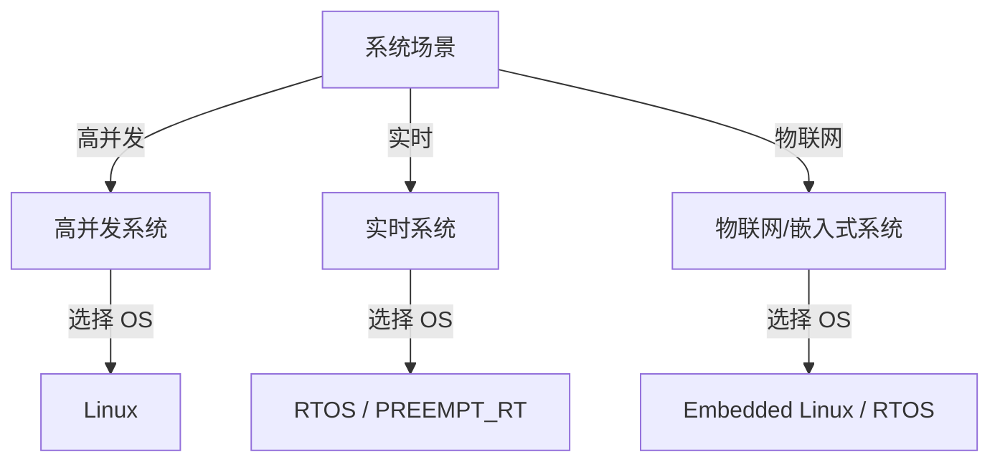

# 高并发 / 实时 / 物联网 场景决策树汇总

> **目标**：把操作系统、网络、嵌入式、接口四个领域的决策树汇总为可直接指导工程选型的统一决策框架。

---

## 1. 顶层场景分类

---

## 2. 高并发系统决策树

| 条件 | 推荐方案 |
|------|----------|
| fd 数量 ≤ 1024，跨平台 | `select` / `poll` |
| fd 数量大，低延迟 | `epoll` |
| 磁盘 + 网络混合，批处理 | `io_uring` |
| 多核 CPU，网络包处理 | NAPI + RPS/RFS/XPS |
| 内核态包过滤/转发 | eBPF / XDP |
| 10k+ 连接，应用层 | 协程 + 事件循环 |

### 2.1 关键参数

| 参数 | 含义 | 调优方向 |
|------|------|----------|
| `net.core.somaxconn` | 全连接队列长度 | 根据并发量增大 |
| `net.ipv4.tcp_max_syn_backlog` | SYN 队列长度 | 防 SYN Flood |
| `net.ipv4.tcp_tw_reuse` | TIME_WAIT 复用 | 高短连接场景 |
| `fs.aio-max-nr` | 最大异步 IO 请求 | io_uring |

---

## 3. 实时系统决策树

| 条件 | 推荐方案 |
|------|----------|
| 硬实时 < 10 µs 抖动 | RTOS（FreeRTOS/Zephyr/RTEMS/VxWorks） |
| 软实时 + 复杂网络/文件 | Linux PREEMPT_RT |
| 周期任务，隐式截止期 | RM / EDF |
| 共享资源冲突 | PI / PCP 互斥锁 |
| 安全认证 | VxWorks / RTEMS / Zephyr |

---

## 4. 物联网/嵌入式决策树

| 条件 | 推荐方案 |
|------|----------|
| 极简 MCU，< 1 MB RAM | FreeRTOS |
| 现代 IoT，安全，多协议 | Zephyr |
| 复杂边缘网关 | Embedded Linux（Buildroot/Yocto） |
| 工业控制，硬实时 | RTOS + 工业总线（CAN/Modbus/OPC UA） |
| 大规模 OTA、包管理 | Yocto + OSTree |

---

## 5. 综合选型矩阵

| 场景 | OS | 网络 | 嵌入式 | 安全 |
|------|----|------|--------|------|
| 高并发 Web 后端 | Linux | epoll/io_uring + TCP | - | seccomp + LSM |
| 金融交易低延迟 | Linux PREEMPT_RT | kernel bypass / DPDK | - | TLS/IPsec |
| 自动驾驶 ECU | RTOS | TSN / CAN-FD | 传感器融合 | secure boot + MPU |
| 工业网关 | Embedded Linux | MQTT/OPC UA | PLC 接口 | TPM + LSM |
| 智能家居设备 | Zephyr/FreeRTOS | CoAP/MQTT | 低功耗 BLE/WiFi | OTA + 加密 |

---

## 6. 验证清单

- [ ] 明确延迟/吞吐/抖动目标
- [ ] 评估任务数量、周期、优先级
- [ ] 选择 OS/RTOS
- [ ] 选择 I/O 多路复用或实时调度
- [ ] 配置隔离、亲和性、中断绑核
- [ ] 运行基准测试（wrk/cyclictest/latency_test）
- [ ] 安全审查（seccomp/capabilities/LSM）

---

## 7. 相关文件

- [操作系统-网络-嵌入式-接口跨域映射](./操作系统-网络-嵌入式-接口跨域映射.md)
- [Linux vs RTOS 决策树](../3.物联网嵌入式系统/06-decision-trees/linux-vs-rtos.md)
- [Socket 与多路复用](../2.操作系统/02-operating-systems/06-networking/socket-and-multiplexing.md)
