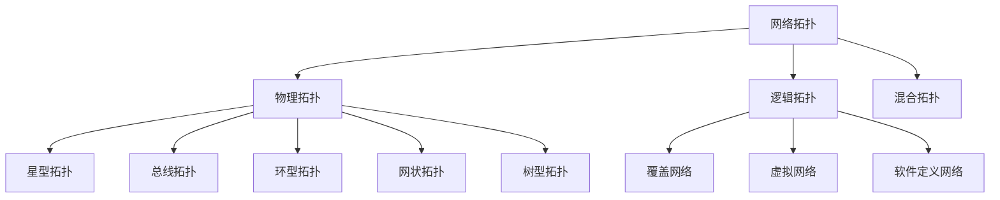
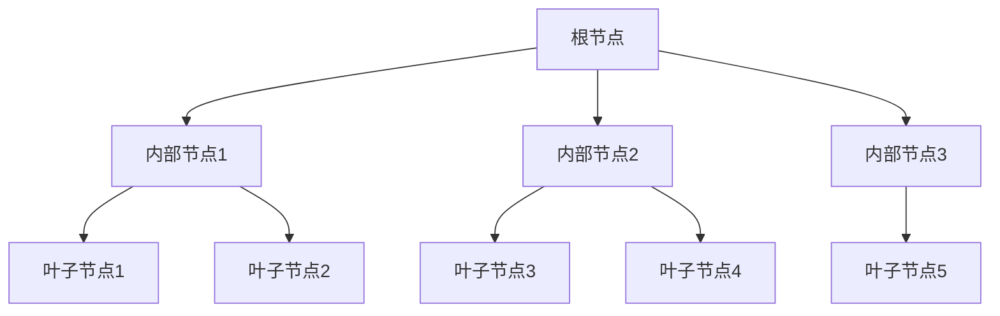
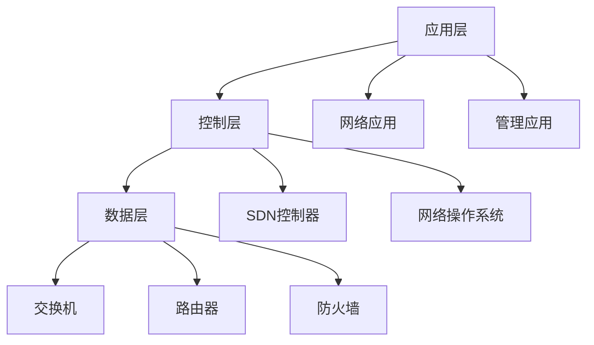
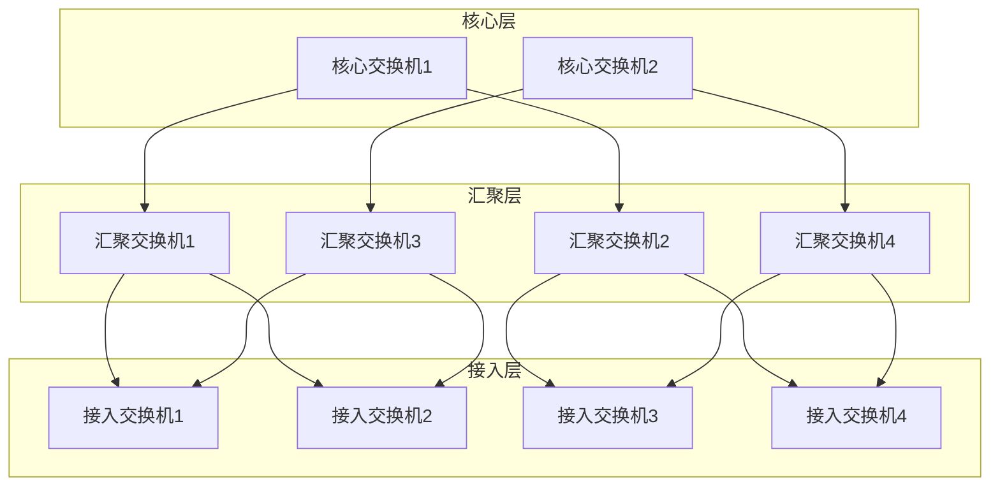

# 3.1.2 网络拓扑 / Network Topology


<!-- TOC START -->

- [3.1.2 网络拓扑 / Network Topology](#312-网络拓扑-network-topology)
  - [1. 拓扑理论基础 / Topology Theory Foundation](#1-拓扑理论基础-topology-theory-foundation)
    - [1.1 图论基础 / Graph Theory Foundation](#11-图论基础-graph-theory-foundation)
    - [1.2 拓扑分类 / Topology Classification](#12-拓扑分类-topology-classification)
  - [2. 物理拓扑 / Physical Topology](#2-物理拓扑-physical-topology)
    - [2.1 星型拓扑 / Star Topology](#21-星型拓扑-star-topology)
    - [2.2 网状拓扑 / Mesh Topology](#22-网状拓扑-mesh-topology)
    - [2.3 树型拓扑 / Tree Topology](#23-树型拓扑-tree-topology)
  - [3. 逻辑拓扑 / Logical Topology](#3-逻辑拓扑-logical-topology)
    - [3.1 覆盖网络 / Overlay Networks](#31-覆盖网络-overlay-networks)
    - [3.2 软件定义网络 / Software-Defined Networking](#32-软件定义网络-software-defined-networking)
  - [4. 拓扑优化 / Topology Optimization](#4-拓扑优化-topology-optimization)
    - [4.1 性能优化 / Performance Optimization](#41-性能优化-performance-optimization)
    - [4.2 容错设计 / Fault Tolerance Design](#42-容错设计-fault-tolerance-design)
  - [5. 新兴拓扑 / Emerging Topologies](#5-新兴拓扑-emerging-topologies)
    - [5.1 数据中心拓扑 / Data Center Topology](#51-数据中心拓扑-data-center-topology)
    - [5.2 量子网络拓扑 / Quantum Network Topology](#52-量子网络拓扑-quantum-network-topology)
  - [6. 总结与展望 / Summary and Outlook](#6-总结与展望-summary-and-outlook)
    - [6.1 拓扑发展趋势 / Topology Development Trends](#61-拓扑发展趋势-topology-development-trends)
    - [6.2 挑战与机遇 / Challenges and Opportunities](#62-挑战与机遇-challenges-and-opportunities)

<!-- TOC END -->

## 1. 拓扑理论基础 / Topology Theory Foundation

### 1.1 图论基础 / Graph Theory Foundation

**网络拓扑形式化定义：**

- $G = (V, E)$：网络图，其中V为节点集合，E为边集合  
  Network graph: G = (V, E) where V is vertex set, E is edge set
- $|V| = n$：节点数量  
  Number of vertices: n
- $|E| = m$：边数量  
  Number of edges: m
- $d(v)$：节点v的度数  
  Degree of vertex v

**拓扑性质：**

1. **连通性**：$Connected(G) \iff \forall u,v \in V, \exists path(u,v)$  
   Connectivity: graph is connected if path exists between any two vertices
2. **直径**：$Diameter(G) = \max_{u,v \in V} d(u,v)$  
   Diameter: maximum shortest path length between any two vertices
3. **平均路径长度**：$\bar{L} = \frac{1}{n(n-1)} \sum_{u \neq v} d(u,v)$  
   Average path length: average shortest path length between all vertex pairs

### 1.2 拓扑分类 / Topology Classification

**基本拓扑类型：**



## 2. 物理拓扑 / Physical Topology

### 2.1 星型拓扑 / Star Topology

**星型拓扑特征：**

- $Star_{Topology} = \{Center, Peripherals, Connections\}$  
  Star topology: central node with peripheral connections
- $Center$：中心节点  
  Center: central hub node
- $Peripherals = \{p_1, p_2, ..., p_n\}$：外围节点集合  
  Peripherals: set of peripheral nodes

**性能分析：**

```rust
#[derive(Debug)]
pub struct StarTopology {
    center: Node,
    peripherals: Vec<Node>,
    connections: Vec<Connection>,
}

impl StarTopology {
    pub fn new(center: Node, peripherals: Vec<Node>) -> Self {
        let connections: Vec<Connection> = peripherals
            .iter()
            .map(|p| Connection::new(center.id.clone(), p.id.clone()))
            .collect();
        
        StarTopology {
            center,
            peripherals,
            connections,
        }
    }
    
    pub fn diameter(&self) -> usize {
        2 // 星型拓扑的直径为2
    }
    
    pub fn average_path_length(&self) -> f64 {
        let n = self.peripherals.len() + 1;
        let total_paths = n * (n - 1);
        let avg_length = (2.0 * (n - 1) + (n - 1) * (n - 2)) as f64 / total_paths as f64;
        avg_length
    }
}
```

**优缺点分析：**

| 优点 | 缺点 |
|------|------|
| 易于管理和故障定位 | 中心节点单点故障 |
| 扩展性好 | 中心节点负载集中 |
| 布线简单 | 布线成本高 |

### 2.2 网状拓扑 / Mesh Topology

**网状拓扑特征：**

- $Mesh_{Topology} = \{Nodes, Full_{Connections}\}$  
  Mesh topology: fully connected network
- $Full_{Connections} = \{(i,j) | i,j \in V, i \neq j\}$：全连接边集合  
  Full connections: complete graph edges

**连接数量计算：**

```rust
impl MeshTopology {
    pub fn connection_count(&self) -> usize {
        let n = self.nodes.len();
        n * (n - 1) / 2 // 完全图的边数
    }
    
    pub fn diameter(&self) -> usize {
        1 // 网状拓扑的直径为1
    }
    
    pub fn reliability(&self) -> f64 {
        // 网状拓扑的可靠性计算
        let n = self.nodes.len();
        let p = self.link_reliability;
        let reliability = 1.0 - (1.0 - p).powi(n as i32);
        reliability
    }
}
```

### 2.3 树型拓扑 / Tree Topology

**树型拓扑特征：**

- $Tree_{Topology} = \{Root, Internal_{Nodes}, Leaves\}$  
  Tree topology: hierarchical structure
- $Height(T)$：树的高度  
  Height: maximum depth of tree
- $Branching_{Factor}$：分支因子  
  Branching factor: maximum children per node

**层次结构：**



## 3. 逻辑拓扑 / Logical Topology

### 3.1 覆盖网络 / Overlay Networks

**覆盖网络定义：**

- $Overlay_{Network} = \{Physical_{Network}, Virtual_{Links}\}$  
  Overlay network: virtual network on physical infrastructure
- $Virtual_{Link} = \{Source, Destination, Virtual_{Path}\}$  
  Virtual link: logical connection over physical path

**P2P覆盖网络：**

```rust
#[derive(Debug)]
pub struct OverlayNetwork {
    physical_nodes: Vec<PhysicalNode>,
    virtual_links: Vec<VirtualLink>,
    routing_table: HashMap<NodeId, Vec<NodeId>>,
}

impl OverlayNetwork {
    pub fn create_virtual_link(&mut self, source: NodeId, dest: NodeId) {
        let path = self.find_shortest_path(source, dest);
        let virtual_link = VirtualLink {
            source,
            destination: dest,
            path,
            bandwidth: self.calculate_bandwidth(&path),
        };
        self.virtual_links.push(virtual_link);
    }
    
    pub fn optimize_routing(&mut self) {
        // 优化虚拟链路的路由
        for link in &mut self.virtual_links {
            link.path = self.find_optimal_path(link.source, link.destination);
        }
    }
}
```

### 3.2 软件定义网络 / Software-Defined Networking

**SDN架构：**



**OpenFlow协议：**

```rust
#[derive(Debug)]
pub struct OpenFlowMessage {
    header: OpenFlowHeader,
    body: OpenFlowBody,
}

#[derive(Debug)]
pub enum OpenFlowBody {
    PacketIn(PacketIn),
    FlowMod(FlowMod),
    PortStatus(PortStatus),
    FeaturesReply(FeaturesReply),
}

impl OpenFlowMessage {
    pub fn create_flow_mod(&self, match_fields: MatchFields, actions: Vec<Action>) -> Self {
        let flow_mod = FlowMod {
            cookie: 0,
            command: FlowModCommand::Add,
            idle_timeout: 0,
            hard_timeout: 0,
            priority: 100,
            buffer_id: None,
            out_port: None,
            flags: FlowModFlags::empty(),
            match_fields,
            actions,
        };
        
        OpenFlowMessage {
            header: OpenFlowHeader::new(),
            body: OpenFlowBody::FlowMod(flow_mod),
        }
    }
}
```

## 4. 拓扑优化 / Topology Optimization

### 4.1 性能优化 / Performance Optimization

**优化目标：**

1. **最小化延迟**：$\min \sum_{i,j} d(i,j) \cdot w(i,j)$  
   Minimize delay: minimize weighted sum of path lengths
2. **最大化带宽**：$\max \min_{(i,j) \in E} b(i,j)$  
   Maximize bandwidth: maximize minimum link bandwidth
3. **最小化成本**：$\min \sum_{(i,j) \in E} c(i,j)$  
   Minimize cost: minimize total link cost

**优化算法：**

```rust
pub trait TopologyOptimizer {
    fn optimize_delay(&self, topology: &mut NetworkTopology) -> f64;
    fn optimize_bandwidth(&self, topology: &mut NetworkTopology) -> f64;
    fn optimize_cost(&self, topology: &mut NetworkTopology) -> f64;
}

impl TopologyOptimizer for NetworkTopology {
    fn optimize_delay(&self, topology: &mut NetworkTopology) -> f64 {
        // 使用Dijkstra算法优化路径
        let mut total_delay = 0.0;
        for source in &topology.nodes {
            for dest in &topology.nodes {
                if source != dest {
                    let path = self.dijkstra_shortest_path(source, dest);
                    total_delay += path.delay;
                }
            }
        }
        total_delay
    }
}
```

### 4.2 容错设计 / Fault Tolerance Design

**冗余设计：**

- $Redundancy_{Factor} = \frac{|E|}{|V| - 1}$：冗余因子  
  Redundancy factor: ratio of edges to minimum spanning tree edges
- $Fault_{Tolerance} = \min_{e \in E} Connectivity(G - e)$：容错能力  
  Fault tolerance: minimum connectivity after removing any edge

**多路径路由：**

```rust
#[derive(Debug)]
pub struct MultiPathRouting {
    primary_path: Vec<NodeId>,
    backup_paths: Vec<Vec<NodeId>>,
    load_balancing: LoadBalancingStrategy,
}

impl MultiPathRouting {
    pub fn create_backup_paths(&mut self, source: NodeId, dest: NodeId) {
        let mut paths = Vec::new();
        
        // 使用K最短路径算法
        for k in 1..=3 {
            if let Some(path) = self.find_kth_shortest_path(source, dest, k) {
                paths.push(path);
            }
        }
        
        self.primary_path = paths.remove(0);
        self.backup_paths = paths;
    }
    
    pub fn switch_to_backup(&mut self, failed_link: (NodeId, NodeId)) {
        // 检测到链路故障时切换到备用路径
        for backup_path in &self.backup_paths {
            if !backup_path.contains(&failed_link.0) || 
               !backup_path.contains(&failed_link.1) {
                self.primary_path = backup_path.clone();
                break;
            }
        }
    }
}
```

## 5. 新兴拓扑 / Emerging Topologies

### 5.1 数据中心拓扑 / Data Center Topology

**Fat-Tree拓扑：**



### 5.2 量子网络拓扑 / Quantum Network Topology

**量子中继器网络：**

- $Quantum_{Network} = \{Quantum_{Nodes}, Quantum_{Channels}, Classical_{Channels}\}$  
  Quantum network: quantum nodes with quantum and classical channels
- $Entanglement_{Distribution} = \{Source, Bell_{Pairs}, Purification\}$  
  Entanglement distribution: quantum state distribution process

**拓扑特征：**

```rust
#[derive(Debug)]
pub struct QuantumNetworkTopology {
    quantum_nodes: Vec<QuantumNode>,
    quantum_channels: Vec<QuantumChannel>,
    classical_channels: Vec<ClassicalChannel>,
    entanglement_routing: EntanglementRouting,
}

impl QuantumNetworkTopology {
    pub fn distribute_entanglement(&mut self, source: NodeId, dest: NodeId) -> Result<BellPair, Error> {
        // 量子纠缠分发
        let path = self.find_quantum_path(source, dest);
        let bell_pair = self.create_bell_pair();
        
        for node in path {
            bell_pair = self.quantum_relay(node, bell_pair)?;
        }
        
        Ok(bell_pair)
    }
    
    pub fn quantum_key_distribution(&mut self, alice: NodeId, bob: NodeId) -> Result<QuantumKey, Error> {
        // 量子密钥分发
        let entangled_pair = self.distribute_entanglement(alice, bob)?;
        let key = self.measure_entangled_pair(entangled_pair);
        Ok(key)
    }
}
```

## 6. 总结与展望 / Summary and Outlook

### 6.1 拓扑发展趋势 / Topology Development Trends

**技术演进：**

1. **软件定义化**：从硬件固定拓扑向软件可编程拓扑演进
2. **虚拟化**：物理拓扑与逻辑拓扑分离，支持多租户
3. **智能化**：基于AI的拓扑自动优化和故障预测
4. **量子化**：量子网络拓扑的探索和应用

### 6.2 挑战与机遇 / Challenges and Opportunities

**技术挑战：**

- 大规模网络的拓扑优化复杂度
- 动态拓扑的实时调整能力
- 异构网络的拓扑统一管理
- 量子拓扑的经典-量子混合设计

**发展机遇：**

- 5G/6G网络的拓扑创新
- 边缘计算的分布式拓扑
- 物联网的感知网络拓扑
- 量子互联网的拓扑设计

---

> 网络拓扑是网络系统的基础架构，其设计直接影响网络的性能、可靠性和可扩展性。随着新技术的发展，拓扑设计需要不断创新以适应新的应用需求。
> Network topology is the foundation of network systems, directly affecting performance, reliability, and scalability. With new technology development, topology design needs continuous innovation to adapt to new application requirements.
