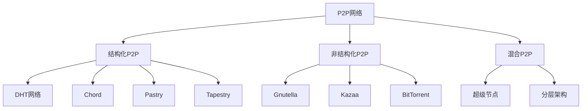
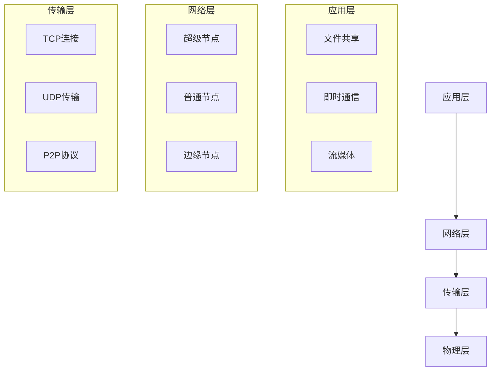

# 3.2.1 P2P架构 / P2P Architecture


<!-- TOC START -->

- [3.2.1 P2P架构 / P2P Architecture](#321-p2p架构-p2p-architecture)
  - [1. P2P理论基础 / P2P Theory Foundation](#1-p2p理论基础-p2p-theory-foundation)
    - [1.1 P2P网络定义 / P2P Network Definition](#11-p2p网络定义-p2p-network-definition)
    - [1.2 P2P网络分类 / P2P Network Classification](#12-p2p网络分类-p2p-network-classification)
  - [2. 结构化P2P / Structured P2P](#2-结构化p2p-structured-p2p)
    - [2.1 分布式哈希表 / Distributed Hash Tables](#21-分布式哈希表-distributed-hash-tables)
    - [2.2 Pastry DHT / Pastry DHT](#22-pastry-dht-pastry-dht)
  - [3. 非结构化P2P / Unstructured P2P](#3-非结构化p2p-unstructured-p2p)
    - [3.1 Gnutella协议 / Gnutella Protocol](#31-gnutella协议-gnutella-protocol)
    - [3.2 BitTorrent协议 / BitTorrent Protocol](#32-bittorrent协议-bittorrent-protocol)
  - [4. 混合P2P / Hybrid P2P](#4-混合p2p-hybrid-p2p)
    - [4.1 超级节点架构 / Supernode Architecture](#41-超级节点架构-supernode-architecture)
    - [4.2 分层P2P架构 / Hierarchical P2P Architecture](#42-分层p2p架构-hierarchical-p2p-architecture)
  - [5. P2P安全 / P2P Security](#5-p2p安全-p2p-security)
    - [5.1 攻击防护 / Attack Prevention](#51-攻击防护-attack-prevention)
    - [5.2 信任机制 / Trust Mechanism](#52-信任机制-trust-mechanism)
  - [6. 总结与展望 / Summary and Outlook](#6-总结与展望-summary-and-outlook)
    - [6.1 P2P发展趋势 / P2P Development Trends](#61-p2p发展趋势-p2p-development-trends)
    - [6.2 挑战与机遇 / Challenges and Opportunities](#62-挑战与机遇-challenges-and-opportunities)

<!-- TOC END -->

## 1. P2P理论基础 / P2P Theory Foundation

### 1.1 P2P网络定义 / P2P Network Definition

**P2P网络形式化定义：**

- $P2P_{Network} = \{Peers, Connections, Resources, Protocols\}$  
  P2P network: decentralized network of peers
- $Peer = \{ID, Resources, Neighbors, State\}$：对等节点  
  Peer: individual node in P2P network
- $Connection = \{(Peer_i, Peer_j) | i \neq j\}$：节点连接  
  Connection: direct link between peers

**P2P特征：**

1. **去中心化**：$Centralization_{Index} = \frac{1}{|Peers|} \sum_{i} Centrality(i)$  
   Decentralization: low centralization index
2. **自组织**：$Self_{Organization} = \{Discovery, Join, Leave, Recovery\}$  
   Self-organization: automatic network management
3. **资源共享**：$Resource_{Sharing} = \{Storage, Bandwidth, Computing\}$  
   Resource sharing: distributed resource utilization

### 1.2 P2P网络分类 / P2P Network Classification

**网络拓扑分类：**



## 2. 结构化P2P / Structured P2P

### 2.1 分布式哈希表 / Distributed Hash Tables

**DHT基本原理：**

- $DHT = \{Key_{Space}, Node_{Space}, Routing_{Function}\}$  
  DHT: distributed hash table with key and node spaces
- $Key_{Space} = [0, 2^m - 1]$：键空间  
  Key space: range of possible keys
- $Node_{Space} = \{Node_1, Node_2, ..., Node_n\}$：节点空间  
  Node space: set of participating nodes

**Chord DHT：**

```rust
#[derive(Debug)]
pub struct ChordNode {
    id: u64,
    finger_table: Vec<FingerEntry>,
    predecessor: Option<u64>,
    successor: Option<u64>,
    data: HashMap<u64, Vec<u8>>,
}

#[derive(Debug)]
pub struct FingerEntry {
    start: u64,
    interval: u64,
    node: u64,
}

impl ChordNode {
    pub fn new(id: u64, m: usize) -> Self {
        let mut finger_table = Vec::new();
        for i in 0..m {
            let start = (id + 2u64.pow(i as u32)) % 2u64.pow(m as u32);
            finger_table.push(FingerEntry {
                start,
                interval: 2u64.pow(i as u32),
                node: id,
            });
        }
        
        ChordNode {
            id,
            finger_table,
            predecessor: None,
            successor: None,
            data: HashMap::new(),
        }
    }
    
    pub fn find_successor(&self, key: u64) -> u64 {
        if key == self.id {
            return self.id;
        }
        
        let closest_preceding_node = self.closest_preceding_finger(key);
        if closest_preceding_node == self.id {
            return self.successor.unwrap_or(self.id);
        }
        
        // 递归查找
        self.request_find_successor(closest_preceding_node, key)
    }
    
    pub fn closest_preceding_finger(&self, key: u64) -> u64 {
        for i in (0..self.finger_table.len()).rev() {
            let finger = &self.finger_table[i];
            if finger.node != self.id && 
               self.is_between(finger.node, self.id, key) {
                return finger.node;
            }
        }
        self.id
    }
    
    fn is_between(&self, x: u64, start: u64, end: u64) -> bool {
        if start <= end {
            x > start && x <= end
        } else {
            x > start || x <= end
        }
    }
}
```

### 2.2 Pastry DHT / Pastry DHT

**Pastry路由表：**

```rust
#[derive(Debug)]
pub struct PastryNode {
    id: u64,
    routing_table: Vec<Vec<Option<u64>>>,
    leaf_set: Vec<u64>,
    neighborhood_set: Vec<u64>,
}

impl PastryNode {
    pub fn new(id: u64, base: u32) -> Self {
        let mut routing_table = vec![vec![None; base as usize]; 16];
        
        PastryNode {
            id,
            routing_table,
            leaf_set: Vec::new(),
            neighborhood_set: Vec::new(),
        }
    }
    
    pub fn route(&self, key: u64) -> u64 {
        let mut current_node = self.id;
        let mut hops = 0;
        
        while hops < 16 {
            let next_hop = self.find_next_hop(current_node, key);
            if next_hop == current_node {
                return current_node;
            }
            current_node = next_hop;
            hops += 1;
        }
        
        current_node
    }
    
    fn find_next_hop(&self, node: u64, key: u64) -> u64 {
        // 检查叶子集
        for leaf in &self.leaf_set {
            if self.is_closer(*leaf, node, key) {
                return *leaf;
            }
        }
        
        // 检查路由表
        let prefix_length = self.common_prefix_length(node, key);
        let digit = self.get_digit(key, prefix_length);
        
        if let Some(next_hop) = self.routing_table[prefix_length][digit as usize] {
            return next_hop;
        }
        
        node
    }
}
```

## 3. 非结构化P2P / Unstructured P2P

### 3.1 Gnutella协议 / Gnutella Protocol

**Gnutella消息类型：**

```rust
#[derive(Debug)]
pub enum GnutellaMessage {
    Ping(PingMessage),
    Pong(PongMessage),
    Query(QueryMessage),
    QueryHit(QueryHitMessage),
    Push(PushMessage),
}

#[derive(Debug)]
pub struct PingMessage {
    ttl: u8,
    hops: u8,
    payload_length: u32,
}

#[derive(Debug)]
pub struct QueryMessage {
    ttl: u8,
    hops: u8,
    min_speed: u32,
    search_criteria: String,
}

impl GnutellaNode {
    pub fn handle_ping(&mut self, ping: PingMessage, sender: SocketAddr) {
        // 转发PING消息
        if ping.ttl > 0 && ping.hops < 7 {
            let mut new_ping = ping.clone();
            new_ping.ttl -= 1;
            new_ping.hops += 1;
            
            for neighbor in &self.neighbors {
                if neighbor != &sender {
                    self.send_message(neighbor, GnutellaMessage::Ping(new_ping.clone()));
                }
            }
        }
        
        // 发送PONG响应
        let pong = PongMessage {
            ttl: 3,
            hops: 0,
            ip_address: self.ip_address,
            port: self.port,
            files_shared: self.shared_files.len() as u32,
            kilobytes_shared: self.total_kilobytes,
        };
        
        self.send_message(&sender, GnutellaMessage::Pong(pong));
    }
    
    pub fn handle_query(&mut self, query: QueryMessage, sender: SocketAddr) {
        // 搜索本地文件
        let matching_files = self.search_local_files(&query.search_criteria);
        
        if !matching_files.is_empty() {
            let query_hit = QueryHitMessage {
                ttl: 7,
                hops: query.hops,
                num_hits: matching_files.len() as u8,
                port: self.port,
                ip_address: self.ip_address,
                speed: self.connection_speed,
                result_set: matching_files,
            };
            
            self.send_message(&sender, GnutellaMessage::QueryHit(query_hit));
        }
        
        // 转发查询
        if query.ttl > 0 && query.hops < 7 {
            let mut new_query = query.clone();
            new_query.ttl -= 1;
            new_query.hops += 1;
            
            for neighbor in &self.neighbors {
                if neighbor != &sender {
                    self.send_message(neighbor, GnutellaMessage::Query(new_query.clone()));
                }
            }
        }
    }
}
```

### 3.2 BitTorrent协议 / BitTorrent Protocol

**BitTorrent架构：**

```rust
#[derive(Debug)]
pub struct BitTorrentClient {
    info_hash: [u8; 20],
    peer_id: [u8; 20],
    pieces: Vec<Piece>,
    peers: HashMap<SocketAddr, Peer>,
    tracker: Tracker,
}

#[derive(Debug)]
pub struct Piece {
    index: u32,
    data: Option<Vec<u8>>,
    hash: [u8; 20],
    downloaded: bool,
}

impl BitTorrentClient {
    pub fn start_download(&mut self, torrent_file: &str) -> Result<(), Error> {
        // 解析种子文件
        let torrent = self.parse_torrent_file(torrent_file)?;
        self.info_hash = torrent.info_hash;
        
        // 连接Tracker
        let peer_list = self.tracker.get_peers(&self.info_hash)?;
        
        // 连接对等节点
        for peer_addr in peer_list {
            self.connect_to_peer(peer_addr)?;
        }
        
        // 开始下载
        self.start_download_loop();
        
        Ok(())
    }
    
    pub fn handle_peer_message(&mut self, peer: &mut Peer, message: PeerMessage) {
        match message {
            PeerMessage::Choke => {
                peer.choked = true;
            }
            PeerMessage::Unchoke => {
                peer.choked = false;
                self.request_pieces(peer);
            }
            PeerMessage::Interested => {
                peer.interested = true;
                if peer.choking {
                    self.send_message(peer, PeerMessage::Unchoke);
                }
            }
            PeerMessage::NotInterested => {
                peer.interested = false;
            }
            PeerMessage::Have(piece_index) => {
                peer.bitfield.set(piece_index as usize, true);
                self.update_piece_availability();
            }
            PeerMessage::Bitfield(bitfield) => {
                peer.bitfield = bitfield;
                self.update_piece_availability();
            }
            PeerMessage::Request(piece_index, offset, length) => {
                if let Some(piece) = self.get_piece(piece_index) {
                    let data = piece.get_data(offset, length);
                    self.send_message(peer, PeerMessage::Piece(piece_index, offset, data));
                }
            }
            PeerMessage::Piece(piece_index, offset, data) => {
                self.save_piece_data(piece_index, offset, data);
                if self.is_piece_complete(piece_index) {
                    self.verify_piece(piece_index);
                }
            }
        }
    }
}
```

## 4. 混合P2P / Hybrid P2P

### 4.1 超级节点架构 / Supernode Architecture

**超级节点设计：**

```rust
#[derive(Debug)]
pub struct Supernode {
    id: u64,
    capacity: u32,
    connected_nodes: Vec<RegularNode>,
    routing_table: HashMap<u64, SocketAddr>,
    load_balancer: LoadBalancer,
}

#[derive(Debug)]
pub struct RegularNode {
    id: u64,
    supernode: Option<u64>,
    resources: NodeResources,
    status: NodeStatus,
}

impl Supernode {
    pub fn register_node(&mut self, node: RegularNode) -> Result<(), Error> {
        if self.connected_nodes.len() < self.capacity as usize {
            self.connected_nodes.push(node);
            self.update_routing_table();
            Ok(())
        } else {
            Err(Error::CapacityExceeded)
        }
    }
    
    pub fn route_request(&self, request: &Request) -> Option<SocketAddr> {
        // 根据请求类型选择目标节点
        match request.request_type {
            RequestType::FileSearch => {
                self.find_file_provider(&request.resource_id)
            }
            RequestType::FileTransfer => {
                self.find_best_provider(&request.resource_id)
            }
            RequestType::MetadataQuery => {
                self.find_metadata_provider(&request.resource_id)
            }
        }
    }
    
    fn find_file_provider(&self, resource_id: &str) -> Option<SocketAddr> {
        // 在连接的节点中查找文件提供者
        for node in &self.connected_nodes {
            if node.has_resource(resource_id) {
                return Some(node.address);
            }
        }
        None
    }
}
```

### 4.2 分层P2P架构 / Hierarchical P2P Architecture

**分层架构设计：**



```rust
#[derive(Debug)]
pub struct HierarchicalP2PNetwork {
    layers: Vec<NetworkLayer>,
    layer_connectors: Vec<LayerConnector>,
}

#[derive(Debug)]
pub struct NetworkLayer {
    layer_type: LayerType,
    nodes: Vec<Node>,
    protocols: Vec<Protocol>,
}

impl HierarchicalP2PNetwork {
    pub fn create_layer(&mut self, layer_type: LayerType) -> LayerId {
        let layer = NetworkLayer {
            layer_type,
            nodes: Vec::new(),
            protocols: Vec::new(),
        };
        
        let layer_id = self.layers.len();
        self.layers.push(layer);
        
        layer_id
    }
    
    pub fn add_node_to_layer(&mut self, layer_id: LayerId, node: Node) {
        if layer_id < self.layers.len() {
            self.layers[layer_id].nodes.push(node);
        }
    }
    
    pub fn route_across_layers(&self, request: &Request) -> Option<Response> {
        let mut current_layer = 0;
        
        while current_layer < self.layers.len() {
            if let Some(response) = self.layers[current_layer].handle_request(request) {
                return Some(response);
            }
            
            // 尝试上层
            if current_layer > 0 {
                current_layer -= 1;
            } else {
                break;
            }
        }
        
        None
    }
}
```

## 5. P2P安全 / P2P Security

### 5.1 攻击防护 / Attack Prevention

**常见攻击类型：**

```rust
#[derive(Debug)]
pub enum P2PAttack {
    Sybil(SybilAttack),
    Eclipse(EclipseAttack),
    Churn(ChurnAttack),
    FreeRiding(FreeRidingAttack),
}

impl P2PNetwork {
    pub fn detect_sybil_attack(&self, node: &Node) -> bool {
        // 检测Sybil攻击
        let suspicious_indicators = [
            node.creation_time < self.network_age / 2,
            node.resources.is_empty(),
            node.connection_pattern.is_suspicious(),
            node.behavior_score < 0.3,
        ];
        
        suspicious_indicators.iter().filter(|&&x| x).count() >= 3
    }
    
    pub fn prevent_eclipse_attack(&mut self) {
        // 防止Eclipse攻击
        for node in &mut self.nodes {
            // 随机化邻居选择
            node.randomize_neighbors();
            
            // 验证邻居身份
            node.verify_neighbor_identities();
            
            // 限制连接数
            node.limit_connections(MAX_CONNECTIONS);
        }
    }
    
    pub fn handle_churn_attack(&mut self) {
        // 处理Churn攻击
        let churn_rate = self.calculate_churn_rate();
        
        if churn_rate > CHURN_THRESHOLD {
            // 增加冗余连接
            self.increase_redundancy();
            
            // 启动恢复机制
            self.start_recovery_protocol();
        }
    }
}
```

### 5.2 信任机制 / Trust Mechanism

**信任计算：**

```rust
#[derive(Debug)]
pub struct TrustSystem {
    trust_scores: HashMap<NodeId, f64>,
    reputation_history: HashMap<NodeId, Vec<ReputationEvent>>,
    trust_network: TrustNetwork,
}

#[derive(Debug)]
pub struct ReputationEvent {
    event_type: ReputationEventType,
    timestamp: DateTime<Utc>,
    value: f64,
    source: NodeId,
}

impl TrustSystem {
    pub fn update_trust_score(&mut self, node_id: NodeId, event: ReputationEvent) {
        let current_score = self.trust_scores.get(&node_id).unwrap_or(&0.5);
        let new_score = self.calculate_new_score(*current_score, &event);
        
        self.trust_scores.insert(node_id, new_score);
        self.reputation_history.entry(node_id)
            .or_insert_with(Vec::new)
            .push(event);
    }
    
    fn calculate_new_score(&self, current_score: f64, event: &ReputationEvent) -> f64 {
        let weight = match event.event_type {
            ReputationEventType::SuccessfulTransfer => 0.1,
            ReputationEventType::FailedTransfer => -0.2,
            ReputationEventType::MaliciousBehavior => -0.5,
            ReputationEventType::HelpfulBehavior => 0.3,
        };
        
        let decay_factor = 0.95; // 时间衰减因子
        let new_score = current_score + weight * decay_factor;
        
        new_score.max(0.0).min(1.0)
    }
    
    pub fn is_trusted(&self, node_id: NodeId) -> bool {
        if let Some(score) = self.trust_scores.get(&node_id) {
            *score >= TRUST_THRESHOLD
        } else {
            false
        }
    }
}
```

## 6. 总结与展望 / Summary and Outlook

### 6.1 P2P发展趋势 / P2P Development Trends

**技术演进：**

1. **区块链集成**：P2P网络与区块链技术的融合
2. **边缘计算**：P2P网络在边缘计算中的应用
3. **AI优化**：基于AI的P2P网络优化
4. **量子P2P**：量子网络中的P2P架构

### 6.2 挑战与机遇 / Challenges and Opportunities

**技术挑战：**

- 大规模P2P网络的性能优化
- P2P网络的安全性和隐私保护
- 异构P2P网络的互操作性
- 动态P2P网络的稳定性

**发展机遇：**

- 去中心化应用的P2P架构
- 边缘计算的P2P协作
- 物联网的P2P通信
- 量子网络的P2P协议

---

> P2P架构是分布式系统的重要实现方式，通过去中心化的设计实现了高可用性和可扩展性。随着新技术的发展，P2P架构将继续演进以适应新的应用需求。
> P2P architecture is an important implementation of distributed systems, achieving high availability and scalability through decentralized design. With new technology development, P2P architecture will continue to evolve to adapt to new application requirements.
