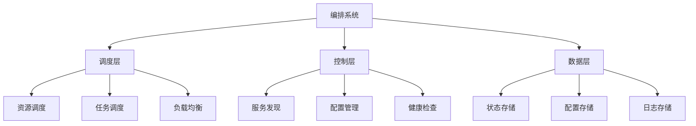

# 4.1.2 容器编排 / Container Orchestration


<!-- TOC START -->

- [4.1.2 容器编排 / Container Orchestration](#412-容器编排-container-orchestration)
  - [1. 编排理论基础 / Orchestration Theory Foundation](#1-编排理论基础-orchestration-theory-foundation)
    - [1.1 编排系统定义 / Orchestration System Definition](#11-编排系统定义-orchestration-system-definition)
    - [1.2 编排架构模式 / Orchestration Architecture Patterns](#12-编排架构模式-orchestration-architecture-patterns)
  - [2. Kubernetes编排 / Kubernetes Orchestration](#2-kubernetes编排-kubernetes-orchestration)
    - [2.1 Kubernetes架构 / Kubernetes Architecture](#21-kubernetes架构-kubernetes-architecture)
    - [2.2 Pod调度算法 / Pod Scheduling Algorithm](#22-pod调度算法-pod-scheduling-algorithm)
    - [2.3 服务发现 / Service Discovery](#23-服务发现-service-discovery)
  - [3. Docker Swarm编排 / Docker Swarm Orchestration](#3-docker-swarm编排-docker-swarm-orchestration)
    - [3.1 Swarm架构 / Swarm Architecture](#31-swarm架构-swarm-architecture)
    - [3.2 服务调度 / Service Scheduling](#32-服务调度-service-scheduling)
  - [4. 编排优化 / Orchestration Optimization](#4-编排优化-orchestration-optimization)
    - [4.1 资源优化 / Resource Optimization](#41-资源优化-resource-optimization)
    - [4.2 负载均衡 / Load Balancing](#42-负载均衡-load-balancing)
  - [5. 监控与运维 / Monitoring and Operations](#5-监控与运维-monitoring-and-operations)
    - [5.1 健康检查 / Health Checks](#51-健康检查-health-checks)
    - [5.2 自动扩缩容 / Auto Scaling](#52-自动扩缩容-auto-scaling)
  - [6. 总结与展望 / Summary and Outlook](#6-总结与展望-summary-and-outlook)
    - [6.1 编排技术趋势 / Orchestration Technology Trends](#61-编排技术趋势-orchestration-technology-trends)
    - [6.2 挑战与机遇 / Challenges and Opportunities](#62-挑战与机遇-challenges-and-opportunities)

<!-- TOC END -->

## 1. 编排理论基础 / Orchestration Theory Foundation

### 1.1 编排系统定义 / Orchestration System Definition

**容器编排形式化定义：**

- $Orchestration_{System} = \{Scheduler, Scheduler, Monitor, Controller\}$  
  Orchestration system: automated container management platform
- $Scheduler = \{Resource_{Allocation}, Placement_{Algorithm}, Load_{Balancing}\}$  
  Scheduler: resource allocation and task placement
- $Monitor = \{Health_{Check}, Metrics_{Collection}, Alerting\}$  
  Monitor: system monitoring and health management

**编排目标：**

1. **资源优化**：$\min \sum_{i,j} Resource_{Cost}(i,j) \cdot Allocation(i,j)$  
   Resource optimization: minimize total resource cost
2. **高可用性**：$Availability = \frac{MTTF}{MTTF + MTTR}$  
   High availability: maximize system uptime
3. **负载均衡**：$\min \max_{i} Load(i) - \min_{i} Load(i)$  
   Load balancing: minimize load variance

### 1.2 编排架构模式 / Orchestration Architecture Patterns

**编排系统架构：**



## 2. Kubernetes编排 / Kubernetes Orchestration

### 2.1 Kubernetes架构 / Kubernetes Architecture

**Kubernetes组件：**

```rust
#[derive(Debug)]
pub struct KubernetesCluster {
    master_components: MasterComponents,
    worker_components: Vec<WorkerComponents>,
    etcd: EtcdCluster,
    api_server: ApiServer,
}

#[derive(Debug)]
pub struct MasterComponents {
    api_server: ApiServer,
    scheduler: Scheduler,
    controller_manager: ControllerManager,
    etcd: Etcd,
}

#[derive(Debug)]
pub struct WorkerComponents {
    kubelet: Kubelet,
    kube_proxy: KubeProxy,
    container_runtime: ContainerRuntime,
}

impl KubernetesCluster {
    pub fn new() -> Self {
        let etcd = EtcdCluster::new();
        let api_server = ApiServer::new(etcd.clone());
        let scheduler = Scheduler::new(api_server.clone());
        let controller_manager = ControllerManager::new(api_server.clone());
        
        KubernetesCluster {
            master_components: MasterComponents {
                api_server,
                scheduler,
                controller_manager,
                etcd,
            },
            worker_components: Vec::new(),
            etcd: etcd.clone(),
            api_server: api_server.clone(),
        }
    }
    
    pub fn add_worker_node(&mut self, node: WorkerComponents) {
        self.worker_components.push(node);
        self.scheduler.update_node_list(&self.worker_components);
    }
    
    pub fn deploy_pod(&mut self, pod: Pod) -> Result<(), Error> {
        // 调度Pod到合适的节点
        let target_node = self.scheduler.schedule_pod(&pod)?;
        
        // 在目标节点上创建Pod
        if let Some(worker) = self.worker_components.iter_mut()
            .find(|w| w.node_name == target_node) {
            worker.kubelet.create_pod(pod)?;
        }
        
        Ok(())
    }
}
```

### 2.2 Pod调度算法 / Pod Scheduling Algorithm

**调度器实现：**

```rust
#[derive(Debug)]
pub struct Scheduler {
    scheduling_algorithm: Box<dyn SchedulingAlgorithm>,
    node_list: Vec<Node>,
    pod_queue: VecDeque<Pod>,
}

impl Scheduler {
    pub fn schedule_pod(&mut self, pod: &Pod) -> Result<String, Error> {
        // 过滤阶段：找到满足Pod要求的节点
        let feasible_nodes = self.filter_nodes(pod);
        
        if feasible_nodes.is_empty() {
            return Err(Error::NoFeasibleNodes);
        }
        
        // 评分阶段：为每个可行节点评分
        let scored_nodes = self.score_nodes(pod, &feasible_nodes);
        
        // 选择阶段：选择得分最高的节点
        let selected_node = scored_nodes.iter()
            .max_by_key(|(_, score)| *score)
            .map(|(node, _)| node.name.clone())
            .ok_or(Error::SchedulingFailed)?;
        
        Ok(selected_node)
    }
    
    fn filter_nodes(&self, pod: &Pod) -> Vec<&Node> {
        self.node_list.iter()
            .filter(|node| {
                // 检查资源需求
                self.check_resource_requirements(pod, node) &&
                // 检查节点选择器
                self.check_node_selectors(pod, node) &&
                // 检查污点容忍
                self.check_taint_tolerations(pod, node)
            })
            .collect()
    }
    
    fn score_nodes(&self, pod: &Pod, nodes: &[&Node]) -> Vec<(&Node, f64)> {
        nodes.iter()
            .map(|node| {
                let score = self.calculate_node_score(pod, node);
                (*node, score)
            })
            .collect()
    }
    
    fn calculate_node_score(&self, pod: &Pod, node: &Node) -> f64 {
        let mut score = 0.0;
        
        // 资源平衡分数
        score += self.calculate_resource_balance_score(pod, node);
        
        // 亲和性分数
        score += self.calculate_affinity_score(pod, node);
        
        // 反亲和性分数
        score += self.calculate_anti_affinity_score(pod, node);
        
        // 节点偏好分数
        score += self.calculate_node_preference_score(pod, node);
        
        score
    }
}
```

### 2.3 服务发现 / Service Discovery

**Service实现：**

```rust
#[derive(Debug)]
pub struct Service {
    metadata: ObjectMeta,
    spec: ServiceSpec,
    status: ServiceStatus,
}

#[derive(Debug)]
pub struct ServiceSpec {
    selector: HashMap<String, String>,
    ports: Vec<ServicePort>,
    cluster_ip: Option<String>,
    service_type: ServiceType,
}

impl Service {
    pub fn new(name: String, selector: HashMap<String, String>) -> Self {
        Service {
            metadata: ObjectMeta {
                name,
                namespace: "default".to_string(),
                ..Default::default()
            },
            spec: ServiceSpec {
                selector,
                ports: Vec::new(),
                cluster_ip: None,
                service_type: ServiceType::ClusterIP,
            },
            status: ServiceStatus::default(),
        }
    }
    
    pub fn add_port(&mut self, port: ServicePort) {
        self.spec.ports.push(port);
    }
    
    pub fn get_endpoints(&self, pod_list: &[Pod]) -> Vec<Endpoint> {
        let mut endpoints = Vec::new();
        
        for pod in pod_list {
            if self.matches_selector(pod) {
                for port in &self.spec.ports {
                    if let Some(pod_port) = pod.get_container_port(port.target_port) {
                        endpoints.push(Endpoint {
                            ip: pod.status.pod_ip.clone(),
                            port: pod_port,
                            target_ref: Some(pod.metadata.uid.clone()),
                        });
                    }
                }
            }
        }
        
        endpoints
    }
    
    fn matches_selector(&self, pod: &Pod) -> bool {
        for (key, value) in &self.spec.selector {
            if let Some(pod_value) = pod.metadata.labels.get(key) {
                if pod_value != value {
                    return false;
                }
            } else {
                return false;
            }
        }
        true
    }
}
```

## 3. Docker Swarm编排 / Docker Swarm Orchestration

### 3.1 Swarm架构 / Swarm Architecture

**Swarm集群：**

```rust
#[derive(Debug)]
pub struct SwarmCluster {
    manager_nodes: Vec<ManagerNode>,
    worker_nodes: Vec<WorkerNode>,
    services: Vec<Service>,
    networks: Vec<Network>,
}

#[derive(Debug)]
pub struct ManagerNode {
    id: String,
    address: SocketAddr,
    role: ManagerRole,
    state: NodeState,
}

#[derive(Debug)]
pub struct WorkerNode {
    id: String,
    address: SocketAddr,
    state: NodeState,
    resources: NodeResources,
}

impl SwarmCluster {
    pub fn new() -> Self {
        SwarmCluster {
            manager_nodes: Vec::new(),
            worker_nodes: Vec::new(),
            services: Vec::new(),
            networks: Vec::new(),
        }
    }
    
    pub fn add_manager(&mut self, address: SocketAddr) -> Result<String, Error> {
        let manager = ManagerNode {
            id: self.generate_node_id(),
            address,
            role: ManagerRole::Worker, // 初始为Worker角色
            state: NodeState::Ready,
        };
        
        let node_id = manager.id.clone();
        self.manager_nodes.push(manager);
        
        // 如果是第一个Manager，提升为Leader
        if self.manager_nodes.len() == 1 {
            self.promote_to_leader(&node_id)?;
        }
        
        Ok(node_id)
    }
    
    pub fn create_service(&mut self, service_spec: ServiceSpec) -> Result<String, Error> {
        let service = Service {
            id: self.generate_service_id(),
            spec: service_spec,
            tasks: Vec::new(),
            state: ServiceState::Creating,
        };
        
        let service_id = service.id.clone();
        self.services.push(service);
        
        // 调度服务任务
        self.schedule_service_tasks(&service_id)?;
        
        Ok(service_id)
    }
    
    fn schedule_service_tasks(&mut self, service_id: &str) -> Result<(), Error> {
        if let Some(service) = self.services.iter_mut().find(|s| s.id == service_id) {
            let replicas = service.spec.replicas;
            let mut scheduled_tasks = 0;
            
            while scheduled_tasks < replicas {
                if let Some(node) = self.select_node_for_task(&service.spec) {
                    let task = self.create_task(service_id, node)?;
                    service.tasks.push(task);
                    scheduled_tasks += 1;
                } else {
                    return Err(Error::NoAvailableNodes);
                }
            }
        }
        
        Ok(())
    }
}
```

### 3.2 服务调度 / Service Scheduling

**调度策略：**

```rust
#[derive(Debug)]
pub enum SchedulingStrategy {
    Spread,
    Binpack,
    Random,
}

impl SwarmCluster {
    pub fn select_node_for_task(&self, service_spec: &ServiceSpec) -> Option<&WorkerNode> {
        let available_nodes: Vec<&WorkerNode> = self.worker_nodes
            .iter()
            .filter(|node| node.state == NodeState::Ready)
            .filter(|node| self.check_resource_constraints(service_spec, node))
            .collect();
        
        if available_nodes.is_empty() {
            return None;
        }
        
        match service_spec.scheduling_strategy {
            SchedulingStrategy::Spread => {
                // 选择负载最轻的节点
                available_nodes.iter()
                    .min_by_key(|node| node.get_task_count())
            }
            SchedulingStrategy::Binpack => {
                // 选择负载最重的节点
                available_nodes.iter()
                    .max_by_key(|node| node.get_task_count())
            }
            SchedulingStrategy::Random => {
                // 随机选择节点
                let mut rng = rand::thread_rng();
                available_nodes.choose(&mut rng)
            }
        }
    }
    
    fn check_resource_constraints(&self, service_spec: &ServiceSpec, node: &WorkerNode) -> bool {
        // 检查CPU约束
        if let Some(cpu_limit) = service_spec.resource_limits.cpu {
            if node.resources.available_cpu < cpu_limit {
                return false;
            }
        }
        
        // 检查内存约束
        if let Some(memory_limit) = service_spec.resource_limits.memory {
            if node.resources.available_memory < memory_limit {
                return false;
            }
        }
        
        // 检查端口约束
        for port in &service_spec.ports {
            if !node.is_port_available(port.published_port) {
                return false;
            }
        }
        
        true
    }
}
```

## 4. 编排优化 / Orchestration Optimization

### 4.1 资源优化 / Resource Optimization

**资源分配算法：**

```rust
#[derive(Debug)]
pub struct ResourceOptimizer {
    allocation_strategy: AllocationStrategy,
    resource_pool: ResourcePool,
}

impl ResourceOptimizer {
    pub fn optimize_allocation(&mut self, requests: &[ResourceRequest]) -> Vec<ResourceAllocation> {
        let mut allocations = Vec::new();
        let mut available_resources = self.resource_pool.clone();
        
        // 按优先级排序请求
        let mut sorted_requests: Vec<_> = requests.iter().enumerate().collect();
        sorted_requests.sort_by_key(|(_, req)| req.priority);
        
        for (index, request) in sorted_requests {
            if let Some(allocation) = self.allocate_resources(request, &mut available_resources) {
                allocations.push(allocation);
            } else {
                // 记录无法满足的请求
                self.log_failed_allocation(index, request);
            }
        }
        
        allocations
    }
    
    fn allocate_resources(&self, request: &ResourceRequest, available: &mut ResourcePool) -> Option<ResourceAllocation> {
        match self.allocation_strategy {
            AllocationStrategy::FirstFit => {
                self.first_fit_allocation(request, available)
            }
            AllocationStrategy::BestFit => {
                self.best_fit_allocation(request, available)
            }
            AllocationStrategy::WorstFit => {
                self.worst_fit_allocation(request, available)
            }
        }
    }
    
    fn best_fit_allocation(&self, request: &ResourceRequest, available: &ResourcePool) -> Option<ResourceAllocation> {
        let mut best_node = None;
        let mut best_waste = f64::INFINITY;
        
        for node in &available.nodes {
            if self.can_allocate(request, node) {
                let waste = self.calculate_waste(request, node);
                if waste < best_waste {
                    best_waste = waste;
                    best_node = Some(node.clone());
                }
            }
        }
        
        best_node.map(|node| {
            self.allocate_on_node(request, &node)
        })
    }
}
```

### 4.2 负载均衡 / Load Balancing

**负载均衡器：**

```rust
#[derive(Debug)]
pub struct LoadBalancer {
    algorithm: LoadBalancingAlgorithm,
    backend_servers: Vec<BackendServer>,
    health_checker: HealthChecker,
}

#[derive(Debug)]
pub struct BackendServer {
    address: SocketAddr,
    weight: f64,
    health_status: HealthStatus,
    current_connections: usize,
    max_connections: usize,
}

impl LoadBalancer {
    pub fn select_backend(&mut self, request: &Request) -> Option<&BackendServer> {
        let healthy_servers: Vec<&BackendServer> = self.backend_servers
            .iter()
            .filter(|server| server.health_status == HealthStatus::Healthy)
            .collect();
        
        if healthy_servers.is_empty() {
            return None;
        }
        
        match self.algorithm {
            LoadBalancingAlgorithm::RoundRobin => {
                self.round_robin_select(&healthy_servers)
            }
            LoadBalancingAlgorithm::LeastConnections => {
                self.least_connections_select(&healthy_servers)
            }
            LoadBalancingAlgorithm::WeightedRoundRobin => {
                self.weighted_round_robin_select(&healthy_servers)
            }
            LoadBalancingAlgorithm::IPHash => {
                self.ip_hash_select(&healthy_servers, request)
            }
        }
    }
    
    fn round_robin_select(&self, servers: &[&BackendServer]) -> Option<&BackendServer> {
        let index = (self.request_count % servers.len()) as usize;
        servers.get(index).copied()
    }
    
    fn least_connections_select(&self, servers: &[&BackendServer]) -> Option<&BackendServer> {
        servers.iter()
            .min_by_key(|server| server.current_connections)
            .copied()
    }
    
    fn weighted_round_robin_select(&self, servers: &[&BackendServer]) -> Option<&BackendServer> {
        let total_weight: f64 = servers.iter().map(|s| s.weight).sum();
        let mut current_weight = 0.0;
        
        for server in servers {
            current_weight += server.weight;
            if current_weight >= self.weight_counter {
                return Some(server);
            }
        }
        
        // 重置权重计数器
        self.weight_counter = (self.weight_counter + 1.0) % total_weight;
        servers.first().copied()
    }
}
```

## 5. 监控与运维 / Monitoring and Operations

### 5.1 健康检查 / Health Checks

**健康检查系统：**

```rust
#[derive(Debug)]
pub struct HealthChecker {
    check_interval: Duration,
    timeout: Duration,
    retries: usize,
    checks: Vec<HealthCheck>,
}

#[derive(Debug)]
pub struct HealthCheck {
    check_type: HealthCheckType,
    endpoint: String,
    expected_status: u16,
    timeout: Duration,
}

impl HealthChecker {
    pub fn add_health_check(&mut self, check: HealthCheck) {
        self.checks.push(check);
    }
    
    pub fn perform_health_check(&self, target: &str) -> HealthStatus {
        let mut healthy_checks = 0;
        
        for check in &self.checks {
            if self.execute_check(check, target) {
                healthy_checks += 1;
            }
        }
        
        if healthy_checks == self.checks.len() {
            HealthStatus::Healthy
        } else if healthy_checks > 0 {
            HealthStatus::Degraded
        } else {
            HealthStatus::Unhealthy
        }
    }
    
    fn execute_check(&self, check: &HealthCheck, target: &str) -> bool {
        match check.check_type {
            HealthCheckType::HTTP => {
                self.http_health_check(check, target)
            }
            HealthCheckType::TCP => {
                self.tcp_health_check(check, target)
            }
            HealthCheckType::Command => {
                self.command_health_check(check, target)
            }
        }
    }
    
    fn http_health_check(&self, check: &HealthCheck, target: &str) -> bool {
        let client = reqwest::Client::new();
        let response = client
            .get(&format!("{}{}", target, check.endpoint))
            .timeout(check.timeout)
            .send();
        
        match response {
            Ok(resp) => resp.status().as_u16() == check.expected_status,
            Err(_) => false,
        }
    }
}
```

### 5.2 自动扩缩容 / Auto Scaling

**扩缩容策略：**

```rust
#[derive(Debug)]
pub struct AutoScaler {
    scaling_policy: ScalingPolicy,
    metrics_collector: MetricsCollector,
    scaling_history: Vec<ScalingEvent>,
}

#[derive(Debug)]
pub struct ScalingPolicy {
    min_replicas: usize,
    max_replicas: usize,
    target_cpu_utilization: f64,
    target_memory_utilization: f64,
    scale_up_cooldown: Duration,
    scale_down_cooldown: Duration,
}

impl AutoScaler {
    pub fn evaluate_scaling(&mut self, service: &mut Service) -> Option<ScalingDecision> {
        let current_metrics = self.metrics_collector.get_current_metrics(service);
        let scaling_history = self.get_recent_scaling_events(service);
        
        // 检查是否在冷却期内
        if self.is_in_cooldown_period(scaling_history) {
            return None;
        }
        
        let decision = self.calculate_scaling_decision(
            &current_metrics,
            &self.scaling_policy,
            service.current_replicas
        );
        
        if let Some(decision) = decision {
            self.record_scaling_event(service, &decision);
        }
        
        decision
    }
    
    fn calculate_scaling_decision(
        &self,
        metrics: &ServiceMetrics,
        policy: &ScalingPolicy,
        current_replicas: usize
    ) -> Option<ScalingDecision> {
        let cpu_utilization = metrics.cpu_utilization;
        let memory_utilization = metrics.memory_utilization;
        
        let mut target_replicas = current_replicas;
        
        // 检查是否需要扩容
        if cpu_utilization > policy.target_cpu_utilization ||
           memory_utilization > policy.target_memory_utilization {
            target_replicas = (current_replicas as f64 * 1.5).ceil() as usize;
        }
        
        // 检查是否需要缩容
        if cpu_utilization < policy.target_cpu_utilization * 0.5 &&
           memory_utilization < policy.target_memory_utilization * 0.5 {
            target_replicas = (current_replicas as f64 * 0.7).floor() as usize;
        }
        
        // 应用最小/最大副本数限制
        target_replicas = target_replicas
            .max(policy.min_replicas)
            .min(policy.max_replicas);
        
        if target_replicas != current_replicas {
            Some(ScalingDecision {
                target_replicas,
                reason: self.generate_scaling_reason(metrics, policy),
                timestamp: Utc::now(),
            })
        } else {
            None
        }
    }
}
```

## 6. 总结与展望 / Summary and Outlook

### 6.1 编排技术趋势 / Orchestration Technology Trends

**发展方向：**

1. **云原生编排**：与云原生技术的深度集成
2. **边缘编排**：边缘计算场景的编排优化
3. **AI驱动编排**：基于AI的智能编排决策
4. **多集群编排**：跨集群的统一编排管理

### 6.2 挑战与机遇 / Challenges and Opportunities

**技术挑战：**

- 大规模集群的编排性能优化
- 异构资源的统一编排管理
- 编排系统的安全性和可靠性
- 复杂应用的编排策略设计

**发展机遇：**

- 微服务架构的编排需求
- 边缘计算的编排创新
- 混合云环境的编排统一
- 容器化应用的编排标准化

---

> 容器编排是现代云原生应用的核心技术，通过自动化管理实现了应用的高可用性和可扩展性。随着容器技术的普及，编排系统将继续演进以满足更复杂的应用需求。
> Container orchestration is the core technology of modern cloud-native applications, achieving high availability and scalability through automated management. With the proliferation of container technology, orchestration systems will continue to evolve to meet more complex application requirements.
