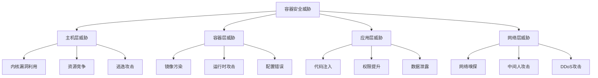

# 4.1.3 容器安全 / Container Security


<!-- TOC START -->

- [4.1.3 容器安全 / Container Security](#413-容器安全-container-security)
  - [1. 安全理论基础 / Security Theory Foundation](#1-安全理论基础-security-theory-foundation)
    - [1.1 容器安全威胁模型 / Container Security Threat Model](#11-容器安全威胁模型-container-security-threat-model)
    - [1.2 安全原则 / Security Principles](#12-安全原则-security-principles)
  - [2. 容器运行时安全 / Container Runtime Security](#2-容器运行时安全-container-runtime-security)
    - [2.1 命名空间隔离 / Namespace Isolation](#21-命名空间隔离-namespace-isolation)
    - [2.2 控制组限制 / Cgroup Restrictions](#22-控制组限制-cgroup-restrictions)
    - [2.3 安全配置文件 / Security Profiles](#23-安全配置文件-security-profiles)
  - [3. 镜像安全 / Image Security](#3-镜像安全-image-security)
    - [3.1 镜像扫描 / Image Scanning](#31-镜像扫描-image-scanning)
    - [3.2 镜像签名 / Image Signing](#32-镜像签名-image-signing)
  - [4. 网络安全 / Network Security](#4-网络安全-network-security)
    - [4.1 网络策略 / Network Policies](#41-网络策略-network-policies)
    - [4.2 TLS/SSL配置 / TLS/SSL Configuration](#42-tlsssl配置-tlsssl-configuration)
  - [5. 运行时保护 / Runtime Protection](#5-运行时保护-runtime-protection)
    - [5.1 行为监控 / Behavior Monitoring](#51-行为监控-behavior-monitoring)
    - [5.2 入侵检测 / Intrusion Detection](#52-入侵检测-intrusion-detection)
  - [6. 安全最佳实践 / Security Best Practices](#6-安全最佳实践-security-best-practices)
    - [6.1 安全配置 / Security Configuration](#61-安全配置-security-configuration)
    - [6.2 安全审计 / Security Auditing](#62-安全审计-security-auditing)
  - [7. 总结与展望 / Summary and Outlook](#7-总结与展望-summary-and-outlook)
    - [7.1 容器安全趋势 / Container Security Trends](#71-容器安全趋势-container-security-trends)
    - [7.2 挑战与机遇 / Challenges and Opportunities](#72-挑战与机遇-challenges-and-opportunities)

<!-- TOC END -->

## 1. 安全理论基础 / Security Theory Foundation

### 1.1 容器安全威胁模型 / Container Security Threat Model

**威胁分类：**

- $Threat_{Model} = \{Attack_{Vectors}, Vulnerabilities, Exploits\}$  
  Threat model: systematic analysis of security threats
- $Attack_{Vector} = \{Privilege_{Escalation}, Data_{Exfiltration}, Denial_{of}_{Service}\}$  
  Attack vector: methods used to compromise security
- $Vulnerability = \{Configuration_{Error}, Code_{Flaw}, Design_{Weakness}\}$  
  Vulnerability: security weaknesses in container systems

**安全威胁层次：**



### 1.2 安全原则 / Security Principles

**容器安全原则：**

1. **最小权限原则**：$Principle_{of}_{Least}_{Privilege} = \min_{p \in P} Privilege(p)$  
   Principle of least privilege: minimize privileges granted to containers
2. **深度防御**：$Defense_{in}_{Depth} = \{Layer_1, Layer_2, ..., Layer_n\}$  
   Defense in depth: multiple security layers
3. **零信任模型**：$Zero_{Trust} = \{Verify_{Always}, Trust_{Never}\}$  
   Zero trust: verify everything, trust nothing

## 2. 容器运行时安全 / Container Runtime Security

### 2.1 命名空间隔离 / Namespace Isolation

**Linux命名空间：**

```rust
#[derive(Debug)]
pub struct NamespaceConfig {
    pid_namespace: bool,
    network_namespace: bool,
    mount_namespace: bool,
    uts_namespace: bool,
    ipc_namespace: bool,
    user_namespace: bool,
}

impl NamespaceConfig {
    pub fn create_namespaces(&self) -> Result<(), Error> {
        if self.pid_namespace {
            self.create_pid_namespace()?;
        }
        
        if self.network_namespace {
            self.create_network_namespace()?;
        }
        
        if self.mount_namespace {
            self.create_mount_namespace()?;
        }
        
        if self.uts_namespace {
            self.create_uts_namespace()?;
        }
        
        if self.ipc_namespace {
            self.create_ipc_namespace()?;
        }
        
        if self.user_namespace {
            self.create_user_namespace()?;
        }
        
        Ok(())
    }
    
    fn create_pid_namespace(&self) -> Result<(), Error> {
        // 创建PID命名空间
        let flags = nix::sched::CloneFlags::CLONE_NEWPID;
        nix::sched::unshare(flags)?;
        Ok(())
    }
    
    fn create_network_namespace(&self) -> Result<(), Error> {
        // 创建网络命名空间
        let flags = nix::sched::CloneFlags::CLONE_NEWNET;
        nix::sched::unshare(flags)?;
        Ok(())
    }
}
```

### 2.2 控制组限制 / Cgroup Restrictions

**资源限制配置：**

```rust
#[derive(Debug)]
pub struct CgroupConfig {
    cpu_limit: Option<f64>,
    memory_limit: Option<usize>,
    pids_limit: Option<usize>,
    device_access: Vec<DeviceAccess>,
}

#[derive(Debug)]
pub struct DeviceAccess {
    device_type: DeviceType,
    major: u32,
    minor: u32,
    permissions: DevicePermissions,
}

impl CgroupConfig {
    pub fn apply_limits(&self, container_id: &str) -> Result<(), Error> {
        let cgroup_path = format!("/sys/fs/cgroup/docker/{}", container_id);
        
        // 设置CPU限制
        if let Some(cpu_limit) = self.cpu_limit {
            self.set_cpu_limit(&cgroup_path, cpu_limit)?;
        }
        
        // 设置内存限制
        if let Some(memory_limit) = self.memory_limit {
            self.set_memory_limit(&cgroup_path, memory_limit)?;
        }
        
        // 设置进程数限制
        if let Some(pids_limit) = self.pids_limit {
            self.set_pids_limit(&cgroup_path, pids_limit)?;
        }
        
        // 设置设备访问权限
        for device in &self.device_access {
            self.set_device_access(&cgroup_path, device)?;
        }
        
        Ok(())
    }
    
    fn set_cpu_limit(&self, cgroup_path: &str, limit: f64) -> Result<(), Error> {
        let cpu_quota = (limit * 100000.0) as i64;
        let cpu_period = 100000;
        
        std::fs::write(
            format!("{}/cpu.cfs_quota_us", cgroup_path),
            cpu_quota.to_string()
        )?;
        
        std::fs::write(
            format!("{}/cpu.cfs_period_us", cgroup_path),
            cpu_period.to_string()
        )?;
        
        Ok(())
    }
    
    fn set_memory_limit(&self, cgroup_path: &str, limit: usize) -> Result<(), Error> {
        std::fs::write(
            format!("{}/memory.limit_in_bytes", cgroup_path),
            limit.to_string()
        )?;
        
        Ok(())
    }
}
```

### 2.3 安全配置文件 / Security Profiles

**AppArmor配置：**

```rust
#[derive(Debug)]
pub struct AppArmorProfile {
    name: String,
    rules: Vec<AppArmorRule>,
    capabilities: Vec<Capability>,
}

#[derive(Debug)]
pub struct AppArmorRule {
    rule_type: RuleType,
    path: String,
    permissions: Vec<Permission>,
}

impl AppArmorProfile {
    pub fn create_profile(&self) -> Result<(), Error> {
        let profile_content = self.generate_profile_content();
        
        // 写入AppArmor配置文件
        std::fs::write(
            format!("/etc/apparmor.d/{}", self.name),
            profile_content
        )?;
        
        // 加载配置文件
        std::process::Command::new("apparmor_parser")
            .arg("-r")
            .arg(format!("/etc/apparmor.d/{}", self.name))
            .output()?;
        
        Ok(())
    }
    
    fn generate_profile_content(&self) -> String {
        let mut content = String::new();
        content.push_str(&format!("profile {}\n", self.name));
        
        // 添加能力
        for capability in &self.capabilities {
            content.push_str(&format!("  capability {},\n", capability));
        }
        
        // 添加文件访问规则
        for rule in &self.rules {
            content.push_str(&format!("  {} {} {},\n", 
                rule.path, 
                rule.permissions.join(" "), 
                rule.rule_type
            ));
        }
        
        content
    }
}
```

## 3. 镜像安全 / Image Security

### 3.1 镜像扫描 / Image Scanning

**漏洞扫描器：**

```rust
#[derive(Debug)]
pub struct ImageScanner {
    scanner_type: ScannerType,
    vulnerability_db: VulnerabilityDatabase,
    scan_results: Vec<ScanResult>,
}

#[derive(Debug)]
pub struct ScanResult {
    vulnerability_id: String,
    severity: Severity,
    package_name: String,
    package_version: String,
    fixed_version: Option<String>,
    description: String,
}

impl ImageScanner {
    pub fn scan_image(&mut self, image_name: &str) -> Result<Vec<ScanResult>, Error> {
        // 提取镜像层
        let layers = self.extract_image_layers(image_name)?;
        
        let mut all_vulnerabilities = Vec::new();
        
        for layer in layers {
            // 扫描每一层
            let layer_vulnerabilities = self.scan_layer(&layer)?;
            all_vulnerabilities.extend(layer_vulnerabilities);
        }
        
        // 去重和排序
        self.deduplicate_vulnerabilities(&mut all_vulnerabilities);
        all_vulnerabilities.sort_by_key(|v| v.severity);
        
        self.scan_results = all_vulnerabilities.clone();
        Ok(all_vulnerabilities)
    }
    
    fn scan_layer(&self, layer: &ImageLayer) -> Result<Vec<ScanResult>, Error> {
        let mut vulnerabilities = Vec::new();
        
        // 扫描操作系统包
        if let Some(packages) = layer.get_packages() {
            for package in packages {
                if let Some(vulns) = self.vulnerability_db.check_package(&package) {
                    vulnerabilities.extend(vulns);
                }
            }
        }
        
        // 扫描应用程序依赖
        if let Some(dependencies) = layer.get_dependencies() {
            for dependency in dependencies {
                if let Some(vulns) = self.vulnerability_db.check_dependency(&dependency) {
                    vulnerabilities.extend(vulns);
                }
            }
        }
        
        Ok(vulnerabilities)
    }
    
    pub fn generate_report(&self) -> SecurityReport {
        let critical_count = self.scan_results.iter()
            .filter(|r| r.severity == Severity::Critical)
            .count();
        
        let high_count = self.scan_results.iter()
            .filter(|r| r.severity == Severity::High)
            .count();
        
        SecurityReport {
            total_vulnerabilities: self.scan_results.len(),
            critical_count,
            high_count,
            medium_count: self.scan_results.iter()
                .filter(|r| r.severity == Severity::Medium)
                .count(),
            low_count: self.scan_results.iter()
                .filter(|r| r.severity == Severity::Low)
                .count(),
            recommendations: self.generate_recommendations(),
        }
    }
}
```

### 3.2 镜像签名 / Image Signing

**数字签名验证：**

```rust
#[derive(Debug)]
pub struct ImageSigner {
    private_key: PrivateKey,
    public_key: PublicKey,
    signature_algorithm: SignatureAlgorithm,
}

impl ImageSigner {
    pub fn sign_image(&self, image_digest: &str) -> Result<Signature, Error> {
        // 创建签名数据
        let signature_data = self.create_signature_data(image_digest);
        
        // 使用私钥签名
        let signature = self.private_key.sign(&signature_data)?;
        
        Ok(Signature {
            algorithm: self.signature_algorithm.clone(),
            signature: signature,
            timestamp: Utc::now(),
            key_id: self.public_key.key_id(),
        })
    }
    
    pub fn verify_signature(&self, image_digest: &str, signature: &Signature) -> Result<bool, Error> {
        // 创建签名数据
        let signature_data = self.create_signature_data(image_digest);
        
        // 使用公钥验证签名
        let is_valid = self.public_key.verify(&signature_data, &signature.signature)?;
        
        Ok(is_valid)
    }
    
    fn create_signature_data(&self, image_digest: &str) -> Vec<u8> {
        let mut data = Vec::new();
        data.extend_from_slice(b"docker-image-v1");
        data.extend_from_slice(image_digest.as_bytes());
        data
    }
}
```

## 4. 网络安全 / Network Security

### 4.1 网络策略 / Network Policies

**网络隔离配置：**

```rust
#[derive(Debug)]
pub struct NetworkPolicy {
    name: String,
    namespace: String,
    pod_selector: HashMap<String, String>,
    ingress_rules: Vec<IngressRule>,
    egress_rules: Vec<EgressRule>,
}

#[derive(Debug)]
pub struct IngressRule {
    from: Vec<NetworkPeer>,
    ports: Vec<NetworkPort>,
    action: PolicyAction,
}

#[derive(Debug)]
pub struct EgressRule {
    to: Vec<NetworkPeer>,
    ports: Vec<NetworkPort>,
    action: PolicyAction,
}

impl NetworkPolicy {
    pub fn apply_policy(&self, iptables: &mut Iptables) -> Result<(), Error> {
        // 创建策略链
        let chain_name = format!("POLICY-{}", self.name);
        iptables.create_chain(&chain_name)?;
        
        // 添加入站规则
        for rule in &self.ingress_rules {
            self.add_ingress_rule(iptables, &chain_name, rule)?;
        }
        
        // 添加出站规则
        for rule in &self.egress_rules {
            self.add_egress_rule(iptables, &chain_name, rule)?;
        }
        
        // 将策略应用到Pod
        self.apply_to_pods(iptables, &chain_name)?;
        
        Ok(())
    }
    
    fn add_ingress_rule(&self, iptables: &mut Iptables, chain: &str, rule: &IngressRule) -> Result<(), Error> {
        for peer in &rule.from {
            for port in &rule.ports {
                let iptables_rule = IptablesRule {
                    table: "filter".to_string(),
                    chain: chain.to_string(),
                    protocol: port.protocol.clone(),
                    source: peer.ip_range.clone(),
                    destination_port: port.port,
                    action: match rule.action {
                        PolicyAction::Allow => "ACCEPT".to_string(),
                        PolicyAction::Deny => "DROP".to_string(),
                    },
                };
                
                iptables.add_rule(iptables_rule)?;
            }
        }
        
        Ok(())
    }
}
```

### 4.2 TLS/SSL配置 / TLS/SSL Configuration

**证书管理：**

```rust
#[derive(Debug)]
pub struct CertificateManager {
    ca_certificate: X509Certificate,
    server_certificates: HashMap<String, X509Certificate>,
    certificate_rotation: CertificateRotation,
}

impl CertificateManager {
    pub fn generate_server_certificate(&mut self, domain: &str) -> Result<X509Certificate, Error> {
        // 生成私钥
        let private_key = self.generate_private_key()?;
        
        // 创建证书请求
        let mut cert_builder = X509v3CertificateBuilder::new()?;
        cert_builder.set_subject_name(&self.create_subject_name(domain)?)?;
        cert_builder.set_issuer_name(&self.ca_certificate.subject_name())?;
        cert_builder.set_not_before(&Asn1Time::from_unix(Utc::now().timestamp())?)?;
        cert_builder.set_not_after(&Asn1Time::from_unix(
            (Utc::now() + Duration::days(365)).timestamp()
        )?)?;
        
        // 添加扩展
        cert_builder.append_extension(
            BasicConstraints::new().critical().ca().build()?
        )?;
        
        cert_builder.append_extension(
            SubjectAlternativeName::new()
                .dns(domain)
                .build(&cert_builder.x509v3_context(&self.ca_certificate, None)?)?
        )?;
        
        // 签名证书
        let certificate = cert_builder.sign(&private_key, MessageDigest::sha256())?;
        
        // 存储证书
        self.server_certificates.insert(domain.to_string(), certificate.clone());
        
        Ok(certificate)
    }
    
    pub fn verify_certificate(&self, certificate: &X509Certificate) -> Result<bool, Error> {
        // 验证证书链
        let mut store = X509Store::new()?;
        store.add_cert(&self.ca_certificate)?;
        
        let mut context = X509StoreContext::new()?;
        context.init(&store, certificate, &[])?;
        
        Ok(context.verify_cert()?)
    }
}
```

## 5. 运行时保护 / Runtime Protection

### 5.1 行为监控 / Behavior Monitoring

**异常检测系统：**

```rust
#[derive(Debug)]
pub struct BehaviorMonitor {
    baseline: BehaviorBaseline,
    current_behavior: ContainerBehavior,
    anomaly_detector: AnomalyDetector,
}

#[derive(Debug)]
pub struct ContainerBehavior {
    process_activity: Vec<ProcessEvent>,
    network_activity: Vec<NetworkEvent>,
    file_activity: Vec<FileEvent>,
    system_calls: Vec<SyscallEvent>,
}

impl BehaviorMonitor {
    pub fn monitor_container(&mut self, container_id: &str) -> Result<(), Error> {
        // 启动监控线程
        let process_monitor = self.start_process_monitoring(container_id)?;
        let network_monitor = self.start_network_monitoring(container_id)?;
        let file_monitor = self.start_file_monitoring(container_id)?;
        let syscall_monitor = self.start_syscall_monitoring(container_id)?;
        
        // 收集行为数据
        loop {
            let behavior = self.collect_behavior_data(
                &process_monitor,
                &network_monitor,
                &file_monitor,
                &syscall_monitor
            );
            
            // 检测异常
            if let Some(anomaly) = self.detect_anomaly(&behavior) {
                self.handle_anomaly(anomaly)?;
            }
            
            // 更新基线
            self.update_baseline(&behavior);
            
            std::thread::sleep(Duration::from_secs(1));
        }
    }
    
    fn detect_anomaly(&self, behavior: &ContainerBehavior) -> Option<Anomaly> {
        let process_anomaly = self.anomaly_detector.detect_process_anomaly(
            &behavior.process_activity,
            &self.baseline.process_patterns
        );
        
        let network_anomaly = self.anomaly_detector.detect_network_anomaly(
            &behavior.network_activity,
            &self.baseline.network_patterns
        );
        
        let file_anomaly = self.anomaly_detector.detect_file_anomaly(
            &behavior.file_activity,
            &self.baseline.file_patterns
        );
        
        if process_anomaly.is_some() || network_anomaly.is_some() || file_anomaly.is_some() {
            Some(Anomaly {
                process_anomaly,
                network_anomaly,
                file_anomaly,
                timestamp: Utc::now(),
            })
        } else {
            None
        }
    }
}
```

### 5.2 入侵检测 / Intrusion Detection

**IDS系统：**

```rust
#[derive(Debug)]
pub struct IntrusionDetectionSystem {
    signature_database: SignatureDatabase,
    anomaly_detector: AnomalyDetector,
    alert_manager: AlertManager,
}

impl IntrusionDetectionSystem {
    pub fn analyze_traffic(&mut self, packet: &NetworkPacket) -> Result<(), Error> {
        // 签名检测
        if let Some(signature_match) = self.signature_database.match_signature(packet) {
            self.alert_manager.raise_alert(Alert {
                alert_type: AlertType::SignatureMatch,
                severity: signature_match.severity,
                description: signature_match.description,
                packet_data: packet.clone(),
                timestamp: Utc::now(),
            })?;
        }
        
        // 异常检测
        if let Some(anomaly) = self.anomaly_detector.detect_network_anomaly(packet) {
            self.alert_manager.raise_alert(Alert {
                alert_type: AlertType::AnomalyDetected,
                severity: Severity::Medium,
                description: anomaly.description,
                packet_data: packet.clone(),
                timestamp: Utc::now(),
            })?;
        }
        
        Ok(())
    }
    
    pub fn update_signatures(&mut self, new_signatures: Vec<Signature>) -> Result<(), Error> {
        for signature in new_signatures {
            self.signature_database.add_signature(signature)?;
        }
        
        Ok(())
    }
}
```

## 6. 安全最佳实践 / Security Best Practices

### 6.1 安全配置 / Security Configuration

**安全配置检查：**

```rust
#[derive(Debug)]
pub struct SecurityConfigChecker {
    security_policies: Vec<SecurityPolicy>,
    compliance_rules: Vec<ComplianceRule>,
}

impl SecurityConfigChecker {
    pub fn check_container_security(&self, container: &Container) -> SecurityReport {
        let mut violations = Vec::new();
        let mut recommendations = Vec::new();
        
        // 检查运行时配置
        let runtime_violations = self.check_runtime_config(container);
        violations.extend(runtime_violations);
        
        // 检查镜像安全
        let image_violations = self.check_image_security(container);
        violations.extend(image_violations);
        
        // 检查网络配置
        let network_violations = self.check_network_config(container);
        violations.extend(network_violations);
        
        // 生成建议
        recommendations = self.generate_recommendations(&violations);
        
        SecurityReport {
            violations,
            recommendations,
            compliance_score: self.calculate_compliance_score(&violations),
        }
    }
    
    fn check_runtime_config(&self, container: &Container) -> Vec<SecurityViolation> {
        let mut violations = Vec::new();
        
        // 检查特权模式
        if container.privileged {
            violations.push(SecurityViolation {
                rule: "No privileged containers".to_string(),
                severity: Severity::High,
                description: "Container is running in privileged mode".to_string(),
            });
        }
        
        // 检查用户ID
        if container.user_id == 0 {
            violations.push(SecurityViolation {
                rule: "No root user".to_string(),
                severity: Severity::Medium,
                description: "Container is running as root user".to_string(),
            });
        }
        
        // 检查挂载点
        for mount in &container.mounts {
            if mount.read_only == false && mount.destination == "/" {
                violations.push(SecurityViolation {
                    rule: "Read-only root filesystem".to_string(),
                    severity: Severity::Medium,
                    description: "Root filesystem should be read-only".to_string(),
                });
            }
        }
        
        violations
    }
}
```

### 6.2 安全审计 / Security Auditing

**审计日志系统：**

```rust
#[derive(Debug)]
pub struct SecurityAuditor {
    audit_logger: AuditLogger,
    compliance_checker: ComplianceChecker,
    report_generator: ReportGenerator,
}

impl SecurityAuditor {
    pub fn audit_container_activity(&mut self, container_id: &str) -> AuditReport {
        let mut audit_events = Vec::new();
        
        // 收集审计事件
        audit_events.extend(self.collect_process_events(container_id));
        audit_events.extend(self.collect_network_events(container_id));
        audit_events.extend(self.collect_file_events(container_id));
        audit_events.extend(self.collect_security_events(container_id));
        
        // 分析合规性
        let compliance_results = self.compliance_checker.check_compliance(&audit_events);
        
        // 生成审计报告
        self.report_generator.generate_audit_report(
            container_id,
            &audit_events,
            &compliance_results
        )
    }
    
    fn collect_process_events(&self, container_id: &str) -> Vec<AuditEvent> {
        let mut events = Vec::new();
        
        // 监控进程创建
        if let Ok(processes) = self.get_container_processes(container_id) {
            for process in processes {
                events.push(AuditEvent {
                    event_type: AuditEventType::ProcessCreated,
                    timestamp: Utc::now(),
                    details: format!("Process {} created with PID {}", 
                        process.command, process.pid),
                    severity: Severity::Info,
                });
            }
        }
        
        events
    }
}
```

## 7. 总结与展望 / Summary and Outlook

### 7.1 容器安全趋势 / Container Security Trends

**技术发展方向：**

1. **零信任架构**：基于零信任的容器安全模型
2. **AI安全**：基于AI的威胁检测和响应
3. **供应链安全**：容器镜像供应链的安全保障
4. **合规自动化**：自动化的安全合规检查

### 7.2 挑战与机遇 / Challenges and Opportunities

**技术挑战：**

- 容器逃逸攻击的防护
- 大规模容器环境的安全管理
- 容器安全与性能的平衡
- 多云环境的统一安全管理

**发展机遇：**

- 云原生安全的新需求
- 容器安全标准的制定
- 安全工具链的集成
- 自动化安全运维

---

> 容器安全是云原生应用安全的重要组成部分，需要从镜像构建、运行时保护到网络安全的全方位防护。随着容器技术的普及，安全防护措施需要不断创新以适应新的威胁。
> Container security is an important component of cloud-native application security, requiring comprehensive protection from image building to runtime protection and network security. With the proliferation of container technology, security measures need continuous innovation to adapt to new threats.
