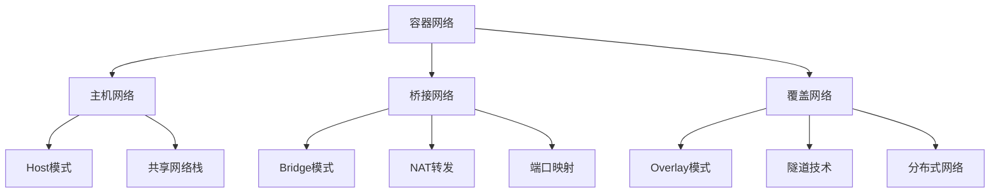

# 4.1.4 容器网络 / Container Networking

## 1. 网络理论基础 / Network Theory Foundation

### 1.1 容器网络模型 / Container Network Model

**网络架构定义：**

- $Container_{Network} = \{Host_{Network}, Bridge_{Network}, Overlay_{Network}\}$  
  Container network: network architecture for containerized applications
- $Network_{Mode} = \{Host, Bridge, Overlay, None\}$：网络模式  
  Network mode: container network configuration
- $Network_{Plugin} = \{CNI, CNM, Custom\}$：网络插件  
  Network plugin: container network implementation

**网络层次结构：**



### 1.2 网络命名空间 / Network Namespaces

**命名空间隔离：**

```rust
#[derive(Debug)]
pub struct NetworkNamespace {
    id: u64,
    interfaces: Vec<NetworkInterface>,
    routing_table: RoutingTable,
    iptables_rules: Vec<IptablesRule>,
}

impl NetworkNamespace {
    pub fn create_namespace(&self) -> Result<(), Error> {
        // 创建网络命名空间
        let flags = nix::sched::CloneFlags::CLONE_NEWNET;
        nix::sched::unshare(flags)?;
        
        // 创建回环接口
        self.create_loopback_interface()?;
        
        Ok(())
    }
    
    pub fn create_veth_pair(&mut self, name: &str) -> Result<(String, String), Error> {
        // 创建虚拟以太网对
        let host_name = format!("veth{}", self.generate_interface_id());
        let container_name = name.to_string();
        
        // 创建veth对
        let veth = VethPair::new(&host_name, &container_name)?;
        
        // 将容器端移动到命名空间
        veth.move_to_namespace(self.id)?;
        
        // 配置IP地址
        self.configure_interface(&container_name)?;
        
        Ok((host_name, container_name))
    }
    
    fn configure_interface(&self, interface_name: &str) -> Result<(), Error> {
        // 启用接口
        std::fs::write(
            format!("/sys/class/net/{}/operstate", interface_name),
            "up"
        )?;
        
        // 配置IP地址
        let ip_command = std::process::Command::new("ip")
            .args(&["addr", "add", "10.0.0.2/24", "dev", interface_name])
            .output()?;
        
        if !ip_command.status.success() {
            return Err(Error::InterfaceConfigurationFailed);
        }
        
        Ok(())
    }
}
```

## 2. 网络模式 / Network Modes

### 2.1 Host模式 / Host Mode

**Host网络配置：**

```rust
#[derive(Debug)]
pub struct HostNetworkMode {
    container_id: String,
    host_interfaces: Vec<NetworkInterface>,
}

impl HostNetworkMode {
    pub fn configure(&self) -> Result<(), Error> {
        // 共享主机网络栈
        let flags = nix::sched::CloneFlags::empty(); // 不创建新的网络命名空间
        
        // 直接使用主机网络接口
        for interface in &self.host_interfaces {
            self.configure_host_interface(interface)?;
        }
        
        Ok(())
    }
    
    fn configure_host_interface(&self, interface: &NetworkInterface) -> Result<(), Error> {
        // 配置主机接口供容器使用
        if interface.name == "lo" {
            // 回环接口配置
            self.configure_loopback()?;
        } else {
            // 物理接口配置
            self.configure_physical_interface(interface)?;
        }
        
        Ok(())
    }
    
    pub fn get_network_info(&self) -> NetworkInfo {
        NetworkInfo {
            mode: NetworkMode::Host,
            ip_address: self.get_host_ip(),
            gateway: self.get_host_gateway(),
            dns_servers: self.get_host_dns(),
        }
    }
}
```

### 2.2 Bridge模式 / Bridge Mode

**Bridge网络实现：**

```rust
#[derive(Debug)]
pub struct BridgeNetworkMode {
    bridge_name: String,
    subnet: IpNetwork,
    gateway: IpAddr,
    containers: Vec<ContainerNetwork>,
}

impl BridgeNetworkMode {
    pub fn create_bridge(&mut self) -> Result<(), Error> {
        // 创建网桥
        let bridge = Bridge::new(&self.bridge_name)?;
        
        // 配置网桥IP
        bridge.set_ip_address(self.gateway, self.subnet.prefix())?;
        
        // 启用网桥
        bridge.enable()?;
        
        Ok(())
    }
    
    pub fn connect_container(&mut self, container_id: &str) -> Result<ContainerNetwork, Error> {
        // 创建veth对
        let (host_veth, container_veth) = self.create_veth_pair(container_id)?;
        
        // 将主机端连接到网桥
        self.bridge.add_interface(&host_veth)?;
        
        // 分配IP地址
        let container_ip = self.allocate_ip_address()?;
        
        // 配置容器网络
        let container_network = ContainerNetwork {
            container_id: container_id.to_string(),
            veth_pair: (host_veth, container_veth),
            ip_address: container_ip,
            gateway: self.gateway,
            subnet: self.subnet,
        };
        
        self.containers.push(container_network.clone());
        
        Ok(container_network)
    }
    
    fn allocate_ip_address(&self) -> Result<IpAddr, Error> {
        // 从子网中分配IP地址
        let network = self.subnet.network();
        let mut allocated_ips: Vec<IpAddr> = self.containers
            .iter()
            .map(|c| c.ip_address)
            .collect();
        
        // 找到第一个可用IP
        for i in 2..=254 {
            let candidate_ip = network + i;
            if !allocated_ips.contains(&candidate_ip) {
                return Ok(candidate_ip);
            }
        }
        
        Err(Error::NoAvailableIP)
    }
    
    pub fn setup_nat(&self) -> Result<(), Error> {
        // 配置NAT规则
        let iptables = Iptables::new();
        
        // 启用IP转发
        std::fs::write("/proc/sys/net/ipv4/ip_forward", "1")?;
        
        // 添加MASQUERADE规则
        iptables.add_rule(IptablesRule {
            table: "nat".to_string(),
            chain: "POSTROUTING".to_string(),
            source: self.subnet.to_string(),
            destination: "0.0.0.0/0".to_string(),
            action: "MASQUERADE".to_string(),
            ..Default::default()
        })?;
        
        Ok(())
    }
}
```

### 2.3 Overlay模式 / Overlay Mode

**Overlay网络实现：**

```rust
#[derive(Debug)]
pub struct OverlayNetworkMode {
    network_id: String,
    subnet: IpNetwork,
    encryption: bool,
    nodes: Vec<OverlayNode>,
    tunnels: Vec<Tunnel>,
}

#[derive(Debug)]
pub struct OverlayNode {
    node_id: String,
    ip_address: IpAddr,
    public_ip: IpAddr,
    tunnels: Vec<Tunnel>,
}

impl OverlayNetworkMode {
    pub fn create_overlay_network(&mut self) -> Result<(), Error> {
        // 创建VXLAN接口
        let vxlan = VxlanInterface::new(
            &format!("vxlan{}", self.network_id),
            self.subnet,
            self.encryption
        )?;
        
        // 配置VXLAN参数
        vxlan.set_vni(self.generate_vni())?;
        vxlan.set_mtu(1450)?; // 考虑VXLAN头部开销
        
        // 启用接口
        vxlan.enable()?;
        
        Ok(())
    }
    
    pub fn add_node(&mut self, node: OverlayNode) -> Result<(), Error> {
        // 添加节点到覆盖网络
        self.nodes.push(node.clone());
        
        // 创建到其他节点的隧道
        for existing_node in &self.nodes {
            if existing_node.node_id != node.node_id {
                let tunnel = self.create_tunnel(&node, existing_node)?;
                self.tunnels.push(tunnel);
            }
        }
        
        Ok(())
    }
    
    fn create_tunnel(&self, source: &OverlayNode, destination: &OverlayNode) -> Result<Tunnel, Error> {
        // 创建GRE隧道
        let tunnel = GreTunnel::new(
            &format!("gre-{}", destination.node_id),
            source.public_ip,
            destination.public_ip,
            self.subnet
        )?;
        
        // 配置隧道参数
        tunnel.set_mtu(1400)?;
        tunnel.enable_encryption(self.encryption)?;
        
        Ok(Tunnel {
            id: format!("{}-{}", source.node_id, destination.node_id),
            source: source.node_id.clone(),
            destination: destination.node_id.clone(),
            interface: tunnel,
        })
    }
    
    pub fn route_packet(&self, packet: &NetworkPacket) -> Result<(), Error> {
        // 在覆盖网络中路由数据包
        let destination_ip = packet.destination_ip;
        
        // 查找目标节点
        if let Some(target_node) = self.find_node_by_ip(destination_ip) {
            // 通过隧道发送数据包
            if let Some(tunnel) = self.find_tunnel_to_node(&target_node.node_id) {
                tunnel.send_packet(packet)?;
            }
        }
        
        Ok(())
    }
}
```

## 3. 网络插件 / Network Plugins

### 3.1 CNI插件 / CNI Plugins

**CNI接口实现：**

```rust
#[derive(Debug)]
pub struct CNIPlugin {
    name: String,
    version: String,
    capabilities: Vec<Capability>,
    config: CNIConfig,
}

#[derive(Debug)]
pub struct CNIConfig {
    cni_version: String,
    name: String,
    type_: String,
    bridge: Option<String>,
    ipam: IPAMConfig,
    dns: DNSConfig,
}

impl CNIPlugin {
    pub fn add_network(&self, container_id: &str, network_namespace: &str) -> Result<CNIResult, Error> {
        // 解析CNI配置
        let config = self.parse_config()?;
        
        // 创建网络接口
        let interfaces = self.create_interfaces(&config, container_id)?;
        
        // 配置IP地址
        let ips = self.configure_ips(&config, &interfaces)?;
        
        // 配置路由
        let routes = self.configure_routes(&config)?;
        
        // 配置DNS
        let dns = self.configure_dns(&config)?;
        
        Ok(CNIResult {
            cni_version: config.cni_version,
            interfaces,
            ips,
            routes,
            dns,
        })
    }
    
    pub fn del_network(&self, container_id: &str, network_namespace: &str) -> Result<(), Error> {
        // 清理网络配置
        self.cleanup_interfaces(container_id)?;
        self.cleanup_routes(container_id)?;
        self.cleanup_iptables(container_id)?;
        
        Ok(())
    }
    
    fn create_interfaces(&self, config: &CNIConfig, container_id: &str) -> Result<Vec<Interface>, Error> {
        let mut interfaces = Vec::new();
        
        match config.type_.as_str() {
            "bridge" => {
                // 创建桥接接口
                let bridge_interface = self.create_bridge_interface(config)?;
                interfaces.push(bridge_interface);
                
                // 创建veth对
                let veth_pair = self.create_veth_pair(container_id)?;
                interfaces.push(veth_pair.0);
                interfaces.push(veth_pair.1);
            }
            "host-local" => {
                // 使用主机网络
                let host_interface = self.get_host_interface()?;
                interfaces.push(host_interface);
            }
            "overlay" => {
                // 创建覆盖网络接口
                let overlay_interface = self.create_overlay_interface(config)?;
                interfaces.push(overlay_interface);
            }
            _ => {
                return Err(Error::UnsupportedNetworkType);
            }
        }
        
        Ok(interfaces)
    }
}
```

### 3.2 网络策略 / Network Policies

**策略实现：**

```rust
#[derive(Debug)]
pub struct NetworkPolicy {
    name: String,
    namespace: String,
    pod_selector: HashMap<String, String>,
    ingress_rules: Vec<IngressRule>,
    egress_rules: Vec<EgressRule>,
}

impl NetworkPolicy {
    pub fn apply_policy(&self, iptables: &mut Iptables) -> Result<(), Error> {
        // 创建策略链
        let chain_name = format!("POLICY-{}", self.name);
        iptables.create_chain(&chain_name)?;
        
        // 添加入站规则
        for rule in &self.ingress_rules {
            self.add_ingress_rule(iptables, &chain_name, rule)?;
        }
        
        // 添加出站规则
        for rule in &self.egress_rules {
            self.add_egress_rule(iptables, &chain_name, rule)?;
        }
        
        // 将策略应用到Pod
        self.apply_to_pods(iptables, &chain_name)?;
        
        Ok(())
    }
    
    fn add_ingress_rule(&self, iptables: &mut Iptables, chain: &str, rule: &IngressRule) -> Result<(), Error> {
        for peer in &rule.from {
            for port in &rule.ports {
                let iptables_rule = IptablesRule {
                    table: "filter".to_string(),
                    chain: chain.to_string(),
                    protocol: port.protocol.clone(),
                    source: peer.ip_range.clone(),
                    destination_port: port.port,
                    action: match rule.action {
                        PolicyAction::Allow => "ACCEPT".to_string(),
                        PolicyAction::Deny => "DROP".to_string(),
                    },
                };
                
                iptables.add_rule(iptables_rule)?;
            }
        }
        
        Ok(())
    }
}
```

## 4. 服务发现 / Service Discovery

### 4.1 DNS服务发现 / DNS Service Discovery

**DNS配置：**

```rust
#[derive(Debug)]
pub struct DNSServiceDiscovery {
    dns_server: DNSServer,
    service_registry: ServiceRegistry,
    dns_records: HashMap<String, DNSRecord>,
}

impl DNSServiceDiscovery {
    pub fn register_service(&mut self, service: &Service) -> Result<(), Error> {
        // 创建DNS记录
        let dns_record = DNSRecord {
            name: format!("{}.{}.svc.cluster.local", service.name, service.namespace),
            record_type: RecordType::A,
            ttl: 300,
            data: service.cluster_ip.to_string(),
        };
        
        // 添加到DNS服务器
        self.dns_server.add_record(&dns_record)?;
        self.dns_records.insert(dns_record.name.clone(), dns_record);
        
        // 注册到服务注册表
        self.service_registry.register(service)?;
        
        Ok(())
    }
    
    pub fn resolve_service(&self, service_name: &str, namespace: &str) -> Result<Vec<IpAddr>, Error> {
        let fqdn = format!("{}.{}.svc.cluster.local", service_name, namespace);
        
        // 查询DNS记录
        let records = self.dns_server.query(&fqdn, RecordType::A)?;
        
        let mut ips = Vec::new();
        for record in records {
            if let Ok(ip) = record.data.parse::<IpAddr>() {
                ips.push(ip);
            }
        }
        
        Ok(ips)
    }
    
    pub fn update_service_endpoints(&mut self, service: &Service, endpoints: &[Endpoint]) -> Result<(), Error> {
        // 更新服务的端点记录
        for endpoint in endpoints {
            let record_name = format!("{}.{}.svc.cluster.local", service.name, service.namespace);
            
            let dns_record = DNSRecord {
                name: record_name,
                record_type: RecordType::A,
                ttl: 30, // 较短的TTL以便快速更新
                data: endpoint.ip.to_string(),
            };
            
            self.dns_server.update_record(&dns_record)?;
        }
        
        Ok(())
    }
}
```

### 4.2 负载均衡 / Load Balancing

**负载均衡器：**

```rust
#[derive(Debug)]
pub struct LoadBalancer {
    algorithm: LoadBalancingAlgorithm,
    backend_servers: Vec<BackendServer>,
    health_checker: HealthChecker,
}

impl LoadBalancer {
    pub fn select_backend(&mut self, request: &Request) -> Option<&BackendServer> {
        let healthy_servers: Vec<&BackendServer> = self.backend_servers
            .iter()
            .filter(|server| server.health_status == HealthStatus::Healthy)
            .collect();
        
        if healthy_servers.is_empty() {
            return None;
        }
        
        match self.algorithm {
            LoadBalancingAlgorithm::RoundRobin => {
                self.round_robin_select(&healthy_servers)
            }
            LoadBalancingAlgorithm::LeastConnections => {
                self.least_connections_select(&healthy_servers)
            }
            LoadBalancingAlgorithm::WeightedRoundRobin => {
                self.weighted_round_robin_select(&healthy_servers)
            }
            LoadBalancingAlgorithm::IPHash => {
                self.ip_hash_select(&healthy_servers, request)
            }
        }
    }
    
    fn round_robin_select(&self, servers: &[&BackendServer]) -> Option<&BackendServer> {
        let index = (self.request_count % servers.len()) as usize;
        servers.get(index).copied()
    }
    
    fn least_connections_select(&self, servers: &[&BackendServer]) -> Option<&BackendServer> {
        servers.iter()
            .min_by_key(|server| server.current_connections)
            .copied()
    }
    
    pub fn health_check(&mut self) {
        for server in &mut self.backend_servers {
            let health_status = self.health_checker.check_server(server);
            server.health_status = health_status;
        }
    }
}
```

## 5. 网络监控 / Network Monitoring

### 5.1 流量监控 / Traffic Monitoring

**监控系统：**

```rust
#[derive(Debug)]
pub struct NetworkMonitor {
    traffic_collector: TrafficCollector,
    metrics_aggregator: MetricsAggregator,
    alert_manager: AlertManager,
}

impl NetworkMonitor {
    pub fn start_monitoring(&mut self) -> Result<(), Error> {
        // 启动流量收集
        self.traffic_collector.start_collection()?;
        
        // 启动指标聚合
        self.metrics_aggregator.start_aggregation()?;
        
        // 启动告警管理
        self.alert_manager.start_monitoring()?;
        
        Ok(())
    }
    
    pub fn collect_metrics(&self) -> NetworkMetrics {
        let traffic_stats = self.traffic_collector.get_statistics();
        let connection_stats = self.get_connection_statistics();
        let error_stats = self.get_error_statistics();
        
        NetworkMetrics {
            bytes_in: traffic_stats.bytes_in,
            bytes_out: traffic_stats.bytes_out,
            packets_in: traffic_stats.packets_in,
            packets_out: traffic_stats.packets_out,
            active_connections: connection_stats.active,
            total_connections: connection_stats.total,
            error_rate: error_stats.error_rate,
            latency: self.calculate_average_latency(),
        }
    }
    
    pub fn check_alerts(&mut self, metrics: &NetworkMetrics) -> Result<(), Error> {
        // 检查带宽使用率
        if metrics.bandwidth_utilization > 80.0 {
            self.alert_manager.raise_alert(Alert {
                alert_type: AlertType::HighBandwidthUsage,
                severity: Severity::Warning,
                description: format!("Bandwidth usage: {:.1}%", metrics.bandwidth_utilization),
                timestamp: Utc::now(),
            })?;
        }
        
        // 检查错误率
        if metrics.error_rate > 5.0 {
            self.alert_manager.raise_alert(Alert {
                alert_type: AlertType::HighErrorRate,
                severity: Severity::Critical,
                description: format!("Error rate: {:.1}%", metrics.error_rate),
                timestamp: Utc::now(),
            })?;
        }
        
        // 检查延迟
        if metrics.latency > Duration::from_millis(100) {
            self.alert_manager.raise_alert(Alert {
                alert_type: AlertType::HighLatency,
                severity: Severity::Warning,
                description: format!("High latency: {:?}", metrics.latency),
                timestamp: Utc::now(),
            })?;
        }
        
        Ok(())
    }
}
```

### 5.2 网络诊断 / Network Diagnostics

**诊断工具：**

```rust
#[derive(Debug)]
pub struct NetworkDiagnostics {
    connectivity_tester: ConnectivityTester,
    traceroute: Traceroute,
    packet_analyzer: PacketAnalyzer,
}

impl NetworkDiagnostics {
    pub fn diagnose_connectivity(&self, target: &str) -> ConnectivityReport {
        let mut report = ConnectivityReport::new();
        
        // 测试基本连通性
        if let Ok(ping_result) = self.connectivity_tester.ping(target) {
            report.ping_latency = Some(ping_result.latency);
            report.packet_loss = Some(ping_result.packet_loss);
        }
        
        // 执行路由跟踪
        if let Ok(trace_result) = self.traceroute.trace(target) {
            report.route_hops = Some(trace_result.hops);
            report.route_latency = Some(trace_result.total_latency);
        }
        
        // 分析数据包
        if let Ok(packet_analysis) = self.packet_analyzer.analyze(target) {
            report.packet_statistics = Some(packet_analysis);
        }
        
        report
    }
    
    pub fn diagnose_service_connectivity(&self, service_name: &str) -> ServiceConnectivityReport {
        let mut report = ServiceConnectivityReport::new();
        
        // 解析服务地址
        if let Ok(service_ips) = self.resolve_service(service_name) {
            for ip in service_ips {
                let connectivity = self.diagnose_connectivity(&ip.to_string());
                report.endpoint_reports.push(connectivity);
            }
        }
        
        // 测试服务端口
        if let Ok(port_test) = self.test_service_ports(service_name) {
            report.port_status = Some(port_test);
        }
        
        report
    }
}
```

## 6. 总结与展望 / Summary and Outlook

### 6.1 容器网络趋势 / Container Network Trends

**技术发展方向：**

1. **服务网格**：Istio、Linkerd等服务网格技术
2. **网络虚拟化**：更高级的网络虚拟化技术
3. **边缘网络**：容器在边缘计算中的网络优化
4. **量子网络**：量子网络在容器中的应用

### 6.2 挑战与机遇 / Challenges and Opportunities

**技术挑战：**

- 大规模容器网络的性能优化
- 多租户网络隔离的安全性
- 容器网络与现有网络的集成
- 网络策略的复杂性和可维护性

**发展机遇：**

- 云原生网络的新需求
- 微服务架构的网络优化
- 边缘计算的网络创新
- 网络自动化的标准化

---

> 容器网络是容器化应用的基础设施，需要提供高性能、高可用性和安全性的网络服务。随着容器技术的普及，网络技术需要不断创新以满足新的应用需求。
> Container networking is the infrastructure for containerized applications, requiring high-performance, high-availability, and secure network services. With the proliferation of container technology, network technology needs continuous innovation to meet new application requirements.
