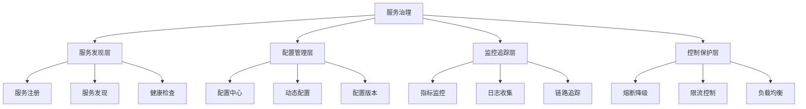

# 4.2.3 服务治理 / Service Governance


<!-- TOC START -->

- [4.2.3 服务治理 / Service Governance](#423-服务治理-service-governance)
  - [1. 服务治理理论基础 / Service Governance Theory Foundation](#1-服务治理理论基础-service-governance-theory-foundation)
    - [1.1 服务治理定义 / Service Governance Definition](#11-服务治理定义-service-governance-definition)
    - [1.2 服务治理架构 / Service Governance Architecture](#12-服务治理架构-service-governance-architecture)
  - [2. 服务发现 / Service Discovery](#2-服务发现-service-discovery)
    - [2.1 服务注册 / Service Registration](#21-服务注册-service-registration)
    - [2.2 健康检查 / Health Check](#22-健康检查-health-check)
  - [3. 配置管理 / Configuration Management](#3-配置管理-configuration-management)
    - [3.1 配置中心 / Configuration Center](#31-配置中心-configuration-center)
    - [3.2 动态配置 / Dynamic Configuration](#32-动态配置-dynamic-configuration)
  - [4. 熔断降级 / Circuit Breaker](#4-熔断降级-circuit-breaker)
    - [4.1 熔断器实现 / Circuit Breaker Implementation](#41-熔断器实现-circuit-breaker-implementation)
    - [4.2 降级策略 / Fallback Strategy](#42-降级策略-fallback-strategy)
  - [5. 链路追踪 / Distributed Tracing](#5-链路追踪-distributed-tracing)
    - [5.1 追踪上下文 / Trace Context](#51-追踪上下文-trace-context)
    - [5.2 追踪收集器 / Trace Collector](#52-追踪收集器-trace-collector)
  - [6. 监控告警 / Monitoring and Alerting](#6-监控告警-monitoring-and-alerting)
    - [6.1 指标监控 / Metrics Monitoring](#61-指标监控-metrics-monitoring)
    - [6.2 告警系统 / Alerting System](#62-告警系统-alerting-system)
  - [7. 总结与展望 / Summary and Outlook](#7-总结与展望-summary-and-outlook)
    - [7.1 服务治理趋势 / Service Governance Trends](#71-服务治理趋势-service-governance-trends)
    - [7.2 挑战与机遇 / Challenges and Opportunities](#72-挑战与机遇-challenges-and-opportunities)

<!-- TOC END -->

## 1. 服务治理理论基础 / Service Governance Theory Foundation

### 1.1 服务治理定义 / Service Governance Definition

**服务治理形式化定义：**

- $Service_{Governance} = \{Discovery, Configuration, Monitoring, Control\}$  
  Service governance: comprehensive management of microservices
- $Discovery = \{Registration, Lookup, Health_{Check}\}$：服务发现  
  Discovery: service registration and discovery mechanism
- $Configuration = \{Dynamic_{Config}, Version_{Control}, Environment_{Management}\}$：配置管理  
  Configuration: dynamic configuration management

**治理目标：**

1. **高可用性**：$Availability = \frac{MTTF}{MTTF + MTTR}$  
   High availability: maximize service uptime
2. **可观测性**：$Observability = \{Logs, Metrics, Traces\}$  
   Observability: comprehensive monitoring and tracing
3. **可控制性**：$Control = \{Circuit_{Breaker}, Rate_{Limiting}, Load_{Balancing}\}$  
   Control: service control and protection mechanisms

### 1.2 服务治理架构 / Service Governance Architecture

**治理架构层次：**



## 2. 服务发现 / Service Discovery

### 2.1 服务注册 / Service Registration

**注册中心实现：**

```rust
#[derive(Debug)]
pub struct ServiceRegistry {
    services: HashMap<String, ServiceInstance>,
    health_checker: HealthChecker,
    event_notifier: EventNotifier,
}

#[derive(Debug, Clone)]
pub struct ServiceInstance {
    service_name: String,
    instance_id: String,
    host: String,
    port: u16,
    metadata: HashMap<String, String>,
    status: InstanceStatus,
    last_heartbeat: DateTime<Utc>,
}

impl ServiceRegistry {
    pub fn register_service(&mut self, instance: ServiceInstance) -> Result<(), Error> {
        let key = format!("{}:{}", instance.service_name, instance.instance_id);
        
        // 验证服务实例
        self.validate_instance(&instance)?;
        
        // 注册服务
        self.services.insert(key, instance.clone());
        
        // 启动健康检查
        self.health_checker.start_check(&instance)?;
        
        // 通知服务注册事件
        self.event_notifier.notify(ServiceEvent::Registered(instance))?;
        
        Ok(())
    }
    
    pub fn deregister_service(&mut self, service_name: &str, instance_id: &str) -> Result<(), Error> {
        let key = format!("{}:{}", service_name, instance_id);
        
        if let Some(instance) = self.services.remove(&key) {
            // 停止健康检查
            self.health_checker.stop_check(&instance)?;
            
            // 通知服务注销事件
            self.event_notifier.notify(ServiceEvent::Deregistered(instance))?;
        }
        
        Ok(())
    }
    
    pub fn discover_service(&self, service_name: &str) -> Vec<ServiceInstance> {
        self.services.values()
            .filter(|instance| instance.service_name == service_name)
            .filter(|instance| instance.status == InstanceStatus::Healthy)
            .cloned()
            .collect()
    }
    
    fn validate_instance(&self, instance: &ServiceInstance) -> Result<(), Error> {
        // 检查必要字段
        if instance.service_name.is_empty() || instance.instance_id.is_empty() {
            return Err(Error::InvalidInstanceData);
        }
        
        // 检查端口范围
        if instance.port == 0 || instance.port > 65535 {
            return Err(Error::InvalidPort);
        }
        
        // 检查主机地址
        if instance.host.is_empty() {
            return Err(Error::InvalidHost);
        }
        
        Ok(())
    }
}
```

### 2.2 健康检查 / Health Check

**健康检查机制：**

```rust
#[derive(Debug)]
pub struct HealthChecker {
    check_interval: Duration,
    timeout: Duration,
    max_failures: usize,
    health_checks: HashMap<String, HealthCheck>,
}

#[derive(Debug)]
pub struct HealthCheck {
    instance_id: String,
    check_type: HealthCheckType,
    endpoint: String,
    expected_status: u16,
    failure_count: usize,
    last_check: DateTime<Utc>,
}

impl HealthChecker {
    pub fn start_check(&mut self, instance: &ServiceInstance) -> Result<(), Error> {
        let health_check = HealthCheck {
            instance_id: instance.instance_id.clone(),
            check_type: HealthCheckType::HTTP,
            endpoint: format!("http://{}:{}/health", instance.host, instance.port),
            expected_status: 200,
            failure_count: 0,
            last_check: Utc::now(),
        };
        
        self.health_checks.insert(instance.instance_id.clone(), health_check);
        
        // 启动健康检查线程
        self.spawn_health_check_thread(instance.instance_id.clone());
        
        Ok(())
    }
    
    fn spawn_health_check_thread(&self, instance_id: String) {
        let health_checker = self.clone();
        
        std::thread::spawn(move || {
            loop {
                if let Err(e) = health_checker.perform_health_check(&instance_id) {
                    eprintln!("Health check failed for {}: {}", instance_id, e);
                }
                
                std::thread::sleep(health_checker.check_interval);
            }
        });
    }
    
    fn perform_health_check(&mut self, instance_id: &str) -> Result<(), Error> {
        if let Some(health_check) = self.health_checks.get_mut(instance_id) {
            let client = reqwest::Client::new();
            let response = client
                .get(&health_check.endpoint)
                .timeout(self.timeout)
                .send();
            
            match response {
                Ok(resp) => {
                    if resp.status().as_u16() == health_check.expected_status {
                        health_check.failure_count = 0;
                        health_check.last_check = Utc::now();
                    } else {
                        health_check.failure_count += 1;
                        self.handle_health_check_failure(instance_id, health_check);
                    }
                }
                Err(_) => {
                    health_check.failure_count += 1;
                    self.handle_health_check_failure(instance_id, health_check);
                }
            }
        }
        
        Ok(())
    }
    
    fn handle_health_check_failure(&self, instance_id: &str, health_check: &HealthCheck) {
        if health_check.failure_count >= self.max_failures {
            // 标记实例为不健康
            self.mark_instance_unhealthy(instance_id);
        }
    }
}
```

## 3. 配置管理 / Configuration Management

### 3.1 配置中心 / Configuration Center

**配置中心实现：**

```rust
#[derive(Debug)]
pub struct ConfigurationCenter {
    configurations: HashMap<String, Configuration>,
    watchers: HashMap<String, Vec<ConfigurationWatcher>>,
    version_control: VersionControl,
}

#[derive(Debug, Clone)]
pub struct Configuration {
    key: String,
    value: String,
    version: u64,
    environment: String,
    namespace: String,
    metadata: HashMap<String, String>,
}

impl ConfigurationCenter {
    pub fn set_configuration(&mut self, config: Configuration) -> Result<(), Error> {
        let key = self.generate_config_key(&config);
        
        // 版本控制
        let new_version = self.version_control.next_version(&key);
        let mut config_with_version = config;
        config_with_version.version = new_version;
        
        // 存储配置
        self.configurations.insert(key.clone(), config_with_version.clone());
        
        // 通知观察者
        self.notify_watchers(&key, &config_with_version)?;
        
        Ok(())
    }
    
    pub fn get_configuration(&self, key: &str, environment: &str, namespace: &str) -> Option<Configuration> {
        let config_key = format!("{}:{}:{}", namespace, environment, key);
        self.configurations.get(&config_key).cloned()
    }
    
    pub fn watch_configuration(&mut self, key: &str, watcher: ConfigurationWatcher) {
        let config_key = key.to_string();
        self.watchers.entry(config_key).or_insert_with(Vec::new).push(watcher);
    }
    
    fn notify_watchers(&self, key: &str, config: &Configuration) -> Result<(), Error> {
        if let Some(watchers) = self.watchers.get(key) {
            for watcher in watchers {
                watcher.on_configuration_changed(config.clone())?;
            }
        }
        
        Ok(())
    }
    
    pub fn rollback_configuration(&mut self, key: &str, version: u64) -> Result<(), Error> {
        if let Some(previous_config) = self.version_control.get_version(key, version) {
            self.set_configuration(previous_config)?;
        }
        
        Ok(())
    }
}
```

### 3.2 动态配置 / Dynamic Configuration

**配置热更新：**

```rust
#[derive(Debug)]
pub struct DynamicConfiguration {
    config_center: ConfigurationCenter,
    local_cache: HashMap<String, String>,
    change_listeners: Vec<ConfigurationChangeListener>,
}

impl DynamicConfiguration {
    pub fn get_config(&self, key: &str) -> Option<String> {
        // 首先检查本地缓存
        if let Some(value) = self.local_cache.get(key) {
            return Some(value.clone());
        }
        
        // 从配置中心获取
        if let Some(config) = self.config_center.get_configuration(key, "default", "default") {
            Some(config.value)
        } else {
            None
        }
    }
    
    pub fn set_config(&mut self, key: &str, value: &str) -> Result<(), Error> {
        let config = Configuration {
            key: key.to_string(),
            value: value.to_string(),
            version: 0,
            environment: "default".to_string(),
            namespace: "default".to_string(),
            metadata: HashMap::new(),
        };
        
        // 更新配置中心
        self.config_center.set_configuration(config)?;
        
        // 更新本地缓存
        self.local_cache.insert(key.to_string(), value.to_string());
        
        // 通知监听者
        self.notify_change_listeners(key, value)?;
        
        Ok(())
    }
    
    pub fn add_change_listener(&mut self, listener: ConfigurationChangeListener) {
        self.change_listeners.push(listener);
    }
    
    fn notify_change_listeners(&self, key: &str, value: &str) -> Result<(), Error> {
        for listener in &self.change_listeners {
            listener.on_configuration_changed(key, value)?;
        }
        
        Ok(())
    }
}
```

## 4. 熔断降级 / Circuit Breaker

### 4.1 熔断器实现 / Circuit Breaker Implementation

**熔断器模式：**

```rust
#[derive(Debug)]
pub struct CircuitBreaker {
    name: String,
    state: CircuitState,
    failure_threshold: usize,
    success_threshold: usize,
    timeout: Duration,
    failure_count: usize,
    success_count: usize,
    last_failure_time: Option<DateTime<Utc>>,
}

#[derive(Debug, Clone)]
pub enum CircuitState {
    Closed,    // 正常状态
    Open,      // 熔断状态
    HalfOpen,  // 半开状态
}

impl CircuitBreaker {
    pub fn new(name: String, failure_threshold: usize, timeout: Duration) -> Self {
        CircuitBreaker {
            name,
            state: CircuitState::Closed,
            failure_threshold,
            success_threshold: 5,
            timeout,
            failure_count: 0,
            success_count: 0,
            last_failure_time: None,
        }
    }
    
    pub fn call<F, T, E>(&mut self, f: F) -> Result<T, CircuitBreakerError<E>>
    where
        F: FnOnce() -> Result<T, E>,
    {
        match self.state {
            CircuitState::Closed => self.call_closed(f),
            CircuitState::Open => self.call_open(),
            CircuitState::HalfOpen => self.call_half_open(f),
        }
    }
    
    fn call_closed<F, T, E>(&mut self, f: F) -> Result<T, CircuitBreakerError<E>>
    where
        F: FnOnce() -> Result<T, E>,
    {
        match f() {
            Ok(result) => {
                self.on_success();
                Ok(result)
            }
            Err(error) => {
                self.on_failure();
                Err(CircuitBreakerError::ServiceError(error))
            }
        }
    }
    
    fn call_open<E>(&mut self) -> Result<(), CircuitBreakerError<E>> {
        // 检查是否应该进入半开状态
        if let Some(last_failure) = self.last_failure_time {
            if Utc::now() - last_failure > self.timeout {
                self.state = CircuitState::HalfOpen;
                return self.call_half_open(|| Ok(()));
            }
        }
        
        Err(CircuitBreakerError::CircuitOpen)
    }
    
    fn call_half_open<F, T, E>(&mut self, f: F) -> Result<T, CircuitBreakerError<E>>
    where
        F: FnOnce() -> Result<T, E>,
    {
        match f() {
            Ok(result) => {
                self.on_success();
                self.state = CircuitState::Closed;
                Ok(result)
            }
            Err(error) => {
                self.on_failure();
                self.state = CircuitState::Open;
                Err(CircuitBreakerError::ServiceError(error))
            }
        }
    }
    
    fn on_success(&mut self) {
        self.success_count += 1;
        self.failure_count = 0;
    }
    
    fn on_failure(&mut self) {
        self.failure_count += 1;
        self.success_count = 0;
        self.last_failure_time = Some(Utc::now());
        
        if self.failure_count >= self.failure_threshold {
            self.state = CircuitState::Open;
        }
    }
}
```

### 4.2 降级策略 / Fallback Strategy

**降级机制：**

```rust
#[derive(Debug)]
pub struct FallbackStrategy {
    primary_service: Box<dyn Service>,
    fallback_services: Vec<Box<dyn Service>>,
    circuit_breaker: CircuitBreaker,
}

impl FallbackStrategy {
    pub fn execute<T>(&mut self, request: &Request) -> Result<T, Error> {
        // 尝试主服务
        match self.circuit_breaker.call(|| self.primary_service.execute(request)) {
            Ok(result) => Ok(result),
            Err(CircuitBreakerError::ServiceError(_)) => {
                // 主服务失败，尝试降级服务
                self.try_fallback_services(request)
            }
            Err(CircuitBreakerError::CircuitOpen) => {
                // 熔断器打开，直接使用降级服务
                self.try_fallback_services(request)
            }
        }
    }
    
    fn try_fallback_services<T>(&self, request: &Request) -> Result<T, Error> {
        for fallback_service in &self.fallback_services {
            if let Ok(result) = fallback_service.execute(request) {
                return Ok(result);
            }
        }
        
        Err(Error::AllServicesUnavailable)
    }
}
```

## 5. 链路追踪 / Distributed Tracing

### 5.1 追踪上下文 / Trace Context

**追踪实现：**

```rust
#[derive(Debug, Clone)]
pub struct TraceContext {
    trace_id: String,
    span_id: String,
    parent_span_id: Option<String>,
    baggage: HashMap<String, String>,
}

impl TraceContext {
    pub fn new() -> Self {
        TraceContext {
            trace_id: Self::generate_trace_id(),
            span_id: Self::generate_span_id(),
            parent_span_id: None,
            baggage: HashMap::new(),
        }
    }
    
    pub fn with_parent(parent: &TraceContext) -> Self {
        TraceContext {
            trace_id: parent.trace_id.clone(),
            span_id: Self::generate_span_id(),
            parent_span_id: Some(parent.span_id.clone()),
            baggage: parent.baggage.clone(),
        }
    }
    
    pub fn inject_headers(&self, headers: &mut HashMap<String, String>) {
        headers.insert("X-Trace-ID".to_string(), self.trace_id.clone());
        headers.insert("X-Span-ID".to_string(), self.span_id.clone());
        
        if let Some(parent_id) = &self.parent_span_id {
            headers.insert("X-Parent-Span-ID".to_string(), parent_id.clone());
        }
        
        for (key, value) in &self.baggage {
            headers.insert(format!("X-Baggage-{}", key), value.clone());
        }
    }
    
    pub fn extract_from_headers(headers: &HashMap<String, String>) -> Option<Self> {
        let trace_id = headers.get("X-Trace-ID")?.clone();
        let span_id = headers.get("X-Span-ID")?.clone();
        let parent_span_id = headers.get("X-Parent-Span-ID").cloned();
        
        let mut baggage = HashMap::new();
        for (key, value) in headers {
            if key.starts_with("X-Baggage-") {
                let baggage_key = key.trim_start_matches("X-Baggage-");
                baggage.insert(baggage_key.to_string(), value.clone());
            }
        }
        
        Some(TraceContext {
            trace_id,
            span_id,
            parent_span_id,
            baggage,
        })
    }
    
    fn generate_trace_id() -> String {
        use rand::Rng;
        let mut rng = rand::thread_rng();
        format!("{:016x}", rng.gen::<u64>())
    }
    
    fn generate_span_id() -> String {
        use rand::Rng;
        let mut rng = rand::thread_rng();
        format!("{:016x}", rng.gen::<u64>())
    }
}
```

### 5.2 追踪收集器 / Trace Collector

**追踪数据收集：**

```rust
#[derive(Debug)]
pub struct TraceCollector {
    spans: Vec<Span>,
    exporter: Box<dyn TraceExporter>,
}

#[derive(Debug)]
pub struct Span {
    trace_id: String,
    span_id: String,
    parent_span_id: Option<String>,
    service_name: String,
    operation_name: String,
    start_time: DateTime<Utc>,
    end_time: Option<DateTime<Utc>>,
    tags: HashMap<String, String>,
    logs: Vec<LogEntry>,
}

impl TraceCollector {
    pub fn start_span(&mut self, context: &TraceContext, service_name: &str, operation_name: &str) -> Span {
        let span = Span {
            trace_id: context.trace_id.clone(),
            span_id: context.span_id.clone(),
            parent_span_id: context.parent_span_id.clone(),
            service_name: service_name.to_string(),
            operation_name: operation_name.to_string(),
            start_time: Utc::now(),
            end_time: None,
            tags: HashMap::new(),
            logs: Vec::new(),
        };
        
        self.spans.push(span.clone());
        span
    }
    
    pub fn finish_span(&mut self, span_id: &str) {
        if let Some(span) = self.spans.iter_mut().find(|s| s.span_id == span_id) {
            span.end_time = Some(Utc::now());
        }
    }
    
    pub fn add_tag(&mut self, span_id: &str, key: &str, value: &str) {
        if let Some(span) = self.spans.iter_mut().find(|s| s.span_id == span_id) {
            span.tags.insert(key.to_string(), value.to_string());
        }
    }
    
    pub fn add_log(&mut self, span_id: &str, level: &str, message: &str) {
        if let Some(span) = self.spans.iter_mut().find(|s| s.span_id == span_id) {
            span.logs.push(LogEntry {
                timestamp: Utc::now(),
                level: level.to_string(),
                message: message.to_string(),
            });
        }
    }
    
    pub fn export_traces(&mut self) -> Result<(), Error> {
        let completed_spans: Vec<Span> = self.spans
            .iter()
            .filter(|span| span.end_time.is_some())
            .cloned()
            .collect();
        
        if !completed_spans.is_empty() {
            self.exporter.export(&completed_spans)?;
            
            // 清理已导出的span
            self.spans.retain(|span| span.end_time.is_none());
        }
        
        Ok(())
    }
}
```

## 6. 监控告警 / Monitoring and Alerting

### 6.1 指标监控 / Metrics Monitoring

**监控指标收集：**

```rust
#[derive(Debug)]
pub struct MetricsCollector {
    counters: HashMap<String, Counter>,
    gauges: HashMap<String, Gauge>,
    histograms: HashMap<String, Histogram>,
    exporter: Box<dyn MetricsExporter>,
}

#[derive(Debug)]
pub struct Counter {
    name: String,
    value: u64,
    labels: HashMap<String, String>,
}

#[derive(Debug)]
pub struct Gauge {
    name: String,
    value: f64,
    labels: HashMap<String, String>,
}

impl MetricsCollector {
    pub fn increment_counter(&mut self, name: &str, labels: HashMap<String, String>) {
        let key = self.generate_metric_key(name, &labels);
        
        let counter = self.counters.entry(key).or_insert_with(|| Counter {
            name: name.to_string(),
            value: 0,
            labels,
        });
        
        counter.value += 1;
    }
    
    pub fn set_gauge(&mut self, name: &str, value: f64, labels: HashMap<String, String>) {
        let key = self.generate_metric_key(name, &labels);
        
        let gauge = self.gauges.entry(key).or_insert_with(|| Gauge {
            name: name.to_string(),
            value: 0.0,
            labels,
        });
        
        gauge.value = value;
    }
    
    pub fn record_histogram(&mut self, name: &str, value: f64, labels: HashMap<String, String>) {
        let key = self.generate_metric_key(name, &labels);
        
        let histogram = self.histograms.entry(key).or_insert_with(|| Histogram {
            name: name.to_string(),
            buckets: vec![0.1, 0.5, 1.0, 2.0, 5.0, 10.0],
            values: Vec::new(),
            labels,
        });
        
        histogram.values.push(value);
        
        // 保持最近1000个值
        if histogram.values.len() > 1000 {
            histogram.values.remove(0);
        }
    }
    
    pub fn export_metrics(&self) -> Result<(), Error> {
        let metrics = Metrics {
            counters: self.counters.values().cloned().collect(),
            gauges: self.gauges.values().cloned().collect(),
            histograms: self.histograms.values().cloned().collect(),
            timestamp: Utc::now(),
        };
        
        self.exporter.export(&metrics)
    }
}
```

### 6.2 告警系统 / Alerting System

**告警规则和通知：**

```rust
#[derive(Debug)]
pub struct AlertingSystem {
    rules: Vec<AlertRule>,
    notifiers: Vec<Box<dyn AlertNotifier>>,
    alert_history: Vec<Alert>,
}

#[derive(Debug)]
pub struct AlertRule {
    name: String,
    condition: AlertCondition,
    severity: AlertSeverity,
    cooldown: Duration,
    last_triggered: Option<DateTime<Utc>>,
}

impl AlertingSystem {
    pub fn add_rule(&mut self, rule: AlertRule) {
        self.rules.push(rule);
    }
    
    pub fn evaluate_rules(&mut self, metrics: &Metrics) -> Result<(), Error> {
        for rule in &mut self.rules {
            if self.should_evaluate_rule(rule) && self.evaluate_condition(&rule.condition, metrics) {
                self.trigger_alert(rule)?;
            }
        }
        
        Ok(())
    }
    
    fn should_evaluate_rule(&self, rule: &AlertRule) -> bool {
        if let Some(last_triggered) = rule.last_triggered {
            Utc::now() - last_triggered > rule.cooldown
        } else {
            true
        }
    }
    
    fn evaluate_condition(&self, condition: &AlertCondition, metrics: &Metrics) -> bool {
        match condition {
            AlertCondition::CounterThreshold(counter_name, threshold) => {
                if let Some(counter) = metrics.counters.iter().find(|c| c.name == *counter_name) {
                    counter.value > *threshold
                } else {
                    false
                }
            }
            AlertCondition::GaugeThreshold(gauge_name, threshold, operator) => {
                if let Some(gauge) = metrics.gauges.iter().find(|g| g.name == *gauge_name) {
                    match operator {
                        ThresholdOperator::GreaterThan => gauge.value > *threshold,
                        ThresholdOperator::LessThan => gauge.value < *threshold,
                        ThresholdOperator::Equals => (gauge.value - threshold).abs() < f64::EPSILON,
                    }
                } else {
                    false
                }
            }
        }
    }
    
    fn trigger_alert(&mut self, rule: &mut AlertRule) -> Result<(), Error> {
        let alert = Alert {
            rule_name: rule.name.clone(),
            severity: rule.severity.clone(),
            message: format!("Alert triggered for rule: {}", rule.name),
            timestamp: Utc::now(),
        };
        
        // 记录告警历史
        self.alert_history.push(alert.clone());
        
        // 发送通知
        for notifier in &self.notifiers {
            notifier.send_alert(&alert)?;
        }
        
        // 更新最后触发时间
        rule.last_triggered = Some(Utc::now());
        
        Ok(())
    }
}
```

## 7. 总结与展望 / Summary and Outlook

### 7.1 服务治理趋势 / Service Governance Trends

**技术发展方向：**

1. **云原生治理**：与Kubernetes深度集成的服务治理
2. **AI驱动治理**：基于AI的智能服务治理决策
3. **零信任治理**：基于零信任的服务安全治理
4. **边缘治理**：边缘计算场景的服务治理

### 7.2 挑战与机遇 / Challenges and Opportunities

**技术挑战：**

- 大规模微服务的治理复杂度
- 分布式系统的可观测性
- 服务治理的性能开销
- 多租户环境的隔离管理

**发展机遇：**

- 云原生架构的治理需求
- 微服务架构的标准化
- 服务网格技术的普及
- 智能化运维的发展

---

> 服务治理是微服务架构成功的关键要素，通过系统化的治理机制可以确保服务的可靠性、可观测性和可控制性。随着微服务架构的普及，服务治理技术需要不断创新以适应新的挑战。
> Service governance is a key element for the success of microservice architecture. Through systematic governance mechanisms, service reliability, observability, and controllability can be ensured. With the proliferation of microservice architecture, service governance technology needs continuous innovation to adapt to new challenges.
