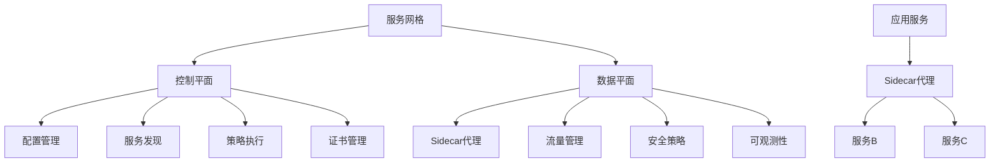

# 4.2.4 服务网格 / Service Mesh

## 1. 服务网格理论基础 / Service Mesh Theory Foundation

### 1.1 服务网格定义 / Service Mesh Definition

**服务网格形式化定义：**

- $Service_{Mesh} = \{Data_{Plane}, Control_{Plane}, Proxy_{Sidecar}\}$  
  Service mesh: infrastructure layer for service-to-service communication
- $Data_{Plane} = \{Proxy_{Instances}, Traffic_{Management}, Security_{Policy}\}$：数据平面  
  Data plane: handles actual service-to-service communication
- $Control_{Plane} = \{Configuration_{Management}, Service_{Discovery}, Policy_{Enforcement}\}$：控制平面  
  Control plane: manages and configures the data plane

**服务网格特征：**

1. **透明代理**：$Transparent_{Proxy} = \{Interception, Routing, Load_{Balancing}\}$  
   Transparent proxy: intercepts and manages service communication
2. **零信任安全**：$Zero_{Trust} = \{mTLS, Authorization, Authentication\}$  
   Zero trust: security without implicit trust
3. **可观测性**：$Observability = \{Metrics, Logs, Traces\}$  
   Observability: comprehensive monitoring and tracing

### 1.2 服务网格架构 / Service Mesh Architecture

**架构层次：**



## 2. Istio服务网格 / Istio Service Mesh

### 2.1 Istio架构 / Istio Architecture

**Istio组件：**

```rust
#[derive(Debug)]
pub struct IstioMesh {
    control_plane: IstioControlPlane,
    data_plane: Vec<IstioDataPlane>,
    gateway: IstioGateway,
}

#[derive(Debug)]
pub struct IstioControlPlane {
    pilot: Pilot,
    citadel: Citadel,
    galley: Galley,
    telemetry: Telemetry,
}

#[derive(Debug)]
pub struct IstioDataPlane {
    sidecar_proxy: EnvoyProxy,
    service_account: String,
    namespace: String,
}

impl IstioMesh {
    pub fn new() -> Self {
        IstioMesh {
            control_plane: IstioControlPlane {
                pilot: Pilot::new(),
                citadel: Citadel::new(),
                galley: Galley::new(),
                telemetry: Telemetry::new(),
            },
            data_plane: Vec::new(),
            gateway: IstioGateway::new(),
        }
    }
    
    pub fn deploy_service(&mut self, service: &Service) -> Result<(), Error> {
        // 创建Sidecar代理
        let sidecar = EnvoyProxy::new(service);
        
        // 配置代理
        self.configure_sidecar(&sidecar)?;
        
        // 注入到Pod
        self.inject_sidecar(service, sidecar)?;
        
        // 注册到Pilot
        self.control_plane.pilot.register_service(service)?;
        
        Ok(())
    }
    
    fn configure_sidecar(&self, sidecar: &EnvoyProxy) -> Result<(), Error> {
        // 配置监听器
        let listeners = self.generate_listeners(sidecar);
        sidecar.configure_listeners(&listeners)?;
        
        // 配置集群
        let clusters = self.generate_clusters(sidecar);
        sidecar.configure_clusters(&clusters)?;
        
        // 配置路由
        let routes = self.generate_routes(sidecar);
        sidecar.configure_routes(&routes)?;
        
        Ok(())
    }
    
    pub fn apply_traffic_policy(&mut self, policy: &TrafficPolicy) -> Result<(), Error> {
        // 通过Pilot分发配置
        self.control_plane.pilot.apply_policy(policy)?;
        
        // 更新所有相关的Sidecar代理
        for data_plane in &mut self.data_plane {
            data_plane.sidecar_proxy.update_configuration(policy)?;
        }
        
        Ok(())
    }
}
```

### 2.2 流量管理 / Traffic Management

**流量路由规则：**

```rust
#[derive(Debug)]
pub struct TrafficPolicy {
    destination_rules: Vec<DestinationRule>,
    virtual_services: Vec<VirtualService>,
    gateway_rules: Vec<GatewayRule>,
}

#[derive(Debug)]
pub struct DestinationRule {
    name: String,
    host: String,
    subsets: Vec<Subset>,
    traffic_policy: TrafficPolicyConfig,
}

#[derive(Debug)]
pub struct VirtualService {
    name: String,
    hosts: Vec<String>,
    gateways: Vec<String>,
    http_routes: Vec<HTTPRoute>,
    tcp_routes: Vec<TCPRoute>,
}

impl IstioMesh {
    pub fn apply_destination_rule(&mut self, rule: &DestinationRule) -> Result<(), Error> {
        // 验证规则
        self.validate_destination_rule(rule)?;
        
        // 转换为Envoy配置
        let envoy_config = self.convert_to_envoy_config(rule)?;
        
        // 应用到所有相关的Sidecar代理
        for data_plane in &mut self.data_plane {
            if self.is_affected_by_rule(data_plane, rule) {
                data_plane.sidecar_proxy.update_cluster_config(&envoy_config)?;
            }
        }
        
        Ok(())
    }
    
    pub fn apply_virtual_service(&mut self, service: &VirtualService) -> Result<(), Error> {
        // 验证虚拟服务
        self.validate_virtual_service(service)?;
        
        // 转换为Envoy路由配置
        let route_config = self.convert_to_route_config(service)?;
        
        // 应用到网关和Sidecar代理
        self.gateway.update_routes(&route_config)?;
        
        for data_plane in &mut self.data_plane {
            if self.is_affected_by_virtual_service(data_plane, service) {
                data_plane.sidecar_proxy.update_route_config(&route_config)?;
            }
        }
        
        Ok(())
    }
    
    fn convert_to_envoy_config(&self, rule: &DestinationRule) -> Result<EnvoyClusterConfig, Error> {
        let mut config = EnvoyClusterConfig::new();
        
        // 配置负载均衡策略
        match &rule.traffic_policy.load_balancer {
            LoadBalancer::RoundRobin => {
                config.set_lb_policy("ROUND_ROBIN");
            }
            LoadBalancer::LeastConnections => {
                config.set_lb_policy("LEAST_REQUEST");
            }
            LoadBalancer::Random => {
                config.set_lb_policy("RANDOM");
            }
        }
        
        // 配置连接池
        if let Some(connection_pool) = &rule.traffic_policy.connection_pool {
            config.set_connection_pool(connection_pool);
        }
        
        // 配置健康检查
        if let Some(health_check) = &rule.traffic_policy.health_check {
            config.set_health_check(health_check);
        }
        
        Ok(config)
    }
}
```

### 2.3 安全策略 / Security Policies

**mTLS和授权：**

```rust
#[derive(Debug)]
pub struct SecurityPolicy {
    authentication_policies: Vec<AuthenticationPolicy>,
    authorization_policies: Vec<AuthorizationPolicy>,
    peer_authentication: PeerAuthentication,
}

#[derive(Debug)]
pub struct AuthenticationPolicy {
    name: String,
    namespace: String,
    selector: HashMap<String, String>,
    mtls_mode: MTLSMode,
}

impl IstioMesh {
    pub fn apply_security_policy(&mut self, policy: &SecurityPolicy) -> Result<(), Error> {
        // 应用认证策略
        for auth_policy in &policy.authentication_policies {
            self.apply_authentication_policy(auth_policy)?;
        }
        
        // 应用授权策略
        for authz_policy in &policy.authorization_policies {
            self.apply_authorization_policy(authz_policy)?;
        }
        
        // 应用对等认证
        self.apply_peer_authentication(&policy.peer_authentication)?;
        
        Ok(())
    }
    
    fn apply_authentication_policy(&mut self, policy: &AuthenticationPolicy) -> Result<(), Error> {
        // 生成mTLS配置
        let mtls_config = self.generate_mtls_config(policy)?;
        
        // 应用到相关的Sidecar代理
        for data_plane in &mut self.data_plane {
            if self.matches_selector(data_plane, &policy.selector) {
                data_plane.sidecar_proxy.configure_mtls(&mtls_config)?;
            }
        }
        
        Ok(())
    }
    
    fn apply_authorization_policy(&mut self, policy: &AuthorizationPolicy) -> Result<(), Error> {
        // 生成授权规则
        let authz_rules = self.generate_authorization_rules(policy)?;
        
        // 应用到相关的Sidecar代理
        for data_plane in &mut self.data_plane {
            if self.matches_selector(data_plane, &policy.selector) {
                data_plane.sidecar_proxy.configure_authorization(&authz_rules)?;
            }
        }
        
        Ok(())
    }
    
    fn generate_mtls_config(&self, policy: &AuthenticationPolicy) -> Result<MTLSConfig, Error> {
        let mut config = MTLSConfig::new();
        
        match policy.mtls_mode {
            MTLSMode::Strict => {
                config.set_mode("STRICT");
                config.enable_client_certificates();
                config.enable_server_certificates();
            }
            MTLSMode::Permissive => {
                config.set_mode("PERMISSIVE");
                config.enable_client_certificates();
            }
            MTLSMode::Disabled => {
                config.set_mode("DISABLE");
            }
        }
        
        // 配置证书
        let certificates = self.control_plane.citadel.generate_certificates(policy)?;
        config.set_certificates(certificates);
        
        Ok(config)
    }
}
```

## 3. Linkerd服务网格 / Linkerd Service Mesh

### 3.1 Linkerd架构 / Linkerd Architecture

**Linkerd组件：**

```rust
#[derive(Debug)]
pub struct LinkerdMesh {
    control_plane: LinkerdControlPlane,
    data_plane: Vec<LinkerdDataPlane>,
    identity: Identity,
}

#[derive(Debug)]
pub struct LinkerdControlPlane {
    destination: Destination,
    identity: Identity,
    proxy_injector: ProxyInjector,
}

#[derive(Debug)]
pub struct LinkerdDataPlane {
    proxy: LinkerdProxy,
    service_account: String,
    namespace: String,
}

impl LinkerdMesh {
    pub fn new() -> Self {
        LinkerdMesh {
            control_plane: LinkerdControlPlane {
                destination: Destination::new(),
                identity: Identity::new(),
                proxy_injector: ProxyInjector::new(),
            },
            data_plane: Vec::new(),
            identity: Identity::new(),
        }
    }
    
    pub fn inject_proxy(&mut self, pod: &Pod) -> Result<(), Error> {
        // 检查是否需要注入代理
        if !self.should_inject_proxy(pod) {
            return Ok(());
        }
        
        // 创建代理容器
        let proxy_container = self.create_proxy_container(pod)?;
        
        // 注入到Pod
        self.inject_container_to_pod(pod, proxy_container)?;
        
        // 配置代理
        self.configure_proxy(pod)?;
        
        Ok(())
    }
    
    fn should_inject_proxy(&self, pod: &Pod) -> bool {
        // 检查注解
        if let Some(annotation) = pod.annotations.get("linkerd.io/inject") {
            return annotation == "enabled";
        }
        
        // 检查命名空间
        if let Some(namespace_annotation) = pod.namespace_annotations.get("linkerd.io/inject") {
            return namespace_annotation == "enabled";
        }
        
        false
    }
    
    fn create_proxy_container(&self, pod: &Pod) -> Result<Container, Error> {
        let mut container = Container::new("linkerd-proxy");
        
        // 设置镜像
        container.set_image("linkerd/proxy:stable");
        
        // 设置端口
        container.add_port(ContainerPort {
            name: "admin".to_string(),
            container_port: 4191,
            protocol: "TCP".to_string(),
        });
        
        container.add_port(ContainerPort {
            name: "proxy".to_string(),
            container_port: 4140,
            protocol: "TCP".to_string(),
        });
        
        // 设置环境变量
        container.add_env_var("LINKERD2_PROXY_LOG", "warn,linkerd2_proxy=info");
        container.add_env_var("LINKERD2_PROXY_BIND_TIMEOUT", "1s");
        
        Ok(container)
    }
}
```

### 3.2 流量路由 / Traffic Routing

**Linkerd路由配置：**

```rust
#[derive(Debug)]
pub struct LinkerdRouting {
    service_profiles: Vec<ServiceProfile>,
    traffic_splits: Vec<TrafficSplit>,
    retry_policies: Vec<RetryPolicy>,
}

#[derive(Debug)]
pub struct ServiceProfile {
    name: String,
    namespace: String,
    routes: Vec<Route>,
    retry_budget: RetryBudget,
}

impl LinkerdMesh {
    pub fn apply_service_profile(&mut self, profile: &ServiceProfile) -> Result<(), Error> {
        // 验证服务配置文件
        self.validate_service_profile(profile)?;
        
        // 转换为代理配置
        let proxy_config = self.convert_to_proxy_config(profile)?;
        
        // 应用到相关的代理
        for data_plane in &mut self.data_plane {
            if self.matches_service_profile(data_plane, profile) {
                data_plane.proxy.update_routing_config(&proxy_config)?;
            }
        }
        
        Ok(())
    }
    
    pub fn apply_traffic_split(&mut self, split: &TrafficSplit) -> Result<(), Error> {
        // 验证流量分割
        self.validate_traffic_split(split)?;
        
        // 计算权重分布
        let weight_distribution = self.calculate_weight_distribution(split)?;
        
        // 应用到代理
        for data_plane in &mut self.data_plane {
            if self.is_affected_by_traffic_split(data_plane, split) {
                data_plane.proxy.update_traffic_split(&weight_distribution)?;
            }
        }
        
        Ok(())
    }
    
    fn convert_to_proxy_config(&self, profile: &ServiceProfile) -> Result<ProxyConfig, Error> {
        let mut config = ProxyConfig::new();
        
        // 配置路由
        for route in &profile.routes {
            let route_config = RouteConfig {
                path: route.path.clone(),
                method: route.method.clone(),
                timeout: route.timeout,
                retries: route.retries,
            };
            config.add_route(route_config);
        }
        
        // 配置重试预算
        config.set_retry_budget(profile.retry_budget.clone());
        
        Ok(config)
    }
}
```

## 4. 服务网格监控 / Service Mesh Monitoring

### 4.1 指标收集 / Metrics Collection

**网格指标：**

```rust
#[derive(Debug)]
pub struct ServiceMeshMetrics {
    request_metrics: RequestMetrics,
    proxy_metrics: ProxyMetrics,
    service_metrics: ServiceMetrics,
}

#[derive(Debug)]
pub struct RequestMetrics {
    total_requests: u64,
    successful_requests: u64,
    failed_requests: u64,
    request_duration: Histogram,
    request_size: Histogram,
    response_size: Histogram,
}

impl ServiceMeshMetrics {
    pub fn collect_metrics(&mut self, proxy: &ServiceMeshProxy) -> Result<(), Error> {
        // 收集请求指标
        let request_stats = proxy.get_request_statistics()?;
        self.update_request_metrics(&request_stats);
        
        // 收集代理指标
        let proxy_stats = proxy.get_proxy_statistics()?;
        self.update_proxy_metrics(&proxy_stats);
        
        // 收集服务指标
        let service_stats = proxy.get_service_statistics()?;
        self.update_service_metrics(&service_stats);
        
        Ok(())
    }
    
    pub fn export_metrics(&self, exporter: &dyn MetricsExporter) -> Result<(), Error> {
        let metrics = MeshMetrics {
            request_metrics: self.request_metrics.clone(),
            proxy_metrics: self.proxy_metrics.clone(),
            service_metrics: self.service_metrics.clone(),
            timestamp: Utc::now(),
        };
        
        exporter.export(&metrics)
    }
    
    fn update_request_metrics(&mut self, stats: &RequestStatistics) {
        self.request_metrics.total_requests += stats.total_requests;
        self.request_metrics.successful_requests += stats.successful_requests;
        self.request_metrics.failed_requests += stats.failed_requests;
        
        // 更新直方图
        for duration in &stats.request_durations {
            self.request_metrics.request_duration.observe(*duration);
        }
        
        for size in &stats.request_sizes {
            self.request_metrics.request_size.observe(*size);
        }
        
        for size in &stats.response_sizes {
            self.request_metrics.response_size.observe(*size);
        }
    }
}
```

### 4.2 链路追踪 / Distributed Tracing

**网格追踪：**

```rust
#[derive(Debug)]
pub struct ServiceMeshTracing {
    trace_collector: TraceCollector,
    span_generator: SpanGenerator,
    trace_context: TraceContext,
}

impl ServiceMeshTracing {
    pub fn trace_request(&mut self, request: &ServiceRequest) -> Result<TraceSpan, Error> {
        // 提取或创建追踪上下文
        let context = self.extract_or_create_context(request)?;
        
        // 创建span
        let span = self.span_generator.create_span(
            &context,
            "service_mesh_request",
            request.service_name.clone(),
        )?;
        
        // 添加网格特定的标签
        span.add_tag("mesh.service", &request.service_name);
        span.add_tag("mesh.namespace", &request.namespace);
        span.add_tag("mesh.protocol", &request.protocol);
        
        // 记录请求详情
        span.add_log("request.start", &format!("Request to {}", request.service_name));
        
        Ok(span)
    }
    
    pub fn trace_response(&mut self, span: &mut TraceSpan, response: &ServiceResponse) -> Result<(), Error> {
        // 添加响应标签
        span.add_tag("response.status", &response.status_code.to_string());
        span.add_tag("response.size", &response.size.to_string());
        
        // 记录响应详情
        span.add_log("response.end", &format!("Response from {}", response.service_name));
        
        // 完成span
        span.finish();
        
        Ok(())
    }
    
    fn extract_or_create_context(&self, request: &ServiceRequest) -> Result<TraceContext, Error> {
        // 尝试从请求头中提取追踪上下文
        if let Some(context) = self.extract_context_from_headers(&request.headers) {
            Ok(context)
        } else {
            // 创建新的追踪上下文
            Ok(TraceContext::new())
        }
    }
}
```

## 5. 服务网格安全 / Service Mesh Security

### 5.1 身份认证 / Identity Authentication

**网格身份管理：**

```rust
#[derive(Debug)]
pub struct ServiceMeshIdentity {
    identity_manager: IdentityManager,
    certificate_manager: CertificateManager,
    trust_store: TrustStore,
}

impl ServiceMeshIdentity {
    pub fn create_service_identity(&mut self, service: &Service) -> Result<ServiceIdentity, Error> {
        // 生成服务身份
        let identity = ServiceIdentity {
            name: service.name.clone(),
            namespace: service.namespace.clone(),
            service_account: service.service_account.clone(),
        };
        
        // 生成证书
        let certificate = self.certificate_manager.generate_certificate(&identity)?;
        
        // 存储身份
        self.identity_manager.store_identity(&identity, &certificate)?;
        
        Ok(identity)
    }
    
    pub fn verify_service_identity(&self, identity: &ServiceIdentity, certificate: &Certificate) -> Result<bool, Error> {
        // 验证证书
        let is_valid_cert = self.certificate_manager.verify_certificate(certificate)?;
        
        // 验证身份
        let is_valid_identity = self.identity_manager.verify_identity(identity)?;
        
        // 检查信任链
        let is_trusted = self.trust_store.verify_trust_chain(certificate)?;
        
        Ok(is_valid_cert && is_valid_identity && is_trusted)
    }
    
    pub fn rotate_certificates(&mut self) -> Result<(), Error> {
        // 获取所有服务身份
        let identities = self.identity_manager.list_identities()?;
        
        for identity in identities {
            // 生成新证书
            let new_certificate = self.certificate_manager.generate_certificate(&identity)?;
            
            // 更新证书
            self.identity_manager.update_certificate(&identity, &new_certificate)?;
            
            // 通知相关代理更新证书
            self.notify_certificate_rotation(&identity, &new_certificate)?;
        }
        
        Ok(())
    }
}
```

### 5.2 授权策略 / Authorization Policies

**网格授权：**

```rust
#[derive(Debug)]
pub struct ServiceMeshAuthorization {
    policy_engine: PolicyEngine,
    rbac_manager: RBACManager,
    audit_logger: AuditLogger,
}

impl ServiceMeshAuthorization {
    pub fn check_authorization(&self, request: &ServiceRequest, identity: &ServiceIdentity) -> Result<bool, Error> {
        // 获取授权策略
        let policies = self.policy_engine.get_policies(&request.service_name)?;
        
        // 检查每个策略
        for policy in policies {
            if !self.evaluate_policy(policy, request, identity)? {
                // 记录拒绝访问
                self.audit_logger.log_access_denied(request, identity, policy)?;
                return Ok(false);
            }
        }
        
        // 记录允许访问
        self.audit_logger.log_access_granted(request, identity)?;
        Ok(true)
    }
    
    fn evaluate_policy(&self, policy: &AuthorizationPolicy, request: &ServiceRequest, identity: &ServiceIdentity) -> Result<bool, Error> {
        // 检查主体
        if !self.matches_subject(policy, identity)? {
            return Ok(false);
        }
        
        // 检查资源
        if !self.matches_resource(policy, request)? {
            return Ok(false);
        }
        
        // 检查操作
        if !self.matches_action(policy, request)? {
            return Ok(false);
        }
        
        // 检查条件
        if !self.evaluate_conditions(policy, request, identity)? {
            return Ok(false);
        }
        
        Ok(true)
    }
    
    pub fn apply_rbac_policy(&mut self, policy: &RBACPolicy) -> Result<(), Error> {
        // 验证策略
        self.validate_rbac_policy(policy)?;
        
        // 应用策略
        self.rbac_manager.apply_policy(policy)?;
        
        // 通知相关代理
        self.notify_policy_update(policy)?;
        
        Ok(())
    }
}
```

## 6. 总结与展望 / Summary and Outlook

### 6.1 服务网格趋势 / Service Mesh Trends

**技术发展方向：**

1. **云原生集成**：与Kubernetes的深度集成
2. **边缘计算**：边缘节点的服务网格
3. **多集群管理**：跨集群的服务网格
4. **AI驱动优化**：基于AI的智能路由和优化

### 6.2 挑战与机遇 / Challenges and Opportunities

**技术挑战：**

- 服务网格的性能开销
- 大规模部署的复杂性
- 多租户环境的隔离
- 与传统系统的集成

**发展机遇：**

- 微服务架构的普及
- 云原生技术的成熟
- 零信任安全的需求
- 可观测性的重要性

---

> 服务网格是微服务架构的重要基础设施，通过透明的代理层提供了强大的流量管理、安全控制和可观测性能力。随着微服务架构的普及，服务网格技术将继续演进以满足新的需求。
> Service mesh is an important infrastructure for microservice architecture, providing powerful traffic management, security control, and observability capabilities through transparent proxy layers. With the proliferation of microservice architecture, service mesh technology will continue to evolve to meet new requirements.
