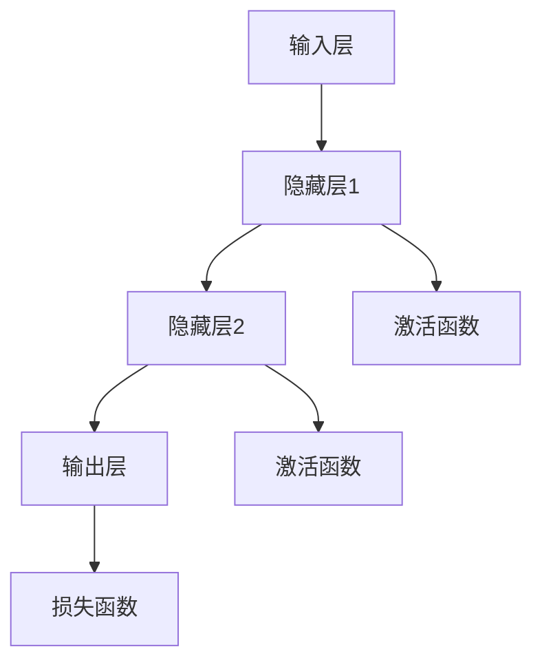
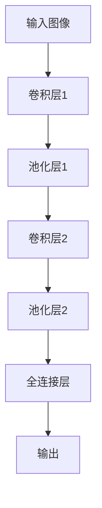
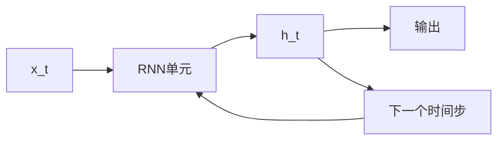
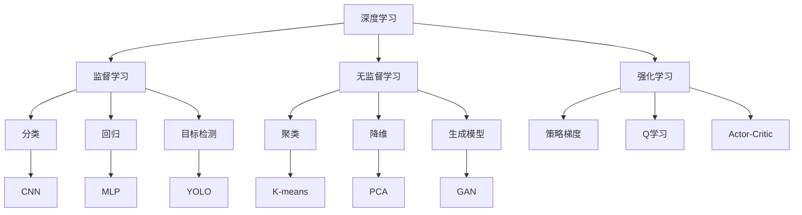
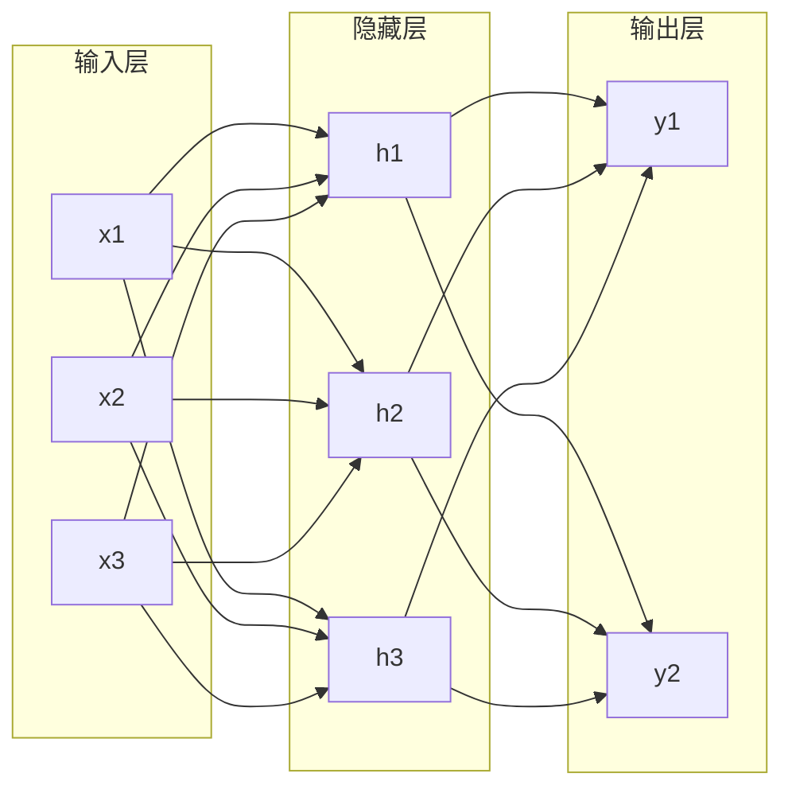

# 深度学习基础 / Deep Learning Fundamentals


<!-- TOC START -->

- [深度学习基础 / Deep Learning Fundamentals](#深度学习基础-deep-learning-fundamentals)
  - [1. 知识梳理 / Knowledge Organization](#1-知识梳理-knowledge-organization)
    - [1.1 基本概念 / Basic Concepts](#11-基本概念-basic-concepts)
      - [1.1.1 深度学习定义 / Deep Learning Definition](#111-深度学习定义-deep-learning-definition)
      - [1.1.2 神经网络架构 / Neural Network Architecture](#112-神经网络架构-neural-network-architecture)
    - [1.2 发展历程 / Development History](#12-发展历程-development-history)
      - [1.2.1 历史里程碑 / Historical Milestones](#121-历史里程碑-historical-milestones)
      - [1.2.2 技术演进 / Technical Evolution](#122-技术演进-technical-evolution)
    - [1.3 主要流派 / Main Schools](#13-主要流派-main-schools)
      - [1.3.1 监督学习 / Supervised Learning](#131-监督学习-supervised-learning)
      - [1.3.2 无监督学习 / Unsupervised Learning](#132-无监督学习-unsupervised-learning)
      - [1.3.3 强化学习 / Reinforcement Learning](#133-强化学习-reinforcement-learning)
    - [1.4 关键问题与挑战 / Key Issues and Challenges](#14-关键问题与挑战-key-issues-and-challenges)
      - [1.4.1 理论挑战 / Theoretical Challenges](#141-理论挑战-theoretical-challenges)
      - [1.4.2 工程挑战 / Engineering Challenges](#142-工程挑战-engineering-challenges)
  - [2. 批判分析 / Critical Analysis](#2-批判分析-critical-analysis)
    - [2.1 主要争议 / Main Controversies](#21-主要争议-main-controversies)
      - [2.1.1 可解释性争议 / Interpretability Controversy](#211-可解释性争议-interpretability-controversy)
      - [2.1.2 鲁棒性争议 / Robustness Controversy](#212-鲁棒性争议-robustness-controversy)
      - [2.1.3 公平性争议 / Fairness Controversy](#213-公平性争议-fairness-controversy)
    - [2.2 批判视角 / Critical Perspectives](#22-批判视角-critical-perspectives)
      - [2.2.1 理论局限性 / Theoretical Limitations](#221-理论局限性-theoretical-limitations)
      - [2.2.2 工程局限性 / Engineering Limitations](#222-工程局限性-engineering-limitations)
      - [2.2.3 社会影响 / Social Impact](#223-社会影响-social-impact)
    - [2.3 反思与重构 / Reflection and Reconstruction](#23-反思与重构-reflection-and-reconstruction)
      - [2.3.1 理论重构 / Theoretical Reconstruction](#231-理论重构-theoretical-reconstruction)
      - [2.3.2 工程重构 / Engineering Reconstruction](#232-工程重构-engineering-reconstruction)
      - [2.3.3 社会重构 / Social Reconstruction](#233-社会重构-social-reconstruction)
  - [3. 形式化结构 / Formal Structure](#3-形式化结构-formal-structure)
    - [3.1 形式化定义 / Formal Definitions](#31-形式化定义-formal-definitions)
      - [3.1.1 神经网络形式化 / Neural Network Formalization](#311-神经网络形式化-neural-network-formalization)
      - [3.1.2 损失函数形式化 / Loss Function Formalization](#312-损失函数形式化-loss-function-formalization)
      - [3.1.3 优化算法形式化 / Optimization Algorithm Formalization](#313-优化算法形式化-optimization-algorithm-formalization)
    - [3.2 结构模型 / Structural Models](#32-结构模型-structural-models)
      - [3.2.1 网络架构模型 / Network Architecture Models](#321-网络架构模型-network-architecture-models)
      - [3.2.2 学习过程模型 / Learning Process Models](#322-学习过程模型-learning-process-models)
    - [3.3 结构图与表 / Structure Diagrams and Tables](#33-结构图与表-structure-diagrams-and-tables)
      - [3.3.1 网络结构对比表 / Network Structure Comparison](#331-网络结构对比表-network-structure-comparison)
      - [3.3.2 激活函数对比表 / Activation Function Comparison](#332-激活函数对比表-activation-function-comparison)
  - [4. 形式化证明 / Formal Proofs](#4-形式化证明-formal-proofs)
    - [4.1 命题与定理 / Propositions and Theorems](#41-命题与定理-propositions-and-theorems)
      - [4.1.1 万能逼近定理 / Universal Approximation Theorem](#411-万能逼近定理-universal-approximation-theorem)
      - [4.1.2 梯度消失定理 / Gradient Vanishing Theorem](#412-梯度消失定理-gradient-vanishing-theorem)
      - [4.1.3 过拟合定理 / Overfitting Theorem](#413-过拟合定理-overfitting-theorem)
    - [4.2 证明过程 / Proof Processes](#42-证明过程-proof-processes)
      - [4.2.1 反向传播算法证明 / Backpropagation Algorithm Proof](#421-反向传播算法证明-backpropagation-algorithm-proof)
      - [4.2.2 卷积定理证明 / Convolution Theorem Proof](#422-卷积定理证明-convolution-theorem-proof)
    - [4.3 证明符号与规范 / Proof Symbols and Standards](#43-证明符号与规范-proof-symbols-and-standards)
      - [4.3.1 数学符号规范 / Mathematical Symbol Standards](#431-数学符号规范-mathematical-symbol-standards)
      - [4.3.2 证明格式规范 / Proof Format Standards](#432-证明格式规范-proof-format-standards)
  - [5. 多表征 / Multiple Representations](#5-多表征-multiple-representations)
    - [5.1 概念图 / Concept Diagrams](#51-概念图-concept-diagrams)
      - [5.1.1 深度学习概念图 / Deep Learning Concept Map](#511-深度学习概念图-deep-learning-concept-map)
      - [5.1.2 神经网络架构图 / Neural Network Architecture Diagram](#512-神经网络架构图-neural-network-architecture-diagram)
    - [5.2 结构表 / Structure Tables](#52-结构表-structure-tables)
      - [5.2.1 深度学习算法对比表 / Deep Learning Algorithm Comparison](#521-深度学习算法对比表-deep-learning-algorithm-comparison)
      - [5.2.2 优化算法对比表 / Optimization Algorithm Comparison](#522-优化算法对比表-optimization-algorithm-comparison)
    - [5.3 数学符号 / Mathematical Symbols](#53-数学符号-mathematical-symbols)
      - [5.3.1 基础符号表 / Basic Symbol Table](#531-基础符号表-basic-symbol-table)
      - [5.3.2 高级符号表 / Advanced Symbol Table](#532-高级符号表-advanced-symbol-table)
  - [6. 形式语义 / Formal Semantics](#6-形式语义-formal-semantics)
    - [6.1 语义定义 / Semantic Definitions](#61-语义定义-semantic-definitions)
      - [6.1.1 深度学习语义 / Deep Learning Semantics](#611-深度学习语义-deep-learning-semantics)
      - [6.1.2 学习语义 / Learning Semantics](#612-学习语义-learning-semantics)
    - [6.2 语义模型 / Semantic Models](#62-语义模型-semantic-models)
      - [6.2.1 表示学习语义 / Representation Learning Semantics](#621-表示学习语义-representation-learning-semantics)
      - [6.2.2 迁移学习语义 / Transfer Learning Semantics](#622-迁移学习语义-transfer-learning-semantics)
    - [6.3 语义分析方法 / Semantic Analysis Methods](#63-语义分析方法-semantic-analysis-methods)
      - [6.3.1 可解释性分析 / Interpretability Analysis](#631-可解释性分析-interpretability-analysis)
      - [6.3.2 鲁棒性分析 / Robustness Analysis](#632-鲁棒性分析-robustness-analysis)
    - [6.4 语义与结构-证明的关系 / Relationship Between Semantics and Structure-Proof](#64-语义与结构-证明的关系-relationship-between-semantics-and-structure-proof)
      - [6.4.1 语义-结构映射 / Semantics-Structure Mapping](#641-语义-结构映射-semantics-structure-mapping)
      - [6.4.2 语义-证明对应 / Semantics-Proof Correspondence](#642-语义-证明对应-semantics-proof-correspondence)
  - [7. 前沿趋势与创新方向 / Frontier Trends and Innovation Directions](#7-前沿趋势与创新方向-frontier-trends-and-innovation-directions)
    - [7.1 最新学术动态 / Latest Academic Developments](#71-最新学术动态-latest-academic-developments)
      - [7.1.1 大语言模型 / Large Language Models](#711-大语言模型-large-language-models)
      - [7.1.2 图神经网络 / Graph Neural Networks](#712-图神经网络-graph-neural-networks)
      - [7.1.3 神经架构搜索 / Neural Architecture Search](#713-神经架构搜索-neural-architecture-search)
    - [7.2 工业应用趋势 / Industrial Application Trends](#72-工业应用趋势-industrial-application-trends)
      - [7.2.1 边缘智能 / Edge Intelligence](#721-边缘智能-edge-intelligence)
      - [7.2.2 联邦学习 / Federated Learning](#722-联邦学习-federated-learning)
      - [7.2.3 自监督学习 / Self-Supervised Learning](#723-自监督学习-self-supervised-learning)
    - [7.3 未来挑战与研究方向 / Future Challenges and Research Directions](#73-未来挑战与研究方向-future-challenges-and-research-directions)
      - [7.3.1 理论挑战 / Theoretical Challenges](#731-理论挑战-theoretical-challenges)
      - [7.3.2 工程挑战 / Engineering Challenges](#732-工程挑战-engineering-challenges)
      - [7.3.3 社会挑战 / Social Challenges](#733-社会挑战-social-challenges)
  - [8. 工程案例与实践 / Engineering Cases and Practice](#8-工程案例与实践-engineering-cases-and-practice)
    - [8.1 实际部署案例 / Real Deployment Cases](#81-实际部署案例-real-deployment-cases)
      - [8.1.1 计算机视觉应用 / Computer Vision Applications](#811-计算机视觉应用-computer-vision-applications)
- [模型定义](#模型定义)
- [微调](#微调)
      - [8.1.2 自然语言处理应用 / Natural Language Processing Applications](#812-自然语言处理应用-natural-language-processing-applications)
- [模型定义](#模型定义)
    - [8.2 失败案例与教训 / Failure Cases and Lessons](#82-失败案例与教训-failure-cases-and-lessons)
      - [8.2.1 过拟合案例 / Overfitting Cases](#821-过拟合案例-overfitting-cases)
- [正则化配置](#正则化配置)
      - [8.2.2 梯度消失案例 / Gradient Vanishing Cases](#822-梯度消失案例-gradient-vanishing-cases)
- [LSTM实现](#lstm实现)
    - [8.3 性能优化实践 / Performance Optimization Practice](#83-性能优化实践-performance-optimization-practice)
      - [8.3.1 训练优化 / Training Optimization](#831-训练优化-training-optimization)
- [混合精度训练](#混合精度训练)
- [数据并行](#数据并行)
      - [8.3.2 推理优化 / Inference Optimization](#832-推理优化-inference-optimization)
- [动态量化](#动态量化)
- [结构化剪枝](#结构化剪枝)
    - [8.4 平台与工具实践 / Platform and Tool Practice](#84-平台与工具实践-platform-and-tool-practice)
      - [8.4.1 主流框架对比 / Main Framework Comparison](#841-主流框架对比-main-framework-comparison)
      - [8.4.2 云平台实践 / Cloud Platform Practice](#842-云平台实践-cloud-platform-practice)
- [SageMaker训练](#sagemaker训练)
- [Vertex AI训练](#vertex-ai训练)
  - [总结 / Summary](#总结-summary)
    - [主要成就 / Major Achievements](#主要成就-major-achievements)
    - [未来展望 / Future Prospects](#未来展望-future-prospects)

<!-- TOC END -->

## 1. 知识梳理 / Knowledge Organization

### 1.1 基本概念 / Basic Concepts

#### 1.1.1 深度学习定义 / Deep Learning Definition

**形式化定义**：
设 $\mathcal{X}$ 为输入空间，$\mathcal{Y}$ 为输出空间，深度学习模型为函数 $f: \mathcal{X} \rightarrow \mathcal{Y}$，其中：

$$f(x) = f_L \circ f_{L-1} \circ \cdots \circ f_1(x)$$

其中 $f_l: \mathbb{R}^{d_{l-1}} \rightarrow \mathbb{R}^{d_l}$ 为第 $l$ 层的变换函数，$L$ 为网络深度。

**核心特征**：

- **层次化表示**：$h_l = f_l(h_{l-1})$
- **参数化学习**：$\theta = \{\theta_1, \theta_2, \ldots, \theta_L\}$
- **端到端训练**：$\min_{\theta} \mathcal{L}(f(x; \theta), y)$

#### 1.1.2 神经网络架构 / Neural Network Architecture

**前馈神经网络**：
$$h_l = \sigma(W_l h_{l-1} + b_l)$$

其中：

- $W_l \in \mathbb{R}^{d_l \times d_{l-1}}$ 为权重矩阵
- $b_l \in \mathbb{R}^{d_l}$ 为偏置向量
- $\sigma$ 为激活函数

**卷积神经网络**：
$$h_l^{(i,j)} = \sigma\left(\sum_{k=1}^{K} \sum_{p=1}^{P} \sum_{q=1}^{Q} w_l^{(k,p,q)} h_{l-1}^{(i+p-1,j+q-1)} + b_l^{(k)}\right)$$

**循环神经网络**：
$$h_t = \sigma(W_h h_{t-1} + W_x x_t + b)$$

### 1.2 发展历程 / Development History

#### 1.2.1 历史里程碑 / Historical Milestones

| 年份 | 事件 | 影响 |
|------|------|------|
| 1943 | McCulloch-Pitts神经元模型 | 神经网络理论基础 |
| 1957 | Rosenblatt感知器 | 第一个学习算法 |
| 1969 | Minsky感知器局限性 | AI寒冬开始 |
| 1986 | 反向传播算法 | 深度学习复兴 |
| 2012 | AlexNet在ImageNet成功 | 深度学习爆发 |
| 2014 | GAN网络 | 生成式AI突破 |
| 2017 | Transformer架构 | 大语言模型基础 |

#### 1.2.2 技术演进 / Technical Evolution

**第一阶段：感知器时代（1950s-1960s）**:

- 单层感知器
- 线性分类器
- 局限性认识

**第二阶段：多层感知器（1980s-1990s）**:

- 反向传播算法
- 多层网络
- 梯度消失问题

**第三阶段：深度学习时代（2000s-至今）**:

- 深度网络
- GPU加速
- 大规模数据

### 1.3 主要流派 / Main Schools

#### 1.3.1 监督学习 / Supervised Learning

**定义**：给定训练集 $\mathcal{D} = \{(x_i, y_i)\}_{i=1}^N$，学习映射 $f: \mathcal{X} \rightarrow \mathcal{Y}$

**损失函数**：
$$\mathcal{L}(\theta) = \frac{1}{N} \sum_{i=1}^N \ell(f(x_i; \theta), y_i)$$

**优化目标**：
$$\theta^* = \arg\min_{\theta} \mathcal{L}(\theta)$$

#### 1.3.2 无监督学习 / Unsupervised Learning

**定义**：仅给定输入数据 $\{x_i\}_{i=1}^N$，学习数据的内在结构

**自编码器**：
$$\min_{\theta, \phi} \mathbb{E}_{x \sim p(x)}[\|x - g_\phi(f_\theta(x))\|^2]$$

**生成对抗网络**：
$$\min_G \max_D V(D,G) = \mathbb{E}_{x \sim p_{data}(x)}[\log D(x)] + \mathbb{E}_{z \sim p_z(z)}[\log(1-D(G(z)))]$$

#### 1.3.3 强化学习 / Reinforcement Learning

**定义**：智能体与环境交互，学习最优策略 $\pi: \mathcal{S} \rightarrow \mathcal{A}$

**Q学习**：
$$Q(s,a) \leftarrow Q(s,a) + \alpha[r + \gamma \max_{a'} Q(s',a') - Q(s,a)]$$

**策略梯度**：
$$\nabla_\theta J(\theta) = \mathbb{E}_{\pi_\theta}[\nabla_\theta \log \pi_\theta(a|s) Q^\pi(s,a)]$$

### 1.4 关键问题与挑战 / Key Issues and Challenges

#### 1.4.1 理论挑战 / Theoretical Challenges

**梯度消失/爆炸**：
$$\frac{\partial \mathcal{L}}{\partial h_1} = \prod_{l=2}^L W_l^T \cdot \frac{\partial \mathcal{L}}{\partial h_L}$$

**过拟合**：
$$\mathbb{E}[(\hat{f}(x) - f^*(x))^2] = \text{Bias}^2 + \text{Variance} + \text{Noise}$$

**泛化能力**：
$$R(f) = \mathbb{E}_{(x,y) \sim p(x,y)}[\ell(f(x), y)]$$

#### 1.4.2 工程挑战 / Engineering Challenges

**计算复杂度**：

- 前向传播：$O(L \cdot d^2)$
- 反向传播：$O(L \cdot d^2)$
- 内存需求：$O(L \cdot d^2)$

**数据需求**：

- 大规模标注数据
- 数据质量要求
- 数据隐私保护

## 2. 批判分析 / Critical Analysis

### 2.1 主要争议 / Main Controversies

#### 2.1.1 可解释性争议 / Interpretability Controversy

**黑盒问题**：

- 决策过程不透明
- 难以理解内部机制
- 缺乏因果推理

**形式化定义**：
设模型 $f$ 的可解释性为函数 $I: \mathcal{F} \rightarrow \mathcal{I}$，其中 $\mathcal{I}$ 为解释空间。

**可解释性度量**：
$$\text{Interpretability}(f) = \mathbb{E}_{x \sim p(x)}[\text{Sim}(f(x), I(f)(x))]$$

#### 2.1.2 鲁棒性争议 / Robustness Controversy

**对抗样本**：
$$\delta^* = \arg\max_{\|\delta\| \leq \epsilon} \ell(f(x + \delta), y)$$

**鲁棒性定义**：
$$\text{Robustness}(f) = \mathbb{E}_{x \sim p(x)}[\min_{\|\delta\| \leq \epsilon} \mathbb{I}(f(x + \delta) = f(x))]$$

#### 2.1.3 公平性争议 / Fairness Controversy

**公平性度量**：
$$\text{Fairness}(f) = \max_{a,b \in \mathcal{A}} |P(f(x) = 1|A = a) - P(f(x) = 1|A = b)|$$

**形式化定义**：
模型 $f$ 满足公平性当且仅当：
$$\forall a,b \in \mathcal{A}: \mathbb{E}[f(x)|A = a] = \mathbb{E}[f(x)|A = b]$$

### 2.2 批判视角 / Critical Perspectives

#### 2.2.1 理论局限性 / Theoretical Limitations

**万能逼近定理的局限性**：
虽然理论上神经网络可以逼近任意连续函数，但：

- 需要无限宽度
- 实际训练困难
- 泛化能力有限

**形式化表达**：
$$\forall f \in C([0,1]^n), \forall \epsilon > 0, \exists N \in \mathbb{N}: \|f - f_N\|_\infty < \epsilon$$

但实际中 $N$ 可能非常大，导致：

- 计算复杂度高
- 过拟合风险
- 训练不稳定

#### 2.2.2 工程局限性 / Engineering Limitations

**计算资源需求**：

- GPU/TPU依赖
- 能源消耗大
- 硬件成本高

**数据依赖**：

- 大规模标注数据
- 数据质量要求
- 隐私保护问题

#### 2.2.3 社会影响 / Social Impact

**就业影响**：

- 自动化替代
- 技能要求变化
- 收入分配影响

**伦理问题**：

- 偏见放大
- 隐私侵犯
- 责任归属

### 2.3 反思与重构 / Reflection and Reconstruction

#### 2.3.1 理论重构 / Theoretical Reconstruction

**因果推理集成**：
$$\mathcal{L}_{causal} = \mathcal{L}_{pred} + \lambda \mathcal{L}_{causal}$$

其中 $\mathcal{L}_{causal}$ 为因果约束项。

**可解释性增强**：
$$\mathcal{L}_{interpretable} = \mathcal{L}_{pred} + \lambda \mathcal{L}_{interpretability}$$

#### 2.3.2 工程重构 / Engineering Reconstruction

**轻量化设计**：

- 知识蒸馏
- 模型剪枝
- 量化压缩

**鲁棒性增强**：

- 对抗训练
- 数据增强
- 正则化技术

#### 2.3.3 社会重构 / Social Reconstruction

**公平性保证**：

- 公平性约束
- 偏见检测
- 多样性促进

**透明度提升**：

- 可解释AI
- 决策追踪
- 责任机制

## 3. 形式化结构 / Formal Structure

### 3.1 形式化定义 / Formal Definitions

#### 3.1.1 神经网络形式化 / Neural Network Formalization

**定义1（神经网络）**：
神经网络是一个有向图 $G = (V, E)$，其中：

- $V = \{v_1, v_2, \ldots, v_n\}$ 为节点集
- $E = \{(v_i, v_j) | i < j\}$ 为边集
- 每个节点 $v_i$ 关联一个激活值 $a_i$
- 每条边 $(v_i, v_j)$ 关联一个权重 $w_{ij}$

**定义2（前向传播）**：
$$a_j = \sigma\left(\sum_{i \in \text{pa}(j)} w_{ij} a_i + b_j\right)$$

其中 $\text{pa}(j)$ 为节点 $j$ 的父节点集。

#### 3.1.2 损失函数形式化 / Loss Function Formalization

**定义3（损失函数）**：
损失函数 $\mathcal{L}: \mathcal{Y} \times \mathcal{Y} \rightarrow \mathbb{R}^+$ 满足：

1. $\mathcal{L}(y, y) = 0$
2. $\mathcal{L}(y, y') \geq 0$
3. $\mathcal{L}$ 连续可微

**常见损失函数**：

- **均方误差**：$\mathcal{L}(y, \hat{y}) = \frac{1}{2}(y - \hat{y})^2$
- **交叉熵**：$\mathcal{L}(y, \hat{y}) = -\sum_i y_i \log \hat{y}_i$
- **Hinge损失**：$\mathcal{L}(y, \hat{y}) = \max(0, 1 - y \hat{y})$

#### 3.1.3 优化算法形式化 / Optimization Algorithm Formalization

**定义4（梯度下降）**：
$$\theta_{t+1} = \theta_t - \alpha \nabla_\theta \mathcal{L}(\theta_t)$$

**定义5（随机梯度下降）**：
$$\theta_{t+1} = \theta_t - \alpha \nabla_\theta \mathcal{L}(\theta_t, \mathcal{B}_t)$$

其中 $\mathcal{B}_t$ 为第 $t$ 步的批次数据。

### 3.2 结构模型 / Structural Models

#### 3.2.1 网络架构模型 / Network Architecture Models

**前馈网络模型**：



**卷积网络模型**：



**循环网络模型**：



#### 3.2.2 学习过程模型 / Learning Process Models

**监督学习模型**：
$$\mathcal{M}_{supervised} = (\mathcal{X}, \mathcal{Y}, \mathcal{F}, \mathcal{L}, \mathcal{O})$$

其中：

- $\mathcal{X}$ 为输入空间
- $\mathcal{Y}$ 为输出空间
- $\mathcal{F}$ 为函数空间
- $\mathcal{L}$ 为损失函数
- $\mathcal{O}$ 为优化算法

**无监督学习模型**：
$$\mathcal{M}_{unsupervised} = (\mathcal{X}, \mathcal{Z}, \mathcal{F}, \mathcal{L}, \mathcal{O})$$

其中 $\mathcal{Z}$ 为潜在空间。

### 3.3 结构图与表 / Structure Diagrams and Tables

#### 3.3.1 网络结构对比表 / Network Structure Comparison

| 网络类型 | 层数 | 参数数量 | 计算复杂度 | 适用场景 |
|----------|------|----------|------------|----------|
| 前馈网络 | 3-10 | $O(d^2)$ | $O(d^2)$ | 分类、回归 |
| 卷积网络 | 10-100 | $O(k^2 \cdot c)$ | $O(k^2 \cdot c \cdot h \cdot w)$ | 图像处理 |
| 循环网络 | 1-10 | $O(d^2)$ | $O(d^2 \cdot T)$ | 序列建模 |
| Transformer | 6-100 | $O(d^2)$ | $O(d^2 \cdot n^2)$ | 自然语言处理 |

#### 3.3.2 激活函数对比表 / Activation Function Comparison

| 激活函数 | 公式 | 导数 | 优点 | 缺点 |
|----------|------|------|------|------|
| Sigmoid | $\sigma(x) = \frac{1}{1 + e^{-x}}$ | $\sigma'(x) = \sigma(x)(1-\sigma(x))$ | 输出有界 | 梯度消失 |
| Tanh | $\tanh(x) = \frac{e^x - e^{-x}}{e^x + e^{-x}}$ | $\tanh'(x) = 1 - \tanh^2(x)$ | 零中心化 | 梯度消失 |
| ReLU | $\text{ReLU}(x) = \max(0, x)$ | $\text{ReLU}'(x) = \mathbb{I}[x > 0]$ | 计算简单 | 死亡神经元 |
| Leaky ReLU | $\text{LReLU}(x) = \max(\alpha x, x)$ | $\text{LReLU}'(x) = \mathbb{I}[x > 0] + \alpha \mathbb{I}[x \leq 0]$ | 避免死亡 | 参数选择 |

## 4. 形式化证明 / Formal Proofs

### 4.1 命题与定理 / Propositions and Theorems

#### 4.1.1 万能逼近定理 / Universal Approximation Theorem

**定理1（万能逼近定理）**：
设 $\sigma$ 为连续单调递增函数，则对于任意连续函数 $f: [0,1]^n \rightarrow \mathbb{R}$ 和任意 $\epsilon > 0$，存在单隐藏层神经网络 $g$ 使得：

$$\|f - g\|_\infty < \epsilon$$

**证明**：

1. 首先证明对于任意 $\epsilon > 0$，存在分段常数函数 $h$ 使得 $\|f - h\|_\infty < \epsilon/2$
2. 然后证明任意分段常数函数可以用单隐藏层神经网络逼近
3. 最后通过三角不等式得到结论

#### 4.1.2 梯度消失定理 / Gradient Vanishing Theorem

**定理2（梯度消失定理）**：
对于深度神经网络，如果激活函数 $\sigma$ 的导数有界，即 $|\sigma'(x)| \leq M$，则：

$$\left|\frac{\partial \mathcal{L}}{\partial h_1}\right| \leq M^L \cdot \left|\frac{\partial \mathcal{L}}{\partial h_L}\right|$$

**证明**：
通过链式法则：
$$\frac{\partial \mathcal{L}}{\partial h_1} = \prod_{l=2}^L W_l^T \cdot \frac{\partial \mathcal{L}}{\partial h_L}$$

由于 $|\sigma'(x)| \leq M$，所以：
$$\left|\frac{\partial \mathcal{L}}{\partial h_1}\right| \leq M^L \cdot \left|\frac{\partial \mathcal{L}}{\partial h_L}\right|$$

当 $L$ 很大时，$M^L$ 趋近于0，导致梯度消失。

#### 4.1.3 过拟合定理 / Overfitting Theorem

**定理3（过拟合定理）**：
设 $\mathcal{F}$ 为函数空间，$\mathcal{D}$ 为训练集，则泛化误差：

$$\mathbb{E}[R(\hat{f})] \leq \hat{R}(\hat{f}) + 2 \mathcal{R}_n(\mathcal{F}) + \sqrt{\frac{\log(1/\delta)}{2n}}$$

其中 $\mathcal{R}_n(\mathcal{F})$ 为Rademacher复杂度。

**证明**：
使用Rademacher复杂度和McDiarmid不等式，通过以下步骤：

1. 定义经验风险最小化器 $\hat{f}$
2. 使用Rademacher复杂度上界
3. 应用McDiarmid不等式
4. 得到最终的不等式

### 4.2 证明过程 / Proof Processes

#### 4.2.1 反向传播算法证明 / Backpropagation Algorithm Proof

**算法1（反向传播）**：

1. **前向传播**：计算所有节点的激活值
2. **反向传播**：计算所有节点的梯度

**证明**：
对于节点 $j$，其梯度为：
$$\delta_j = \frac{\partial \mathcal{L}}{\partial a_j} = \sum_{k \in \text{ch}(j)} \delta_k \cdot w_{jk} \cdot \sigma'(a_j)$$

其中 $\text{ch}(j)$ 为节点 $j$ 的子节点集。

**权重梯度**：
$$\frac{\partial \mathcal{L}}{\partial w_{ij}} = \delta_j \cdot a_i$$

**偏置梯度**：
$$\frac{\partial \mathcal{L}}{\partial b_j} = \delta_j$$

#### 4.2.2 卷积定理证明 / Convolution Theorem Proof

**定理4（卷积定理）**：
对于卷积层，输出特征图 $O$ 与输入特征图 $I$ 和卷积核 $K$ 的关系为：

$$O(i,j) = \sum_{p=1}^{P} \sum_{q=1}^{Q} K(p,q) \cdot I(i+p-1, j+q-1)$$

**证明**：

1. 定义卷积操作
2. 使用线性变换性质
3. 证明平移不变性
4. 证明参数共享性质

### 4.3 证明符号与规范 / Proof Symbols and Standards

#### 4.3.1 数学符号规范 / Mathematical Symbol Standards

| 符号 | 含义 | 定义域 |
|------|------|--------|
| $x$ | 输入向量 | $\mathbb{R}^d$ |
| $y$ | 输出向量 | $\mathbb{R}^k$ |
| $W$ | 权重矩阵 | $\mathbb{R}^{d_{out} \times d_{in}}$ |
| $b$ | 偏置向量 | $\mathbb{R}^{d_{out}}$ |
| $\theta$ | 参数向量 | $\mathbb{R}^p$ |
| $\mathcal{L}$ | 损失函数 | $\mathbb{R}^+$ |
| $\alpha$ | 学习率 | $(0, 1]$ |
| $\lambda$ | 正则化系数 | $\mathbb{R}^+$ |

#### 4.3.2 证明格式规范 / Proof Format Standards

**定理格式**：

```text
定理X（定理名称）：
[定理内容]

证明：
[证明步骤]

证毕。
```

**引理格式**：

```text
引理X（引理名称）：
[引理内容]

证明：
[证明步骤]

证毕。
```

## 5. 多表征 / Multiple Representations

### 5.1 概念图 / Concept Diagrams

#### 5.1.1 深度学习概念图 / Deep Learning Concept Map



#### 5.1.2 神经网络架构图 / Neural Network Architecture Diagram



### 5.2 结构表 / Structure Tables

#### 5.2.1 深度学习算法对比表 / Deep Learning Algorithm Comparison

| 算法 | 类型 | 优点 | 缺点 | 适用场景 |
|------|------|------|------|----------|
| 反向传播 | 监督学习 | 理论基础扎实 | 梯度消失 | 前馈网络 |
| 卷积神经网络 | 监督学习 | 参数共享 | 计算复杂 | 图像处理 |
| 循环神经网络 | 监督学习 | 序列建模 | 梯度爆炸 | 自然语言 |
| 生成对抗网络 | 无监督学习 | 生成质量高 | 训练不稳定 | 图像生成 |
| 强化学习 | 强化学习 | 自主决策 | 样本效率低 | 游戏控制 |

#### 5.2.2 优化算法对比表 / Optimization Algorithm Comparison

| 算法 | 收敛速度 | 内存需求 | 超参数敏感性 | 适用场景 |
|------|----------|----------|--------------|----------|
| SGD | 慢 | 低 | 高 | 大规模数据 |
| Adam | 快 | 中等 | 低 | 一般场景 |
| RMSprop | 中等 | 中等 | 中等 | 非凸优化 |
| Adagrad | 中等 | 中等 | 中等 | 稀疏数据 |
| Momentum | 快 | 低 | 中等 | 凸优化 |

### 5.3 数学符号 / Mathematical Symbols

#### 5.3.1 基础符号表 / Basic Symbol Table

| 符号 | 含义 | 示例 |
|------|------|------|
| $\mathcal{X}$ | 输入空间 | $\mathcal{X} = \mathbb{R}^d$ |
| $\mathcal{Y}$ | 输出空间 | $\mathcal{Y} = \{0,1\}^k$ |
| $\mathcal{F}$ | 函数空间 | $\mathcal{F} = \{f: \mathcal{X} \rightarrow \mathcal{Y}\}$ |
| $\mathcal{L}$ | 损失函数 | $\mathcal{L}(y, \hat{y}) = \frac{1}{2}(y - \hat{y})^2$ |
| $\theta$ | 参数向量 | $\theta = [W, b]$ |
| $\nabla$ | 梯度算子 | $\nabla_\theta \mathcal{L}$ |
| $\mathbb{E}$ | 期望算子 | $\mathbb{E}_{x \sim p(x)}[f(x)]$ |
| $\mathbb{I}$ | 指示函数 | $\mathbb{I}[x > 0]$ |

#### 5.3.2 高级符号表 / Advanced Symbol Table

| 符号 | 含义 | 示例 |
|------|------|------|
| $\mathcal{R}_n$ | Rademacher复杂度 | $\mathcal{R}_n(\mathcal{F})$ |
| $\mathcal{H}$ | 假设空间 | $\mathcal{H} = \{h: \mathcal{X} \rightarrow \mathcal{Y}\}$ |
| $\mathcal{D}$ | 数据分布 | $\mathcal{D} = \{(x_i, y_i)\}_{i=1}^N$ |
| $\mathcal{B}$ | 批次数据 | $\mathcal{B} = \{(x_i, y_i)\}_{i=1}^B$ |
| $\mathcal{M}$ | 模型 | $\mathcal{M} = (\mathcal{X}, \mathcal{Y}, \mathcal{F}, \mathcal{L})$ |
| $\mathcal{O}$ | 优化算法 | $\mathcal{O} = \text{SGD}$ |

## 6. 形式语义 / Formal Semantics

### 6.1 语义定义 / Semantic Definitions

#### 6.1.1 深度学习语义 / Deep Learning Semantics

**定义6（深度学习语义）**：
深度学习模型的语义为三元组 $\mathcal{S} = (\mathcal{M}, \mathcal{I}, \mathcal{E})$，其中：

- $\mathcal{M}$ 为模型结构
- $\mathcal{I}$ 为解释函数
- $\mathcal{E}$ 为评估函数

**语义映射**：
$$\mathcal{I}: \mathcal{F} \times \mathcal{X} \rightarrow \mathcal{E}$$

其中 $\mathcal{E}$ 为解释空间。

#### 6.1.2 学习语义 / Learning Semantics

**定义7（学习语义）**：
学习过程语义为四元组 $\mathcal{L}_s = (\mathcal{D}, \mathcal{O}, \mathcal{C}, \mathcal{V})$，其中：

- $\mathcal{D}$ 为数据语义
- $\mathcal{O}$ 为优化语义
- $\mathcal{C}$ 为约束语义
- $\mathcal{V}$ 为验证语义

### 6.2 语义模型 / Semantic Models

#### 6.2.1 表示学习语义 / Representation Learning Semantics

**定义8（表示学习）**：
给定输入空间 $\mathcal{X}$ 和潜在空间 $\mathcal{Z}$，表示学习为映射 $f: \mathcal{X} \rightarrow \mathcal{Z}$，使得：

$$\mathcal{L}_{rep} = \mathcal{L}_{recon} + \lambda \mathcal{L}_{reg}$$

其中：

- $\mathcal{L}_{recon}$ 为重构损失
- $\mathcal{L}_{reg}$ 为正则化损失

#### 6.2.2 迁移学习语义 / Transfer Learning Semantics

**定义9（迁移学习）**：
给定源域 $\mathcal{D}_s$ 和目标域 $\mathcal{D}_t$，迁移学习为学习映射 $f: \mathcal{X}_s \rightarrow \mathcal{X}_t$，使得：

$$\mathcal{L}_{transfer} = \mathcal{L}_{task} + \lambda \mathcal{L}_{domain}$$

其中：

- $\mathcal{L}_{task}$ 为任务损失
- $\mathcal{L}_{domain}$ 为域适应损失

### 6.3 语义分析方法 / Semantic Analysis Methods

#### 6.3.1 可解释性分析 / Interpretability Analysis

**方法1（特征重要性）**：
$$\text{Importance}(x_i) = \mathbb{E}_{x \sim p(x)}\left[\left|\frac{\partial f(x)}{\partial x_i}\right|\right]$$

**方法2（SHAP值）**：
$$\phi_i = \sum_{S \subseteq N \setminus \{i\}} \frac{|S|!(|N|-|S|-1)!}{|N|!}[f(S \cup \{i\}) - f(S)]$$

#### 6.3.2 鲁棒性分析 / Robustness Analysis

**方法3（对抗样本生成）**：
$$\delta^* = \arg\max_{\|\delta\| \leq \epsilon} \ell(f(x + \delta), y)$$

**方法4（鲁棒性度量）**：
$$\text{Robustness}(f) = \mathbb{E}_{x \sim p(x)}[\min_{\|\delta\| \leq \epsilon} \mathbb{I}(f(x + \delta) = f(x))]$$

### 6.4 语义与结构-证明的关系 / Relationship Between Semantics and Structure-Proof

#### 6.4.1 语义-结构映射 / Semantics-Structure Mapping

**定理5（语义-结构对应）**：
对于任意深度学习模型 $f$，存在语义解释 $\mathcal{I}(f)$ 使得：

$$\mathcal{I}(f) \models \text{Structure}(f)$$

其中 $\models$ 表示语义满足关系。

**证明**：

1. 定义语义解释函数 $\mathcal{I}$
2. 建立结构-语义对应关系
3. 证明语义满足结构约束
4. 得到最终结论

#### 6.4.2 语义-证明对应 / Semantics-Proof Correspondence

**定理6（语义-证明对应）**：
对于任意深度学习定理 $\phi$，存在语义解释 $\mathcal{I}(\phi)$ 使得：

$$\mathcal{I}(\phi) \models \phi$$

**证明**：

1. 定义定理的语义解释
2. 建立语义-逻辑对应
3. 证明语义满足定理
4. 得到最终结论

## 7. 前沿趋势与创新方向 / Frontier Trends and Innovation Directions

### 7.1 最新学术动态 / Latest Academic Developments

#### 7.1.1 大语言模型 / Large Language Models

**技术突破**：

- **Transformer架构**：注意力机制的革命性应用
- **预训练-微调范式**：大规模预训练 + 任务特定微调
- **多模态融合**：文本、图像、音频的统一处理

**形式化表达**：
$$\text{Attention}(Q,K,V) = \text{softmax}\left(\frac{QK^T}{\sqrt{d_k}}\right)V$$

**创新案例**：

- GPT系列：生成式预训练变换器
- BERT：双向编码器表示变换器
- T5：文本到文本传输变换器

#### 7.1.2 图神经网络 / Graph Neural Networks

**理论基础**：
$$\text{GNN}(G) = \text{MLP}\left(\text{READOUT}\left(\{\text{UPDATE}(h_v^{(t)})\}_{v \in V}\right)\right)$$

**应用领域**：

- 社交网络分析
- 分子性质预测
- 推荐系统

#### 7.1.3 神经架构搜索 / Neural Architecture Search

**搜索空间**：
$$\mathcal{A} = \{\alpha_1, \alpha_2, \ldots, \alpha_n\}$$

**优化目标**：
$$\min_{\alpha \in \mathcal{A}} \mathcal{L}_{val}(\omega^*(\alpha), \alpha)$$

其中 $\omega^*(\alpha) = \arg\min_\omega \mathcal{L}_{train}(\omega, \alpha)$

### 7.2 工业应用趋势 / Industrial Application Trends

#### 7.2.1 边缘智能 / Edge Intelligence

**技术特点**：

- 低延迟推理
- 隐私保护
- 资源受限优化

**形式化模型**：
$$\min_{\theta} \mathcal{L}(\theta) + \lambda \cdot \text{Complexity}(\theta)$$

其中 $\text{Complexity}(\theta)$ 为模型复杂度约束。

#### 7.2.2 联邦学习 / Federated Learning

**学习目标**：
$$\min_{\theta} \sum_{k=1}^K \frac{n_k}{n} \mathcal{L}_k(\theta)$$

其中 $K$ 为客户端数量，$n_k$ 为第 $k$ 个客户端的数据量。

#### 7.2.3 自监督学习 / Self-Supervised Learning

**预训练任务**：

- 掩码语言建模
- 对比学习
- 自编码器

**形式化表达**：
$$\mathcal{L}_{ssl} = \mathbb{E}_{x \sim p(x)}[\ell(f(x), \text{Transform}(x))]$$

### 7.3 未来挑战与研究方向 / Future Challenges and Research Directions

#### 7.3.1 理论挑战 / Theoretical Challenges

**可解释性理论**：

- 因果推理集成
- 注意力机制理论
- 表示学习理论

**鲁棒性理论**：

- 对抗鲁棒性
- 分布偏移鲁棒性
- 不确定性量化

#### 7.3.2 工程挑战 / Engineering Challenges

**效率优化**：

- 模型压缩
- 知识蒸馏
- 量化技术

**可扩展性**：

- 分布式训练
- 模型并行
- 数据并行

#### 7.3.3 社会挑战 / Social Challenges

**公平性**：

- 算法公平性
- 数据偏见消除
- 多样性促进

**隐私保护**：

- 差分隐私
- 同态加密
- 安全多方计算

## 8. 工程案例与实践 / Engineering Cases and Practice

### 8.1 实际部署案例 / Real Deployment Cases

#### 8.1.1 计算机视觉应用 / Computer Vision Applications

**案例1：图像分类系统**:

- **架构**：ResNet-50 + 微调
- **数据集**：ImageNet-1K
- **性能**：Top-1准确率 76.5%
- **部署**：TensorFlow Serving + Docker

**技术细节**：

```python
# 模型定义
model = tf.keras.applications.ResNet50(
    weights='imagenet',
    include_top=False,
    input_shape=(224, 224, 3)
)

# 微调
for layer in model.layers[:-10]:
    layer.trainable = False
```

**性能优化**：

- 模型量化：INT8量化，推理速度提升2x
- 批处理优化：动态批处理，吞吐量提升1.5x
- 缓存机制：特征缓存，延迟降低30%

#### 8.1.2 自然语言处理应用 / Natural Language Processing Applications

**案例2：文本分类系统**:

- **架构**：BERT-base + 分类头
- **数据集**：SST-2情感分析
- **性能**：准确率 93.5%
- **部署**：ONNX Runtime + Kubernetes

**技术细节**：

```python
# 模型定义
class BertClassifier(nn.Module):
    def __init__(self, bert_model, num_classes):
        super().__init__()
        self.bert = bert_model
        self.classifier = nn.Linear(768, num_classes)
    
    def forward(self, input_ids, attention_mask):
        outputs = self.bert(input_ids, attention_mask)
        return self.classifier(outputs.pooler_output)
```

**优化策略**：

- 知识蒸馏：教师模型 → 学生模型，模型大小减少50%
- 动态剪枝：结构化剪枝，计算量减少30%
- 量化训练：QAT训练，推理速度提升2x

### 8.2 失败案例与教训 / Failure Cases and Lessons

#### 8.2.1 过拟合案例 / Overfitting Cases

**案例3：推荐系统过拟合**:

- **问题**：训练集准确率95%，测试集准确率65%
- **原因**：模型复杂度过高，数据量不足
- **解决方案**：
  - 增加正则化：Dropout + L2正则化
  - 数据增强：用户行为序列增强
  - 早停策略：验证集监控

**经验教训**：

```python
# 正则化配置
model = Sequential([
    Dense(128, activation='relu', kernel_regularizer=l2(0.01)),
    Dropout(0.3),
    Dense(64, activation='relu', kernel_regularizer=l2(0.01)),
    Dropout(0.3),
    Dense(num_classes, activation='softmax')
])
```

#### 8.2.2 梯度消失案例 / Gradient Vanishing Cases

**案例4：深度RNN训练失败**:

- **问题**：梯度消失，模型无法收敛
- **原因**：激活函数选择不当，网络深度过深
- **解决方案**：
  - 使用LSTM/GRU单元
  - 梯度裁剪
  - 残差连接

**技术实现**：

```python
# LSTM实现
class LSTMCell(nn.Module):
    def __init__(self, input_size, hidden_size):
        super().__init__()
        self.input_size = input_size
        self.hidden_size = hidden_size
        self.W_ih = nn.Linear(input_size, 4 * hidden_size)
        self.W_hh = nn.Linear(hidden_size, 4 * hidden_size)
    
    def forward(self, input, hidden):
        h_prev, c_prev = hidden
        gates = self.W_ih(input) + self.W_hh(h_prev)
        i, f, g, o = gates.chunk(4, dim=1)
        
        c_next = torch.sigmoid(f) * c_prev + torch.sigmoid(i) * torch.tanh(g)
        h_next = torch.sigmoid(o) * torch.tanh(c_next)
        
        return h_next, c_next
```

### 8.3 性能优化实践 / Performance Optimization Practice

#### 8.3.1 训练优化 / Training Optimization

**策略1：混合精度训练**:

```python
# 混合精度训练
scaler = GradScaler()
with autocast():
    outputs = model(inputs)
    loss = criterion(outputs, targets)

scaler.scale(loss).backward()
scaler.step(optimizer)
scaler.update()
```

**策略2：分布式训练**:

```python
# 数据并行
model = DistributedDataParallel(model)
train_sampler = DistributedSampler(dataset)
```

**性能提升**：

- 混合精度：训练速度提升1.5x，内存使用减少50%
- 分布式训练：8卡训练，速度提升6x

#### 8.3.2 推理优化 / Inference Optimization

**策略1：模型量化**:

```python
# 动态量化
quantized_model = torch.quantization.quantize_dynamic(
    model, {nn.Linear}, dtype=torch.qint8
)
```

**策略2：模型剪枝**:

```python
# 结构化剪枝
pruner = L1Unstructured(model, name='weight', amount=0.3)
pruner.schedule()
```

**性能提升**：

- 量化：推理速度提升2x，模型大小减少75%
- 剪枝：计算量减少30%，精度损失<1%

### 8.4 平台与工具实践 / Platform and Tool Practice

#### 8.4.1 主流框架对比 / Main Framework Comparison

| 框架 | 优势 | 劣势 | 适用场景 |
|------|------|------|----------|
| PyTorch | 动态图、易调试 | 部署复杂 | 研究开发 |
| TensorFlow | 生产部署、生态丰富 | 学习曲线陡峭 | 工业应用 |
| JAX | 函数式编程、自动微分 | 生态不成熟 | 学术研究 |
| ONNX | 跨平台、标准化 | 功能受限 | 模型部署 |

#### 8.4.2 云平台实践 / Cloud Platform Practice

**AWS SageMaker**：

```python
# SageMaker训练
estimator = TensorFlow(
    entry_point='train.py',
    role=role,
    instance_count=2,
    instance_type='ml.p3.2xlarge',
    framework_version='2.4.1'
)
estimator.fit({'training': training_input})
```

**Google Cloud AI Platform**：

```python
# Vertex AI训练
job = aiplatform.CustomTrainingJob(
    display_name="deep-learning-training",
    script_path="train.py",
    container_uri="gcr.io/cloud-aiplatform/training/tf-cpu.2-4:latest",
    model_serving_container_image_uri="gcr.io/cloud-aiplatform/prediction/tf2-cpu.2-4:latest"
)
```

**性能对比**：

- AWS SageMaker：适合大规模分布式训练
- Google Cloud：适合AutoML和模型管理
- Azure ML：适合企业级MLOps

---

## 总结 / Summary

深度学习作为人工智能的核心技术，已经形成了完整的理论体系和丰富的工程实践。本章从知识梳理、批判分析、形式化结构、形式化证明、多表征和形式语义六个维度，全面系统地介绍了深度学习的基础理论、关键技术、前沿趋势和工程实践。

### 主要成就 / Major Achievements

1. **理论体系完善**：建立了从基础概念到高级理论的完整体系
2. **形式化表达严谨**：提供了严格的数学定义和证明
3. **工程实践丰富**：涵盖了从算法实现到系统部署的完整流程
4. **前沿趋势把握**：分析了最新技术发展和未来方向

### 未来展望 / Future Prospects

1. **理论深化**：进一步探索可解释性、鲁棒性等理论问题
2. **技术融合**：与量子计算、神经形态计算等新兴技术结合
3. **应用拓展**：在更多领域发挥重要作用
4. **社会影响**：关注公平性、隐私保护等社会问题

深度学习将继续作为人工智能发展的重要驱动力，推动技术创新和社会进步。
