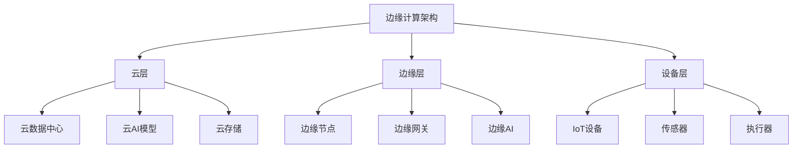

# 5.1.2 边缘计算 / Edge Computing


<!-- TOC START -->

- [5.1.2 边缘计算 / Edge Computing](#512-边缘计算-edge-computing)
  - [1. 边缘计算理论基础 / Edge Computing Theory Foundation](#1-边缘计算理论基础-edge-computing-theory-foundation)
    - [1.1 边缘计算定义 / Edge Computing Definition](#11-边缘计算定义-edge-computing-definition)
    - [1.2 边缘计算架构 / Edge Computing Architecture](#12-边缘计算架构-edge-computing-architecture)
  - [2. 边缘节点 / Edge Nodes](#2-边缘节点-edge-nodes)
    - [2.1 边缘节点架构 / Edge Node Architecture](#21-边缘节点架构-edge-node-architecture)
    - [2.2 边缘节点管理 / Edge Node Management](#22-边缘节点管理-edge-node-management)
  - [3. 边缘智能 / Edge Intelligence](#3-边缘智能-edge-intelligence)
    - [3.1 边缘AI模型 / Edge AI Models](#31-边缘ai模型-edge-ai-models)
    - [3.2 边缘学习 / Edge Learning](#32-边缘学习-edge-learning)
  - [4. 边缘安全 / Edge Security](#4-边缘安全-edge-security)
    - [4.1 边缘安全架构 / Edge Security Architecture](#41-边缘安全架构-edge-security-architecture)
    - [4.2 隐私保护 / Privacy Protection](#42-隐私保护-privacy-protection)
  - [5. 边缘网络 / Edge Networking](#5-边缘网络-edge-networking)
    - [5.1 边缘网络架构 / Edge Network Architecture](#51-边缘网络架构-edge-network-architecture)
    - [5.2 边缘缓存 / Edge Caching](#52-边缘缓存-edge-caching)
  - [6. 总结与展望 / Summary and Outlook](#6-总结与展望-summary-and-outlook)
    - [6.1 边缘计算趋势 / Edge Computing Trends](#61-边缘计算趋势-edge-computing-trends)
    - [6.2 挑战与机遇 / Challenges and Opportunities](#62-挑战与机遇-challenges-and-opportunities)

<!-- TOC END -->

## 1. 边缘计算理论基础 / Edge Computing Theory Foundation

### 1.1 边缘计算定义 / Edge Computing Definition

**边缘计算形式化定义：**

- $Edge_{Computing} = \{Edge_{Nodes}, Edge_{Intelligence}, Edge_{Security}\}$  
  Edge computing: distributed computing paradigm at network edge
- $Edge_{Node} = \{Computing_{Resources}, Storage_{Resources}, Network_{Resources}\}$：边缘节点  
  Edge node: computing infrastructure at network edge
- $Edge_{Intelligence} = \{AI_{Models}, Inference_{Engine}, Data_{Processing}\}$：边缘智能  
  Edge intelligence: AI capabilities at edge nodes

**边缘计算特征：**

1. **低延迟**：$Latency_{Edge} < Latency_{Cloud}$  
   Low latency: reduced network latency
2. **高带宽**：$Bandwidth_{Local} > Bandwidth_{WAN}$  
   High bandwidth: local data processing
3. **隐私保护**：$Privacy_{Edge} = \{Local_{Processing}, Data_{Minimization}\}$  
   Privacy protection: local data processing

### 1.2 边缘计算架构 / Edge Computing Architecture

**架构层次：**



## 2. 边缘节点 / Edge Nodes

### 2.1 边缘节点架构 / Edge Node Architecture

**节点实现：**

```rust
#[derive(Debug)]
pub struct EdgeNode {
    node_id: String,
    location: Location,
    resources: NodeResources,
    services: Vec<EdgeService>,
    connectivity: ConnectivityManager,
}

#[derive(Debug)]
pub struct NodeResources {
    cpu_cores: u32,
    memory_gb: u32,
    storage_gb: u32,
    network_bandwidth: u32,
    power_consumption: f64,
}

impl EdgeNode {
    pub fn new(node_id: String, location: Location, resources: NodeResources) -> Self {
        EdgeNode {
            node_id,
            location,
            resources,
            services: Vec::new(),
            connectivity: ConnectivityManager::new(),
        }
    }
    
    pub fn deploy_service(&mut self, service: EdgeService) -> Result<(), Error> {
        // 检查资源需求
        if !self.check_resource_availability(&service) {
            return Err(Error::InsufficientResources);
        }
        
        // 部署服务
        let deployed_service = self.deploy_service_container(&service)?;
        
        // 注册服务
        self.services.push(deployed_service);
        
        // 更新资源使用情况
        self.update_resource_usage(&service);
        
        Ok(())
    }
    
    pub fn process_data(&self, data: &SensorData) -> Result<ProcessedData, Error> {
        let mut processed_data = ProcessedData::new();
        
        // 数据预处理
        let preprocessed_data = self.preprocess_data(data)?;
        
        // 本地AI推理
        if let Some(ai_model) = self.get_ai_model(data.sensor_type) {
            let inference_result = self.run_inference(ai_model, &preprocessed_data)?;
            processed_data.add_inference_result(inference_result);
        }
        
        // 数据聚合
        let aggregated_data = self.aggregate_data(&preprocessed_data)?;
        processed_data.add_aggregated_data(aggregated_data);
        
        // 决策制定
        if let Some(decision) = self.make_decision(&processed_data)? {
            processed_data.add_decision(decision);
        }
        
        Ok(processed_data)
    }
    
    fn check_resource_availability(&self, service: &EdgeService) -> bool {
        let required_cpu = service.resource_requirements.cpu_cores;
        let required_memory = service.resource_requirements.memory_gb;
        let required_storage = service.resource_requirements.storage_gb;
        
        let available_cpu = self.resources.cpu_cores - self.get_used_cpu();
        let available_memory = self.resources.memory_gb - self.get_used_memory();
        let available_storage = self.resources.storage_gb - self.get_used_storage();
        
        required_cpu <= available_cpu &&
        required_memory <= available_memory &&
        required_storage <= available_storage
    }
    
    fn run_inference(&self, model: &AIModel, data: &PreprocessedData) -> Result<InferenceResult, Error> {
        // 加载模型
        let loaded_model = self.load_model(model)?;
        
        // 准备输入数据
        let input_tensor = self.prepare_input_tensor(data)?;
        
        // 执行推理
        let output_tensor = loaded_model.infer(&input_tensor)?;
        
        // 后处理结果
        let result = self.postprocess_inference_result(&output_tensor)?;
        
        Ok(result)
    }
}
```

### 2.2 边缘节点管理 / Edge Node Management

**节点集群管理：**

```rust
#[derive(Debug)]
pub struct EdgeNodeCluster {
    nodes: HashMap<String, EdgeNode>,
    load_balancer: LoadBalancer,
    resource_scheduler: ResourceScheduler,
}

impl EdgeNodeCluster {
    pub fn add_node(&mut self, node: EdgeNode) {
        self.nodes.insert(node.node_id.clone(), node);
        self.resource_scheduler.update_cluster_state(&self.nodes);
    }
    
    pub fn remove_node(&mut self, node_id: &str) -> Result<(), Error> {
        if let Some(node) = self.nodes.remove(node_id) {
            // 迁移服务到其他节点
            self.migrate_services(&node)?;
            
            // 更新负载均衡器
            self.load_balancer.remove_node(node_id);
            
            // 更新资源调度器
            self.resource_scheduler.update_cluster_state(&self.nodes);
        }
        
        Ok(())
    }
    
    pub fn deploy_service_to_cluster(&mut self, service: EdgeService) -> Result<String, Error> {
        // 选择最佳节点
        let target_node = self.resource_scheduler.select_best_node(&service, &self.nodes)?;
        
        // 部署服务
        if let Some(node) = self.nodes.get_mut(&target_node) {
            node.deploy_service(service)?;
            return Ok(target_node);
        }
        
        Err(Error::NodeNotFound)
    }
    
    fn migrate_services(&mut self, source_node: &EdgeNode) -> Result<(), Error> {
        for service in &source_node.services {
            // 选择目标节点
            let target_node = self.resource_scheduler.select_migration_target(service, &self.nodes)?;
            
            // 迁移服务
            if let Some(target) = self.nodes.get_mut(&target_node) {
                target.deploy_service(service.clone())?;
            }
        }
        
        Ok(())
    }
}
```

## 3. 边缘智能 / Edge Intelligence

### 3.1 边缘AI模型 / Edge AI Models

**模型管理：**

```rust
#[derive(Debug)]
pub struct EdgeAIManager {
    models: HashMap<String, AIModel>,
    model_optimizer: ModelOptimizer,
    inference_engine: InferenceEngine,
}

#[derive(Debug)]
pub struct AIModel {
    model_id: String,
    model_type: ModelType,
    model_data: Vec<u8>,
    input_shape: Vec<usize>,
    output_shape: Vec<usize>,
    quantization: QuantizationConfig,
}

impl EdgeAIManager {
    pub fn deploy_model(&mut self, model: AIModel) -> Result<(), Error> {
        // 模型优化
        let optimized_model = self.model_optimizer.optimize_for_edge(&model)?;
        
        // 量化模型
        let quantized_model = self.quantize_model(&optimized_model)?;
        
        // 部署到推理引擎
        self.inference_engine.load_model(&quantized_model)?;
        
        // 存储模型
        self.models.insert(model.model_id.clone(), quantized_model);
        
        Ok(())
    }
    
    pub fn run_inference(&self, model_id: &str, input_data: &Tensor) -> Result<Tensor, Error> {
        // 获取模型
        let model = self.models.get(model_id)
            .ok_or(Error::ModelNotFound)?;
        
        // 验证输入
        self.validate_input(model, input_data)?;
        
        // 执行推理
        let output = self.inference_engine.infer(model, input_data)?;
        
        // 后处理
        let processed_output = self.postprocess_output(model, &output)?;
        
        Ok(processed_output)
    }
    
    fn optimize_for_edge(&self, model: &AIModel) -> Result<AIModel, Error> {
        let mut optimized_model = model.clone();
        
        // 模型剪枝
        optimized_model = self.model_optimizer.prune_model(&optimized_model)?;
        
        // 知识蒸馏
        optimized_model = self.model_optimizer.distill_model(&optimized_model)?;
        
        // 模型压缩
        optimized_model = self.model_optimizer.compress_model(&optimized_model)?;
        
        Ok(optimized_model)
    }
    
    fn quantize_model(&self, model: &AIModel) -> Result<AIModel, Error> {
        let mut quantized_model = model.clone();
        
        // 动态量化
        if model.quantization.dynamic_quantization {
            quantized_model = self.model_optimizer.dynamic_quantization(&quantized_model)?;
        }
        
        // 静态量化
        if model.quantization.static_quantization {
            quantized_model = self.model_optimizer.static_quantization(&quantized_model)?;
        }
        
        // 混合精度
        if model.quantization.mixed_precision {
            quantized_model = self.model_optimizer.mixed_precision(&quantized_model)?;
        }
        
        Ok(quantized_model)
    }
}
```

### 3.2 边缘学习 / Edge Learning

**联邦学习实现：**

```rust
#[derive(Debug)]
pub struct EdgeLearning {
    federated_learning: FederatedLearning,
    local_training: LocalTraining,
    model_aggregation: ModelAggregation,
}

impl EdgeLearning {
    pub fn start_federated_learning(&mut self, global_model: &AIModel) -> Result<(), Error> {
        // 初始化联邦学习
        self.federated_learning.initialize(global_model)?;
        
        // 分发模型到边缘节点
        self.distribute_model_to_nodes(global_model)?;
        
        // 启动本地训练
        self.start_local_training()?;
        
        Ok(())
    }
    
    pub fn train_local_model(&mut self, local_data: &TrainingData) -> Result<AIModel, Error> {
        // 获取当前模型
        let current_model = self.federated_learning.get_current_model()?;
        
        // 本地训练
        let trained_model = self.local_training.train_model(&current_model, local_data)?;
        
        // 计算模型更新
        let model_update = self.calculate_model_update(&current_model, &trained_model)?;
        
        // 发送更新到聚合器
        self.federated_learning.send_model_update(model_update)?;
        
        Ok(trained_model)
    }
    
    pub fn aggregate_models(&mut self) -> Result<AIModel, Error> {
        // 收集所有模型更新
        let model_updates = self.federated_learning.collect_model_updates()?;
        
        // 聚合模型
        let aggregated_model = self.model_aggregation.aggregate(model_updates)?;
        
        // 更新全局模型
        self.federated_learning.update_global_model(&aggregated_model)?;
        
        // 分发新模型
        self.distribute_model_to_nodes(&aggregated_model)?;
        
        Ok(aggregated_model)
    }
    
    fn calculate_model_update(&self, original_model: &AIModel, trained_model: &AIModel) -> Result<ModelUpdate, Error> {
        let mut update = ModelUpdate::new();
        
        // 计算参数差异
        for (param_name, original_param) in &original_model.parameters {
            if let Some(trained_param) = trained_model.parameters.get(param_name) {
                let diff = trained_param - original_param;
                update.add_parameter_update(param_name.clone(), diff);
            }
        }
        
        // 添加元数据
        update.metadata.training_samples = trained_model.metadata.training_samples;
        update.metadata.training_duration = trained_model.metadata.training_duration;
        update.metadata.loss_value = trained_model.metadata.loss_value;
        
        Ok(update)
    }
}
```

## 4. 边缘安全 / Edge Security

### 4.1 边缘安全架构 / Edge Security Architecture

**安全框架：**

```rust
#[derive(Debug)]
pub struct EdgeSecurity {
    authentication: EdgeAuthentication,
    authorization: EdgeAuthorization,
    encryption: EdgeEncryption,
    threat_detection: ThreatDetection,
}

impl EdgeSecurity {
    pub fn authenticate_device(&self, device: &IoTDevice) -> Result<DeviceIdentity, Error> {
        // 设备认证
        let device_cert = self.authentication.verify_device_certificate(device)?;
        
        // 身份验证
        let identity = self.authentication.verify_device_identity(device, &device_cert)?;
        
        // 权限检查
        self.authorization.check_device_permissions(&identity)?;
        
        Ok(identity)
    }
    
    pub fn encrypt_data(&self, data: &SensorData, key: &EncryptionKey) -> Result<EncryptedData, Error> {
        // 选择加密算法
        let algorithm = self.select_encryption_algorithm(data.data_type)?;
        
        // 加密数据
        let encrypted_data = self.encryption.encrypt(data, key, algorithm)?;
        
        // 添加元数据
        encrypted_data.metadata.encryption_algorithm = algorithm;
        encrypted_data.metadata.encryption_timestamp = Utc::now();
        
        Ok(encrypted_data)
    }
    
    pub fn detect_threats(&self, data: &ProcessedData) -> Result<Vec<Threat>, Error> {
        let mut threats = Vec::new();
        
        // 异常检测
        if let Some(anomalies) = self.threat_detection.detect_anomalies(data)? {
            for anomaly in anomalies {
                threats.push(Threat::Anomaly(anomaly));
            }
        }
        
        // 入侵检测
        if let Some(intrusions) = self.threat_detection.detect_intrusions(data)? {
            for intrusion in intrusions {
                threats.push(Threat::Intrusion(intrusion));
            }
        }
        
        // 恶意软件检测
        if let Some(malware) = self.threat_detection.detect_malware(data)? {
            for malware_instance in malware {
                threats.push(Threat::Malware(malware_instance));
            }
        }
        
        Ok(threats)
    }
    
    fn select_encryption_algorithm(&self, data_type: DataType) -> Result<EncryptionAlgorithm, Error> {
        match data_type {
            DataType::SensorData => Ok(EncryptionAlgorithm::AES256),
            DataType::ControlCommand => Ok(EncryptionAlgorithm::ChaCha20),
            DataType::Configuration => Ok(EncryptionAlgorithm::AES128),
            DataType::LogData => Ok(EncryptionAlgorithm::AES256),
        }
    }
}
```

### 4.2 隐私保护 / Privacy Protection

**隐私计算：**

```rust
#[derive(Debug)]
pub struct PrivacyProtection {
    data_anonymization: DataAnonymization,
    differential_privacy: DifferentialPrivacy,
    secure_computation: SecureComputation,
}

impl PrivacyProtection {
    pub fn anonymize_data(&self, data: &SensorData) -> Result<AnonymizedData, Error> {
        let mut anonymized_data = data.clone();
        
        // 移除个人标识信息
        anonymized_data.remove_personal_identifiers()?;
        
        // 泛化敏感属性
        anonymized_data.generalize_sensitive_attributes()?;
        
        // 添加噪声
        anonymized_data.add_noise(self.differential_privacy.get_noise_level())?;
        
        Ok(AnonymizedData {
            data: anonymized_data,
            anonymization_method: "k-anonymity".to_string(),
            privacy_level: PrivacyLevel::High,
        })
    }
    
    pub fn apply_differential_privacy(&self, query: &DataQuery, epsilon: f64) -> Result<QueryResult, Error> {
        // 计算敏感度
        let sensitivity = self.calculate_query_sensitivity(query)?;
        
        // 计算噪声
        let noise = self.differential_privacy.calculate_noise(sensitivity, epsilon)?;
        
        // 执行查询
        let result = self.execute_query(query)?;
        
        // 添加噪声
        let noisy_result = result.add_noise(noise)?;
        
        Ok(noisy_result)
    }
    
    pub fn secure_computation(&self, computation: &SecureComputation) -> Result<ComputationResult, Error> {
        // 验证计算协议
        self.secure_computation.validate_protocol(computation)?;
        
        // 执行安全计算
        let result = self.secure_computation.execute(computation)?;
        
        // 验证结果
        self.secure_computation.verify_result(&result)?;
        
        Ok(result)
    }
    
    fn calculate_query_sensitivity(&self, query: &DataQuery) -> Result<f64, Error> {
        match query.query_type {
            QueryType::Count => Ok(1.0),
            QueryType::Sum => {
                let max_value = query.get_max_value()?;
                Ok(max_value)
            }
            QueryType::Average => {
                let max_value = query.get_max_value()?;
                let min_value = query.get_min_value()?;
                Ok(max_value - min_value)
            }
            QueryType::Histogram => Ok(1.0),
        }
    }
}
```

## 5. 边缘网络 / Edge Networking

### 5.1 边缘网络架构 / Edge Network Architecture

**网络管理：**

```rust
#[derive(Debug)]
pub struct EdgeNetwork {
    network_manager: NetworkManager,
    routing_protocol: RoutingProtocol,
    bandwidth_manager: BandwidthManager,
}

impl EdgeNetwork {
    pub fn establish_connection(&mut self, source: &EdgeNode, destination: &EdgeNode) -> Result<Connection, Error> {
        // 选择最佳路径
        let path = self.routing_protocol.find_optimal_path(source, destination)?;
        
        // 分配带宽
        let bandwidth = self.bandwidth_manager.allocate_bandwidth(&path)?;
        
        // 建立连接
        let connection = Connection {
            source: source.node_id.clone(),
            destination: destination.node_id.clone(),
            path,
            bandwidth,
            established_at: Utc::now(),
        };
        
        // 配置路由
        self.network_manager.configure_routing(&connection)?;
        
        Ok(connection)
    }
    
    pub fn transmit_data(&self, connection: &Connection, data: &NetworkData) -> Result<TransmissionResult, Error> {
        // 检查带宽可用性
        if !self.bandwidth_manager.check_bandwidth_availability(connection, data.size)? {
            return Err(Error::InsufficientBandwidth);
        }
        
        // 数据分片
        let fragments = self.fragment_data(data)?;
        
        // 传输数据
        let mut transmission_results = Vec::new();
        for fragment in fragments {
            let result = self.transmit_fragment(connection, &fragment)?;
            transmission_results.push(result);
        }
        
        // 重组数据
        let reassembled_data = self.reassemble_data(transmission_results)?;
        
        Ok(TransmissionResult {
            transmitted_bytes: reassembled_data.size,
            transmission_time: reassembled_data.transmission_duration,
            success: true,
        })
    }
    
    fn fragment_data(&self, data: &NetworkData) -> Result<Vec<DataFragment>, Error> {
        let mut fragments = Vec::new();
        let fragment_size = self.calculate_optimal_fragment_size(data.size)?;
        
        let mut offset = 0;
        let mut fragment_id = 0;
        
        while offset < data.size {
            let current_fragment_size = std::cmp::min(fragment_size, data.size - offset);
            
            let fragment = DataFragment {
                fragment_id,
                data: data.data[offset..offset + current_fragment_size].to_vec(),
                offset,
                size: current_fragment_size,
                total_fragments: (data.size + fragment_size - 1) / fragment_size,
            };
            
            fragments.push(fragment);
            offset += current_fragment_size;
            fragment_id += 1;
        }
        
        Ok(fragments)
    }
}
```

### 5.2 边缘缓存 / Edge Caching

**缓存策略：**

```rust
#[derive(Debug)]
pub struct EdgeCache {
    cache_manager: CacheManager,
    cache_policy: CachePolicy,
    cache_optimizer: CacheOptimizer,
}

impl EdgeCache {
    pub fn cache_data(&mut self, data: &CacheableData) -> Result<(), Error> {
        // 检查缓存策略
        if !self.cache_policy.should_cache(data)? {
            return Ok(());
        }
        
        // 选择缓存位置
        let cache_location = self.select_cache_location(data)?;
        
        // 存储数据
        self.cache_manager.store_data(data, &cache_location)?;
        
        // 更新缓存索引
        self.cache_manager.update_cache_index(data)?;
        
        Ok(())
    }
    
    pub fn retrieve_data(&self, data_id: &str) -> Result<Option<CacheableData>, Error> {
        // 查找缓存位置
        if let Some(cache_location) = self.cache_manager.find_cached_data(data_id)? {
            // 检查数据有效性
            if self.cache_manager.is_data_valid(data_id, &cache_location)? {
                // 检索数据
                let data = self.cache_manager.retrieve_data(&cache_location)?;
                return Ok(Some(data));
            } else {
                // 数据已过期，从缓存中移除
                self.cache_manager.remove_data(data_id)?;
            }
        }
        
        Ok(None)
    }
    
    pub fn optimize_cache(&mut self) -> Result<(), Error> {
        // 分析缓存使用模式
        let usage_patterns = self.cache_optimizer.analyze_usage_patterns()?;
        
        // 优化缓存策略
        let optimized_policy = self.cache_optimizer.optimize_policy(&usage_patterns)?;
        
        // 应用优化策略
        self.cache_policy.update_policy(optimized_policy)?;
        
        // 清理过期数据
        self.cache_manager.cleanup_expired_data()?;
        
        // 重新平衡缓存
        self.cache_manager.rebalance_cache()?;
        
        Ok(())
    }
    
    fn select_cache_location(&self, data: &CacheableData) -> Result<CacheLocation, Error> {
        // 基于数据特征选择缓存位置
        match data.access_pattern {
            AccessPattern::Frequent => {
                // 频繁访问的数据存储在本地缓存
                Ok(CacheLocation::Local)
            }
            AccessPattern::Occasional => {
                // 偶尔访问的数据存储在边缘缓存
                Ok(CacheLocation::Edge)
            }
            AccessPattern::Rare => {
                // 很少访问的数据存储在云缓存
                Ok(CacheLocation::Cloud)
            }
        }
    }
}
```

## 6. 总结与展望 / Summary and Outlook

### 6.1 边缘计算趋势 / Edge Computing Trends

**技术发展方向：**

1. **AI边缘化**：更多AI模型部署到边缘节点
2. **5G集成**：与5G网络的深度集成
3. **边缘原生**：专门为边缘计算设计的应用架构
4. **绿色边缘**：节能环保的边缘计算

### 6.2 挑战与机遇 / Challenges and Opportunities

**技术挑战：**

- 边缘节点的资源限制
- 分布式系统的复杂性
- 边缘安全威胁的多样性
- 边缘网络的可靠性

**发展机遇：**

- 物联网设备的普及
- 5G网络的建设
- AI技术的成熟
- 云边协同的需求

---

> 边缘计算是物联网和5G时代的重要技术，通过在网络边缘提供计算能力，实现了低延迟、高带宽和隐私保护。随着边缘计算技术的成熟，将为更多应用场景提供支持。
> Edge computing is an important technology in the IoT and 5G era, providing computing capabilities at the network edge to achieve low latency, high bandwidth, and privacy protection. With the maturity of edge computing technology, it will support more application scenarios.
