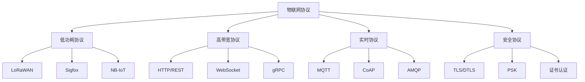

# 5.1.3 物联网协议 / IoT Protocols

## 1. 物联网协议理论基础 / IoT Protocol Theory Foundation

### 1.1 协议分类体系 / Protocol Classification System

**物联网协议形式化定义：**

- $IoT_{Protocol} = \{Transport_{Layer}, Application_{Layer}, Security_{Layer}\}$  
  IoT protocol: communication protocol for Internet of Things
- $Protocol_{Type} = \{MQTT, CoAP, LoRaWAN, Zigbee, HTTP_{REST}\}$：协议类型  
  Protocol type: different IoT communication protocols
- $Protocol_{Characteristics} = \{Bandwidth, Latency, Reliability, Power_{Consumption}\}$：协议特征  
  Protocol characteristics: performance and resource requirements

**协议选择矩阵：**



### 1.2 协议性能模型 / Protocol Performance Model

**性能指标定义：**

- $Throughput = \frac{Data_{Transferred}}{Time_{Interval}}$：吞吐量  
  Throughput: data transfer rate
- $Latency = T_{Send} - T_{Receive}$：延迟  
  Latency: end-to-end delay
- $Reliability = \frac{Successful_{Transmissions}}{Total_{Transmissions}}$：可靠性  
  Reliability: successful transmission ratio
- $Power_{Efficiency} = \frac{Data_{Transferred}}{Energy_{Consumed}}$：能效  
  Power efficiency: data per energy unit

## 2. MQTT协议 / MQTT Protocol

### 2.1 MQTT架构 / MQTT Architecture

**MQTT实现：**

```rust
#[derive(Debug)]
pub struct MQTTBroker {
    clients: HashMap<String, MQTTClient>,
    topics: HashMap<String, Vec<String>>,
    message_store: MessageStore,
    security_manager: SecurityManager,
}

#[derive(Debug)]
pub struct MQTTClient {
    client_id: String,
    username: Option<String>,
    password: Option<String>,
    subscriptions: Vec<Subscription>,
    connection_state: ConnectionState,
}

impl MQTTBroker {
    pub fn new() -> Self {
        MQTTBroker {
            clients: HashMap::new(),
            topics: HashMap::new(),
            message_store: MessageStore::new(),
            security_manager: SecurityManager::new(),
        }
    }
    
    pub fn handle_connect(&mut self, connect_packet: ConnectPacket) -> Result<ConnAckPacket, Error> {
        // 验证客户端
        let client_id = connect_packet.client_id.clone();
        
        // 检查认证
        if let (Some(username), Some(password)) = (&connect_packet.username, &connect_packet.password) {
            self.security_manager.authenticate(username, password)?;
        }
        
        // 创建客户端连接
        let client = MQTTClient {
            client_id: client_id.clone(),
            username: connect_packet.username,
            password: connect_packet.password,
            subscriptions: Vec::new(),
            connection_state: ConnectionState::Connected,
        };
        
        self.clients.insert(client_id.clone(), client);
        
        // 返回连接确认
        Ok(ConnAckPacket {
            return_code: ConnectReturnCode::Accepted,
            session_present: false,
        })
    }
    
    pub fn handle_publish(&mut self, publish_packet: PublishPacket) -> Result<(), Error> {
        let topic = publish_packet.topic.clone();
        let message = publish_packet.payload.clone();
        let qos = publish_packet.qos;
        
        // 存储消息
        self.message_store.store_message(&topic, &message, qos)?;
        
        // 查找订阅者
        let subscribers = self.find_subscribers(&topic)?;
        
        // 发送给订阅者
        for subscriber_id in subscribers {
            if let Some(client) = self.clients.get_mut(&subscriber_id) {
                let delivery_packet = PublishPacket {
                    topic: topic.clone(),
                    payload: message.clone(),
                    qos,
                    packet_id: self.generate_packet_id(),
                    retain: false,
                };
                
                self.send_to_client(client, delivery_packet)?;
            }
        }
        
        Ok(())
    }
    
    pub fn handle_subscribe(&mut self, subscribe_packet: SubscribePacket) -> Result<SubAckPacket, Error> {
        let client_id = subscribe_packet.client_id.clone();
        
        if let Some(client) = self.clients.get_mut(&client_id) {
            let mut return_codes = Vec::new();
            
            for subscription in &subscribe_packet.subscriptions {
                // 添加订阅
                client.subscriptions.push(Subscription {
                    topic_filter: subscription.topic_filter.clone(),
                    qos: subscription.qos,
                });
                
                // 更新主题订阅者
                self.topics.entry(subscription.topic_filter.clone())
                    .or_insert_with(Vec::new)
                    .push(client_id.clone());
                
                return_codes.push(subscription.qos);
            }
            
            Ok(SubAckPacket {
                packet_id: subscribe_packet.packet_id,
                return_codes,
            })
        } else {
            Err(Error::ClientNotFound)
        }
    }
    
    fn find_subscribers(&self, topic: &str) -> Result<Vec<String>, Error> {
        let mut subscribers = Vec::new();
        
        for (topic_pattern, client_ids) in &self.topics {
            if self.topic_matches(topic, topic_pattern) {
                subscribers.extend(client_ids.clone());
            }
        }
        
        Ok(subscribers)
    }
    
    fn topic_matches(&self, topic: &str, pattern: &str) -> bool {
        // 实现MQTT通配符匹配
        let topic_parts: Vec<&str> = topic.split('/').collect();
        let pattern_parts: Vec<&str> = pattern.split('/').collect();
        
        if pattern_parts.len() > topic_parts.len() {
            return false;
        }
        
        for (i, pattern_part) in pattern_parts.iter().enumerate() {
            match *pattern_part {
                "+" => continue, // 单级通配符
                "#" => return true, // 多级通配符
                _ => {
                    if i >= topic_parts.len() || topic_parts[i] != *pattern_part {
                        return false;
                    }
                }
            }
        }
        
        pattern_parts.len() == topic_parts.len()
    }
}
```

### 2.2 MQTT QoS机制 / MQTT QoS Mechanism

**服务质量实现：**

```rust
#[derive(Debug)]
pub struct MQTTQoS {
    qos_level: QoSLevel,
    message_store: MessageStore,
    retry_manager: RetryManager,
}

impl MQTTQoS {
    pub fn handle_qos_publish(&mut self, packet: PublishPacket) -> Result<(), Error> {
        match packet.qos {
            QoSLevel::AtMostOnce => {
                // QoS 0: 最多一次，不保证送达
                self.handle_qos0_publish(packet)
            }
            QoSLevel::AtLeastOnce => {
                // QoS 1: 至少一次，保证送达
                self.handle_qos1_publish(packet)
            }
            QoSLevel::ExactlyOnce => {
                // QoS 2: 恰好一次，保证只送达一次
                self.handle_qos2_publish(packet)
            }
        }
    }
    
    fn handle_qos0_publish(&self, packet: PublishPacket) -> Result<(), Error> {
        // 直接发送，不等待确认
        self.send_packet(&packet)?;
        Ok(())
    }
    
    fn handle_qos1_publish(&mut self, packet: PublishPacket) -> Result<(), Error> {
        // 发送消息
        self.send_packet(&packet)?;
        
        // 存储消息等待确认
        self.message_store.store_pending_message(&packet)?;
        
        // 启动重试机制
        self.retry_manager.schedule_retry(&packet, Duration::from_secs(5))?;
        
        Ok(())
    }
    
    fn handle_qos2_publish(&mut self, packet: PublishPacket) -> Result<(), Error> {
        // 发送PUBLISH
        self.send_packet(&packet)?;
        
        // 存储消息
        self.message_store.store_pending_message(&packet)?;
        
        // 等待PUBREC
        self.wait_for_pubrec(&packet.packet_id)?;
        
        Ok(())
    }
    
    pub fn handle_puback(&mut self, packet_id: u16) -> Result<(), Error> {
        // 收到PUBACK，移除待确认消息
        self.message_store.remove_pending_message(packet_id)?;
        self.retry_manager.cancel_retry(packet_id);
        Ok(())
    }
    
    pub fn handle_pubrec(&mut self, packet_id: u16) -> Result<(), Error> {
        // 发送PUBREL
        let pubrel_packet = PubRelPacket { packet_id };
        self.send_packet(&pubrel_packet)?;
        
        // 等待PUBCOMP
        self.wait_for_pubcomp(packet_id)?;
        
        Ok(())
    }
    
    pub fn handle_pubcomp(&mut self, packet_id: u16) -> Result<(), Error> {
        // 收到PUBCOMP，完成QoS 2流程
        self.message_store.remove_pending_message(packet_id)?;
        Ok(())
    }
}
```

## 3. CoAP协议 / CoAP Protocol

### 3.1 CoAP架构 / CoAP Architecture

**CoAP实现：**

```rust
#[derive(Debug)]
pub struct CoAPServer {
    resources: HashMap<String, CoAPResource>,
    message_handler: MessageHandler,
    retransmission: RetransmissionManager,
}

#[derive(Debug)]
pub struct CoAPResource {
    path: String,
    methods: Vec<CoAPMethod>,
    content_type: ContentType,
    max_age: Option<u32>,
    etag: Option<String>,
}

impl CoAPServer {
    pub fn new() -> Self {
        CoAPServer {
            resources: HashMap::new(),
            message_handler: MessageHandler::new(),
            retransmission: RetransmissionManager::new(),
        }
    }
    
    pub fn register_resource(&mut self, resource: CoAPResource) {
        self.resources.insert(resource.path.clone(), resource);
    }
    
    pub fn handle_request(&mut self, request: CoAPRequest) -> Result<CoAPResponse, Error> {
        // 解析请求
        let resource_path = request.uri_path.clone();
        
        // 查找资源
        if let Some(resource) = self.resources.get(&resource_path) {
            // 检查方法支持
            if !resource.methods.contains(&request.method) {
                return Ok(CoAPResponse {
                    code: ResponseCode::MethodNotAllowed,
                    payload: None,
                    content_type: None,
                });
            }
            
            // 处理请求
            match request.method {
                CoAPMethod::GET => self.handle_get(request, resource),
                CoAPMethod::POST => self.handle_post(request, resource),
                CoAPMethod::PUT => self.handle_put(request, resource),
                CoAPMethod::DELETE => self.handle_delete(request, resource),
            }
        } else {
            // 资源不存在
            Ok(CoAPResponse {
                code: ResponseCode::NotFound,
                payload: None,
                content_type: None,
            })
        }
    }
    
    fn handle_get(&self, request: CoAPRequest, resource: &CoAPResource) -> Result<CoAPResponse, Error> {
        // 检查缓存
        if let Some(etag) = &request.etag {
            if Some(etag.clone()) == resource.etag {
                return Ok(CoAPResponse {
                    code: ResponseCode::Valid,
                    payload: None,
                    content_type: None,
                });
            }
        }
        
        // 获取资源内容
        let payload = self.get_resource_content(&resource.path)?;
        
        Ok(CoAPResponse {
            code: ResponseCode::Content,
            payload: Some(payload),
            content_type: Some(resource.content_type.clone()),
        })
    }
    
    fn handle_post(&self, request: CoAPRequest, resource: &CoAPResource) -> Result<CoAPResponse, Error> {
        // 处理POST请求
        let result = self.process_post_data(&resource.path, &request.payload)?;
        
        Ok(CoAPResponse {
            code: ResponseCode::Created,
            payload: Some(result),
            content_type: Some(resource.content_type.clone()),
        })
    }
    
    pub fn send_confirmable(&mut self, request: CoAPRequest) -> Result<(), Error> {
        // 发送CON消息
        let message = CoAPMessage {
            message_type: MessageType::Confirmable,
            code: request.method.into(),
            message_id: self.generate_message_id(),
            token: request.token,
            options: request.options,
            payload: request.payload,
        };
        
        // 发送消息
        self.message_handler.send_message(&message)?;
        
        // 启动重传机制
        self.retransmission.schedule_retransmission(&message)?;
        
        Ok(())
    }
    
    pub fn send_non_confirmable(&mut self, request: CoAPRequest) -> Result<(), Error> {
        // 发送NON消息
        let message = CoAPMessage {
            message_type: MessageType::NonConfirmable,
            code: request.method.into(),
            message_id: self.generate_message_id(),
            token: request.token,
            options: request.options,
            payload: request.payload,
        };
        
        // 发送消息，不等待确认
        self.message_handler.send_message(&message)?;
        
        Ok(())
    }
}
```

### 3.2 CoAP观察者模式 / CoAP Observer Pattern

**观察者实现：**

```rust
#[derive(Debug)]
pub struct CoAPObserver {
    observers: HashMap<String, Vec<ObserverInfo>>,
    resource_monitor: ResourceMonitor,
}

#[derive(Debug)]
pub struct ObserverInfo {
    client_address: SocketAddr,
    token: Vec<u8>,
    last_notification: DateTime<Utc>,
}

impl CoAPObserver {
    pub fn add_observer(&mut self, resource_path: &str, observer: ObserverInfo) {
        self.observers.entry(resource_path.to_string())
            .or_insert_with(Vec::new)
            .push(observer);
    }
    
    pub fn remove_observer(&mut self, resource_path: &str, client_address: &SocketAddr) {
        if let Some(observers) = self.observers.get_mut(resource_path) {
            observers.retain(|obs| obs.client_address != *client_address);
        }
    }
    
    pub fn notify_observers(&mut self, resource_path: &str, new_data: &[u8]) -> Result<(), Error> {
        if let Some(observers) = self.observers.get(resource_path) {
            for observer in observers {
                let notification = CoAPMessage {
                    message_type: MessageType::Confirmable,
                    code: ResponseCode::Content,
                    message_id: self.generate_message_id(),
                    token: observer.token.clone(),
                    options: vec![
                        CoAPOption::UriPath(resource_path.to_string()),
                        CoAPOption::ContentFormat(ContentType::ApplicationJson),
                    ],
                    payload: new_data.to_vec(),
                };
                
                // 发送通知
                self.send_notification(&observer.client_address, &notification)?;
            }
        }
        
        Ok(())
    }
    
    pub fn start_monitoring(&mut self, resource_path: &str) -> Result<(), Error> {
        // 启动资源监控
        self.resource_monitor.start_monitoring(resource_path, |data| {
            self.notify_observers(resource_path, data)
        })?;
        
        Ok(())
    }
}
```

## 4. LoRaWAN协议 / LoRaWAN Protocol

### 4.1 LoRaWAN架构 / LoRaWAN Architecture

**LoRaWAN实现：**

```rust
#[derive(Debug)]
pub struct LoRaWANNetwork {
    network_server: NetworkServer,
    application_server: ApplicationServer,
    join_server: JoinServer,
    devices: HashMap<String, LoRaWANDevice>,
}

#[derive(Debug)]
pub struct LoRaWANDevice {
    dev_eui: [u8; 8],
    app_eui: [u8; 8],
    app_key: [u8; 16],
    dev_addr: Option<[u8; 4]>,
    session_keys: Option<SessionKeys>,
    activation_type: ActivationType,
}

impl LoRaWANNetwork {
    pub fn new() -> Self {
        LoRaWANNetwork {
            network_server: NetworkServer::new(),
            application_server: ApplicationServer::new(),
            join_server: JoinServer::new(),
            devices: HashMap::new(),
        }
    }
    
    pub fn handle_join_request(&mut self, join_request: JoinRequest) -> Result<JoinAccept, Error> {
        // 验证设备
        let device = self.verify_device(&join_request.dev_eui)?;
        
        // 生成Join Accept
        let join_accept = self.join_server.process_join_request(&join_request, &device)?;
        
        // 更新设备状态
        if let Some(device) = self.devices.get_mut(&hex::encode(join_request.dev_eui)) {
            device.dev_addr = Some(join_accept.dev_addr);
            device.session_keys = Some(join_accept.session_keys.clone());
            device.activation_type = ActivationType::OTAA;
        }
        
        Ok(join_accept)
    }
    
    pub fn handle_uplink(&mut self, uplink: UplinkMessage) -> Result<(), Error> {
        // 验证消息完整性
        self.verify_message_integrity(&uplink)?;
        
        // 解密消息
        let decrypted_payload = self.decrypt_uplink(&uplink)?;
        
        // 处理应用数据
        self.application_server.process_uplink(&uplink.dev_addr, &decrypted_payload)?;
        
        // 生成下行消息（如果需要）
        if let Some(downlink) = self.generate_downlink(&uplink)? {
            self.send_downlink(&downlink)?;
        }
        
        Ok(())
    }
    
    pub fn handle_downlink(&mut self, downlink: DownlinkMessage) -> Result<(), Error> {
        // 验证设备
        let device = self.get_device_by_addr(&downlink.dev_addr)?;
        
        // 加密下行消息
        let encrypted_payload = self.encrypt_downlink(&downlink, &device)?;
        
        // 发送下行消息
        self.network_server.send_downlink(&downlink.dev_addr, &encrypted_payload)?;
        
        Ok(())
    }
    
    fn verify_message_integrity(&self, message: &UplinkMessage) -> Result<(), Error> {
        // 计算MIC
        let calculated_mic = self.calculate_mic(message)?;
        
        // 验证MIC
        if calculated_mic != message.mic {
            return Err(Error::InvalidMIC);
        }
        
        Ok(())
    }
    
    fn decrypt_uplink(&self, uplink: &UplinkMessage) -> Result<Vec<u8>, Error> {
        // 获取会话密钥
        let device = self.get_device_by_addr(&uplink.dev_addr)?;
        let session_keys = device.session_keys.as_ref()
            .ok_or(Error::NoSessionKeys)?;
        
        // 使用AppSKey解密
        let decrypted = self.aes_decrypt(
            &uplink.payload,
            &session_keys.app_s_key,
            &uplink.dev_addr,
            uplink.f_cnt
        )?;
        
        Ok(decrypted)
    }
    
    fn encrypt_downlink(&self, downlink: &DownlinkMessage, device: &LoRaWANDevice) -> Result<Vec<u8>, Error> {
        // 获取会话密钥
        let session_keys = device.session_keys.as_ref()
            .ok_or(Error::NoSessionKeys)?;
        
        // 使用AppSKey加密
        let encrypted = self.aes_encrypt(
            &downlink.payload,
            &session_keys.app_s_key,
            &downlink.dev_addr,
            downlink.f_cnt
        )?;
        
        Ok(encrypted)
    }
}
```

### 4.2 LoRaWAN安全机制 / LoRaWAN Security

**安全实现：**

```rust
#[derive(Debug)]
pub struct LoRaWANSecurity {
    key_manager: KeyManager,
    crypto_engine: CryptoEngine,
    session_manager: SessionManager,
}

impl LoRaWANSecurity {
    pub fn derive_session_keys(&self, app_key: &[u8; 16], join_nonce: &[u8; 3], 
                              join_eui: &[u8; 8], dev_nonce: &[u8; 2]) -> Result<SessionKeys, Error> {
        // 计算AppSKey
        let app_s_key = self.derive_app_session_key(app_key, join_nonce, join_eui, dev_nonce)?;
        
        // 计算NwkSKey
        let nwk_s_key = self.derive_network_session_key(app_key, join_nonce, join_eui, dev_nonce)?;
        
        Ok(SessionKeys {
            app_s_key,
            nwk_s_key,
        })
    }
    
    fn derive_app_session_key(&self, app_key: &[u8; 16], join_nonce: &[u8; 3], 
                             join_eui: &[u8; 8], dev_nonce: &[u8; 2]) -> Result<[u8; 16], Error> {
        let mut input = Vec::new();
        input.extend_from_slice(&[0x02]); // AppSKey derivation
        input.extend_from_slice(join_nonce);
        input.extend_from_slice(join_eui);
        input.extend_from_slice(dev_nonce);
        input.extend_from_slice(&[0x00]); // Padding
        
        let app_s_key = self.aes_cmac(app_key, &input)?;
        Ok(app_s_key)
    }
    
    fn derive_network_session_key(&self, app_key: &[u8; 16], join_nonce: &[u8; 3], 
                                 join_eui: &[u8; 8], dev_nonce: &[u8; 2]) -> Result<[u8; 16], Error> {
        let mut input = Vec::new();
        input.extend_from_slice(&[0x01]); // NwkSKey derivation
        input.extend_from_slice(join_nonce);
        input.extend_from_slice(join_eui);
        input.extend_from_slice(dev_nonce);
        input.extend_from_slice(&[0x00]); // Padding
        
        let nwk_s_key = self.aes_cmac(app_key, &input)?;
        Ok(nwk_s_key)
    }
    
    pub fn calculate_mic(&self, message: &LoRaWANMessage, nwk_s_key: &[u8; 16]) -> Result<[u8; 4], Error> {
        let mut input = Vec::new();
        
        // 添加消息头
        input.extend_from_slice(&message.mhdr);
        
        // 添加MAC payload
        input.extend_from_slice(&message.mac_payload);
        
        // 计算CMAC
        let cmac = self.aes_cmac(nwk_s_key, &input)?;
        
        // 取前4字节作为MIC
        let mut mic = [0u8; 4];
        mic.copy_from_slice(&cmac[..4]);
        
        Ok(mic)
    }
    
    fn aes_cmac(&self, key: &[u8; 16], data: &[u8]) -> Result<Vec<u8>, Error> {
        // 实现AES-CMAC算法
        let cipher = Aes128::new_from_slice(key)
            .map_err(|_| Error::InvalidKey)?;
        
        let mut cmac = Cmac::<Aes128>::new_from_slice(key)
            .map_err(|_| Error::CryptoError)?;
        
        cmac.update(data);
        let result = cmac.finalize();
        
        Ok(result.into_bytes().to_vec())
    }
}
```

## 5. Zigbee协议 / Zigbee Protocol

### 5.1 Zigbee网络架构 / Zigbee Network Architecture

**Zigbee实现：**

```rust
#[derive(Debug)]
pub struct ZigbeeNetwork {
    coordinator: Coordinator,
    routers: HashMap<u16, Router>,
    end_devices: HashMap<u16, EndDevice>,
    network_key: [u8; 16],
    pan_id: u16,
}

#[derive(Debug)]
pub struct ZigbeeDevice {
    address: u16,
    device_type: DeviceType,
    capabilities: DeviceCapabilities,
    parent: Option<u16>,
    children: Vec<u16>,
}

impl ZigbeeNetwork {
    pub fn new(pan_id: u16, network_key: [u8; 16]) -> Self {
        ZigbeeNetwork {
            coordinator: Coordinator::new(0x0000),
            routers: HashMap::new(),
            end_devices: HashMap::new(),
            network_key,
            pan_id,
        }
    }
    
    pub fn start_network(&mut self) -> Result<(), Error> {
        // 启动协调器
        self.coordinator.start(&self.pan_id, &self.network_key)?;
        
        // 开始接受设备加入
        self.coordinator.enable_joining()?;
        
        Ok(())
    }
    
    pub fn handle_join_request(&mut self, join_request: JoinRequest) -> Result<JoinResponse, Error> {
        // 验证设备
        self.verify_device(&join_request)?;
        
        // 分配地址
        let address = self.allocate_address(&join_request.device_type)?;
        
        // 分配父节点
        let parent = self.select_parent(&join_request)?;
        
        // 生成网络密钥
        let network_key = self.generate_network_key()?;
        
        // 创建设备
        let device = ZigbeeDevice {
            address,
            device_type: join_request.device_type,
            capabilities: join_request.capabilities,
            parent: Some(parent),
            children: Vec::new(),
        };
        
        // 添加到网络
        match join_request.device_type {
            DeviceType::Router => {
                self.routers.insert(address, Router::new(device));
            }
            DeviceType::EndDevice => {
                self.end_devices.insert(address, EndDevice::new(device));
            }
            _ => return Err(Error::InvalidDeviceType),
        }
        
        // 更新父节点
        self.update_parent_children(parent, address)?;
        
        Ok(JoinResponse {
            address,
            network_key,
            parent,
        })
    }
    
    pub fn route_message(&mut self, message: ZigbeeMessage) -> Result<(), Error> {
        let destination = message.destination;
        
        // 查找路由路径
        let route = self.find_route(message.source, destination)?;
        
        // 转发消息
        for hop in route {
            self.forward_message(&message, hop)?;
        }
        
        Ok(())
    }
    
    fn find_route(&self, source: u16, destination: u16) -> Result<Vec<u16>, Error> {
        // 实现AODV路由算法
        let mut route = Vec::new();
        
        // 检查直接连接
        if self.is_neighbor(source, destination) {
            route.push(destination);
            return Ok(route);
        }
        
        // 查找路由表
        if let Some(path) = self.lookup_routing_table(source, destination) {
            return Ok(path);
        }
        
        // 发起路由发现
        let discovered_route = self.discover_route(source, destination)?;
        
        // 更新路由表
        self.update_routing_table(source, destination, &discovered_route)?;
        
        Ok(discovered_route)
    }
    
    fn discover_route(&self, source: u16, destination: u16) -> Result<Vec<u16>, Error> {
        // 发送RREQ
        let rreq = RouteRequest {
            source,
            destination,
            request_id: self.generate_request_id(),
            hop_count: 0,
        };
        
        // 广播RREQ
        self.broadcast_rreq(&rreq)?;
        
        // 等待RREP
        let rrep = self.wait_for_rrep(&rreq)?;
        
        // 构建路由
        let mut route = Vec::new();
        let mut current = destination;
        
        while current != source {
            route.push(current);
            current = rrep.previous_hop(current)?;
        }
        
        route.push(source);
        route.reverse();
        
        Ok(route)
    }
}
```

### 5.2 Zigbee安全机制 / Zigbee Security

**安全实现：**

```rust
#[derive(Debug)]
pub struct ZigbeeSecurity {
    trust_center: TrustCenter,
    key_manager: KeyManager,
    security_manager: SecurityManager,
}

impl ZigbeeSecurity {
    pub fn authenticate_device(&mut self, device: &ZigbeeDevice) -> Result<bool, Error> {
        // 检查设备是否在信任列表中
        if !self.trust_center.is_trusted(&device.address)? {
            return Ok(false);
        }
        
        // 验证设备证书
        let certificate = self.get_device_certificate(&device.address)?;
        let is_valid = self.verify_certificate(&certificate)?;
        
        if is_valid {
            // 生成会话密钥
            let session_key = self.generate_session_key(&device.address)?;
            self.key_manager.store_session_key(&device.address, &session_key)?;
        }
        
        Ok(is_valid)
    }
    
    pub fn encrypt_message(&self, message: &ZigbeeMessage, device_address: u16) -> Result<EncryptedMessage, Error> {
        // 获取会话密钥
        let session_key = self.key_manager.get_session_key(&device_address)?;
        
        // 生成随机数
        let nonce = self.generate_nonce()?;
        
        // 加密消息
        let encrypted_payload = self.aes_encrypt(&message.payload, &session_key, &nonce)?;
        
        // 计算MIC
        let mic = self.calculate_mic(&message.header, &encrypted_payload, &session_key)?;
        
        Ok(EncryptedMessage {
            header: message.header.clone(),
            payload: encrypted_payload,
            mic,
            nonce,
        })
    }
    
    pub fn decrypt_message(&self, encrypted_message: &EncryptedMessage, device_address: u16) -> Result<Vec<u8>, Error> {
        // 获取会话密钥
        let session_key = self.key_manager.get_session_key(&device_address)?;
        
        // 验证MIC
        let calculated_mic = self.calculate_mic(&encrypted_message.header, &encrypted_message.payload, &session_key)?;
        if calculated_mic != encrypted_message.mic {
            return Err(Error::InvalidMIC);
        }
        
        // 解密消息
        let decrypted_payload = self.aes_decrypt(&encrypted_message.payload, &session_key, &encrypted_message.nonce)?;
        
        Ok(decrypted_payload)
    }
    
    fn calculate_mic(&self, header: &MessageHeader, payload: &[u8], key: &[u8; 16]) -> Result<[u8; 4], Error> {
        let mut input = Vec::new();
        
        // 添加头部
        input.extend_from_slice(&header.to_bytes());
        
        // 添加负载
        input.extend_from_slice(payload);
        
        // 计算CMAC
        let cmac = self.aes_cmac(key, &input)?;
        
        // 取前4字节作为MIC
        let mut mic = [0u8; 4];
        mic.copy_from_slice(&cmac[..4]);
        
        Ok(mic)
    }
}
```

## 6. 协议对比与选择 / Protocol Comparison and Selection

### 6.1 协议性能对比 / Protocol Performance Comparison

**对比矩阵：**

| 协议 | 带宽 | 延迟 | 功耗 | 覆盖范围 | 安全性 | 适用场景 |
|------|------|------|------|----------|--------|----------|
| MQTT | 高 | 低 | 中 | 广域网 | 高 | 云边协同 |
| CoAP | 中 | 低 | 低 | 局域网 | 中 | 资源受限设备 |
| LoRaWAN | 低 | 高 | 极低 | 广域网 | 高 | 低功耗广域 |
| Zigbee | 中 | 低 | 低 | 局域网 | 高 | 短距离通信 |

### 6.2 协议选择指南 / Protocol Selection Guide

**选择策略：**

```rust
#[derive(Debug)]
pub struct ProtocolSelector {
    requirements: ProtocolRequirements,
    constraints: ProtocolConstraints,
}

impl ProtocolSelector {
    pub fn select_protocol(&self, requirements: &ProtocolRequirements) -> Result<IoTProtocol, Error> {
        let mut candidates = Vec::new();
        
        // 评估MQTT
        if self.evaluate_mqtt(requirements) {
            candidates.push((IoTProtocol::MQTT, self.calculate_mqtt_score(requirements)));
        }
        
        // 评估CoAP
        if self.evaluate_coap(requirements) {
            candidates.push((IoTProtocol::CoAP, self.calculate_coap_score(requirements)));
        }
        
        // 评估LoRaWAN
        if self.evaluate_lorawan(requirements) {
            candidates.push((IoTProtocol::LoRaWAN, self.calculate_lorawan_score(requirements)));
        }
        
        // 评估Zigbee
        if self.evaluate_zigbee(requirements) {
            candidates.push((IoTProtocol::Zigbee, self.calculate_zigbee_score(requirements)));
        }
        
        // 选择最高分的协议
        candidates.sort_by(|a, b| b.1.partial_cmp(&a.1).unwrap());
        
        if let Some((protocol, _)) = candidates.first() {
            Ok(protocol.clone())
        } else {
            Err(Error::NoSuitableProtocol)
        }
    }
    
    fn evaluate_mqtt(&self, requirements: &ProtocolRequirements) -> bool {
        requirements.bandwidth <= 1000 && // 带宽要求
        requirements.latency >= 100 && // 延迟要求
        requirements.power_consumption >= PowerLevel::Medium && // 功耗要求
        requirements.security_level >= SecurityLevel::High // 安全要求
    }
    
    fn calculate_mqtt_score(&self, requirements: &ProtocolRequirements) -> f64 {
        let mut score = 0.0;
        
        // 带宽评分
        score += (requirements.bandwidth / 1000.0).min(1.0) * 25.0;
        
        // 延迟评分
        score += (1000.0 / requirements.latency).min(1.0) * 25.0;
        
        // 功耗评分
        score += self.power_score(requirements.power_consumption) * 25.0;
        
        // 安全评分
        score += self.security_score(requirements.security_level) * 25.0;
        
        score
    }
}
```

## 7. 总结与展望 / Summary and Outlook

### 7.1 物联网协议趋势 / IoT Protocol Trends

**技术发展方向：**

1. **5G集成**：与5G网络的深度集成
2. **边缘计算**：边缘节点的协议优化
3. **AI驱动**：基于AI的协议选择优化
4. **安全增强**：更强的安全机制

### 7.2 挑战与机遇 / Challenges and Opportunities

**技术挑战：**

- 协议互操作性问题
- 安全威胁的多样性
- 能耗优化需求
- 大规模部署复杂性

**发展机遇：**

- 物联网设备普及
- 5G网络建设
- 边缘计算发展
- 标准化需求

---

> 物联网协议是物联网系统的基础，不同的协议适用于不同的应用场景。通过深入理解各种协议的特性和选择策略，可以构建高效、安全、可靠的物联网系统。
> IoT protocols are the foundation of IoT systems, with different protocols suitable for different application scenarios. Through deep understanding of various protocol characteristics and selection strategies, efficient, secure, and reliable IoT systems can be built.
