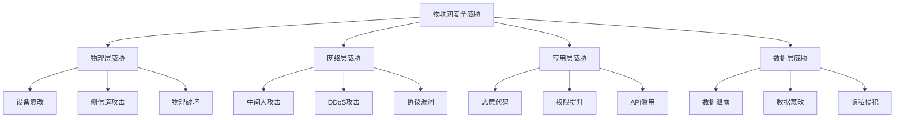

# 5.1.4 物联网安全 / IoT Security

## 1. 物联网安全理论基础 / IoT Security Theory Foundation

### 1.1 安全威胁模型 / Security Threat Model

**物联网安全形式化定义：**

- $IoT_{Security} = \{Device_{Security}, Data_{Security}, Network_{Security}, Application_{Security}\}$  
  IoT security: comprehensive security framework for Internet of Things
- $Threat_{Model} = \{Physical_{Attacks}, Network_{Attacks}, Application_{Attacks}, Data_{Breaches}\}$：威胁模型  
  Threat model: systematic analysis of IoT security threats
- $Security_{Controls} = \{Authentication, Authorization, Encryption, Monitoring\}$：安全控制  
  Security controls: protective measures against threats

**威胁分类：**



### 1.2 安全原则 / Security Principles

**物联网安全原则：**

1. **零信任模型**：$Zero_{Trust} = \{Verify_{Always}, Trust_{Never}\}$  
   Zero trust: verify everything, trust nothing
2. **深度防御**：$Defense_{in}_{Depth} = \{Layer_1, Layer_2, ..., Layer_n\}$  
   Defense in depth: multiple security layers
3. **最小权限**：$Principle_{of}_{Least}_{Privilege} = \min_{p \in P} Privilege(p)$  
   Principle of least privilege: minimize privileges

## 2. 设备认证 / Device Authentication

### 2.1 设备身份管理 / Device Identity Management

**设备认证系统：**

```rust
#[derive(Debug)]
pub struct IoTDeviceAuthentication {
    identity_provider: IdentityProvider,
    certificate_authority: CertificateAuthority,
    device_registry: DeviceRegistry,
}

#[derive(Debug)]
pub struct IoTDevice {
    device_id: String,
    device_type: DeviceType,
    capabilities: DeviceCapabilities,
    certificates: Vec<Certificate>,
    authentication_state: AuthenticationState,
}

impl IoTDeviceAuthentication {
    pub fn register_device(&mut self, device: IoTDevice) -> Result<DeviceIdentity, Error> {
        // 生成设备唯一标识
        let device_id = self.generate_device_id(&device)?;
        
        // 生成设备证书
        let certificate = self.certificate_authority.issue_device_certificate(&device)?;
        
        // 创建设备身份
        let identity = DeviceIdentity {
            device_id: device_id.clone(),
            public_key: certificate.public_key.clone(),
            certificate: certificate,
            registration_time: Utc::now(),
        };
        
        // 注册到设备注册表
        self.device_registry.register_device(&identity)?;
        
        Ok(identity)
    }
    
    pub fn authenticate_device(&self, device_id: &str, challenge: &[u8]) -> Result<AuthenticationResult, Error> {
        // 获取设备身份
        let identity = self.device_registry.get_device(device_id)?;
        
        // 验证证书
        let is_valid_cert = self.certificate_authority.verify_certificate(&identity.certificate)?;
        
        if !is_valid_cert {
            return Ok(AuthenticationResult {
                success: false,
                error: Some("Invalid certificate".to_string()),
            });
        }
        
        // 验证设备签名
        let signature = self.get_device_signature(device_id, challenge)?;
        let is_valid_signature = self.verify_signature(&identity.public_key, challenge, &signature)?;
        
        if !is_valid_signature {
            return Ok(AuthenticationResult {
                success: false,
                error: Some("Invalid signature".to_string()),
            });
        }
        
        // 检查设备状态
        let device_status = self.device_registry.get_device_status(device_id)?;
        if device_status != DeviceStatus::Active {
            return Ok(AuthenticationResult {
                success: false,
                error: Some("Device not active".to_string()),
            });
        }
        
        Ok(AuthenticationResult {
            success: true,
            error: None,
        })
    }
    
    fn generate_device_id(&self, device: &IoTDevice) -> Result<String, Error> {
        // 基于设备特征生成唯一ID
        let mut hasher = Sha256::new();
        hasher.update(device.device_type.as_bytes());
        hasher.update(&device.capabilities.to_bytes());
        hasher.update(&Utc::now().timestamp().to_be_bytes());
        
        let hash = hasher.finalize();
        Ok(hex::encode(hash))
    }
    
    fn verify_signature(&self, public_key: &[u8], data: &[u8], signature: &[u8]) -> Result<bool, Error> {
        let key = VerifyingKey::from_sec1_bytes(public_key)
            .map_err(|_| Error::InvalidPublicKey)?;
        
        let signature = Signature::from_der(signature)
            .map_err(|_| Error::InvalidSignature)?;
        
        Ok(key.verify(data, &signature).is_ok())
    }
}
```

### 2.2 多因子认证 / Multi-Factor Authentication

**MFA实现：**

```rust
#[derive(Debug)]
pub struct MultiFactorAuthentication {
    factors: Vec<AuthenticationFactor>,
    policy_engine: PolicyEngine,
}

#[derive(Debug)]
pub enum AuthenticationFactor {
    Password(String),
    Certificate(Certificate),
    Biometric(BiometricData),
    HardwareToken(HardwareToken),
    Location(Location),
}

impl MultiFactorAuthentication {
    pub fn authenticate(&self, device_id: &str, factors: Vec<AuthenticationFactor>) -> Result<AuthenticationResult, Error> {
        // 获取认证策略
        let policy = self.policy_engine.get_authentication_policy(device_id)?;
        
        // 验证每个因子
        let mut valid_factors = 0;
        let mut required_factors = policy.required_factors.len();
        
        for factor in factors {
            if self.verify_factor(&factor, device_id)? {
                valid_factors += 1;
            }
        }
        
        // 检查是否满足策略要求
        if valid_factors >= required_factors {
            Ok(AuthenticationResult {
                success: true,
                error: None,
            })
        } else {
            Ok(AuthenticationResult {
                success: false,
                error: Some("Insufficient authentication factors".to_string()),
            })
        }
    }
    
    fn verify_factor(&self, factor: &AuthenticationFactor, device_id: &str) -> Result<bool, Error> {
        match factor {
            AuthenticationFactor::Password(password) => {
                self.verify_password(device_id, password)
            }
            AuthenticationFactor::Certificate(certificate) => {
                self.verify_certificate(certificate)
            }
            AuthenticationFactor::Biometric(biometric) => {
                self.verify_biometric(device_id, biometric)
            }
            AuthenticationFactor::HardwareToken(token) => {
                self.verify_hardware_token(device_id, token)
            }
            AuthenticationFactor::Location(location) => {
                self.verify_location(device_id, location)
            }
        }
    }
    
    fn verify_password(&self, device_id: &str, password: &str) -> Result<bool, Error> {
        // 获取存储的密码哈希
        let stored_hash = self.get_stored_password_hash(device_id)?;
        
        // 验证密码
        let input_hash = self.hash_password(password)?;
        
        Ok(stored_hash == input_hash)
    }
    
    fn verify_certificate(&self, certificate: &Certificate) -> Result<bool, Error> {
        // 验证证书链
        let cert_chain = self.build_certificate_chain(certificate)?;
        
        // 验证每个证书
        for cert in cert_chain {
            if !self.verify_single_certificate(&cert)? {
                return Ok(false);
            }
        }
        
        Ok(true)
    }
}
```

## 3. 数据加密 / Data Encryption

### 3.1 传输加密 / Transport Encryption

**TLS/DTLS实现：**

```rust
#[derive(Debug)]
pub struct TransportSecurity {
    tls_config: TLSConfig,
    dtls_config: DTLSConfig,
    key_manager: KeyManager,
}

impl TransportSecurity {
    pub fn establish_tls_connection(&mut self, device: &IoTDevice) -> Result<TLSSession, Error> {
        // 生成会话密钥
        let session_key = self.key_manager.generate_session_key()?;
        
        // 协商加密套件
        let cipher_suite = self.negotiate_cipher_suite(device)?;
        
        // 建立TLS会话
        let session = TLSSession {
            session_id: self.generate_session_id(),
            session_key,
            cipher_suite,
            created_at: Utc::now(),
        };
        
        // 存储会话
        self.key_manager.store_session(&session)?;
        
        Ok(session)
    }
    
    pub fn encrypt_transport_data(&self, session: &TLSSession, data: &[u8]) -> Result<Vec<u8>, Error> {
        match session.cipher_suite {
            CipherSuite::AES256_GCM => {
                self.encrypt_aes_gcm(data, &session.session_key)
            }
            CipherSuite::ChaCha20_Poly1305 => {
                self.encrypt_chacha20_poly1305(data, &session.session_key)
            }
            CipherSuite::AES128_CCM => {
                self.encrypt_aes_ccm(data, &session.session_key)
            }
        }
    }
    
    pub fn decrypt_transport_data(&self, session: &TLSSession, encrypted_data: &[u8]) -> Result<Vec<u8>, Error> {
        match session.cipher_suite {
            CipherSuite::AES256_GCM => {
                self.decrypt_aes_gcm(encrypted_data, &session.session_key)
            }
            CipherSuite::ChaCha20_Poly1305 => {
                self.decrypt_chacha20_poly1305(encrypted_data, &session.session_key)
            }
            CipherSuite::AES128_CCM => {
                self.decrypt_aes_ccm(encrypted_data, &session.session_key)
            }
        }
    }
    
    fn encrypt_aes_gcm(&self, data: &[u8], key: &[u8; 32]) -> Result<Vec<u8>, Error> {
        let cipher = Aes256Gcm::new_from_slice(key)
            .map_err(|_| Error::InvalidKey)?;
        
        let nonce = Aes256Gcm::generate_nonce(&mut OsRng);
        let ciphertext = cipher.encrypt(&nonce, data)
            .map_err(|_| Error::EncryptionFailed)?;
        
        let mut result = Vec::new();
        result.extend_from_slice(&nonce);
        result.extend_from_slice(&ciphertext);
        
        Ok(result)
    }
    
    fn decrypt_aes_gcm(&self, encrypted_data: &[u8], key: &[u8; 32]) -> Result<Vec<u8>, Error> {
        if encrypted_data.len() < 12 {
            return Err(Error::InvalidData);
        }
        
        let nonce = GenericArray::clone_from_slice(&encrypted_data[..12]);
        let ciphertext = &encrypted_data[12..];
        
        let cipher = Aes256Gcm::new_from_slice(key)
            .map_err(|_| Error::InvalidKey)?;
        
        let plaintext = cipher.decrypt(&nonce, ciphertext)
            .map_err(|_| Error::DecryptionFailed)?;
        
        Ok(plaintext)
    }
}
```

### 3.2 数据存储加密 / Data Storage Encryption

**存储加密实现：**

```rust
#[derive(Debug)]
pub struct StorageEncryption {
    key_derivation: KeyDerivation,
    encryption_engine: EncryptionEngine,
    secure_storage: SecureStorage,
}

impl StorageEncryption {
    pub fn encrypt_stored_data(&self, data: &[u8], device_id: &str) -> Result<EncryptedData, Error> {
        // 派生存储密钥
        let storage_key = self.key_derivation.derive_storage_key(device_id)?;
        
        // 生成随机IV
        let iv = self.generate_random_iv()?;
        
        // 加密数据
        let encrypted_data = self.encryption_engine.encrypt_aes_cbc(data, &storage_key, &iv)?;
        
        // 计算MAC
        let mac = self.calculate_mac(&encrypted_data, &storage_key)?;
        
        Ok(EncryptedData {
            data: encrypted_data,
            iv,
            mac,
            algorithm: "AES-CBC".to_string(),
        })
    }
    
    pub fn decrypt_stored_data(&self, encrypted_data: &EncryptedData, device_id: &str) -> Result<Vec<u8>, Error> {
        // 派生存储密钥
        let storage_key = self.key_derivation.derive_storage_key(device_id)?;
        
        // 验证MAC
        let calculated_mac = self.calculate_mac(&encrypted_data.data, &storage_key)?;
        if calculated_mac != encrypted_data.mac {
            return Err(Error::InvalidMAC);
        }
        
        // 解密数据
        let decrypted_data = self.encryption_engine.decrypt_aes_cbc(
            &encrypted_data.data,
            &storage_key,
            &encrypted_data.iv
        )?;
        
        Ok(decrypted_data)
    }
    
    fn calculate_mac(&self, data: &[u8], key: &[u8; 32]) -> Result<[u8; 32], Error> {
        let mut hasher = HmacSha256::new_from_slice(key)
            .map_err(|_| Error::InvalidKey)?;
        
        hasher.update(data);
        let result = hasher.finalize();
        
        let mut mac = [0u8; 32];
        mac.copy_from_slice(&result.into_bytes());
        
        Ok(mac)
    }
}
```

## 4. 威胁检测与防护 / Threat Detection and Protection

### 4.1 入侵检测系统 / Intrusion Detection System

**IDS实现：**

```rust
#[derive(Debug)]
pub struct IoTIntrusionDetection {
    signature_detector: SignatureDetector,
    anomaly_detector: AnomalyDetector,
    behavior_analyzer: BehaviorAnalyzer,
    alert_manager: AlertManager,
}

impl IoTIntrusionDetection {
    pub fn analyze_traffic(&mut self, traffic_data: &NetworkTraffic) -> Result<Vec<ThreatAlert>, Error> {
        let mut alerts = Vec::new();
        
        // 签名检测
        if let Some(signature_matches) = self.signature_detector.detect_signatures(traffic_data)? {
            for match_result in signature_matches {
                alerts.push(ThreatAlert {
                    alert_type: AlertType::SignatureMatch,
                    severity: match_result.severity,
                    description: match_result.description,
                    timestamp: Utc::now(),
                });
            }
        }
        
        // 异常检测
        if let Some(anomalies) = self.anomaly_detector.detect_anomalies(traffic_data)? {
            for anomaly in anomalies {
                alerts.push(ThreatAlert {
                    alert_type: AlertType::AnomalyDetected,
                    severity: Severity::Medium,
                    description: anomaly.description,
                    timestamp: Utc::now(),
                });
            }
        }
        
        // 行为分析
        if let Some(behavior_threats) = self.behavior_analyzer.analyze_behavior(traffic_data)? {
            for threat in behavior_threats {
                alerts.push(ThreatAlert {
                    alert_type: AlertType::BehaviorThreat,
                    severity: threat.severity,
                    description: threat.description,
                    timestamp: Utc::now(),
                });
            }
        }
        
        // 发送告警
        for alert in &alerts {
            self.alert_manager.send_alert(alert)?;
        }
        
        Ok(alerts)
    }
    
    pub fn update_signatures(&mut self, new_signatures: Vec<Signature>) -> Result<(), Error> {
        for signature in new_signatures {
            self.signature_detector.add_signature(signature)?;
        }
        
        Ok(())
    }
    
    pub fn train_anomaly_detector(&mut self, training_data: &[NetworkTraffic]) -> Result<(), Error> {
        // 训练异常检测模型
        self.anomaly_detector.train_model(training_data)?;
        
        Ok(())
    }
}
```

### 4.2 恶意软件防护 / Malware Protection

**恶意软件检测：**

```rust
#[derive(Debug)]
pub struct MalwareProtection {
    signature_scanner: SignatureScanner,
    behavior_monitor: BehaviorMonitor,
    sandbox: Sandbox,
    quarantine: Quarantine,
}

impl MalwareProtection {
    pub fn scan_device(&mut self, device: &IoTDevice) -> Result<ScanResult, Error> {
        let mut scan_result = ScanResult::new();
        
        // 扫描固件
        if let Some(firmware) = self.get_device_firmware(device)? {
            let firmware_scan = self.scan_firmware(&firmware)?;
            scan_result.add_firmware_scan(firmware_scan);
        }
        
        // 扫描配置
        if let Some(config) = self.get_device_config(device)? {
            let config_scan = self.scan_config(&config)?;
            scan_result.add_config_scan(config_scan);
        }
        
        // 监控行为
        let behavior_scan = self.monitor_device_behavior(device)?;
        scan_result.add_behavior_scan(behavior_scan);
        
        // 处理检测结果
        if scan_result.has_threats() {
            self.handle_threats(device, &scan_result)?;
        }
        
        Ok(scan_result)
    }
    
    fn scan_firmware(&self, firmware: &Firmware) -> Result<FirmwareScanResult, Error> {
        let mut result = FirmwareScanResult::new();
        
        // 计算固件哈希
        let firmware_hash = self.calculate_firmware_hash(firmware)?;
        
        // 检查已知恶意软件签名
        let signature_matches = self.signature_scanner.scan_firmware(firmware)?;
        for match_result in signature_matches {
            result.add_threat(Threat {
                threat_type: ThreatType::Malware,
                severity: match_result.severity,
                description: format!("Malware signature detected: {}", match_result.signature_name),
            });
        }
        
        // 在沙箱中执行固件
        let sandbox_result = self.sandbox.execute_firmware(firmware)?;
        if sandbox_result.has_suspicious_behavior() {
            result.add_threat(Threat {
                threat_type: ThreatType::SuspiciousBehavior,
                severity: Severity::High,
                description: "Suspicious behavior detected in sandbox".to_string(),
            });
        }
        
        Ok(result)
    }
    
    fn handle_threats(&mut self, device: &IoTDevice, scan_result: &ScanResult) -> Result<(), Error> {
        for threat in scan_result.get_threats() {
            match threat.severity {
                Severity::Critical => {
                    // 隔离设备
                    self.quarantine.isolate_device(device)?;
                    
                    // 发送紧急告警
                    self.send_emergency_alert(device, threat)?;
                }
                Severity::High => {
                    // 限制设备功能
                    self.restrict_device_capabilities(device)?;
                    
                    // 发送高优先级告警
                    self.send_high_priority_alert(device, threat)?;
                }
                Severity::Medium => {
                    // 监控设备
                    self.increase_monitoring(device)?;
                    
                    // 发送中等优先级告警
                    self.send_medium_priority_alert(device, threat)?;
                }
                Severity::Low => {
                    // 记录威胁
                    self.log_threat(device, threat)?;
                }
            }
        }
        
        Ok(())
    }
}
```

## 5. 隐私保护 / Privacy Protection

### 5.1 数据匿名化 / Data Anonymization

**匿名化实现：**

```rust
#[derive(Debug)]
pub struct PrivacyProtection {
    anonymizer: DataAnonymizer,
    differential_privacy: DifferentialPrivacy,
    consent_manager: ConsentManager,
}

impl PrivacyProtection {
    pub fn anonymize_sensor_data(&self, data: &SensorData) -> Result<AnonymizedData, Error> {
        let mut anonymized_data = data.clone();
        
        // 移除个人标识信息
        anonymized_data.remove_device_id()?;
        anonymized_data.remove_location_precision()?;
        anonymized_data.remove_timestamp_precision()?;
        
        // 泛化敏感属性
        anonymized_data.generalize_sensor_type()?;
        anonymized_data.generalize_value_range()?;
        
        // 添加噪声
        let noise_level = self.differential_privacy.calculate_noise_level(data.sensitivity)?;
        anonymized_data.add_noise(noise_level)?;
        
        Ok(AnonymizedData {
            data: anonymized_data,
            anonymization_method: "k-anonymity".to_string(),
            privacy_level: PrivacyLevel::High,
        })
    }
    
    pub fn apply_differential_privacy(&self, query: &DataQuery, epsilon: f64) -> Result<QueryResult, Error> {
        // 计算查询敏感度
        let sensitivity = self.calculate_query_sensitivity(query)?;
        
        // 计算噪声
        let noise = self.differential_privacy.calculate_noise(sensitivity, epsilon)?;
        
        // 执行查询
        let result = self.execute_query(query)?;
        
        // 添加噪声
        let noisy_result = result.add_noise(noise)?;
        
        Ok(noisy_result)
    }
    
    pub fn check_consent(&self, device_id: &str, data_usage: &DataUsage) -> Result<bool, Error> {
        // 获取用户同意
        let consent = self.consent_manager.get_consent(device_id)?;
        
        // 检查数据使用是否符合同意范围
        let is_allowed = consent.allows_usage(data_usage)?;
        
        Ok(is_allowed)
    }
    
    fn calculate_query_sensitivity(&self, query: &DataQuery) -> Result<f64, Error> {
        match query.query_type {
            QueryType::Count => Ok(1.0),
            QueryType::Sum => {
                let max_value = query.get_max_value()?;
                Ok(max_value)
            }
            QueryType::Average => {
                let max_value = query.get_max_value()?;
                let min_value = query.get_min_value()?;
                Ok(max_value - min_value)
            }
            QueryType::Histogram => Ok(1.0),
        }
    }
}
```

### 5.2 安全审计 / Security Auditing

**审计系统：**

```rust
#[derive(Debug)]
pub struct SecurityAuditor {
    audit_logger: AuditLogger,
    compliance_checker: ComplianceChecker,
    report_generator: ReportGenerator,
}

impl SecurityAuditor {
    pub fn audit_device_activity(&mut self, device: &IoTDevice) -> Result<AuditReport, Error> {
        let mut audit_events = Vec::new();
        
        // 收集认证事件
        audit_events.extend(self.collect_authentication_events(device)?);
        
        // 收集数据访问事件
        audit_events.extend(self.collect_data_access_events(device)?);
        
        // 收集网络活动事件
        audit_events.extend(self.collect_network_events(device)?);
        
        // 收集安全事件
        audit_events.extend(self.collect_security_events(device)?);
        
        // 分析合规性
        let compliance_results = self.compliance_checker.check_compliance(&audit_events)?;
        
        // 生成审计报告
        let report = self.report_generator.generate_audit_report(
            device,
            &audit_events,
            &compliance_results
        )?;
        
        Ok(report)
    }
    
    fn collect_authentication_events(&self, device: &IoTDevice) -> Result<Vec<AuditEvent>, Error> {
        let mut events = Vec::new();
        
        // 获取认证日志
        let auth_logs = self.audit_logger.get_authentication_logs(device)?;
        
        for log in auth_logs {
            events.push(AuditEvent {
                event_type: AuditEventType::Authentication,
                timestamp: log.timestamp,
                details: format!("Authentication attempt: {}", log.result),
                severity: if log.success { Severity::Info } else { Severity::Warning },
            });
        }
        
        Ok(events)
    }
    
    pub fn generate_compliance_report(&self, device: &IoTDevice) -> Result<ComplianceReport, Error> {
        let mut report = ComplianceReport::new();
        
        // 检查GDPR合规性
        let gdpr_compliance = self.check_gdpr_compliance(device)?;
        report.add_compliance_check("GDPR", gdpr_compliance);
        
        // 检查CCPA合规性
        let ccpa_compliance = self.check_ccpa_compliance(device)?;
        report.add_compliance_check("CCPA", ccpa_compliance);
        
        // 检查ISO 27001合规性
        let iso_compliance = self.check_iso_compliance(device)?;
        report.add_compliance_check("ISO 27001", iso_compliance);
        
        Ok(report)
    }
}
```

## 6. 安全架构 / Security Architecture

### 6.1 分层安全架构 / Layered Security Architecture

**安全架构实现：**

```rust
#[derive(Debug)]
pub struct IoTSecurityArchitecture {
    physical_security: PhysicalSecurity,
    network_security: NetworkSecurity,
    application_security: ApplicationSecurity,
    data_security: DataSecurity,
}

impl IoTSecurityArchitecture {
    pub fn implement_security_layers(&mut self, device: &IoTDevice) -> Result<SecurityProfile, Error> {
        let mut security_profile = SecurityProfile::new();
        
        // 物理安全层
        let physical_profile = self.physical_security.implement_physical_security(device)?;
        security_profile.add_layer(physical_profile);
        
        // 网络安全层
        let network_profile = self.network_security.implement_network_security(device)?;
        security_profile.add_layer(network_profile);
        
        // 应用安全层
        let application_profile = self.application_security.implement_application_security(device)?;
        security_profile.add_layer(application_profile);
        
        // 数据安全层
        let data_profile = self.data_security.implement_data_security(device)?;
        security_profile.add_layer(data_profile);
        
        Ok(security_profile)
    }
    
    pub fn validate_security_architecture(&self, profile: &SecurityProfile) -> Result<ValidationResult, Error> {
        let mut validation_result = ValidationResult::new();
        
        // 验证物理安全
        let physical_validation = self.physical_security.validate_security(profile)?;
        validation_result.add_validation("Physical", physical_validation);
        
        // 验证网络安全
        let network_validation = self.network_security.validate_security(profile)?;
        validation_result.add_validation("Network", network_validation);
        
        // 验证应用安全
        let application_validation = self.application_security.validate_security(profile)?;
        validation_result.add_validation("Application", application_validation);
        
        // 验证数据安全
        let data_validation = self.data_security.validate_security(profile)?;
        validation_result.add_validation("Data", data_validation);
        
        Ok(validation_result)
    }
}
```

### 6.2 安全策略管理 / Security Policy Management

**策略管理：**

```rust
#[derive(Debug)]
pub struct SecurityPolicyManager {
    policies: HashMap<String, SecurityPolicy>,
    policy_engine: PolicyEngine,
    enforcement_engine: EnforcementEngine,
}

impl SecurityPolicyManager {
    pub fn create_policy(&mut self, policy: SecurityPolicy) -> Result<(), Error> {
        // 验证策略
        self.validate_policy(&policy)?;
        
        // 存储策略
        self.policies.insert(policy.name.clone(), policy);
        
        // 更新策略引擎
        self.policy_engine.update_policies(&self.policies)?;
        
        Ok(())
    }
    
    pub fn enforce_policy(&self, device: &IoTDevice, action: &SecurityAction) -> Result<PolicyDecision, Error> {
        // 获取适用的策略
        let applicable_policies = self.get_applicable_policies(device)?;
        
        // 评估策略
        let decision = self.policy_engine.evaluate_policies(&applicable_policies, action)?;
        
        // 执行决策
        self.enforcement_engine.enforce_decision(device, &decision)?;
        
        Ok(decision)
    }
    
    fn validate_policy(&self, policy: &SecurityPolicy) -> Result<(), Error> {
        // 检查策略语法
        if !self.check_policy_syntax(policy)? {
            return Err(Error::InvalidPolicySyntax);
        }
        
        // 检查策略冲突
        if self.has_policy_conflicts(policy)? {
            return Err(Error::PolicyConflict);
        }
        
        // 检查策略完整性
        if !self.check_policy_completeness(policy)? {
            return Err(Error::IncompletePolicy);
        }
        
        Ok(())
    }
}
```

## 7. 总结与展望 / Summary and Outlook

### 7.1 物联网安全趋势 / IoT Security Trends

**技术发展方向：**

1. **AI驱动安全**：基于AI的威胁检测和响应
2. **零信任架构**：全面的零信任安全模型
3. **区块链安全**：基于区块链的设备身份管理
4. **量子安全**：后量子密码学在IoT中的应用

### 7.2 挑战与机遇 / Challenges and Opportunities

**技术挑战：**

- 设备资源限制下的安全实现
- 大规模设备的安全管理
- 异构设备的安全标准化
- 实时威胁检测和响应

**发展机遇：**

- 物联网设备普及带来的安全需求
- 5G网络的安全要求
- 边缘计算的安全挑战
- 隐私保护法规的推动

---

> 物联网安全是物联网系统成功的关键要素，需要从设备、网络、应用和数据多个层面进行全面的安全防护。随着物联网技术的普及，安全防护措施需要不断创新以适应新的威胁。
> IoT security is a key element for the success of IoT systems, requiring comprehensive security protection from device, network, application, and data levels. With the proliferation of IoT technology, security measures need continuous innovation to adapt to new threats. 