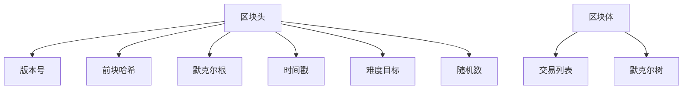

# 区块链基础 / Blockchain Fundamentals


<!-- TOC START -->

- [区块链基础 / Blockchain Fundamentals](#区块链基础-blockchain-fundamentals)
  - [目录](#目录)
  - [1. 知识梳理 / Knowledge Organization](#1-知识梳理-knowledge-organization)
    - [1.1 基本概念 / Basic Concepts](#11-基本概念-basic-concepts)
      - [1.1.1 区块链定义 / Blockchain Definition](#111-区块链定义-blockchain-definition)
      - [1.1.2 区块链架构 / Blockchain Architecture](#112-区块链架构-blockchain-architecture)
    - [1.2 共识机制 / Consensus Mechanisms](#12-共识机制-consensus-mechanisms)
      - [1.2.1 工作量证明 / Proof of Work (PoW)](#121-工作量证明-proof-of-work-pow)
      - [1.2.2 权益证明 / Proof of Stake (PoS)](#122-权益证明-proof-of-stake-pos)
      - [1.2.3 委托权益证明 / Delegated Proof of Stake (DPoS)](#123-委托权益证明-delegated-proof-of-stake-dpos)
    - [1.3 密码学基础 / Cryptographic Foundations](#13-密码学基础-cryptographic-foundations)
      - [1.3.1 哈希函数 / Hash Functions](#131-哈希函数-hash-functions)
      - [1.3.2 数字签名 / Digital Signatures](#132-数字签名-digital-signatures)
      - [1.3.3 默克尔树 / Merkle Trees](#133-默克尔树-merkle-trees)
    - [1.4 发展历程 / Development History](#14-发展历程-development-history)
      - [1.4.1 历史里程碑 / Historical Milestones](#141-历史里程碑-historical-milestones)
  - [2. 批判分析 / Critical Analysis](#2-批判分析-critical-analysis)
    - [2.1 主要争议 / Main Controversies](#21-主要争议-main-controversies)
      - [2.1.1 可扩展性问题 / Scalability Issues](#211-可扩展性问题-scalability-issues)
      - [2.1.2 能源消耗问题 / Energy Consumption Issues](#212-能源消耗问题-energy-consumption-issues)
      - [2.1.3 监管挑战 / Regulatory Challenges](#213-监管挑战-regulatory-challenges)
    - [2.2 理论局限性 / Theoretical Limitations](#22-理论局限性-theoretical-limitations)
      - [2.2.1 不可能三角 / Impossible Triangle](#221-不可能三角-impossible-triangle)
      - [2.2.2 拜占庭容错 / Byzantine Fault Tolerance](#222-拜占庭容错-byzantine-fault-tolerance)
    - [2.3 反思与重构 / Reflection and Reconstruction](#23-反思与重构-reflection-and-reconstruction)
      - [2.3.1 技术重构 / Technical Reconstruction](#231-技术重构-technical-reconstruction)
      - [2.3.2 治理重构 / Governance Reconstruction](#232-治理重构-governance-reconstruction)
  - [3. 形式化结构 / Formal Structure](#3-形式化结构-formal-structure)
    - [3.1 区块链状态机 / Blockchain State Machine](#31-区块链状态机-blockchain-state-machine)
      - [3.1.1 状态定义 / State Definition](#311-状态定义-state-definition)
      - [3.1.2 交易执行 / Transaction Execution](#312-交易执行-transaction-execution)
    - [3.2 共识协议 / Consensus Protocols](#32-共识协议-consensus-protocols)
      - [3.2.1 PBFT协议 / Practical Byzantine Fault Tolerance](#321-pbft协议-practical-byzantine-fault-tolerance)
      - [3.2.2 权益证明协议 / Proof of Stake Protocol](#322-权益证明协议-proof-of-stake-protocol)
    - [3.3 网络协议 / Network Protocols](#33-网络协议-network-protocols)
      - [3.3.1 P2P网络 / Peer-to-Peer Network](#331-p2p网络-peer-to-peer-network)
  - [4. 前沿趋势 / Frontier Trends](#4-前沿趋势-frontier-trends)
    - [4.1 可扩展性解决方案 / Scalability Solutions](#41-可扩展性解决方案-scalability-solutions)
      - [4.1.1 分片技术 / Sharding](#411-分片技术-sharding)
      - [4.1.2 第二层扩展 / Layer 2 Scaling](#412-第二层扩展-layer-2-scaling)
    - [4.2 互操作性 / Interoperability](#42-互操作性-interoperability)
      - [4.2.1 跨链协议 / Cross-Chain Protocols](#421-跨链协议-cross-chain-protocols)
    - [4.3 隐私保护 / Privacy Protection](#43-隐私保护-privacy-protection)
      - [4.3.1 零知识证明 / Zero-Knowledge Proofs](#431-零知识证明-zero-knowledge-proofs)
      - [4.3.2 环签名 / Ring Signatures](#432-环签名-ring-signatures)
  - [5. 工程实践 / Engineering Practice](#5-工程实践-engineering-practice)
    - [5.1 开发框架 / Development Frameworks](#51-开发框架-development-frameworks)
      - [5.1.1 以太坊开发 / Ethereum Development](#511-以太坊开发-ethereum-development)
      - [5.1.2 区块链节点 / Blockchain Nodes](#512-区块链节点-blockchain-nodes)
- [简化的比特币节点](#简化的比特币节点)
    - [5.2 性能优化 / Performance Optimization](#52-性能优化-performance-optimization)
      - [5.2.1 数据库优化 / Database Optimization](#521-数据库优化-database-optimization)
      - [5.2.2 网络优化 / Network Optimization](#522-网络优化-network-optimization)
    - [5.3 安全实践 / Security Practices](#53-安全实践-security-practices)
      - [5.3.1 智能合约安全 / Smart Contract Security](#531-智能合约安全-smart-contract-security)
      - [5.3.2 密钥管理 / Key Management](#532-密钥管理-key-management)
  - [6. 总结 / Summary](#6-总结-summary)
    - [主要成就 / Major Achievements](#主要成就-major-achievements)
    - [未来展望 / Future Prospects](#未来展望-future-prospects)

<!-- TOC END -->

## 目录

- [区块链基础 / Blockchain Fundamentals](#区块链基础--blockchain-fundamentals)
  - [目录](#目录)
  - [1. 知识梳理 / Knowledge Organization](#1-知识梳理--knowledge-organization)
    - [1.1 基本概念 / Basic Concepts](#11-基本概念--basic-concepts)
      - [1.1.1 区块链定义 / Blockchain Definition](#111-区块链定义--blockchain-definition)
      - [1.1.2 区块链架构 / Blockchain Architecture](#112-区块链架构--blockchain-architecture)
    - [1.2 共识机制 / Consensus Mechanisms](#12-共识机制--consensus-mechanisms)
      - [1.2.1 工作量证明 / Proof of Work (PoW)](#121-工作量证明--proof-of-work-pow)
      - [1.2.2 权益证明 / Proof of Stake (PoS)](#122-权益证明--proof-of-stake-pos)
      - [1.2.3 委托权益证明 / Delegated Proof of Stake (DPoS)](#123-委托权益证明--delegated-proof-of-stake-dpos)
    - [1.3 密码学基础 / Cryptographic Foundations](#13-密码学基础--cryptographic-foundations)
      - [1.3.1 哈希函数 / Hash Functions](#131-哈希函数--hash-functions)
      - [1.3.2 数字签名 / Digital Signatures](#132-数字签名--digital-signatures)
      - [1.3.3 默克尔树 / Merkle Trees](#133-默克尔树--merkle-trees)
    - [1.4 发展历程 / Development History](#14-发展历程--development-history)
      - [1.4.1 历史里程碑 / Historical Milestones](#141-历史里程碑--historical-milestones)
  - [2. 批判分析 / Critical Analysis](#2-批判分析--critical-analysis)
    - [2.1 主要争议 / Main Controversies](#21-主要争议--main-controversies)
      - [2.1.1 可扩展性问题 / Scalability Issues](#211-可扩展性问题--scalability-issues)
      - [2.1.2 能源消耗问题 / Energy Consumption Issues](#212-能源消耗问题--energy-consumption-issues)
      - [2.1.3 监管挑战 / Regulatory Challenges](#213-监管挑战--regulatory-challenges)
    - [2.2 理论局限性 / Theoretical Limitations](#22-理论局限性--theoretical-limitations)
      - [2.2.1 不可能三角 / Impossible Triangle](#221-不可能三角--impossible-triangle)
      - [2.2.2 拜占庭容错 / Byzantine Fault Tolerance](#222-拜占庭容错--byzantine-fault-tolerance)
    - [2.3 反思与重构 / Reflection and Reconstruction](#23-反思与重构--reflection-and-reconstruction)
      - [2.3.1 技术重构 / Technical Reconstruction](#231-技术重构--technical-reconstruction)
      - [2.3.2 治理重构 / Governance Reconstruction](#232-治理重构--governance-reconstruction)
  - [3. 形式化结构 / Formal Structure](#3-形式化结构--formal-structure)
    - [3.1 区块链状态机 / Blockchain State Machine](#31-区块链状态机--blockchain-state-machine)
      - [3.1.1 状态定义 / State Definition](#311-状态定义--state-definition)
      - [3.1.2 交易执行 / Transaction Execution](#312-交易执行--transaction-execution)
    - [3.2 共识协议 / Consensus Protocols](#32-共识协议--consensus-protocols)
      - [3.2.1 PBFT协议 / Practical Byzantine Fault Tolerance](#321-pbft协议--practical-byzantine-fault-tolerance)
      - [3.2.2 权益证明协议 / Proof of Stake Protocol](#322-权益证明协议--proof-of-stake-protocol)
    - [3.3 网络协议 / Network Protocols](#33-网络协议--network-protocols)
      - [3.3.1 P2P网络 / Peer-to-Peer Network](#331-p2p网络--peer-to-peer-network)
  - [4. 前沿趋势 / Frontier Trends](#4-前沿趋势--frontier-trends)
    - [4.1 可扩展性解决方案 / Scalability Solutions](#41-可扩展性解决方案--scalability-solutions)
      - [4.1.1 分片技术 / Sharding](#411-分片技术--sharding)
      - [4.1.2 第二层扩展 / Layer 2 Scaling](#412-第二层扩展--layer-2-scaling)
    - [4.2 互操作性 / Interoperability](#42-互操作性--interoperability)
      - [4.2.1 跨链协议 / Cross-Chain Protocols](#421-跨链协议--cross-chain-protocols)
    - [4.3 隐私保护 / Privacy Protection](#43-隐私保护--privacy-protection)
      - [4.3.1 零知识证明 / Zero-Knowledge Proofs](#431-零知识证明--zero-knowledge-proofs)
      - [4.3.2 环签名 / Ring Signatures](#432-环签名--ring-signatures)
  - [5. 工程实践 / Engineering Practice](#5-工程实践--engineering-practice)
    - [5.1 开发框架 / Development Frameworks](#51-开发框架--development-frameworks)
      - [5.1.1 以太坊开发 / Ethereum Development](#511-以太坊开发--ethereum-development)
      - [5.1.2 区块链节点 / Blockchain Nodes](#512-区块链节点--blockchain-nodes)
    - [5.2 性能优化 / Performance Optimization](#52-性能优化--performance-optimization)
      - [5.2.1 数据库优化 / Database Optimization](#521-数据库优化--database-optimization)
      - [5.2.2 网络优化 / Network Optimization](#522-网络优化--network-optimization)
    - [5.3 安全实践 / Security Practices](#53-安全实践--security-practices)
      - [5.3.1 智能合约安全 / Smart Contract Security](#531-智能合约安全--smart-contract-security)
      - [5.3.2 密钥管理 / Key Management](#532-密钥管理--key-management)
  - [6. 总结 / Summary](#6-总结--summary)
    - [主要成就 / Major Achievements](#主要成就--major-achievements)
    - [未来展望 / Future Prospects](#未来展望--future-prospects)

## 1. 知识梳理 / Knowledge Organization

### 1.1 基本概念 / Basic Concepts

#### 1.1.1 区块链定义 / Blockchain Definition

**形式化定义**：
区块链是一个分布式账本系统，由以下部分组成：

- **区块序列**：$B = (B_1, B_2, \ldots, B_n)$
- **哈希链接**：$H(B_i) = \text{hash}(B_{i-1} \| \text{data}_i \| \text{nonce}_i)$
- **共识机制**：确保所有节点对账本状态达成一致
- **密码学保护**：保证数据完整性和身份验证

**核心特征**：

- **去中心化**：无单一控制点
- **不可篡改**：历史数据不可修改
- **透明性**：所有交易公开可见
- **安全性**：基于密码学保证

#### 1.1.2 区块链架构 / Blockchain Architecture

**分层架构**：

```text
应用层 (Application Layer)
    ↓
合约层 (Contract Layer)
    ↓
共识层 (Consensus Layer)
    ↓
网络层 (Network Layer)
    ↓
数据层 (Data Layer)
```

**数据结构**：



### 1.2 共识机制 / Consensus Mechanisms

#### 1.2.1 工作量证明 / Proof of Work (PoW)

**定义**：节点通过解决数学难题来获得记账权

**难度调整**：
$$\text{Target} = \frac{\text{Previous Target} \times \text{Actual Time}}{\text{Expected Time}}$$

**挖矿过程**：
$$\text{hash}(\text{block header}) < \text{target}$$

**安全性**：
$$\text{Security} = \frac{\text{Hash Rate} \times \text{Block Time}}{2^{256}}$$

#### 1.2.2 权益证明 / Proof of Stake (PoS)

**定义**：节点根据持有代币数量和时间获得记账权

**权益计算**：
$$\text{Stake} = \text{Token Amount} \times \text{Time Lock}$$

**验证者选择**：
$$P(\text{selected}) = \frac{\text{Stake}}{\sum \text{Total Stake}}$$

#### 1.2.3 委托权益证明 / Delegated Proof of Stake (DPoS)

**定义**：代币持有者委托代表进行共识

**委托机制**：
$$\text{Delegates} = \text{Top N by Vote Count}$$

**轮换机制**：
$$\text{Block Producer} = \text{Delegates}[(\text{Block Height} \bmod N)]$$

### 1.3 密码学基础 / Cryptographic Foundations

#### 1.3.1 哈希函数 / Hash Functions

**SHA-256算法**：
$$\text{SHA-256}(m) = h$$

**性质**：

- **确定性**：相同输入产生相同输出
- **雪崩效应**：输入微小变化导致输出巨大变化
- **单向性**：无法从输出反推输入
- **抗碰撞性**：难以找到两个不同输入产生相同输出

#### 1.3.2 数字签名 / Digital Signatures

**签名生成**：
$$\sigma = \text{Sign}(sk, m)$$

**签名验证**：
$$\text{Verify}(pk, m, \sigma) = \text{True/False}$$

**椭圆曲线数字签名算法 (ECDSA)**：
$$r = (k \cdot G)_x \bmod n$$
$$s = k^{-1}(H(m) + r \cdot d) \bmod n$$

其中：

- $k$ 为随机数
- $G$ 为基点
- $d$ 为私钥
- $H(m)$ 为消息哈希

#### 1.3.3 默克尔树 / Merkle Trees

**构建过程**：
$$\text{Merkle Root} = H(H(tx_1 \| tx_2) \| H(tx_3 \| tx_4))$$

**验证路径**：
$$\text{Proof} = \{H(tx_2), H(H(tx_3 \| tx_4))\}$$

### 1.4 发展历程 / Development History

#### 1.4.1 历史里程碑 / Historical Milestones

| 年份 | 事件 | 影响 |
|------|------|------|
| 2008 | 中本聪发布比特币白皮书 | 区块链技术诞生 |
| 2009 | 比特币创世区块 | 第一个区块链网络 |
| 2013 | 以太坊概念提出 | 智能合约平台 |
| 2015 | 以太坊主网上线 | 可编程区块链 |
| 2017 | ICO热潮 | 代币经济兴起 |
| 2020 | DeFi爆发 | 去中心化金融 |
| 2021 | NFT热潮 | 数字资产新形式 |

## 2. 批判分析 / Critical Analysis

### 2.1 主要争议 / Main Controversies

#### 2.1.1 可扩展性问题 / Scalability Issues

**问题**：区块链交易处理能力有限
**数据**：

- 比特币：7 TPS
- 以太坊：15 TPS
- Visa：65,000 TPS

**解决方案**：

1. **分片技术**：将网络分割为多个子链
2. **第二层扩展**：Lightning Network, Plasma
3. **侧链技术**：与主链并行运行

#### 2.1.2 能源消耗问题 / Energy Consumption Issues

**PoW能耗**：
$$\text{Energy} = \text{Hash Rate} \times \text{Energy per Hash}$$

**环境影响**：

- 比特币年耗电量相当于阿根廷
- 碳足迹问题
- 可再生能源需求

#### 2.1.3 监管挑战 / Regulatory Challenges

**法律不确定性**：

- 代币法律地位
- 跨境监管
- 反洗钱合规

**监管框架**：

- 美国：SEC监管证券类代币
- 欧盟：MiCA框架
- 中国：全面禁止加密货币交易

### 2.2 理论局限性 / Theoretical Limitations

#### 2.2.1 不可能三角 / Impossible Triangle

**定理**：区块链系统无法同时满足去中心化、安全性和可扩展性。

**证明**：

1. **去中心化**：需要所有节点参与验证
2. **安全性**：需要足够的算力/权益
3. **可扩展性**：需要快速处理大量交易

这三个目标存在内在冲突，无法同时优化。

#### 2.2.2 拜占庭容错 / Byzantine Fault Tolerance

**定义**：在存在恶意节点的情况下，系统仍能达成共识。

**限制**：

- 需要超过2/3的节点是诚实的
- 通信复杂度高
- 延迟问题

### 2.3 反思与重构 / Reflection and Reconstruction

#### 2.3.1 技术重构 / Technical Reconstruction

**混合共识**：
$$\text{Hybrid Consensus} = \alpha \cdot \text{PoW} + \beta \cdot \text{PoS}$$

**分层架构**：

- **Layer 1**：基础共识层
- **Layer 2**：扩展层
- **Layer 3**：应用层

#### 2.3.2 治理重构 / Governance Reconstruction

**去中心化自治组织 (DAO)**：
$$\text{Proposal} = \text{Function}(\text{Votes}, \text{Stake})$$

**治理代币**：
$$\text{Governance Power} = f(\text{Token Balance}, \text{Lock Time})$$

## 3. 形式化结构 / Formal Structure

### 3.1 区块链状态机 / Blockchain State Machine

#### 3.1.1 状态定义 / State Definition

**全局状态**：
$$\sigma = (A, B, C)$$

其中：

- $A$ 为账户状态
- $B$ 为区块链状态
- $C$ 为共识状态

**状态转换**：
$$\sigma_{t+1} = \delta(\sigma_t, T)$$

其中 $T$ 为交易集合。

#### 3.1.2 交易执行 / Transaction Execution

**交易格式**：
$$tx = (from, to, value, data, nonce, signature)$$

**执行函数**：
$$\text{Execute}(tx, \sigma) = \sigma'$$

**有效性检查**：
$$\text{Valid}(tx, \sigma) = \text{True} \iff$$

1. $\text{Balance}(from) \geq value$
2. $\text{Nonce}(from) = tx.nonce$
3. $\text{Verify}(tx.signature) = \text{True}$

### 3.2 共识协议 / Consensus Protocols

#### 3.2.1 PBFT协议 / Practical Byzantine Fault Tolerance

**阶段1：预准备**
$$\text{Pre-prepare}(m, v, n, d)$$

**阶段2：准备**
$$\text{Prepare}(m, v, n, d, i)$$

**阶段3：提交**
$$\text{Commit}(m, v, n, d, i)$$

**安全性条件**：
$$\text{Safety} = |\text{Honest Nodes}| > 2f$$

其中 $f$ 为恶意节点数量。

#### 3.2.2 权益证明协议 / Proof of Stake Protocol

**验证者选择**：
$$P(v_i) = \frac{\text{Stake}_i}{\sum_{j=1}^n \text{Stake}_j}$$

**奖励分配**：
$$\text{Reward}_i = \text{Block Reward} \times \frac{\text{Stake}_i}{\text{Total Stake}}$$

### 3.3 网络协议 / Network Protocols

#### 3.3.1 P2P网络 / Peer-to-Peer Network

**节点发现**：
$$\text{Discover}() = \{peer_1, peer_2, \ldots, peer_n\}$$

**消息传播**：
$$\text{Broadcast}(msg) = \text{Flood}(msg, \text{Neighbors})$$

**同步机制**：
$$\text{Sync}(node_i, node_j) = \text{Exchange}(\text{Blockchain}_i, \text{Blockchain}_j)$$

## 4. 前沿趋势 / Frontier Trends

### 4.1 可扩展性解决方案 / Scalability Solutions

#### 4.1.1 分片技术 / Sharding

**水平分片**：
$$\text{Shard}_i = \{tx : \text{hash}(tx) \bmod n = i\}$$

**跨分片交易**：
$$\text{CrossShard}(tx) = \text{Atomic}(\text{Commit}(tx, \text{Shard}_i), \text{Commit}(tx, \text{Shard}_j))$$

#### 4.1.2 第二层扩展 / Layer 2 Scaling

**状态通道**：
$$\text{State Channel} = \text{OffChain}(\text{Updates}) + \text{OnChain}(\text{Final State})$$

**Rollup技术**：
$$\text{Rollup} = \text{Compress}(\text{Transactions}) + \text{Verify}(\text{Proof})$$

### 4.2 互操作性 / Interoperability

#### 4.2.1 跨链协议 / Cross-Chain Protocols

**原子交换**：
$$\text{Atomic Swap}(A, B) = \text{HTLC}(A, B) + \text{Timeout}(A, B)$$

**中继链**：
$$\text{Relay Chain} = \text{Validate}(\text{Parachain}_1, \text{Parachain}_2, \ldots)$$

### 4.3 隐私保护 / Privacy Protection

#### 4.3.1 零知识证明 / Zero-Knowledge Proofs

**zk-SNARK**：
$$\text{Proof} = \text{Prove}(\text{Statement}, \text{Witness})$$

**验证**：
$$\text{Verify}(\text{Statement}, \text{Proof}) = \text{True/False}$$

#### 4.3.2 环签名 / Ring Signatures

**签名生成**：
$$\sigma = \text{RingSign}(m, \text{Ring}, sk_i)$$

**验证**：
$$\text{RingVerify}(m, \sigma, \text{Ring}) = \text{True/False}$$

## 5. 工程实践 / Engineering Practice

### 5.1 开发框架 / Development Frameworks

#### 5.1.1 以太坊开发 / Ethereum Development

**Solidity智能合约**：

```solidity
// 简单代币合约
contract SimpleToken {
    mapping(address => uint256) public balanceOf;
    
    function transfer(address to, uint256 amount) public {
        require(balanceOf[msg.sender] >= amount);
        balanceOf[msg.sender] -= amount;
        balanceOf[to] += amount;
    }
}
```

#### 5.1.2 区块链节点 / Blockchain Nodes

**比特币节点**：

```python
# 简化的比特币节点
class BitcoinNode:
    def __init__(self):
        self.blockchain = []
        self.mempool = []
        self.peers = []
    
    def broadcast_transaction(self, tx):
        for peer in self.peers:
            peer.receive_transaction(tx)
    
    def mine_block(self):
        block = create_block(self.mempool)
        self.blockchain.append(block)
        self.broadcast_block(block)
```

### 5.2 性能优化 / Performance Optimization

#### 5.2.1 数据库优化 / Database Optimization

**UTXO模型**：
$$\text{UTXO} = \{(txid, vout, value, script)\}$$

**状态数据库**：
$$\text{StateDB} = \text{LevelDB}(\text{Key-Value Store})$$

#### 5.2.2 网络优化 / Network Optimization

**连接池**：
$$\text{Connection Pool} = \{\text{Peer}_1, \text{Peer}_2, \ldots, \text{Peer}_n\}$$

**消息压缩**：
$$\text{Compressed Message} = \text{Compress}(\text{Original Message})$$

### 5.3 安全实践 / Security Practices

#### 5.3.1 智能合约安全 / Smart Contract Security

**常见漏洞**：

1. **重入攻击**：函数调用外部合约时被恶意回调
2. **整数溢出**：数值计算超出范围
3. **访问控制**：权限检查不严格

**安全模式**：

```solidity
// 重入攻击防护
modifier nonReentrant() {
    require(!locked, "Reentrant call");
    locked = true;
    _;
    locked = false;
}
```

#### 5.3.2 密钥管理 / Key Management

**硬件钱包**：
$$\text{Private Key} = \text{Secure Element}(\text{Seed})$$

**多重签名**：
$$\text{MultiSig}(m, n) = \text{Require}(\text{Signatures} \geq m)$$

## 6. 总结 / Summary

区块链技术作为分布式账本系统的创新，在去中心化、透明性和安全性方面展现了独特优势。通过共识机制、密码学技术和网络协议，建立了完整的理论体系。

### 主要成就 / Major Achievements

1. **技术创新**：PoW、PoS等共识机制的发明
2. **应用拓展**：DeFi、NFT等新兴应用场景
3. **生态发展**：完整的开发工具和平台
4. **治理创新**：DAO等去中心化治理模式

### 未来展望 / Future Prospects

1. **可扩展性**：解决TPS限制问题
2. **互操作性**：实现跨链价值转移
3. **隐私保护**：增强交易隐私性
4. **监管合规**：建立合适的监管框架
