# SystemOSIOT 知识体系重构评价与建议


<!-- TOC START -->

- [SystemOSIOT 知识体系重构评价与建议](#systemosiot-知识体系重构评价与建议)
  - [SystemOSIOT Knowledge System Refactoring Evaluation and Recommendations](#systemosiot-knowledge-system-refactoring-evaluation-and-recommendations)
  - [1. 现状分析 / Current Status Analysis](#1-现状分析-current-status-analysis)
    - [1.1 文档覆盖度分析 / Document Coverage Analysis](#11-文档覆盖度分析-document-coverage-analysis)
    - [1.2 内容质量评估 / Content Quality Assessment](#12-内容质量评估-content-quality-assessment)
  - [2. 问题识别 / Problem Identification](#2-问题识别-problem-identification)
    - [2.1 结构性问题 / Structural Issues](#21-结构性问题-structural-issues)
    - [2.2 质量问题 / Quality Issues](#22-质量问题-quality-issues)
    - [2.3 实用性问题 / Practicality Issues](#23-实用性问题-practicality-issues)
  - [3. 改进建议 / Improvement Recommendations](#3-改进建议-improvement-recommendations)
    - [3.1 结构优化建议 / Structural Optimization](#31-结构优化建议-structural-optimization)
    - [3.2 内容增强建议 / Content Enhancement](#32-内容增强建议-content-enhancement)
    - [3.3 质量提升建议 / Quality Improvement](#33-质量提升建议-quality-improvement)
  - [4. 持续执行计划 / Continuous Execution Plan](#4-持续执行计划-continuous-execution-plan)
    - [4.1 短期目标 (1-3个月) / Short-term Goals](#41-短期目标-1-3个月-short-term-goals)
    - [4.2 中期目标 (3-6个月) / Medium-term Goals](#42-中期目标-3-6个月-medium-term-goals)
    - [4.3 长期目标 (6-12个月) / Long-term Goals](#43-长期目标-6-12个月-long-term-goals)
  - [5. 执行策略 / Execution Strategy](#5-执行策略-execution-strategy)
    - [5.1 资源分配 / Resource Allocation](#51-资源分配-resource-allocation)
    - [5.2 质量控制 / Quality Control](#52-质量控制-quality-control)
  - [6. 风险控制 / Risk Control](#6-风险控制-risk-control)
    - [6.1 技术风险 / Technical Risks](#61-技术风险-technical-risks)
    - [6.2 执行风险 / Execution Risks](#62-执行风险-execution-risks)
  - [7. 成功标准 / Success Criteria](#7-成功标准-success-criteria)
    - [7.1 量化指标 / Quantitative Metrics](#71-量化指标-quantitative-metrics)
    - [7.2 质化目标 / Qualitative Goals](#72-质化目标-qualitative-goals)
  - [8. 总结与展望 / Summary and Outlook](#8-总结与展望-summary-and-outlook)
    - [8.1 项目价值 / Project Value](#81-项目价值-project-value)
    - [8.2 未来展望 / Future Outlook](#82-未来展望-future-outlook)

<!-- TOC END -->

## SystemOSIOT Knowledge System Refactoring Evaluation and Recommendations

## 1. 现状分析 / Current Status Analysis

### 1.1 文档覆盖度分析 / Document Coverage Analysis

**已完成的核心模块：**

✅ **理论基础模块** (100% 完成)

- 系统科学基础 (15KB, 356行)
- 复杂性理论 (5KB, 115行)
- 控制论与信息论 (4KB, 101行)
- 形式语义学 (29KB, 805行)
- 集合论与逻辑 (18KB, 532行)
- 图论与网络 (21KB, 691行)
- 线性代数与优化 (26KB, 827行)

✅ **系统架构模块** (100% 完成)

- 进程管理 (28KB, 903行)
- 内存管理 (8.8KB, 265行)
- 文件系统 (13KB, 397行)
- 设备管理 (14KB, 450行)
- 分布式一致性协议 (28KB, 853行)
- 容错机制 (15KB, 474行)
- 分布式存储 (15KB, 485行)

✅ **网络与通信模块** (85% 完成)

- 网络协议基础 (36KB, 1130行)
- 网络安全 (19KB, 612行)
- 物联网协议 (26KB, 821行)
- 网络拓扑 (新创建)
- 网络性能 (新创建)
- P2P架构 (新创建)

✅ **容器与微服务模块** (75% 完成)

- 容器基础 (27KB, 878行)
- 服务拆分 (31KB, 908行)
- 服务通信 (27KB, 875行)
- 容器编排 (新创建)
- 容器安全 (新创建)
- 容器网络 (新创建)

✅ **量子计算模块** (100% 完成)

- 量子计算基础 (26KB, 781行)
- 量子算法 (14KB, 358行)

✅ **人工智能模块** (100% 完成)

- 机器学习基础 (32KB, 970行)
- 深度学习 (31KB, 1090行)
- 强化学习 (5.6KB, 158行)

### 1.2 内容质量评估 / Content Quality Assessment

**优势方面：**

1. **形式化程度高**：大量使用数学符号和形式化定义
2. **代码实现完整**：提供了Rust代码示例
3. **结构层次清晰**：从理论到实践的递进结构
4. **双语对照**：中英文对照便于国际化

**需要改进的方面：**

1. **部分模块深度不足**：某些文档内容相对浅显
2. **实践案例缺乏**：缺少真实工程案例
3. **交叉引用不足**：模块间关联性有待加强
4. **更新维护滞后**：部分内容需要更新

## 2. 问题识别 / Problem Identification

### 2.1 结构性问题 / Structural Issues

**目录结构混乱：**

- 存在重复编号的目录 (如16.智能体系统出现两次)
- 部分目录命名不一致
- 缺少统一的分类标准

**内容组织问题：**

- 部分文档内容过于理论化，缺乏实用性
- 模块间关联性不够明确
- 缺少整体架构图

### 2.2 质量问题 / Quality Issues

**内容深度问题：**

- 部分文档内容过于简单，缺乏深度分析
- 缺少批判性思考和不同观点的对比
- 实践指导不够具体

**技术时效性问题：**

- 部分技术内容可能已经过时
- 缺少最新技术发展趋势
- 新兴技术覆盖不足

### 2.3 实用性问题 / Practicality Issues

**工程实践不足：**

- 缺少真实项目案例
- 性能分析和优化内容不足
- 故障排查和调试指导缺乏

**可操作性差：**

- 缺少具体的实施步骤
- 配置示例不够详细
- 最佳实践总结不足

## 3. 改进建议 / Improvement Recommendations

### 3.1 结构优化建议 / Structural Optimization

**重新组织目录结构：**

```mermaid
graph TD
    A[SystemOSIOT知识体系] --> B[1.理论基础]
    A --> C[2.系统架构]
    A --> D[3.网络通信]
    A --> E[4.容器云原生]
    A --> F[5.人工智能]
    A --> G[6.量子计算]
    A --> H[7.边缘计算]
    A --> I[8.安全隐私]
    
    B --> B1[系统理论]
    B --> B2[数学基础]
    B --> B3[形式化方法]
    
    C --> C1[操作系统]
    C --> C2[分布式系统]
    C --> C3[微服务架构]
    
    D --> D1[网络协议]
    D --> D2[网络安全]
    D --> D3[P2P网络]
    
    E --> E1[容器技术]
    E --> E2[编排调度]
    E --> E3[服务网格]
    
    F --> F1[机器学习]
    F --> F2[深度学习]
    F --> F3[强化学习]
    
    G --> G1[量子算法]
    G --> G2[量子通信]
    G --> G3[量子安全]
    
    H --> H1[边缘节点]
    H --> H2[边缘智能]
    H --> H3[边缘安全]
    
    I --> I1[密码学]
    I --> I2[隐私计算]
    I --> I3[安全审计]
```



### 3.2 内容增强建议 / Content Enhancement

**增加实践案例：**

1. **真实项目案例**：添加知名开源项目的分析
2. **性能基准测试**：提供各种技术的性能对比
3. **故障排查指南**：详细的故障诊断和解决方案
4. **最佳实践总结**：行业最佳实践的汇总

**加强理论深度：**

1. **批判性分析**：对每种技术进行优缺点分析
2. **对比研究**：不同技术方案的对比分析
3. **发展趋势**：技术演进路径和未来展望
4. **学术引用**：增加学术论文和研究成果的引用

### 3.3 质量提升建议 / Quality Improvement

**标准化文档格式：**

```yaml
文档结构标准:
  标题: 中英文对照
  概述: 核心概念和重要性
  理论基础: 数学定义和形式化描述
  技术实现: 代码示例和算法
  实践应用: 真实案例和最佳实践
  性能分析: 基准测试和优化建议
  安全考虑: 安全威胁和防护措施
  发展趋势: 技术演进和未来展望
  参考文献: 学术论文和技术文档
```

**增加交互性内容：**

1. **可执行代码**：提供完整的可运行代码示例
2. **交互式图表**：使用Mermaid等工具创建动态图表
3. **在线演示**：关键概念的在线演示链接
4. **讨论论坛**：建立技术讨论和问答平台

## 4. 持续执行计划 / Continuous Execution Plan

### 4.1 短期目标 (1-3个月) / Short-term Goals

**第一阶段：基础完善**:

- [ ] 修复目录结构问题
- [ ] 补充缺失的核心文档
- [ ] 统一文档格式标准
- [ ] 建立质量检查机制

**第二阶段：内容深化**:

- [ ] 增加实践案例和工程应用
- [ ] 加强模块间交叉引用
- [ ] 补充性能分析和优化内容
- [ ] 添加故障排查指南

**第三阶段：质量提升**:

- [ ] 进行同行评审和技术验证
- [ ] 收集用户反馈并迭代改进
- [ ] 建立版本控制和更新机制
- [ ] 完善文档维护流程

### 4.2 中期目标 (3-6个月) / Medium-term Goals

**技术前沿覆盖：**

- [ ] 量子计算和量子网络
- [ ] 边缘计算和边缘智能
- [ ] 隐私计算和联邦学习
- [ ] 服务网格和云原生

**实践应用增强：**

- [ ] 大型分布式系统案例分析
- [ ] 高并发系统设计模式
- [ ] 微服务架构最佳实践
- [ ] 容器化部署和运维

**社区建设：**

- [ ] 建立技术讨论社区
- [ ] 组织技术分享活动
- [ ] 与开源项目合作
- [ ] 建立贡献者激励机制

### 4.3 长期目标 (6-12个月) / Long-term Goals

**知识体系完善：**

- [ ] 形成完整的知识图谱
- [ ] 建立技术演进路线图
- [ ] 开发智能推荐系统
- [ ] 构建学习路径规划

**影响力提升：**

- [ ] 成为行业技术标准参考
- [ ] 建立技术认证体系
- [ ] 举办技术大会和研讨会
- [ ] 出版技术书籍和论文

**生态建设：**

- [ ] 与高校和研究机构合作
- [ ] 建立企业技术联盟
- [ ] 开发开源工具和框架
- [ ] 形成技术人才培养体系

## 5. 执行策略 / Execution Strategy

### 5.1 资源分配 / Resource Allocation

**人力资源：**

- 核心团队：3-5名技术专家
- 贡献者：10-20名社区成员
- 评审专家：5-10名行业专家

**技术资源：**

- 开发环境：GitHub + CI/CD
- 文档平台：GitBook + Notion
- 协作工具：Slack + Discord
- 监控工具：Google Analytics

**时间安排：**

- 每周固定时间进行内容更新
- 每月进行质量检查和改进
- 每季度进行大规模重构
- 每年进行整体评估和规划

### 5.2 质量控制 / Quality Control

**评审机制：**

- 技术内容同行评审
- 代码示例功能测试
- 文档可读性评估
- 用户反馈收集分析

**更新策略：**

- 定期技术趋势分析
- 及时更新过时内容
- 持续优化文档结构
- 动态调整优先级

**监控指标：**

- 文档完整度：目标 > 95%
- 内容质量评分：目标 > 4.5/5
- 用户满意度：目标 > 90%
- 社区活跃度：目标持续增长

## 6. 风险控制 / Risk Control

### 6.1 技术风险 / Technical Risks

**内容过时风险：**

- 建立技术趋势监控机制
- 定期更新技术内容
- 与行业专家保持联系
- 参与技术会议和研讨会

**质量下降风险：**

- 建立严格的质量检查流程
- 定期进行内容评审
- 收集用户反馈并改进
- 建立版本回滚机制

### 6.2 执行风险 / Execution Risks

**资源不足风险：**

- 合理分配人力资源
- 建立志愿者激励机制
- 寻求外部合作支持
- 分阶段实施计划

**进度延迟风险：**

- 制定详细的时间计划
- 建立里程碑检查点
- 及时调整执行策略
- 保持灵活性和适应性

## 7. 成功标准 / Success Criteria

### 7.1 量化指标 / Quantitative Metrics

**内容指标：**

- 文档总数：目标 > 200篇
- 代码示例：目标 > 1000个
- 实践案例：目标 > 50个
- 参考文献：目标 > 500个

**质量指标：**

- 技术准确性：目标 > 99%
- 内容完整性：目标 > 95%
- 用户满意度：目标 > 90%
- 社区活跃度：目标持续增长

**影响力指标：**

- GitHub星标：目标 > 1000
- 社区成员：目标 > 500
- 技术引用：目标 > 100
- 行业认可：目标建立权威地位

### 7.2 质化目标 / Qualitative Goals

**技术影响力：**

- 成为系统架构设计的重要参考
- 建立技术标准和发展方向
- 培养技术人才和专家
- 推动行业技术进步

**社区价值：**

- 建立活跃的技术社区
- 促进知识分享和交流
- 支持开源项目发展
- 推动产学研合作

## 8. 总结与展望 / Summary and Outlook

### 8.1 项目价值 / Project Value

**学术价值：**

- 系统化整理计算机科学知识
- 建立形式化的技术描述体系
- 促进跨学科技术融合
- 推动理论创新和实践应用

**工程价值：**

- 提供实用的技术指导
- 降低技术学习成本
- 提高系统设计质量
- 促进技术标准化

**社会价值：**

- 推动技术普及和教育
- 促进技术人才成长
- 支持产业数字化转型
- 推动科技创新发展

### 8.2 未来展望 / Future Outlook

**技术发展方向：**

- 量子计算和量子网络
- 边缘计算和边缘智能
- 隐私计算和联邦学习
- 服务网格和云原生

**应用领域扩展：**

- 物联网和智能制造
- 金融科技和区块链
- 医疗健康和生物信息
- 能源交通和智慧城市

**生态建设目标：**

- 建立技术标准联盟
- 形成人才培养体系
- 推动产学研合作
- 促进国际技术交流

---

> SystemOSIOT知识体系重构是一个持续演进的过程，需要不断适应技术发展和社会需求。通过系统性的规划、严格的执行和持续的改进，我们有信心将其建设成为计算机科学领域的重要知识宝库。
> The SystemOSIOT knowledge system refactoring is a continuous evolution process that needs to constantly adapt to technological development and social needs. Through systematic planning, strict execution, and continuous improvement, we are confident in building it into an important knowledge treasure in the field of computer science.
