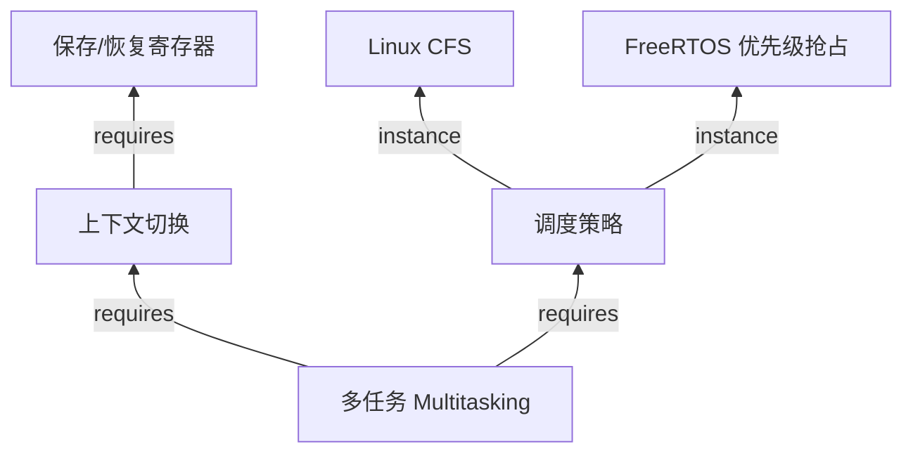
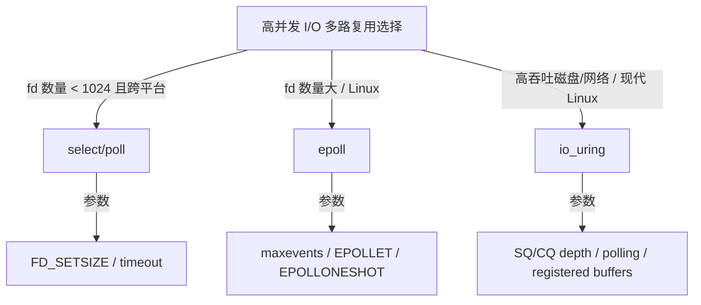

# 概念分析六类模板

本文件定义操作系统、Linux、嵌入式/物联网主题的统一概念分析格式。所有新建的概念分析文件应至少包含以下六类工件之一，并尽量在同一文件中交叉引用。

---

## 1. 概念树（Concept Tree）

**目的**：展示概念之间的上下位、整体-部分、抽象-实例关系。

**格式要求**：

- 使用 Mermaid `graph TD` 或嵌套 Markdown 列表。
- 每个节点标注：概念名（Concept）| 缩写 | 一句话定义。
- 边标注关系类型：`is-a`（泛化）、`part-of`（组成）、`instance-of`（实例）、`depends-on`（依赖）。

**示例结构**：

```markdown
    ```mermaid
    graph TD
        A[操作系统 OS] -->|is-a| B[系统软件]
        A -->|part-of| C[内核 Kernel]
        C -->|part-of| D[进程调度器]
        D -->|depends-on| E[中断机制]
        D -->|instance-of| F[Linux CFS]
    ```

```

---

## 2. 属性-关系映射（Attribute-Relationship Mapping）

**目的**：为每个概念建立可检索的属性集和关系集，支撑形式化定义。

**格式要求**：

- 表格三列：属性/关系名 | 类型/取值范围 | 说明与约束。
- 对关键关系给出数学符号，例如：
  - 进程状态 `s ∈ {new, ready, running, waiting, terminated}`
  - 调度器 `Scheduler = (ReadyQueue, Policy, ContextSwitch)`

**示例**：

| 概念 | 属性/关系 | 类型/取值 | 说明 |
|------|-----------|-----------|------|
| Process | pid | ℕ | 唯一标识 |
| Process | state | StateSet | 生命周期状态 |
| Process | address_space | AddressSpace | 虚拟地址空间 |
| Process | parent_of | Process → Process | 父子关系，构成进程树 |

---

## 3. 机制组合树（Mechanism Composition Tree）

**目的**：解释“底层机制如何组合成系统能力/性质”。

**格式要求**：

- 根节点为系统能力（如多任务、虚拟内存、实时性）。
- 子节点为机制（如上下文切换、页表、中断、优先级调度）。
- 叶子节点为具体实现或硬件支持（如 TLB、MMU、定时器）。
- 每条边标注组合语义：例如 `enables`、`requires`、`combines-with`。

**示例**：

```markdown


```

---

## 4. 依赖树（Dependency Tree）

**目的**：明确学习、实现、部署的前置-后置关系。

**格式要求**：
- 使用 Mermaid `graph LR` 或层级列表。
- 边类型：
  - `hard-depends-on`：没有前者就无法实现后者（如实分页依赖 MMU）。
  - `soft-depends-on`：建议先理解前者（如线程依赖进程概念）。
  - `enables`：前者使后者成为可能。

**示例**：

```markdown


```

---

## 5. 场景分析树（Scenario Analysis Tree）

**目的**：把抽象概念落地到具体工程场景，给出负载特征、机制选择、参数调优、验证指标。

**格式要求**：
- 五层展开：场景 → 负载特征 → 可选机制 → 关键参数 → SLO/验证指标。
- 用表格或 Mermaid 树表示。
- 每个场景给出 1~3 个真实系统实例。

**示例**：

| 场景 | 负载特征 | 机制选择 | 关键参数 | SLO/验证指标 |
|------|----------|----------|----------|--------------|
| 高并发 Web 服务器 | 大量短连接、I/O 密集 | epoll/io_uring + CFS | somaxconn, scheduler latency | P99 延迟 < 10ms |
| 工业实时控制 | 周期性硬实时任务 | SCHED_FIFO / RTOS | 周期、WCET、优先级 | 截止时间满足率 100% |

---

## 6. 国际来源映射表（International Source Mapping）

**目的**：把每个概念/机制锚定到权威教材、课程、标准、源码。

**格式要求**：
- 表格：概念/机制 | 来源类型 | 来源标识 | 具体章节/条款/源码路径 | 覆盖状态。
- 来源类型包括：Textbook、Course、Standard、SourceCode、RFC、Datasheet、Paper。

**示例**：

| 概念 | 来源类型 | 来源 | 位置 | 状态 |
|------|----------|------|------|------|
| 进程状态 | Textbook | OSTEP | Ch. 4 The Abstraction: The Process | 已覆盖 |
| CFS | SourceCode | Linux Kernel | kernel/sched/fair.c | 已覆盖 |
| POSIX 线程 | Standard | POSIX.1-2024 | §2.9 Threads | 已覆盖 |
| TCP 拥塞控制 | RFC | IETF | RFC 2581 | 已覆盖 |
| I2C 时序 | Datasheet | NXP | I2C-bus Specification | 已覆盖 |

---

## 7. 接口层映射（Interface Layer Mapping）

**目的**：明确“用户 API → 标准/ABI → 系统调用 → 内核子系统 → 驱动 → 硬件寄存器”的跨层接口对应关系。

**格式要求**：
- 表格：层级 | 接口名 | 关键数据结构/函数 | 下一层入口。
- 对每个关键接口给出调用约定、参数、返回值、错误码。

**示例**：

| 层级 | 接口 | 关键元素 | 下一层入口 |
|------|------|----------|------------|
| 用户态 | glibc `write()` | `ssize_t write(int fd, const void *buf, size_t count)` | `syscall(SYS_write)` |
| 系统调用 | `sys_write` | `SYSCALL_DEFINE3(write, ...)` | `vfs_write()` |
| VFS | `vfs_write` | `struct file *`, `struct inode *` | `file->f_op->write_iter()` |
| 文件系统 | ext4 `write_iter` | `ext4_file_write_iter()` | page cache / journal |
| 块层 | `submit_bio` | `struct bio` | NVMe/SATA 驱动 |
| 硬件 | DMA | `dma_map_sg()` | SSD/NAND 控制器 |

---

## 8. 决策树 / 场景分析树（Decision Tree / Scenario Analysis Tree）

**目的**：把抽象概念落地到工程决策，给出问题 → 约束 → 候选方案 → 关键参数 → 验证指标 → 典型系统。

**格式要求**：
- 使用 Mermaid `graph TD` 或表格。
- 每个决策节点标注判断条件。
- 每个叶子节点给出：推荐方案、关键参数、SLO/验证指标、典型系统实例。

**示例结构**：

```markdown


```

**表格模板**：

| 场景 | 约束/负载 | 候选方案 | 关键参数 | 验证指标 | 典型系统 |
|------|-----------|----------|----------|----------|----------|
| 高并发 Web 服务器 | 大量长连接，低延迟 | epoll/io_uring | somaxconn, busy_poll, iodepth | P99 延迟, 99th 吞吐 | Nginx/Envoy |
| 工业实时控制 | 硬实时，周期性任务 | SCHED_FIFO / RTOS | 周期, WCET, 优先级 | 截止时间满足率 | FreeRTOS/Zephyr |

---

## 9. 跨层映射图（Cross-Layer Mapping）

**目的**：展示一个完整用户操作经过的所有软件/硬件层次。

**格式要求**：
- 使用 Mermaid `graph LR` 从左到右展示层次。
- 每层标注关键数据结构、函数、设备/协议。
- 文末给出关键路径的时延/开销分析。

**示例**：

```markdown


```

---

## 文件命名与目录约定

- 概念树文件：`concept-tree-<domain>.md`
- 属性-关系映射：`attribute-relationship-map-<domain>.md`
- 机制组合树：`mechanism-composition-tree-<domain>.md`
- 依赖树：`dependency-tree-<domain>.md`
- 场景分析树：`scenario-analysis-tree-<domain>.md`
- 国际来源映射：`source-mapping-<domain>.md`

其中 `<domain>` 可为 `os`、`linux`、`embedded-linux`、`rtos`、`iot-embedded` 等。

---

## 交叉引用约定

- 同一主题内的六类文件通过相对路径互相链接，例如：
  - `参见 [属性-关系映射](./attribute-relationship-map-os.md)`
- 跨主题通过根相对路径链接：
  - `参见 [Linux 进程调度](../05-linux-kernel/process-scheduling-linux.md)`
- 术语首次出现时给出英文原文，并在文末建立术语表。
