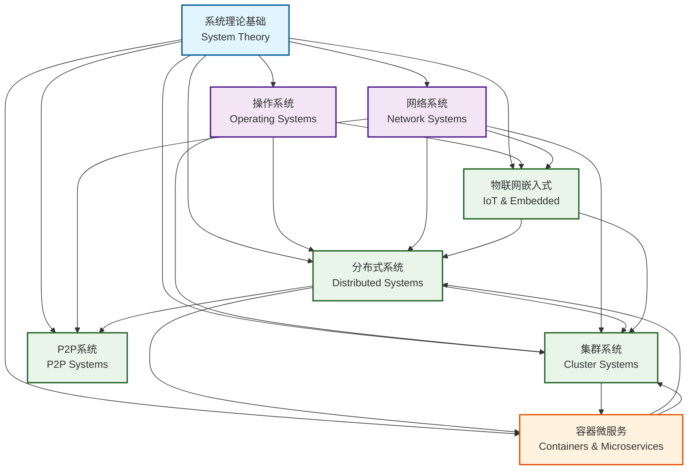
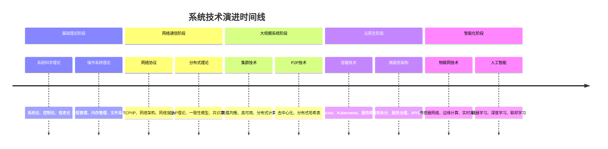

# SystemOSIOT领域关系图 / Domain Relationship Map

```text
title: SystemOSIOT领域关系图
description: 展示SystemOSIOT项目各个核心系统领域之间的关联关系和依赖关系
author: SystemOSIOT Team
created: 2024-12-19
updated: 2024-12-19
tags: [navigation, domain-map, system-architecture, relationships]
difficulty: intermediate
prerequisites: [系统理论基础]
related: [main-index.md, 项目结构优化分析报告.md]
```

## 🗺️ 领域关系总览 / Domain Relationship Overview

SystemOSIOT项目包含8个核心系统领域，这些领域相互关联、相互支撑，形成了一个完整的系统科学知识体系。以下是各个领域之间的详细关系图。

## 🔗 核心领域关联图 / Core Domain Relationships

### 整体关系图 / Overall Relationship Diagram



### 详细依赖关系 / Detailed Dependency Relationships

#### 1. 系统理论基础 (System Theory Foundation)

**核心地位**: 所有其他领域的基础理论支撑

**支撑关系**:

- → 操作系统: 提供系统科学理论基础
- → 分布式系统: 提供系统架构和控制理论
- → 集群系统: 提供系统组织和协调理论
- → 物联网系统: 提供系统集成和互操作理论
- → 网络系统: 提供系统通信和协议理论

#### 2. 操作系统 (Operating Systems)

**基础支撑**: 为其他系统领域提供基础运行环境

**支撑关系**:

- → 分布式系统: 提供进程管理、内存管理基础
- → 集群系统: 提供资源管理和调度基础
- → 物联网系统: 提供实时系统和嵌入式基础
- → 容器微服务: 提供虚拟化和隔离基础

**依赖关系**:

- ← 系统理论: 依赖系统科学理论指导

#### 3. 网络系统 (Network Systems)

**通信基础**: 为分布式和集群系统提供通信支撑

**支撑关系**:

- → 分布式系统: 提供网络通信和协议支持
- → 集群系统: 提供集群间通信支持
- → P2P系统: 提供P2P网络协议支持
- → 物联网系统: 提供物联网通信协议支持

**依赖关系**:

- ← 系统理论: 依赖系统通信理论
- ← 操作系统: 依赖网络栈和协议栈

#### 4. 分布式系统 (Distributed Systems)

**架构核心**: 现代系统架构的核心技术

**支撑关系**:

- → 集群系统: 提供分布式架构基础
- → P2P系统: 提供分布式组织基础
- → 容器微服务: 提供微服务架构基础
- → 物联网系统: 提供分布式IoT架构

**依赖关系**:

- ← 系统理论: 依赖系统架构和控制理论
- ← 操作系统: 依赖进程和内存管理
- ← 网络系统: 依赖网络通信协议

#### 5. 集群系统 (Cluster Systems)

**扩展技术**: 分布式系统的高性能扩展

**支撑关系**:

- → 容器微服务: 提供集群部署和调度支持
- → 高性能计算: 提供并行计算支持

**依赖关系**:

- ← 系统理论: 依赖系统组织和协调理论
- ← 操作系统: 依赖资源管理
- ← 网络系统: 依赖集群通信
- ← 分布式系统: 依赖分布式架构

#### 6. P2P系统 (P2P Systems)

**去中心化**: 分布式系统的去中心化实现

**支撑关系**:

- → 区块链系统: 提供去中心化基础
- → 分布式存储: 提供P2P存储架构

**依赖关系**:

- ← 系统理论: 依赖系统组织理论
- ← 网络系统: 依赖P2P网络协议
- ← 分布式系统: 依赖分布式架构

#### 7. 物联网嵌入式系统 (IoT & Embedded Systems)

**应用领域**: 系统技术在物联网领域的应用

**支撑关系**:

- → 智慧城市: 提供IoT基础设施
- → 工业4.0: 提供智能制造基础
- → 边缘计算: 提供边缘节点基础

**依赖关系**:

- ← 系统理论: 依赖系统集成理论
- ← 操作系统: 依赖实时系统
- ← 网络系统: 依赖IoT通信协议
- ← 分布式系统: 依赖分布式IoT架构

#### 8. 容器与微服务 (Containers & Microservices)

**现代架构**: 云原生时代的系统架构技术

**支撑关系**:

- → 云原生应用: 提供容器化部署基础
- → DevOps实践: 提供自动化部署基础
- → 服务网格: 提供服务治理基础

**依赖关系**:

- ← 系统理论: 依赖系统架构理论
- ← 操作系统: 依赖虚拟化和隔离
- ← 分布式系统: 依赖微服务架构
- ← 集群系统: 依赖集群部署和调度

## 🔄 技术演进路径 / Technology Evolution Path

### 技术发展脉络 / Technology Development Context



### 技术栈层次 / Technology Stack Layers

```text
┌─────────────────────────────────────────────────────────┐
│                    应用层 (Application Layer)              │
├─────────────────────────────────────────────────────────┤
│                微服务层 (Microservices Layer)             │
├─────────────────────────────────────────────────────────┤
│                容器层 (Container Layer)                   │
├─────────────────────────────────────────────────────────┤
│                编排层 (Orchestration Layer)               │
├─────────────────────────────────────────────────────────┤
│                集群层 (Cluster Layer)                     │
├─────────────────────────────────────────────────────────┤
│              分布式层 (Distributed Layer)                 │
├─────────────────────────────────────────────────────────┤
│                网络层 (Network Layer)                     │
├─────────────────────────────────────────────────────────┤
│              操作系统层 (Operating System Layer)           │
├─────────────────────────────────────────────────────────┤
│                理论层 (Theory Layer)                      │
└─────────────────────────────────────────────────────────┘
```

## 🎯 学习路径规划 / Learning Path Planning

### 基础学习路径 / Basic Learning Path

1. **系统理论基础** → 建立系统科学思维
2. **操作系统基础** → 理解系统运行机制
3. **网络通信基础** → 掌握通信原理
4. **分布式系统入门** → 理解分布式概念

### 进阶学习路径 / Advanced Learning Path

1. **集群和P2P技术** → 掌握大规模系统
2. **容器和微服务** → 学习现代架构
3. **物联网和边缘计算** → 了解新兴领域
4. **系统性能优化** → 深入性能分析

### 专业学习路径 / Professional Learning Path

1. **系统架构设计** → 成为架构师
2. **DevOps和云原生** → 掌握云技术
3. **系统安全和可靠性** → 成为安全专家
4. **前沿技术研究** → 推动技术创新

## 🔍 交叉引用索引 / Cross-Reference Index

### 理论交叉引用 / Theoretical Cross-References

- **系统控制论** → 分布式控制、集群调度、智能控制
- **系统优化论** → 性能优化、负载均衡、资源调度
- **系统可靠性** → 容错机制、故障恢复、高可用性
- **系统安全性** → 网络安全、数据保护、访问控制

### 技术交叉引用 / Technical Cross-References

- **分布式算法** → 一致性算法、共识算法、路由算法
- **网络协议** → 通信协议、安全协议、IoT协议
- **容器技术** → 虚拟化、隔离、编排、服务网格
- **边缘计算** → 实时处理、本地计算、边缘智能

### 应用交叉引用 / Application Cross-References

- **微服务架构** → 服务拆分、服务通信、服务治理
- **高可用系统** → 故障检测、自动恢复、负载均衡
- **实时系统** → 实时调度、确定性保证、性能分析
- **安全系统** → 威胁检测、防护措施、应急响应

## 🚀 未来发展方向 / Future Development Directions

### 技术融合趋势 / Technology Convergence Trends

1. **AI与系统集成** → 智能化的系统管理和优化
2. **量子计算应用** → 量子算法在系统中的应用
3. **边缘计算扩展** → 边缘智能和边缘AI
4. **区块链集成** → 去中心化的系统架构

### 新兴应用领域 / Emerging Application Areas

1. **数字孪生** → 物理系统的数字映射
2. **元宇宙系统** → 虚拟世界的系统架构
3. **脑机接口** → 人机融合的系统技术
4. **量子互联网** → 量子通信网络系统

---

> 本领域关系图展示了SystemOSIOT项目各个核心领域之间的复杂关联关系，为理解系统科学知识体系提供了清晰的脉络。
> This domain relationship map shows the complex relationships between various core domains of the SystemOSIOT project, providing a clear context for understanding the system science knowledge system.
