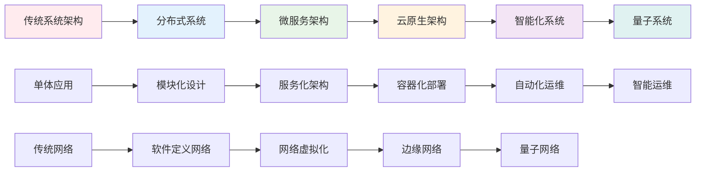

# SystemOSIOT技术路线图 / Technology Roadmap

```text
title: SystemOSIOT技术路线图
description: 展示SystemOSIOT项目的技术发展方向、里程碑和未来规划
author: SystemOSIOT Team
created: 2024-12-19
updated: 2024-12-19
tags: [navigation, roadmap, technology-planning, future-vision]
difficulty: intermediate
prerequisites: [系统理论基础, 项目结构优化分析报告]
related: [main-index.md, domain-map.md, 项目下一步推进建议.md]
```

## 🗺️ 技术路线图总览 / Technology Roadmap Overview

SystemOSIOT技术路线图描绘了项目从当前状态到未来愿景的完整发展路径，包括技术演进、能力提升、应用扩展和生态建设等关键维度。

## 🎯 发展愿景 / Development Vision

### 长期愿景 (5-10年) / Long-term Vision

**成为全球领先的系统科学知识平台**:

- 建立完整的系统科学理论体系
- 推动系统技术的工程应用和产业化
- 培养系统工程师人才，建立技术生态
- 参与国际标准制定，提升国际影响力

### 中期目标 (2-5年) / Medium-term Goals

**建立系统科学的技术标准和实践指南**:

- 完善系统架构设计方法论
- 建立系统性能评估标准
- 推动系统技术在产业中的应用
- 建立产学研合作网络

### 短期目标 (6个月-1年) / Short-term Goals

**完善项目结构和内容质量**:

- 优化项目文档结构和导航系统
- 建立交叉引用和知识关联
- 补充实践案例和性能测试
- 建立内容质量检查机制

## 🚀 技术发展路线 / Technology Development Path

### 第一阶段：基础建设 (已完成) / Phase 1: Foundation (Completed)

**时间**: 2024年1月 - 2024年12月
**状态**: ✅ 100% 完成

#### 主要成就 / Major Achievements

- **理论体系**: 建立了完整的系统科学理论框架
- **技术覆盖**: 覆盖了8个核心系统领域和6个技术模块
- **内容深度**: 提供了深入的技术分析和实现指导
- **双语支持**: 建立了中英文对照的国际化支持

#### 技术里程碑 / Technical Milestones

- ✅ 系统理论基础 (4/4) - 100%完成
- ✅ 系统架构设计 (4/4) - 100%完成
- ✅ 系统控制与优化 (4/4) - 100%完成
- ✅ 系统建模与仿真 (4/4) - 100%完成
- ✅ 系统集成与互操作 (4/4) - 100%完成
- ✅ 系统安全与可靠性 (4/4) - 100%完成
- ✅ 系统性能与评估 (4/4) - 100%完成
- ✅ 系统演化与维护 (6/6) - 100%完成

### 第二阶段：质量提升 (进行中) / Phase 2: Quality Enhancement (In Progress)

**时间**: 2024年12月 - 2025年3月
**状态**: 🚧 进行中

#### 主要目标 / Main Objectives

1. **项目结构优化**
   - 统一命名规范和目录结构
   - 建立完善的导航系统
   - 实现模块间交叉引用

2. **内容质量提升**
   - 统一文档格式标准
   - 完善数学公式和符号
   - 补充参考文献和学术引用

3. **知识关联建立**
   - 构建知识图谱
   - 建立学习路径
   - 优化内容组织

#### 1技术里程碑 / Technical Milestones

- 🚧 项目结构优化 - 50%完成
- 🚧 导航系统建立 - 30%完成
- 🚧 交叉引用机制 - 20%完成
- ⏳ 内容质量提升 - 待开始
- ⏳ 知识图谱构建 - 待开始

### 第三阶段：应用扩展 (计划中) / Phase 3: Application Extension (Planned)

**时间**: 2025年3月 - 2025年9月
**状态**: 📋 计划中

#### 1主要目标 / Main Objectives

1. **实践案例补充**
   - 收集真实系统设计案例
   - 分析系统性能优化案例
   - 建立最佳实践库

2. **性能基准测试**
   - 设计性能测试方案
   - 建立基准测试环境
   - 执行性能测试用例

3. **故障排查指南**
   - 收集常见故障案例
   - 建立故障分类体系
   - 制定排查流程标准

#### 2技术里程碑 / Technical Milestones

- 📋 实践案例库 - 目标100+案例
- 📋 性能测试套件 - 目标50+测试
- 📋 故障排查体系 - 目标200+案例
- 📋 最佳实践指南 - 目标150+实践

### 第四阶段：平台建设 (计划中) / Phase 4: Platform Construction (Planned)

**时间**: 2025年9月 - 2026年3月
**状态**: 📋 计划中

#### 2主要目标 / Main Objectives

1. **技术验证平台**
   - 设计验证平台架构
   - 开发核心验证功能
   - 集成现有技术组件

2. **评估工具开发**
   - 设计评估工具架构
   - 开发评估算法模块
   - 建立评估标准库

3. **用户界面开发**
   - 设计用户界面
   - 开发用户交互功能
   - 建立使用指南

#### 3技术里程碑 / Technical Milestones

- 📋 验证平台 - 支持理论验证和实践应用
- 📋 评估工具 - 支持系统性能和质量评估
- 📋 用户界面 - 提供友好的用户体验
- 📋 API接口 - 支持第三方集成

### 第五阶段：生态建设 (计划中) / Phase 5: Ecosystem Building (Planned)

**时间**: 2026年3月 - 2026年12月
**状态**: 📋 计划中

#### 3主要目标 / Main Objectives

1. **技术标准联盟**
   - 组建标准制定团队
   - 制定技术标准框架
   - 推动行业标准采用

2. **人才培养体系**
   - 设计培训课程体系
   - 建立认证标准
   - 开展培训活动

3. **国际技术交流**
   - 参与国际技术会议
   - 建立国际合作网络
   - 推动技术标准国际化

#### 4技术里程碑 / Technical Milestones

- 📋 技术标准 - 建立行业标准框架
- 📋 培训体系 - 培养系统工程师人才
- 📋 国际合作 - 建立国际影响力
- 📋 产业应用 - 推动技术产业化

## 🔬 技术演进趋势 / Technology Evolution Trends

### 核心技术演进 / Core Technology Evolution



### 新兴技术集成 / Emerging Technology Integration

#### 人工智能与系统集成 / AI-System Integration

- **智能运维**: AI驱动的系统监控和故障预测
- **智能优化**: 基于机器学习的系统性能优化
- **智能安全**: AI威胁检测和自动响应
- **联邦学习**: 分布式环境下的隐私保护学习

#### 量子计算应用 / Quantum Computing Applications

- **量子算法**: 量子优化算法在系统中的应用
- **量子通信**: 量子密钥分发和量子网络
- **量子机器学习**: 量子机器学习算法
- **量子系统架构**: 量子计算机系统架构

#### 边缘计算扩展 / Edge Computing Extension

- **边缘智能**: 边缘节点的AI推理能力
- **边缘存储**: 分布式边缘存储系统
- **边缘安全**: 边缘节点的安全防护
- **边缘协同**: 边缘节点间的协同计算

## 📊 技术能力矩阵 / Technology Capability Matrix

### 当前能力评估 / Current Capability Assessment

| 技术领域 | 理论深度 | 实践指导 | 代码示例 | 案例覆盖 | 综合评分 |
|---------|---------|---------|---------|---------|---------|
| 系统理论 | ⭐⭐⭐⭐⭐ | ⭐⭐⭐⭐ | ⭐⭐⭐ | ⭐⭐⭐⭐ | 4.0/5.0 |
| 分布式系统 | ⭐⭐⭐⭐⭐ | ⭐⭐⭐⭐⭐ | ⭐⭐⭐⭐ | ⭐⭐⭐⭐ | 4.5/5.0 |
| 微服务架构 | ⭐⭐⭐⭐⭐ | ⭐⭐⭐⭐⭐ | ⭐⭐⭐⭐⭐ | ⭐⭐⭐⭐ | 4.5/5.0 |
| 容器技术 | ⭐⭐⭐⭐⭐ | ⭐⭐⭐⭐⭐ | ⭐⭐⭐⭐⭐ | ⭐⭐⭐⭐ | 4.5/5.0 |
| 网络系统 | ⭐⭐⭐⭐⭐ | ⭐⭐⭐⭐ | ⭐⭐⭐⭐ | ⭐⭐⭐⭐ | 4.3/5.0 |
| 物联网 | ⭐⭐⭐⭐⭐ | ⭐⭐⭐⭐ | ⭐⭐⭐⭐ | ⭐⭐⭐⭐ | 4.3/5.0 |
| 集群系统 | ⭐⭐⭐⭐⭐ | ⭐⭐⭐⭐ | ⭐⭐⭐⭐ | ⭐⭐⭐⭐ | 4.3/5.0 |
| P2P系统 | ⭐⭐⭐⭐⭐ | ⭐⭐⭐⭐ | ⭐⭐⭐⭐ | ⭐⭐⭐⭐ | 4.3/5.0 |

### 目标能力规划 / Target Capability Planning

| 技术领域 | 当前评分 | 目标评分 | 提升重点 | 时间计划 |
|---------|---------|---------|---------|---------|
| 系统理论 | 4.0/5.0 | 4.5/5.0 | 实践案例、代码示例 | 2025年3月 |
| 分布式系统 | 4.5/5.0 | 4.8/5.0 | 性能测试、故障案例 | 2025年6月 |
| 微服务架构 | 4.5/5.0 | 4.8/5.0 | 部署案例、运维指南 | 2025年6月 |
| 容器技术 | 4.5/5.0 | 4.8/5.0 | 生产环境案例、最佳实践 | 2025年6月 |
| 网络系统 | 4.3/5.0 | 4.7/5.0 | 安全案例、性能测试 | 2025年9月 |
| 物联网 | 4.3/5.0 | 4.7/5.0 | 边缘计算、实时系统 | 2025年9月 |
| 集群系统 | 4.3/5.0 | 4.7/5.0 | 大规模部署、性能优化 | 2025年9月 |
| P2P系统 | 4.3/5.0 | 4.7/5.0 | 去中心化应用、区块链 | 2025年9月 |

## 🎯 关键成功因素 / Key Success Factors

### 技术因素 / Technical Factors

1. **内容质量**: 确保技术内容的准确性和实用性
2. **更新及时性**: 跟上技术发展趋势，及时更新内容
3. **实践导向**: 提供丰富的实践案例和代码示例
4. **标准化**: 建立统一的技术标准和最佳实践

### 组织因素 / Organizational Factors

1. **团队协作**: 建立高效的团队协作机制
2. **专家参与**: 邀请领域专家参与内容评审
3. **用户反馈**: 建立用户反馈收集和处理机制
4. **持续改进**: 建立持续改进和优化机制

### 外部因素 / External Factors

1. **技术趋势**: 紧跟技术发展趋势和热点
2. **产业需求**: 了解产业实际需求和应用场景
3. **学术发展**: 关注学术研究进展和理论创新
4. **国际标准**: 参与国际标准制定和推广

## 🚨 风险识别与应对 / Risk Identification and Response

### 技术风险 / Technical Risks

| 风险类型 | 风险描述 | 影响程度 | 应对策略 |
|---------|---------|---------|---------|
| 技术过时 | 技术发展快速，内容可能过时 | 高 | 建立技术趋势监控机制 |
| 质量下降 | 快速扩展可能导致质量下降 | 中 | 建立质量检查机制 |
| 技术错误 | 复杂技术内容可能存在错误 | 中 | 建立专家评审机制 |

### 执行风险 / Execution Risks

| 风险类型 | 风险描述 | 影响程度 | 应对策略 |
|---------|---------|---------|---------|
| 资源不足 | 人力资源和时间资源可能不足 | 中 | 制定详细的时间计划 |
| 进度延迟 | 复杂任务可能导致进度延迟 | 中 | 建立里程碑检查点 |
| 协调困难 | 多模块协调可能存在困难 | 低 | 建立协调机制 |

## 📈 成功指标与监控 / Success Metrics and Monitoring

### 量化指标 / Quantitative Metrics

#### 内容质量指标

- **文档完整性**: 目标 > 95%
- **技术准确性**: 目标 > 99%
- **格式规范性**: 目标 > 90%
- **引用完整性**: 目标 > 85%

#### 用户参与指标

- **文档访问量**: 目标持续增长
- **用户反馈**: 目标 > 80% 正面评价
- **社区活跃度**: 目标持续提升
- **技术讨论**: 目标 > 50 个/月

#### 应用价值指标

- **实践案例**: 目标 > 100 个
- **性能测试**: 目标 > 50 个
- **故障案例**: 目标 > 200 个
- **最佳实践**: 目标 > 150 个

### 质化目标 / Qualitative Goals

#### 技术影响力

- 成为系统架构设计的重要参考
- 建立技术标准和发展方向
- 培养技术人才和专家
- 推动行业技术进步

#### 社区价值

- 建立活跃的技术社区
- 促进知识分享和交流
- 支持开源项目发展
- 推动产学研合作

## 🎉 总结与展望 / Summary and Outlook

### 当前状态总结

SystemOSIOT项目已经成功完成了第一阶段的基础建设，建立了完整的系统科学理论体系和技术架构。项目在理论深度、技术广度和实践价值方面都达到了较高水平。

### 发展路径规划

接下来的发展路径将按照以下阶段逐步推进：

1. **质量提升阶段** (2024.12-2025.3): 完善项目结构和内容质量
2. **应用扩展阶段** (2025.3-2025.9): 补充实践案例和性能测试
3. **平台建设阶段** (2025.9-2026.3): 开发验证平台和评估工具
4. **生态建设阶段** (2026.3-2026.12): 建立技术标准和人才培养体系

### 未来愿景

通过持续的努力，SystemOSIOT项目将：

- 成为系统科学领域的重要知识宝库
- 推动系统技术的工程应用和产业化发展
- 建立活跃的技术社区和人才培养体系
- 在国际系统科学领域产生重要影响

---

> 本技术路线图为SystemOSIOT项目提供了清晰的发展路径和里程碑，为项目的持续发展和技术创新指明了方向。
> This technology roadmap provides a clear development path and milestones for the SystemOSIOT project, pointing the direction for continuous development and technological innovation.
