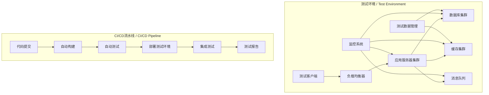

# SystemOSIOT系统集成测试指南 / System Integration Testing Guide

```text
title: 系统集成测试指南
description: SystemOSIOT项目系统集成测试标准和方法，建立完整的测试体系
author: SystemOSIOT Team
created: 2024-01-15
updated: 2024-01-15
version: 1.0.0
tags: [集成测试, 测试体系, 质量保证]
```

## 📑 目录 / Table of Contents

- [SystemOSIOT系统集成测试指南 / System Integration Testing Guide](#systemosiot系统集成测试指南--system-integration-testing-guide)
  - [📑 目录 / Table of Contents](#-目录--table-of-contents)
  - [🎯 测试策略概述 / Testing Strategy Overview](#-测试策略概述--testing-strategy-overview)
    - [测试目标 / Testing Objectives](#测试目标--testing-objectives)
    - [测试层次 / Testing Levels](#测试层次--testing-levels)
  - [🏗️ 测试环境搭建 / Test Environment Setup](#️-测试环境搭建--test-environment-setup)
    - [测试环境架构 / Test Environment Architecture](#测试环境架构--test-environment-architecture)
    - [环境配置标准 / Environment Configuration Standards](#环境配置标准--environment-configuration-standards)
      - [Docker Compose配置](#docker-compose配置)
  - [🧪 测试用例设计 / Test Case Design](#-测试用例设计--test-case-design)
    - [功能测试用例 / Functional Test Cases](#功能测试用例--functional-test-cases)
      - [用户管理模块测试](#用户管理模块测试)
      - [订单处理模块测试](#订单处理模块测试)
    - [性能测试用例 / Performance Test Cases](#性能测试用例--performance-test-cases)
      - [负载测试](#负载测试)
  - [🤖 自动化测试框架 / Automated Testing Framework](#-自动化测试框架--automated-testing-framework)
    - [测试框架配置 / Test Framework Configuration](#测试框架配置--test-framework-configuration)
      - [TestNG配置](#testng配置)
      - [自定义测试监听器](#自定义测试监听器)
    - [测试数据管理 / Test Data Management](#测试数据管理--test-data-management)
      - [测试数据工厂](#测试数据工厂)
  - [📊 测试执行和报告 / Test Execution and Reporting](#-测试执行和报告--test-execution-and-reporting)
    - [测试执行策略 / Test Execution Strategy](#测试执行策略--test-execution-strategy)
      - [测试执行脚本](#测试执行脚本)
    - [测试报告生成 / Test Report Generation](#测试报告生成--test-report-generation)
      - [Allure报告配置](#allure报告配置)
      - [自定义报告模板](#自定义报告模板)
  - [🔄 持续集成测试 / Continuous Integration Testing](#-持续集成测试--continuous-integration-testing)
    - [CI/CD流水线配置 / CI/CD Pipeline Configuration](#cicd流水线配置--cicd-pipeline-configuration)
      - [GitHub Actions配置](#github-actions配置)
      - [Jenkins Pipeline配置](#jenkins-pipeline配置)

## 🎯 测试策略概述 / Testing Strategy Overview

### 测试目标 / Testing Objectives

- **功能验证**: 验证系统各模块功能正确性
- **接口测试**: 测试模块间接口的兼容性
- **性能验证**: 验证系统性能指标
- **稳定性测试**: 测试系统长期运行稳定性
- **安全测试**: 验证系统安全性

### 测试层次 / Testing Levels

- **单元测试**: 单个组件功能测试
- **集成测试**: 组件间协作测试
- **系统测试**: 完整系统功能测试
- **验收测试**: 用户需求满足度测试

## 🏗️ 测试环境搭建 / Test Environment Setup

### 测试环境架构 / Test Environment Architecture



### 环境配置标准 / Environment Configuration Standards

#### Docker Compose配置

```yaml
# docker-compose.test.yml
version: '3.8'

services:
  app:
    build: .
    ports:
      - "8080:8080"
    environment:
      - SPRING_PROFILES_ACTIVE=test
      - DB_HOST=test-db
      - REDIS_HOST=test-redis
    depends_on:
      - test-db
      - test-redis
      - test-rabbitmq

  test-db:
    image: mysql:8.0
    environment:
      - MYSQL_ROOT_PASSWORD=testpass
      - MYSQL_DATABASE=testdb
    ports:
      - "3306:3306"
    volumes:
      - test-db-data:/var/lib/mysql

  test-redis:
    image: redis:6.2
    ports:
      - "6379:6379"
    volumes:
      - test-redis-data:/data

  test-rabbitmq:
    image: rabbitmq:3.9-management
    ports:
      - "5672:5672"
      - "15672:15672"
    environment:
      - RABBITMQ_DEFAULT_USER=testuser
      - RABBITMQ_DEFAULT_PASS=testpass

volumes:
  test-db-data:
  test-redis-data:
```

## 🧪 测试用例设计 / Test Case Design

### 功能测试用例 / Functional Test Cases

#### 用户管理模块测试

```java
@SpringBootTest
@AutoConfigureTestDatabase(replace = AutoConfigureTestDatabase.Replace.NONE)
class UserManagementIntegrationTest {
    
    @Autowired
    private UserService userService;
    
    @Autowired
    private UserRepository userRepository;
    
    @Test
    @Transactional
    void testUserRegistration() {
        // 准备测试数据
        UserRegistrationRequest request = new UserRegistrationRequest();
        request.setUsername("testuser");
        request.setEmail("test@example.com");
        request.setPassword("password123");
        
        // 执行测试
        UserResponse response = userService.registerUser(request);
        
        // 验证结果
        assertNotNull(response);
        assertEquals("testuser", response.getUsername());
        assertEquals("test@example.com", response.getEmail());
        
        // 验证数据库
        User savedUser = userRepository.findByUsername("testuser").orElse(null);
        assertNotNull(savedUser);
        assertTrue(savedUser.isEnabled());
    }
    
    @Test
    @Transactional
    void testUserLogin() {
        // 准备测试数据
        User user = createTestUser();
        userRepository.save(user);
        
        // 执行测试
        LoginRequest request = new LoginRequest();
        request.setUsername("testuser");
        request.setPassword("password123");
        
        LoginResponse response = userService.login(request);
        
        // 验证结果
        assertNotNull(response);
        assertNotNull(response.getToken());
        assertTrue(response.isSuccess());
    }
    
    @Test
    @Transactional
    void testUserProfileUpdate() {
        // 准备测试数据
        User user = createTestUser();
        userRepository.save(user);
        
        // 执行测试
        ProfileUpdateRequest request = new ProfileUpdateRequest();
        request.setDisplayName("Updated Name");
        request.setBio("Updated bio");
        
        UserResponse response = userService.updateProfile(user.getId(), request);
        
        // 验证结果
        assertEquals("Updated Name", response.getDisplayName());
        assertEquals("Updated bio", response.getBio());
    }
    
    private User createTestUser() {
        User user = new User();
        user.setUsername("testuser");
        user.setEmail("test@example.com");
        user.setPassword("encoded_password");
        user.setEnabled(true);
        return user;
    }
}
```

#### 订单处理模块测试

```java
@SpringBootTest
class OrderProcessingIntegrationTest {
    
    @Autowired
    private OrderService orderService;
    
    @Autowired
    private PaymentService paymentService;
    
    @Autowired
    private InventoryService inventoryService;
    
    @MockBean
    private NotificationService notificationService;
    
    @Test
    void testOrderCreationAndProcessing() {
        // 准备测试数据
        OrderRequest orderRequest = createTestOrderRequest();
        
        // 模拟库存检查
        when(inventoryService.checkAvailability(anyList()))
            .thenReturn(true);
        
        // 模拟支付处理
        when(paymentService.processPayment(any(PaymentRequest.class)))
            .thenReturn(new PaymentResponse(true, "payment_123"));
        
        // 执行测试
        OrderResponse orderResponse = orderService.createOrder(orderRequest);
        
        // 验证结果
        assertNotNull(orderResponse);
        assertEquals("PENDING", orderResponse.getStatus());
        
        // 验证订单处理流程
        verify(inventoryService).reserveInventory(anyList());
        verify(paymentService).processPayment(any(PaymentRequest.class));
        verify(notificationService).sendOrderConfirmation(any(Order.class));
    }
    
    @Test
    void testOrderCancellation() {
        // 准备测试数据
        Order order = createTestOrder();
        
        // 执行测试
        orderService.cancelOrder(order.getId(), "User request");
        
        // 验证结果
        Order cancelledOrder = orderService.getOrder(order.getId());
        assertEquals("CANCELLED", cancelledOrder.getStatus());
        assertEquals("User request", cancelledOrder.getCancellationReason());
        
        // 验证库存释放
        verify(inventoryService).releaseInventory(anyList());
        verify(notificationService).sendCancellationNotification(any(Order.class));
    }
    
    private OrderRequest createTestOrderRequest() {
        OrderRequest request = new OrderRequest();
        request.setUserId(1L);
        request.setItems(Arrays.asList(
            new OrderItemRequest(1L, 2),
            new OrderItemRequest(2L, 1)
        ));
        request.setShippingAddress("123 Test St, Test City");
        return request;
    }
    
    private Order createTestOrder() {
        Order order = new Order();
        order.setId(1L);
        order.setStatus("PENDING");
        order.setUserId(1L);
        return order;
    }
}
```

### 性能测试用例 / Performance Test Cases

#### 负载测试

```java
@SpringBootTest
class LoadTestingIntegrationTest {
    
    @Autowired
    private TestRestTemplate restTemplate;
    
    @Test
    void testConcurrentUserRequests() throws InterruptedException {
        int numThreads = 100;
        int requestsPerThread = 10;
        CountDownLatch latch = new CountDownLatch(numThreads);
        AtomicInteger successCount = new AtomicInteger(0);
        AtomicInteger failureCount = new AtomicInteger(0);
        
        // 创建并发线程
        for (int i = 0; i < numThreads; i++) {
            new Thread(() -> {
                try {
                    for (int j = 0; j < requestsPerThread; j++) {
                        ResponseEntity<String> response = restTemplate
                            .getForEntity("/api/users", String.class);
                        
                        if (response.getStatusCode().is2xxSuccessful()) {
                            successCount.incrementAndGet();
                        } else {
                            failureCount.incrementAndGet();
                        }
                        
                        Thread.sleep(100); // 请求间隔
                    }
                } catch (Exception e) {
                    failureCount.incrementAndGet();
                } finally {
                    latch.countDown();
                }
            }).start();
        }
        
        // 等待所有线程完成
        latch.await(60, TimeUnit.SECONDS);
        
        // 验证结果
        int totalRequests = numThreads * requestsPerThread;
        assertEquals(totalRequests, successCount.get() + failureCount.get());
        
        // 成功率应该大于95%
        double successRate = (double) successCount.get() / totalRequests * 100;
        assertTrue(successRate > 95.0, "成功率: " + successRate + "%");
    }
}
```

## 🤖 自动化测试框架 / Automated Testing Framework

### 测试框架配置 / Test Framework Configuration

#### TestNG配置

```xml
<!-- testng.xml -->
<!DOCTYPE suite SYSTEM "http://testng.org/testng-1.0.dtd">
<suite name="SystemOSIOT Integration Test Suite" parallel="methods" thread-count="4">
    
    <test name="User Management Tests">
        <classes>
            <class name="com.systemosiot.test.UserManagementIntegrationTest"/>
        </classes>
    </test>
    
    <test name="Order Processing Tests">
        <classes>
            <class name="com.systemosiot.test.OrderProcessingIntegrationTest"/>
        </classes>
    </test>
    
    <test name="Performance Tests">
        <classes>
            <class name="com.systemosiot.test.LoadTestingIntegrationTest"/>
        </classes>
    </test>
    
    <listeners>
        <listener class-name="com.systemosiot.test.CustomTestListener"/>
        <listener class-name="com.systemosiot.test.PerformanceTestListener"/>
    </listeners>
    
</suite>
```

#### 自定义测试监听器

```java
public class CustomTestListener implements ITestListener {
    
    private static final Logger logger = LoggerFactory.getLogger(CustomTestListener.class);
    
    @Override
    public void onTestStart(ITestResult result) {
        logger.info("开始测试: {} - {}", 
            result.getTestClass().getName(), 
            result.getMethod().getMethodName());
    }
    
    @Override
    public void onTestSuccess(ITestResult result) {
        logger.info("测试通过: {} - {} (耗时: {}ms)", 
            result.getTestClass().getName(),
            result.getMethod().getMethodName(),
            result.getEndMillis() - result.getStartMillis());
    }
    
    @Override
    public void onTestFailure(ITestResult result) {
        logger.error("测试失败: {} - {} - 原因: {}", 
            result.getTestClass().getName(),
            result.getMethod().getMethodName(),
            result.getThrowable().getMessage());
    }
    
    @Override
    public void onTestSkipped(ITestResult result) {
        logger.warn("测试跳过: {} - {}", 
            result.getTestClass().getName(),
            result.getMethod().getMethodName());
    }
}
```

### 测试数据管理 / Test Data Management

#### 测试数据工厂

```java
@Component
public class TestDataFactory {
    
    private final Faker faker = new Faker();
    
    public User createTestUser() {
        User user = new User();
        user.setUsername(faker.name().username());
        user.setEmail(faker.internet().emailAddress());
        user.setPassword(faker.internet().password());
        user.setDisplayName(faker.name().fullName());
        user.setEnabled(true);
        user.setCreatedAt(LocalDateTime.now());
        return user;
    }
    
    public Order createTestOrder() {
        Order order = new Order();
        order.setUserId(faker.number().numberBetween(1L, 1000L));
        order.setStatus("PENDING");
        order.setTotalAmount(new BigDecimal(faker.number().randomDouble(2, 10, 1000)));
        order.setCreatedAt(LocalDateTime.now());
        return order;
    }
    
    public Product createTestProduct() {
        Product product = new Product();
        product.setName(faker.commerce().productName());
        product.setDescription(faker.lorem().sentence());
        product.setPrice(new BigDecimal(faker.number().randomDouble(2, 1, 100)));
        product.setStockQuantity(faker.number().numberBetween(0, 1000));
        product.setActive(true);
        return product;
    }
    
    public List<User> createTestUsers(int count) {
        return IntStream.range(0, count)
            .mapToObj(i -> createTestUser())
            .collect(Collectors.toList());
    }
    
    public List<Order> createTestOrders(int count) {
        return IntStream.range(0, count)
            .mapToObj(i -> createTestOrder())
            .collect(Collectors.toList());
    }
}
```

## 📊 测试执行和报告 / Test Execution and Reporting

### 测试执行策略 / Test Execution Strategy

#### 测试执行脚本

```bash
#!/bin/bash
# 集成测试执行脚本

echo "开始执行SystemOSIOT集成测试..."

# 设置环境变量
export SPRING_PROFILES_ACTIVE=test
export TEST_DB_URL=jdbc:mysql://localhost:3306/testdb
export TEST_DB_USERNAME=testuser
export TEST_DB_PASSWORD=testpass

# 启动测试环境
echo "启动测试环境..."
docker-compose -f docker-compose.test.yml up -d

# 等待服务启动
echo "等待服务启动..."
sleep 30

# 检查服务状态
echo "检查服务状态..."
if ! curl -f http://localhost:8080/actuator/health; then
    echo "服务启动失败"
    exit 1
fi

# 执行测试
echo "执行集成测试..."
mvn test -Dtest=IntegrationTestSuite -Dspring.profiles.active=test

# 收集测试结果
echo "收集测试结果..."
if [ -d "target/surefire-reports" ]; then
    cp -r target/surefire-reports test-results/
fi

# 生成测试报告
echo "生成测试报告..."
mvn surefire-report:report

# 清理测试环境
echo "清理测试环境..."
docker-compose -f docker-compose.test.yml down

echo "集成测试执行完成"
```

### 测试报告生成 / Test Report Generation

#### Allure报告配置

```xml
<!-- pom.xml -->
<plugin>
    <groupId>io.qameta.allure</groupId>
    <artifactId>allure-maven</artifactId>
    <version>2.12.0</version>
    <configuration>
        <reportVersion>2.20.1</reportVersion>
        <resultsDirectory>${project.build.directory}/allure-results</resultsDirectory>
        <reportDirectory>${project.build.directory}/allure-report</reportDirectory>
    </configuration>
</plugin>
```

#### 自定义报告模板

```java
@Component
public class TestReportGenerator {
    
    public void generateCustomReport(List<TestResult> results) {
        // 生成HTML报告
        String htmlReport = generateHtmlReport(results);
        
        // 生成JSON报告
        String jsonReport = generateJsonReport(results);
        
        // 生成PDF报告
        generatePdfReport(results);
        
        // 保存报告
        saveReports(htmlReport, jsonReport);
    }
    
    private String generateHtmlReport(List<TestResult> results) {
        StringBuilder html = new StringBuilder();
        html.append("<!DOCTYPE html><html><head><title>测试报告</title></head><body>");
        html.append("<h1>SystemOSIOT集成测试报告</h1>");
        
        // 统计信息
        long totalTests = results.size();
        long passedTests = results.stream().filter(r -> r.isSuccess()).count();
        long failedTests = totalTests - passedTests;
        
        html.append("<h2>测试统计</h2>");
        html.append("<p>总测试数: ").append(totalTests).append("</p>");
        html.append("<p>通过: ").append(passedTests).append("</p>");
        html.append("<p>失败: ").append(failedTests).append("</p>");
        html.append("<p>成功率: ").append(String.format("%.2f", (double)passedTests/totalTests*100)).append("%</p>");
        
        // 详细结果
        html.append("<h2>详细结果</h2>");
        html.append("<table border='1'><tr><th>测试名称</th><th>状态</th><th>耗时</th><th>错误信息</th></tr>");
        
        for (TestResult result : results) {
            html.append("<tr>");
            html.append("<td>").append(result.getTestName()).append("</td>");
            html.append("<td>").append(result.isSuccess() ? "通过" : "失败").append("</td>");
            html.append("<td>").append(result.getDuration()).append("ms</td>");
            html.append("<td>").append(result.getErrorMessage() != null ? result.getErrorMessage() : "").append("</td>");
            html.append("</tr>");
        }
        
        html.append("</table></body></html>");
        return html.toString();
    }
}
```

## 🔄 持续集成测试 / Continuous Integration Testing

### CI/CD流水线配置 / CI/CD Pipeline Configuration

#### GitHub Actions配置

```yaml
# .github/workflows/integration-test.yml
name: Integration Tests

on:
  push:
    branches: [ main, develop ]
  pull_request:
    branches: [ main, develop ]

jobs:
  integration-test:
    runs-on: ubuntu-latest
    
    services:
      mysql:
        image: mysql:8.0
        env:
          MYSQL_ROOT_PASSWORD: root
          MYSQL_DATABASE: testdb
        ports:
          - 3306:3306
        options: --health-cmd="mysqladmin ping" --health-interval=10s --health-timeout=5s --health-retries=3
      
      redis:
        image: redis:6.2
        ports:
          - 6379:6379
        options: --health-cmd="redis-cli ping" --health-interval=10s --health-timeout=5s --health-retries=3
    
    steps:
    - uses: actions/checkout@v3
    
    - name: Set up JDK 11
      uses: actions/setup-java@v3
      with:
        java-version: '11'
        distribution: 'temurin'
    
    - name: Cache Maven packages
      uses: actions/cache@v3
      with:
        path: ~/.m2
        key: ${{ runner.os }}-m2-${{ hashFiles('**/pom.xml') }}
        restore-keys: ${{ runner.os }}-m2
    
    - name: Run integration tests
      run: mvn clean test -Dtest=IntegrationTestSuite
    
    - name: Generate test report
      run: mvn surefire-report:report
    
    - name: Upload test results
      uses: actions/upload-artifact@v3
      with:
        name: test-results
        path: target/surefire-reports/
    
    - name: Upload test report
      uses: actions/upload-artifact@v3
      with:
        name: test-report
        path: target/site/
```

#### Jenkins Pipeline配置

```groovy
// Jenkinsfile
pipeline {
    agent any
    
    environment {
        JAVA_HOME = tool 'JDK11'
        MAVEN_HOME = tool 'Maven3.8'
    }
    
    stages {
        stage('Checkout') {
            steps {
                checkout scm
            }
        }
        
        stage('Build') {
            steps {
                sh "${MAVEN_HOME}/bin/mvn clean compile"
            }
        }
        
        stage('Unit Tests') {
            steps {
                sh "${MAVEN_HOME}/bin/mvn test"
            }
            post {
                always {
                    junit '**/target/surefire-reports/*.xml'
                }
            }
        }
        
        stage('Integration Tests') {
            steps {
                sh "${MAVEN_HOME}/bin/mvn test -Dtest=IntegrationTestSuite"
            }
            post {
                always {
                    junit '**/target/surefire-reports/*.xml'
                    publishHTML([
                        allowMissing: false,
                        alwaysLinkToLastBuild: true,
                        keepAll: true,
                        reportDir: 'target/site',
                        reportFiles: 'index.html',
                        reportName: 'Test Report'
                    ])
                }
            }
        }
        
        stage('Deploy to Test Environment') {
            when {
                branch 'develop'
            }
            steps {
                sh "docker-compose -f docker-compose.test.yml up -d"
                sh "sleep 30"
                sh "curl -f http://localhost:8080/actuator/health"
            }
        }
    }
    
    post {
        always {
            cleanWs()
        }
        success {
            echo 'Pipeline executed successfully!'
        }
        failure {
            echo 'Pipeline execution failed!'
        }
    }
}
```

---

> 本系统集成测试指南为SystemOSIOT项目提供完整的测试体系和质量保证，确保系统稳定性和可靠性。
> This system integration testing guide provides a complete testing system and quality assurance for the SystemOSIOT project, ensuring system stability and reliability.
