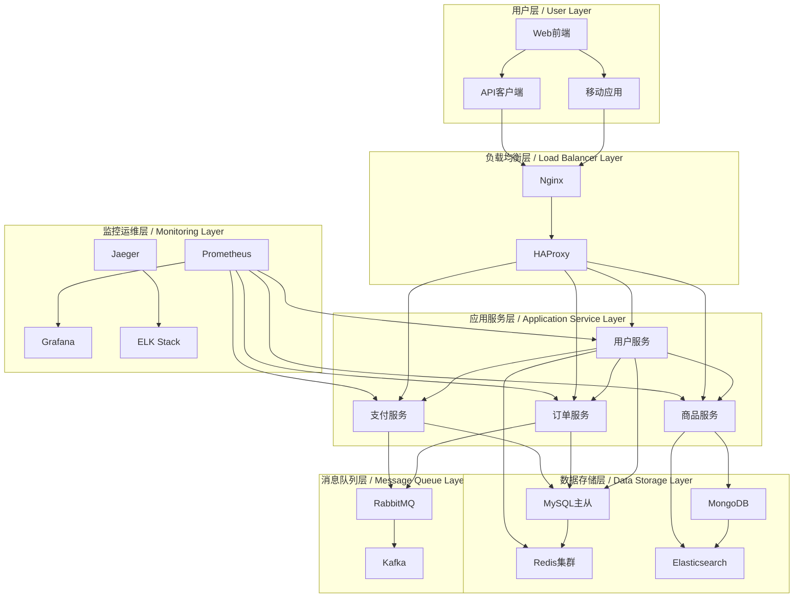

# SystemOSIOT部署运维指南 / Deployment and Operations Guide

```text
title: 部署运维指南
description: SystemOSIOT项目部署和运维指南，建立完整的部署运维体系
author: SystemOSIOT Team
created: 2024-01-15
updated: 2024-01-15
version: 1.0.0
tags: [部署指南, 运维手册, 运维体系]
```

## 📑 目录 / Table of Contents

- [SystemOSIOT部署运维指南 / Deployment and Operations Guide](#systemosiot部署运维指南--deployment-and-operations-guide)
  - [📑 目录 / Table of Contents](#-目录--table-of-contents)
  - [🏗️ 部署架构概述 / Deployment Architecture Overview](#️-部署架构概述--deployment-architecture-overview)
    - [整体架构图 / Overall Architecture](#整体架构图--overall-architecture)
    - [部署拓扑 / Deployment Topology](#部署拓扑--deployment-topology)
      - [生产环境部署](#生产环境部署)
  - [⚙️ 环境配置管理 / Environment Configuration Management](#️-环境配置管理--environment-configuration-management)
    - [配置文件结构 / Configuration File Structure](#配置文件结构--configuration-file-structure)
      - [应用配置文件](#应用配置文件)
      - [环境变量配置](#环境变量配置)
    - [配置管理工具 / Configuration Management Tools](#配置管理工具--configuration-management-tools)
      - [Spring Cloud Config配置](#spring-cloud-config配置)
  - [🐳 容器化部署 / Containerized Deployment](#-容器化部署--containerized-deployment)
    - [Docker配置 / Docker Configuration](#docker配置--docker-configuration)
      - [应用Dockerfile](#应用dockerfile)
      - [启动脚本](#启动脚本)
      - [Docker Compose配置](#docker-compose配置)
    - [Kubernetes部署 / Kubernetes Deployment](#kubernetes部署--kubernetes-deployment)
      - [应用部署配置](#应用部署配置)
      - [服务配置](#服务配置)
      - [Ingress配置](#ingress配置)
  - [🤖 自动化部署 / Automated Deployment](#-自动化部署--automated-deployment)
    - [CI/CD流水线 / CI/CD Pipeline](#cicd流水线--cicd-pipeline)
      - [GitHub Actions配置](#github-actions配置)
      - [Jenkins Pipeline配置](#jenkins-pipeline配置)
  - [📊 监控和告警 / Monitoring and Alerting](#-监控和告警--monitoring-and-alerting)
    - [监控体系 / Monitoring System](#监控体系--monitoring-system)
      - [Prometheus配置](#prometheus配置)
      - [告警规则](#告警规则)
    - [日志管理 / Log Management](#日志管理--log-management)
      - [ELK Stack配置](#elk-stack配置)
  - [🛠️ 运维操作指南 / Operations Guide](#️-运维操作指南--operations-guide)
    - [日常运维操作 / Daily Operations](#日常运维操作--daily-operations)
      - [应用重启脚本](#应用重启脚本)
      - [数据库备份脚本](#数据库备份脚本)
    - [故障处理流程 / Troubleshooting Process](#故障处理流程--troubleshooting-process)
      - [故障响应流程](#故障响应流程)
      - [常见故障处理 / Common Incident Handling](#常见故障处理--common-incident-handling)

## 🏗️ 部署架构概述 / Deployment Architecture Overview

### 整体架构图 / Overall Architecture



### 部署拓扑 / Deployment Topology

#### 生产环境部署

```yaml
# 生产环境部署配置
production:
  regions:
    - name: "华北地区"
      availability_zones:
        - name: "az-1"
          servers:
            - role: "web"
              count: 3
              instance_type: "ecs.g7.2xlarge"
            - role: "app"
              count: 6
              instance_type: "ecs.g7.4xlarge"
            - role: "db"
              count: 2
              instance_type: "rds.mysql.x8.2xlarge"
    
    - name: "华东地区"
      availability_zones:
        - name: "az-1"
          servers:
            - role: "web"
              count: 2
              instance_type: "ecs.g7.2xlarge"
            - role: "app"
              count: 4
              instance_type: "ecs.g7.4xlarge"
            - role: "db"
              count: 1
              instance_type: "rds.mysql.x8.2xlarge"
```

## ⚙️ 环境配置管理 / Environment Configuration Management

### 配置文件结构 / Configuration File Structure

#### 应用配置文件

```yaml
# application.yml
spring:
  profiles:
    active: ${SPRING_PROFILES_ACTIVE:dev}
  
  datasource:
    url: ${DB_URL:jdbc:mysql://localhost:3306/systemosiot}
    username: ${DB_USERNAME:root}
    password: ${DB_PASSWORD:password}
    hikari:
      maximum-pool-size: ${DB_MAX_POOL_SIZE:20}
      minimum-idle: ${DB_MIN_IDLE:5}
      connection-timeout: ${DB_CONNECTION_TIMEOUT:30000}
  
  redis:
    host: ${REDIS_HOST:localhost}
    port: ${REDIS_PORT:6379}
    password: ${REDIS_PASSWORD:}
    database: ${REDIS_DATABASE:0}
    timeout: ${REDIS_TIMEOUT:5000}
    lettuce:
      pool:
        max-active: ${REDIS_MAX_ACTIVE:20}
        max-idle: ${REDIS_MAX_IDLE:10}
        min-idle: ${REDIS_MIN_IDLE:5}
  
  rabbitmq:
    host: ${RABBITMQ_HOST:localhost}
    port: ${RABBITMQ_PORT:5672}
    username: ${RABBITMQ_USERNAME:guest}
    password: ${RABBITMQ_PASSWORD:guest}
    virtual-host: ${RABBITMQ_VHOST:/}

# 应用配置
app:
  name: ${APP_NAME:systemosiot}
  version: ${APP_VERSION:1.0.0}
  port: ${APP_PORT:8080}
  
  security:
    jwt:
      secret: ${JWT_SECRET:your-secret-key}
      expiration: ${JWT_EXPIRATION:86400000}
  
  logging:
    level: ${LOG_LEVEL:INFO}
    file: ${LOG_FILE:/var/log/systemosiot/app.log}
  
  cache:
    ttl: ${CACHE_TTL:3600}
    max-size: ${CACHE_MAX_SIZE:10000}
```

#### 环境变量配置

```bash
# .env.production
# 数据库配置
DB_URL=jdbc:mysql://prod-db-cluster:3306/systemosiot
DB_USERNAME=systemosiot_user
DB_PASSWORD=secure_password_123
DB_MAX_POOL_SIZE=50
DB_MIN_IDLE=10
DB_CONNECTION_TIMEOUT=60000

# Redis配置
REDIS_HOST=prod-redis-cluster
REDIS_PORT=6379
REDIS_PASSWORD=redis_password_123
REDIS_DATABASE=0
REDIS_MAX_ACTIVE=50
REDIS_MAX_IDLE=20
REDIS_MIN_IDLE=10

# RabbitMQ配置
RABBITMQ_HOST=prod-rabbitmq-cluster
RABBITMQ_PORT=5672
RABBITMQ_USERNAME=systemosiot_user
RABBITMQ_PASSWORD=mq_password_123
RABBITMQ_VHOST=/systemosiot

# 应用配置
APP_NAME=systemosiot
APP_VERSION=1.0.0
APP_PORT=8080
SPRING_PROFILES_ACTIVE=production

# 安全配置
JWT_SECRET=your-super-secure-jwt-secret-key-2024
JWT_EXPIRATION=86400000

# 日志配置
LOG_LEVEL=WARN
LOG_FILE=/var/log/systemosiot/app.log

# 缓存配置
CACHE_TTL=3600
CACHE_MAX_SIZE=50000
```

### 配置管理工具 / Configuration Management Tools

#### Spring Cloud Config配置

```yaml
# bootstrap.yml
spring:
  cloud:
    config:
      uri: ${CONFIG_SERVER_URI:http://localhost:8888}
      name: ${CONFIG_NAME:systemosiot}
      profile: ${CONFIG_PROFILE:${SPRING_PROFILES_ACTIVE:dev}}
      label: ${CONFIG_LABEL:main}
      fail-fast: true
      retry:
        initial-interval: 1000
        max-interval: 2000
        max-attempts: 6
        multiplier: 1.1
```

## 🐳 容器化部署 / Containerized Deployment

### Docker配置 / Docker Configuration

#### 应用Dockerfile

```dockerfile
# Dockerfile
FROM openjdk:11-jre-slim

# 设置工作目录
WORKDIR /app

# 安装必要的工具
RUN apt-get update && apt-get install -y \
    curl \
    wget \
    && rm -rf /var/lib/apt/lists/*

# 创建应用用户
RUN groupadd -r appuser && useradd -r -g appuser appuser

# 复制应用JAR文件
COPY target/systemosiot-*.jar app.jar

# 复制启动脚本
COPY scripts/startup.sh startup.sh
RUN chmod +x startup.sh

# 创建日志目录
RUN mkdir -p /var/log/systemosiot && \
    chown -R appuser:appuser /var/log/systemosiot

# 切换到应用用户
USER appuser

# 暴露端口
EXPOSE 8080

# 健康检查
HEALTHCHECK --interval=30s --timeout=3s --start-period=60s --retries=3 \
    CMD curl -f http://localhost:8080/actuator/health || exit 1

# 启动应用
ENTRYPOINT ["./startup.sh"]
```

#### 启动脚本

```bash
#!/bin/bash
# startup.sh

# 设置JVM参数
JVM_OPTS="-Xms${JVM_XMS:-1g} -Xmx${JVM_XMX:-2g} \
    -XX:+UseG1GC \
    -XX:MaxGCPauseMillis=200 \
    -XX:+UnlockExperimentalVMOptions \
    -XX:+UseCGroupMemoryLimitForHeap \
    -XX:MaxRAMFraction=2 \
    -Djava.security.egd=file:/dev/./urandom \
    -Dspring.profiles.active=${SPRING_PROFILES_ACTIVE:-default}"

# 启动应用
exec java $JVM_OPTS -jar app.jar
```

#### Docker Compose配置

```yaml
# docker-compose.yml
version: '3.8'

services:
  app:
    build: .
    container_name: systemosiot-app
    ports:
      - "8080:8080"
    environment:
      - SPRING_PROFILES_ACTIVE=production
      - DB_URL=jdbc:mysql://db:3306/systemosiot
      - REDIS_HOST=redis
      - RABBITMQ_HOST=rabbitmq
    depends_on:
      - db
      - redis
      - rabbitmq
    volumes:
      - app-logs:/var/log/systemosiot
    restart: unless-stopped
    networks:
      - app-network

  db:
    image: mysql:8.0
    container_name: systemosiot-db
    environment:
      - MYSQL_ROOT_PASSWORD=root_password
      - MYSQL_DATABASE=systemosiot
      - MYSQL_USER=systemosiot_user
      - MYSQL_PASSWORD=user_password
    ports:
      - "3306:3306"
    volumes:
      - db-data:/var/lib/mysql
      - ./sql/init.sql:/docker-entrypoint-initdb.d/init.sql
    restart: unless-stopped
    networks:
      - app-network

  redis:
    image: redis:6.2-alpine
    container_name: systemosiot-redis
    command: redis-server --requirepass redis_password
    ports:
      - "6379:6379"
    volumes:
      - redis-data:/data
    restart: unless-stopped
    networks:
      - app-network

  rabbitmq:
    image: rabbitmq:3.9-management
    container_name: systemosiot-rabbitmq
    environment:
      - RABBITMQ_DEFAULT_USER=systemosiot_user
      - RABBITMQ_DEFAULT_PASS=mq_password
      - RABBITMQ_DEFAULT_VHOST=/systemosiot
    ports:
      - "5672:5672"
      - "15672:15672"
    volumes:
      - rabbitmq-data:/var/lib/rabbitmq
    restart: unless-stopped
    networks:
      - app-network

  nginx:
    image: nginx:alpine
    container_name: systemosiot-nginx
    ports:
      - "80:80"
      - "443:443"
    volumes:
      - ./nginx/nginx.conf:/etc/nginx/nginx.conf
      - ./nginx/ssl:/etc/nginx/ssl
    depends_on:
      - app
    restart: unless-stopped
    networks:
      - app-network

volumes:
  app-logs:
  db-data:
  redis-data:
  rabbitmq-data:

networks:
  app-network:
    driver: bridge
```

### Kubernetes部署 / Kubernetes Deployment

#### 应用部署配置

```yaml
# k8s/deployment.yaml
apiVersion: apps/v1
kind: Deployment
metadata:
  name: systemosiot-app
  namespace: systemosiot
  labels:
    app: systemosiot
    version: v1.0.0
spec:
  replicas: 3
  selector:
    matchLabels:
      app: systemosiot
  template:
    metadata:
      labels:
        app: systemosiot
        version: v1.0.0
    spec:
      containers:
      - name: systemosiot-app
        image: systemosiot:1.0.0
        ports:
        - containerPort: 8080
        env:
        - name: SPRING_PROFILES_ACTIVE
          value: "production"
        - name: DB_URL
          valueFrom:
            secretKeyRef:
              name: systemosiot-secrets
              key: db-url
        - name: DB_USERNAME
          valueFrom:
            secretKeyRef:
              name: systemosiot-secrets
              key: db-username
        - name: DB_PASSWORD
          valueFrom:
            secretKeyRef:
              name: systemosiot-secrets
              key: db-password
        resources:
          requests:
            memory: "1Gi"
            cpu: "500m"
          limits:
            memory: "2Gi"
            cpu: "1000m"
        livenessProbe:
          httpGet:
            path: /actuator/health
            port: 8080
          initialDelaySeconds: 60
          periodSeconds: 30
        readinessProbe:
          httpGet:
            path: /actuator/health/readiness
            port: 8080
          initialDelaySeconds: 30
          periodSeconds: 10
        volumeMounts:
        - name: app-logs
          mountPath: /var/log/systemosiot
      volumes:
      - name: app-logs
        emptyDir: {}
      imagePullSecrets:
      - name: systemosiot-registry-secret
```

#### 服务配置

```yaml
# k8s/service.yaml
apiVersion: v1
kind: Service
metadata:
  name: systemosiot-service
  namespace: systemosiot
spec:
  selector:
    app: systemosiot
  ports:
  - protocol: TCP
    port: 80
    targetPort: 8080
  type: ClusterIP
---
apiVersion: v1
kind: Service
metadata:
  name: systemosiot-ingress
  namespace: systemosiot
spec:
  selector:
    app: systemosiot
  ports:
  - protocol: TCP
    port: 8080
    targetPort: 8080
  type: ClusterIP
```

#### Ingress配置

```yaml
# k8s/ingress.yaml
apiVersion: networking.k8s.io/v1
kind: Ingress
metadata:
  name: systemosiot-ingress
  namespace: systemosiot
  annotations:
    kubernetes.io/ingress.class: "nginx"
    cert-manager.io/cluster-issuer: "letsencrypt-prod"
    nginx.ingress.kubernetes.io/ssl-redirect: "true"
    nginx.ingress.kubernetes.io/force-ssl-redirect: "true"
spec:
  tls:
  - hosts:
    - api.systemosiot.com
    secretName: systemosiot-tls
  rules:
  - host: api.systemosiot.com
    http:
      paths:
      - path: /
        pathType: Prefix
        backend:
          service:
            name: systemosiot-ingress
            port:
              number: 8080
```

## 🤖 自动化部署 / Automated Deployment

### CI/CD流水线 / CI/CD Pipeline

#### GitHub Actions配置

```yaml
# .github/workflows/deploy.yml
name: Deploy to Production

on:
  push:
    tags:
      - 'v*'

jobs:
  build-and-test:
    runs-on: ubuntu-latest
    
    steps:
    - uses: actions/checkout@v3
    
    - name: Set up JDK 11
      uses: actions/setup-java@v3
      with:
        java-version: '11'
        distribution: 'temurin'
    
    - name: Cache Maven packages
      uses: actions/cache@v3
      with:
        path: ~/.m2
        key: ${{ runner.os }}-m2-${{ hashFiles('**/pom.xml') }}
        restore-keys: ${{ runner.os }}-m2
    
    - name: Run tests
      run: mvn clean test
    
    - name: Build application
      run: mvn clean package -DskipTests
    
    - name: Build Docker image
      run: docker build -t systemosiot:${{ github.ref_name }} .
    
    - name: Push Docker image
      run: |
        echo ${{ secrets.DOCKER_PASSWORD }} | docker login -u ${{ secrets.DOCKER_USERNAME }} --password-stdin
        docker tag systemosiot:${{ github.ref_name }} ${{ secrets.DOCKER_USERNAME }}/systemosiot:${{ github.ref_name }}
        docker push ${{ secrets.DOCKER_USERNAME }}/systemosiot:${{ github.ref_name }}

  deploy:
    needs: build-and-test
    runs-on: ubuntu-latest
    if: startsWith(github.ref, 'refs/tags/')
    
    steps:
    - uses: actions/checkout@v3
    
    - name: Deploy to Kubernetes
      run: |
        echo "${{ secrets.KUBE_CONFIG }}" > kubeconfig.yaml
        export KUBECONFIG=kubeconfig.yaml
        
        # 更新镜像标签
        sed -i "s|image: systemosiot:.*|image: ${{ secrets.DOCKER_USERNAME }}/systemosiot:${{ github.ref_name }}|g" k8s/deployment.yaml
        
        # 应用配置
        kubectl apply -f k8s/namespace.yaml
        kubectl apply -f k8s/secrets.yaml
        kubectl apply -f k8s/deployment.yaml
        kubectl apply -f k8s/service.yaml
        kubectl apply -f k8s/ingress.yaml
        
        # 等待部署完成
        kubectl rollout status deployment/systemosiot-app -n systemosiot
        
        # 健康检查
        kubectl get pods -n systemosiot
        kubectl get services -n systemosiot
```

#### Jenkins Pipeline配置

```groovy
// Jenkinsfile
pipeline {
    agent any
    
    environment {
        DOCKER_IMAGE = 'systemosiot'
        DOCKER_TAG = "${env.BUILD_NUMBER}"
        KUBE_NAMESPACE = 'systemosiot'
    }
    
    stages {
        stage('Checkout') {
            steps {
                checkout scm
            }
        }
        
        stage('Build') {
            steps {
                sh 'mvn clean package -DskipTests'
            }
        }
        
        stage('Test') {
            steps {
                sh 'mvn test'
            }
            post {
                always {
                    junit '**/target/surefire-reports/*.xml'
                }
            }
        }
        
        stage('Build Docker Image') {
            steps {
                sh "docker build -t ${DOCKER_IMAGE}:${DOCKER_TAG} ."
                sh "docker tag ${DOCKER_IMAGE}:${DOCKER_TAG} ${DOCKER_IMAGE}:latest"
            }
        }
        
        stage('Push Docker Image') {
            steps {
                withCredentials([usernamePassword(credentialsId: 'docker-registry', usernameVariable: 'DOCKER_USER', passwordVariable: 'DOCKER_PASS')]) {
                    sh "echo ${DOCKER_PASS} | docker login -u ${DOCKER_USER} --password-stdin"
                    sh "docker push ${DOCKER_IMAGE}:${DOCKER_TAG}"
                    sh "docker push ${DOCKER_IMAGE}:latest"
                }
            }
        }
        
        stage('Deploy to Kubernetes') {
            steps {
                script {
                    // 更新部署配置
                    sh "sed -i 's|image: systemosiot:.*|image: ${DOCKER_IMAGE}:${DOCKER_TAG}|g' k8s/deployment.yaml"
                    
                    // 应用Kubernetes配置
                    sh "kubectl apply -f k8s/namespace.yaml"
                    sh "kubectl apply -f k8s/secrets.yaml"
                    sh "kubectl apply -f k8s/deployment.yaml"
                    sh "kubectl apply -f k8s/service.yaml"
                    sh "kubectl apply -f k8s/ingress.yaml"
                    
                    // 等待部署完成
                    sh "kubectl rollout status deployment/systemosiot-app -n ${KUBE_NAMESPACE}"
                }
            }
        }
        
        stage('Health Check') {
            steps {
                script {
                    // 等待服务启动
                    sleep 30
                    
                    // 检查服务状态
                    sh "kubectl get pods -n ${KUBE_NAMESPACE}"
                    sh "kubectl get services -n ${KUBE_NAMESPACE}"
                    
                    // 健康检查
                    sh "curl -f http://localhost:8080/actuator/health || exit 1"
                }
            }
        }
    }
    
    post {
        always {
            cleanWs()
        }
        success {
            echo 'Deployment successful!'
        }
        failure {
            echo 'Deployment failed!'
            // 发送失败通知
        }
    }
}
```

## 📊 监控和告警 / Monitoring and Alerting

### 监控体系 / Monitoring System

#### Prometheus配置

```yaml
# prometheus.yml
global:
  scrape_interval: 15s
  evaluation_interval: 15s

rule_files:
  - "rules/*.yml"

alerting:
  alertmanagers:
    - static_configs:
        - targets:
          - alertmanager:9093

scrape_configs:
  - job_name: 'systemosiot-app'
    static_configs:
      - targets: ['app:8080']
    metrics_path: '/actuator/prometheus'
    scrape_interval: 5s
    
  - job_name: 'mysql'
    static_configs:
      - targets: ['db:9104']
    scrape_interval: 30s
    
  - job_name: 'redis'
    static_configs:
      - targets: ['redis:9121']
    scrape_interval: 30s
    
  - job_name: 'rabbitmq'
    static_configs:
      - targets: ['rabbitmq:15692']
    scrape_interval: 30s
```

#### 告警规则

```yaml
# rules/alerts.yml
groups:
  - name: systemosiot_alerts
    rules:
      - alert: HighCPUUsage
        expr: 100 - (avg by(instance) (irate(process_cpu_seconds_total[5m])) * 100) > 80
        for: 5m
        labels:
          severity: warning
        annotations:
          summary: "CPU使用率过高"
          description: "实例 {{ $labels.instance }} CPU使用率超过80%"
      
      - alert: HighMemoryUsage
        expr: (jvm_memory_used_bytes / jvm_memory_max_bytes * 100) > 85
        for: 5m
        labels:
          severity: warning
        annotations:
          summary: "内存使用率过高"
          description: "实例 {{ $labels.instance }} 内存使用率超过85%"
      
      - alert: HighResponseTime
        expr: histogram_quantile(0.95, sum(rate(http_server_requests_seconds_bucket[5m])) by (le)) > 1
        for: 5m
        labels:
          severity: warning
        annotations:
          summary: "响应时间过高"
          description: "实例 {{ $labels.instance }} P95响应时间超过1秒"
      
      - alert: HighErrorRate
        expr: rate(http_server_requests_total{status=~"5.."}[5m]) / rate(http_server_requests_total[5m]) * 100 > 5
        for: 5m
        labels:
          severity: critical
        annotations:
          summary: "错误率过高"
          description: "实例 {{ $labels.instance }} 错误率超过5%"
      
      - alert: ServiceDown
        expr: up == 0
        for: 1m
        labels:
          severity: critical
        annotations:
          summary: "服务不可用"
          description: "实例 {{ $labels.instance }} 服务不可用"
```

### 日志管理 / Log Management

#### ELK Stack配置

```yaml
# docker-compose.logging.yml
version: '3.8'

services:
  elasticsearch:
    image: docker.elastic.co/elasticsearch/elasticsearch:7.17.0
    container_name: elasticsearch
    environment:
      - discovery.type=single-node
      - "ES_JAVA_OPTS=-Xms512m -Xmx512m"
    ports:
      - "9200:9200"
    volumes:
      - elasticsearch-data:/usr/share/elasticsearch/data
    networks:
      - logging

  logstash:
    image: docker.elastic.co/logstash/logstash:7.17.0
    container_name: logstash
    ports:
      - "5044:5044"
    volumes:
      - ./logstash/pipeline:/usr/share/logstash/pipeline
      - ./logstash/config/logstash.yml:/usr/share/logstash/config/logstash.yml
    networks:
      - logging
    depends_on:
      - elasticsearch

  kibana:
    image: docker.elastic.co/kibana/kibana:7.17.0
    container_name: kibana
    ports:
      - "5601:5601"
    environment:
      - ELASTICSEARCH_HOSTS=http://elasticsearch:9200
    networks:
      - logging
    depends_on:
      - elasticsearch

volumes:
  elasticsearch-data:

networks:
  logging:
    driver: bridge
```

## 🛠️ 运维操作指南 / Operations Guide

### 日常运维操作 / Daily Operations

#### 应用重启脚本

```bash
#!/bin/bash
# restart-app.sh

APP_NAME="systemosiot"
NAMESPACE="systemosiot"
DEPLOYMENT="systemosiot-app"

echo "开始重启应用: $APP_NAME"

# 检查应用状态
echo "检查当前应用状态..."
kubectl get pods -n $NAMESPACE -l app=$APP_NAME

# 执行滚动重启
echo "执行滚动重启..."
kubectl rollout restart deployment/$DEPLOYMENT -n $NAMESPACE

# 等待重启完成
echo "等待重启完成..."
kubectl rollout status deployment/$DEPLOYMENT -n $NAMESPACE

# 检查重启后状态
echo "检查重启后状态..."
kubectl get pods -n $NAMESPACE -l app=$APP_NAME

# 健康检查
echo "执行健康检查..."
kubectl get services -n $NAMESPACE
kubectl get ingress -n $NAMESPACE

echo "应用重启完成"
```

#### 数据库备份脚本

```bash
#!/bin/bash
# backup-database.sh

DB_HOST="localhost"
DB_PORT="3306"
DB_NAME="systemosiot"
DB_USER="backup_user"
DB_PASSWORD="backup_password"
BACKUP_DIR="/backup/mysql"
DATE=$(date +%Y%m%d_%H%M%S)
BACKUP_FILE="$BACKUP_DIR/systemosiot_$DATE.sql"

echo "开始数据库备份..."

# 创建备份目录
mkdir -p $BACKUP_DIR

# 执行备份
mysqldump -h $DB_HOST -P $DB_PORT -u $DB_USER -p$DB_PASSWORD \
    --single-transaction \
    --routines \
    --triggers \
    --events \
    $DB_NAME > $BACKUP_FILE

# 检查备份结果
if [ $? -eq 0 ]; then
    echo "数据库备份成功: $BACKUP_FILE"
    
    # 压缩备份文件
    gzip $BACKUP_FILE
    echo "备份文件已压缩: $BACKUP_FILE.gz"
    
    # 清理旧备份文件（保留30天）
    find $BACKUP_DIR -name "*.sql.gz" -mtime +30 -delete
    echo "已清理30天前的备份文件"
else
    echo "数据库备份失败"
    exit 1
fi
```

### 故障处理流程 / Troubleshooting Process

#### 故障响应流程

```markdown
## 故障响应流程 / Incident Response Process

### 1. 故障发现 / Incident Discovery
- 监控告警触发
- 用户反馈
- 运维人员发现

### 2. 故障评估 / Incident Assessment
- 确定故障严重程度
- 评估影响范围
- 初步分析原因

### 3. 应急响应 / Emergency Response
- 立即采取措施恢复服务
- 通知相关人员
- 启动故障处理流程

### 4. 故障分析 / Incident Analysis
- 深入分析故障原因
- 收集相关日志和指标
- 确定根本原因

### 5. 故障修复 / Incident Resolution
- 实施修复方案
- 验证修复效果
- 恢复服务正常运行

### 6. 总结复盘 / Post-Incident Review
- 记录故障处理过程
- 分析处理过程中的问题
- 制定改进措施
- 更新应急预案
```

#### 常见故障处理 / Common Incident Handling

```bash
#!/bin/bash
# incident-response.sh

INCIDENT_ID=$(date +%Y%m%d_%H%M%S)
LOG_FILE="/var/log/incidents/incident_$INCIDENT_ID.log"

echo "故障响应脚本启动 - 故障ID: $INCIDENT_ID" | tee -a $LOG_FILE

# 检查系统状态
check_system_status() {
    echo "检查系统状态..." | tee -a $LOG_FILE
    
    # 检查应用状态
    kubectl get pods -n systemosiot | tee -a $LOG_FILE
    
    # 检查服务状态
    kubectl get services -n systemosiot | tee -a $LOG_FILE
    
    # 检查资源使用情况
    kubectl top pods -n systemosiot | tee -a $LOG_FILE
}

# 收集诊断信息
collect_diagnostics() {
    echo "收集诊断信息..." | tee -a $LOG_FILE
    
    # 收集应用日志
    kubectl logs -n systemosiot -l app=systemosiot --tail=100 | tee -a $LOG_FILE
    
    # 收集系统指标
    kubectl exec -n systemosiot deployment/systemosiot-app -- top -b -n 1 | tee -a $LOG_FILE
    
    # 检查数据库连接
    kubectl exec -n systemosiot deployment/systemosiot-app -- curl -f http://localhost:8080/actuator/health | tee -a $LOG_FILE
}

# 执行应急措施
emergency_response() {
    echo "执行应急措施..." | tee -a $LOG_FILE
    
    # 重启问题Pod
    kubectl delete pod -n systemosiot -l app=systemosiot --force --grace-period=0 | tee -a $LOG_FILE
    
    # 等待Pod重启
    sleep 30
    
    # 检查重启结果
    kubectl get pods -n systemosiot | tee -a $LOG_FILE
}

# 主流程
main() {
    echo "开始故障响应流程..." | tee -a $LOG_FILE
    
    check_system_status
    collect_diagnostics
    emergency_response
    
    echo "故障响应流程完成" | tee -a $LOG_FILE
}

# 执行主流程
main
```

---

> 本部署运维指南为SystemOSIOT项目提供完整的部署和运维体系，确保系统的稳定运行和高效维护。
> This deployment and operations guide provides a complete deployment and operations system for the SystemOSIOT project, ensuring stable system operation and efficient maintenance.
