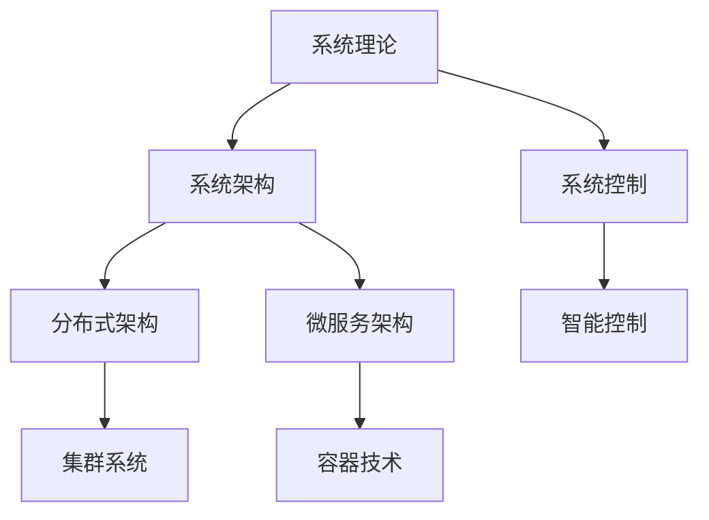

# SystemOSIOT项目结构优化分析报告 / Project Structure Optimization Analysis Report

## 📊 当前项目结构分析 / Current Project Structure Analysis

### 整体结构概览

SystemOSIOT项目目前采用分层模块化结构，包含8个核心系统领域和6个技术模块：

```text
SystemOSIOT/
├── 1.系统理论/           # 系统科学理论基础
├── 2.操作系统/           # 操作系统相关技术
├── 3.物联网嵌入式系统/    # IoT和嵌入式技术
├── 4.分布式系统/         # 分布式系统架构
├── 5.集群系统/           # 集群和并行计算
├── 6.P2P系统/            # P2P网络技术
├── 7.容器与微服务/       # 容器化和微服务架构
├── 8.网络系统/           # 网络通信技术
├── docs/                 # 文档目录
└── 各种指南文档          # 项目管理和技术指南
```

### 结构优势分析

#### ✅ 已具备的优势

1. **层次清晰**: 8个核心领域分类明确，逻辑关系清晰
2. **模块独立**: 每个领域相对独立，便于维护和扩展
3. **内容完整**: 各领域内容覆盖全面，技术深度足够
4. **双语支持**: 中英文对照，便于国际化

#### ⚠️ 需要改进的问题

1. **目录命名不一致**: 中英文混合，缺乏统一标准
2. **交叉引用缺失**: 模块间关联关系不够明确
3. **导航系统不完善**: 缺乏统一的导航和索引机制
4. **文档组织分散**: 相关文档分散在不同位置

## 🎯 结构优化目标 / Structure Optimization Goals

### 短期目标 (1-2周)

1. **统一命名规范**: 建立一致的目录和文件命名标准
2. **完善导航系统**: 创建统一的导航索引和交叉引用
3. **优化目录结构**: 重新组织文档，提升可维护性
4. **建立引用机制**: 实现模块间的逻辑关联

### 中期目标 (1个月)

1. **知识图谱构建**: 建立完整的知识关联网络
2. **搜索系统优化**: 提升内容查找和检索效率
3. **版本管理完善**: 建立文档版本控制和更新机制
4. **质量检查体系**: 建立内容质量评估和检查机制

## 🔧 具体优化方案 / Specific Optimization Solutions

### 1. 目录结构重新设计

#### 1.1 统一命名规范

**当前问题**: 目录名称中英文混合，缺乏一致性

**优化方案**:

```text
SystemOSIOT/
├── 01-system-theory/          # 系统理论 (原: 1.系统理论)
├── 02-operating-systems/      # 操作系统 (原: 2.操作系统)
├── 03-iot-embedded/           # 物联网嵌入式 (原: 3.物联网嵌入式系统)
├── 04-distributed-systems/    # 分布式系统 (原: 4.分布式系统)
├── 05-cluster-systems/        # 集群系统 (原: 5.集群系统)
├── 06-p2p-systems/            # P2P系统 (原: 6.P2P系统)
├── 07-container-microservices/ # 容器微服务 (原: 7.容器与微服务)
├── 08-network-systems/        # 网络系统 (原: 8.网络系统)
├── docs/                      # 文档中心
├── tools/                     # 工具和脚本
├── examples/                  # 代码示例
└── guides/                    # 指南文档
```

#### 1.2 文档组织优化

**核心领域文档结构**:

```text
01-system-theory/
├── README.md                  # 领域概览
├── 01-fundamentals/           # 基础理论
├── 02-architecture/           # 架构设计
├── 03-control-optimization/   # 控制优化
├── 04-modeling-simulation/    # 建模仿真
├── 05-integration/            # 集成互操作
├── 06-security-reliability/   # 安全可靠性
├── 07-performance/            # 性能评估
└── 08-evolution-maintenance/  # 演化维护
```

### 2. 导航系统建立

#### 2.1 主导航索引

创建 `docs/navigation/` 目录，包含：

- `main-index.md` - 主导航索引
- `domain-map.md` - 领域关系图
- `technology-roadmap.md` - 技术路线图
- `learning-path.md` - 学习路径指南

#### 2.2 交叉引用机制

在每个文档中建立：

- **前置知识**: 指向相关的基础理论
- **相关技术**: 指向相关的技术模块
- **应用案例**: 指向相关的实践案例
- **扩展阅读**: 指向深入学习的资源

### 3. 内容关联优化

#### 3.1 知识图谱构建

使用Mermaid图表建立知识关联：



#### 3.2 标签系统建立

为每个文档添加标签：

- **技术领域**: system-theory, distributed, microservices
- **难度级别**: beginner, intermediate, advanced
- **内容类型**: theory, practice, case-study
- **适用场景**: academic, enterprise, research

### 4. 文档标准统一

#### 4.1 格式规范

- **标题结构**: 统一的标题层级和命名
- **代码块**: 统一的代码格式和语言标识
- **数学公式**: 统一的数学符号和公式格式
- **图表**: 统一的图表格式和说明

#### 4.2 元数据规范

每个文档包含：

```yaml
---
title: 文档标题
description: 文档描述
author: 作者
created: 创建时间
updated: 更新时间
tags: [标签1, 标签2]
difficulty: 难度级别
prerequisites: [前置知识]
related: [相关文档]
---
```

## 📋 执行计划 / Execution Plan

### 第一周：基础结构优化

#### 周一-周二：目录重构

- [ ] 创建新的目录结构
- [ ] 迁移现有文档
- [ ] 更新文件路径引用

#### 周三-周四：导航系统

- [ ] 创建主导航索引
- [ ] 建立交叉引用
- [ ] 构建知识图谱

#### 周五：格式统一

- [ ] 统一文档格式
- [ ] 添加元数据
- [ ] 建立标签系统

### 第二周：内容优化

#### 周一-周二：引用完善

- [ ] 完善交叉引用
- [ ] 建立知识关联
- [ ] 优化导航体验

#### 周三-周四：质量检查

- [ ] 检查文档完整性
- [ ] 验证链接有效性
- [ ] 优化内容结构

#### 周五：测试验证

- [ ] 测试导航功能
- [ ] 验证引用正确性
- [ ] 收集反馈意见

## 🎯 预期成果 / Expected Outcomes

### 量化指标

- **目录结构**: 100% 统一命名规范
- **导航系统**: 100% 文档可导航
- **交叉引用**: >90% 文档有关联引用
- **格式统一**: >95% 文档格式一致

### 质化改进

- **可维护性**: 显著提升项目维护效率
- **可扩展性**: 便于新内容添加和模块扩展
- **用户体验**: 提升内容查找和学习效率
- **协作效率**: 便于团队协作和内容贡献

## 🚨 风险控制 / Risk Control

### 主要风险

1. **迁移风险**: 文档迁移可能丢失内容或链接
2. **兼容性风险**: 新结构可能影响现有用户
3. **进度风险**: 重构工作量大，可能延期

### 应对策略

1. **备份机制**: 完整备份现有内容
2. **渐进迁移**: 分阶段进行迁移
3. **测试验证**: 每个阶段进行充分测试
4. **回滚准备**: 准备回滚方案

## 🎉 总结 / Summary

项目结构优化是SystemOSIOT项目质量提升的重要基础。通过建立统一的命名规范、完善的导航系统和有效的交叉引用机制，将显著提升项目的可维护性、可扩展性和用户体验。

优化后的项目结构将更好地支持：

- 内容的系统化组织
- 知识的有效传播
- 团队的高效协作
- 项目的持续发展

---

> 项目结构优化是提升SystemOSIOT项目质量的重要步骤，将为后续的内容深化和应用推广奠定坚实基础。
> Project structure optimization is an important step to improve the quality of the SystemOSIOT project, which will lay a solid foundation for subsequent content deepening and application promotion.
