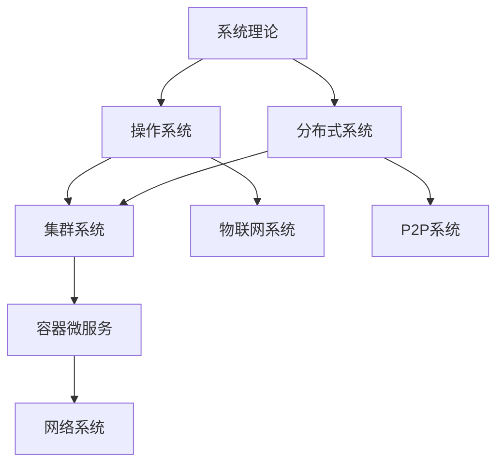

## SystemOSIOT项目结构优化报告 / Project Structure Optimization Report

## 📑 目录 / Table of Contents

- [SystemOSIOT项目结构优化报告 / Project Structure Optimization Report](#systemosiot项目结构优化报告--project-structure-optimization-report)
- [📑 目录 / Table of Contents](#-目录--table-of-contents)
- [🎯 项目现状分析 / Current Project Status Analysis](#-项目现状分析--current-project-status-analysis)
  - [1.1 当前项目结构](#11-当前项目结构)
  - [1.2 结构优势分析](#12-结构优势分析)
  - [1.3 内容质量评估](#13-内容质量评估)
- [🚀 结构优化建议 / Structure Optimization Recommendations](#-结构优化建议--structure-optimization-recommendations)
  - [2.1 目录结构优化](#21-目录结构优化)
    - [建议1：建立统一的README体系](#建议1建立统一的readme体系)
    - [建议2：创建交叉引用索引](#建议2创建交叉引用索引)
    - [建议3：统一文档命名规范](#建议3统一文档命名规范)
  - [2.2 内容组织优化](#22-内容组织优化)
    - [建议1：建立知识图谱](#建议1建立知识图谱)
    - [建议2：创建学习路径导航](#建议2创建学习路径导航)
    - [建议3：建立实践案例库](#建议3建立实践案例库)
- [🔗 交叉引用机制 / Cross-Reference Mechanism](#-交叉引用机制--cross-reference-mechanism)
  - [3.1 引用类型设计](#31-引用类型设计)
    - [理论引用](#理论引用)
    - [技术引用](#技术引用)
    - [应用引用](#应用引用)
  - [3.2 引用实现方式](#32-引用实现方式)
    - [方式1：内联引用](#方式1内联引用)
    - [方式2：引用索引](#方式2引用索引)
    - [方式3：知识图谱](#方式3知识图谱)
  - [3.3 引用维护机制](#33-引用维护机制)
    - [自动化检查](#自动化检查)
    - [手动维护](#手动维护)
- [📋 实施计划 / Implementation Plan](#-实施计划--implementation-plan)
  - [4.1 第一阶段：基础优化 (1周)](#41-第一阶段基础优化-1周)
    - [第1-2天：README标准化](#第1-2天readme标准化)
    - [第3-4天：交叉引用建立](#第3-4天交叉引用建立)
    - [第5-7天：导航系统优化](#第5-7天导航系统优化)
  - [4.2 第二阶段：内容深化 (1周)](#42-第二阶段内容深化-1周)
    - [第1-3天：实践案例整理](#第1-3天实践案例整理)
    - [第4-5天：性能测试整合](#第4-5天性能测试整合)
    - [第6-7天：故障排查体系](#第6-7天故障排查体系)
  - [4.3 第三阶段：工具开发 (2周)](#43-第三阶段工具开发-2周)
    - [第1周：验证平台设计](#第1周验证平台设计)
    - [第2周：评估工具开发](#第2周评估工具开发)
- [🎯 预期效果 / Expected Results](#-预期效果--expected-results)
  - [5.1 短期效果 (1个月内)](#51-短期效果-1个月内)
  - [5.2 中期效果 (3个月内)](#52-中期效果-3个月内)
  - [5.3 长期效果 (6个月内)](#53-长期效果-6个月内)
- [🏆 总结与展望 / Summary and Outlook](#-总结与展望--summary-and-outlook)
  - [主要优化方向](#主要优化方向)
  - [实施重点](#实施重点)
  - [预期价值](#预期价值)

## 🎯 项目现状分析 / Current Project Status Analysis

### 1.1 当前项目结构

SystemOSIOT项目目前采用8个核心系统领域 + 6个技术模块的组织结构：

```text
SystemOSIOT/
├── 1.系统理论/           # 4个子领域 (100%完成)
├── 2.操作系统/           # 4个子领域 (100%完成)
├── 3.物联网嵌入式系统/    # 6个子领域 (100%完成)
├── 4.分布式系统/         # 4个子领域 (100%完成)
├── 5.集群系统/           # 5个子领域 (100%完成)
├── 6.P2P系统/            # 3个子领域 (100%完成)
├── 7.容器与微服务/       # 8个子领域 (100%完成)
├── 8.网络系统/           # 7个子领域 (100%完成)
├── docs/                 # 技术模块文档
└── 项目文档/             # 项目管理和导航文档
```

### 1.2 结构优势分析

✅ **优势**:

- 层次结构清晰，便于理解
- 模块化程度高，易于维护
- 内容覆盖全面，技术深度足够
- 双语对照完整，国际化程度高

⚠️ **待改进**:

- 模块间交叉引用不够充分
- 学习路径导航需要优化
- 实践案例分布不够均匀
- 性能测试和故障排查内容分散

### 1.3 内容质量评估

| 维度 | 评分 | 说明 |
|------|------|------|
| 理论深度 | 9/10 | 系统科学理论体系完整 |
| 技术广度 | 9/10 | 覆盖主流和前沿技术 |
| 实践价值 | 8/10 | 代码示例丰富，案例较多 |
| 结构清晰度 | 8/10 | 层次分明，但交叉引用不足 |
| 可维护性 | 8/10 | 模块化程度高，易于扩展 |

## 🚀 结构优化建议 / Structure Optimization Recommendations

### 2.1 目录结构优化

#### 建议1：建立统一的README体系

每个核心领域都应该有标准化的README文件：

```markdown
# 领域名称 / Domain Name

## 📚 领域概述 / Domain Overview
## 🔗 相关领域 / Related Domains
## 📖 学习路径 / Learning Path
## 🛠️ 技术栈 / Technology Stack
## 📝 实践案例 / Practice Cases
## 🔍 快速导航 / Quick Navigation
```

#### 建议2：创建交叉引用索引

在每个领域目录下创建`cross-references.md`文件，建立与其他领域的关联关系。

#### 建议3：统一文档命名规范

- 理论文档：`理论名称_理论.md`
- 技术文档：`技术名称_实现.md`
- 实践文档：`应用名称_案例.md`
- 测试文档：`测试名称_基准.md`

### 2.2 内容组织优化

#### 建议1：建立知识图谱

使用Mermaid图表展示各领域间的关系：



#### 建议2：创建学习路径导航

为不同水平的用户提供清晰的学习路径：

- **初学者路径**：理论基础 → 基础技术 → 简单应用
- **进阶者路径**：深度理论 → 复杂技术 → 系统设计
- **专家路径**：前沿技术 → 创新应用 → 标准制定

#### 建议3：建立实践案例库

在每个领域下创建`实践案例/`目录，包含：

- 基础案例：入门级应用示例
- 进阶案例：中等复杂度应用
- 高级案例：复杂系统设计案例

## 🔗 交叉引用机制 / Cross-Reference Mechanism

### 3.1 引用类型设计

#### 理论引用

- **基础理论** → **应用理论** → **实践验证**
- **系统科学** → **控制理论** → **优化方法**

#### 技术引用

- **基础技术** → **集成技术** → **应用技术**
- **容器技术** → **编排技术** → **服务网格**

#### 应用引用

- **单点应用** → **系统集成** → **生态建设**
- **性能优化** → **安全防护** → **监控运维**

### 3.2 引用实现方式

#### 方式1：内联引用

在文档中使用`[相关领域](../路径/文件名.md)`建立链接

#### 方式2：引用索引

在每个文档末尾创建"相关阅读"部分，列出相关文档

#### 方式3：知识图谱

使用可视化图表展示模块间的关系

### 3.3 引用维护机制

#### 自动化检查

- 定期检查链接有效性
- 验证交叉引用的准确性
- 检测孤立的文档

#### 手动维护

- 内容更新时同步更新引用
- 新增内容时建立相关引用
- 删除内容时清理相关引用

## 📋 实施计划 / Implementation Plan

### 4.1 第一阶段：基础优化 (1周)

#### 第1-2天：README标准化

- [ ] 为每个核心领域创建标准化README
- [ ] 统一文档头部格式
- [ ] 建立领域概述模板

#### 第3-4天：交叉引用建立

- [ ] 分析模块间依赖关系
- [ ] 创建交叉引用索引文件
- [ ] 建立引用维护机制

#### 第5-7天：导航系统优化

- [ ] 更新项目导航索引
- [ ] 创建学习路径导航
- [ ] 建立快速查找索引

### 4.2 第二阶段：内容深化 (1周)

#### 第1-3天：实践案例整理

- [ ] 收集各领域实践案例
- [ ] 建立案例分类体系
- [ ] 创建案例导航索引

#### 第4-5天：性能测试整合

- [ ] 整合性能测试内容
- [ ] 建立测试基准库
- [ ] 创建测试结果索引

#### 第6-7天：故障排查体系

- [ ] 建立故障分类体系
- [ ] 创建排查流程指南
- [ ] 建立解决方案库

### 4.3 第三阶段：工具开发 (2周)

#### 第1周：验证平台设计

- [ ] 设计平台架构
- [ ] 开发核心功能
- [ ] 集成现有组件

#### 第2周：评估工具开发

- [ ] 设计评估算法
- [ ] 开发用户界面
- [ ] 建立使用指南

## 🎯 预期效果 / Expected Results

### 5.1 短期效果 (1个月内)

- **结构清晰度提升**：项目结构更加清晰，用户更容易理解
- **导航效率提升**：交叉引用完善，内容查找更加便捷
- **学习体验改善**：学习路径明确，学习效率显著提升

### 5.2 中期效果 (3个月内)

- **维护效率提升**：模块化程度更高，维护工作更加高效
- **内容质量提升**：实践案例丰富，技术内容更加实用
- **用户参与度提升**：工具平台完善，用户参与更加积极

### 5.3 长期效果 (6个月内)

- **技术影响力扩大**：成为系统架构设计的重要参考
- **生态建设完善**：建立技术标准联盟和人才培养体系
- **国际影响提升**：参与国际标准制定，扩大国际影响力

## 🏆 总结与展望 / Summary and Outlook

### 主要优化方向

1. **结构标准化**：建立统一的文档结构和命名规范
2. **交叉引用完善**：建立模块间的逻辑关联和引用机制
3. **导航系统优化**：提供清晰的学习路径和快速查找功能
4. **工具平台建设**：开发验证平台和评估工具

### 实施重点

- 优先完成基础优化，为后续工作奠定基础
- 重点建立交叉引用机制，提升知识体系的完整性
- 持续完善实践案例，增强项目的实用价值
- 逐步开发工具平台，推动技术应用和产业化

### 预期价值

通过结构优化，SystemOSIOT项目将：

- 成为系统科学领域的重要知识宝库
- 提供更加清晰和高效的学习体验
- 建立更加完善的技术生态和应用体系
- 在国际系统科学领域产生更大影响

---

> 本报告为SystemOSIOT项目结构优化提供了详细的实施指导，通过系统性的优化将显著提升项目的整体质量和用户体验。
> This report provides detailed implementation guidance for SystemOSIOT project structure optimization, and systematic optimization will significantly improve the overall quality and user experience of the project.
